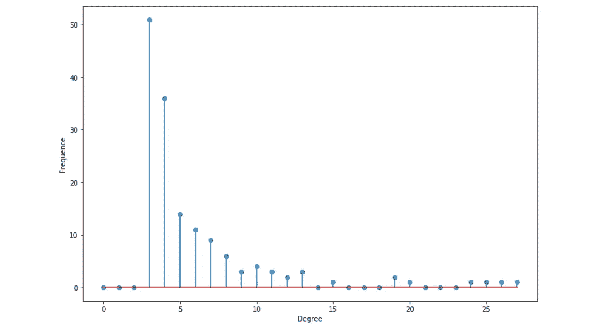

# 图表介绍(第一部分)

> 原文：<https://towardsdatascience.com/introduction-to-graphs-part-1-2de6cda8c5a5?source=collection_archive---------6----------------------->

## [内线艾](https://medium.com/towards-data-science/inside-ai/home)

## Python 中的主要概念、属性和应用


G 如今，raphs 正成为机器学习的核心，例如，无论你是想通过预测潜在的联系来了解社交网络的结构，检测欺诈，了解汽车租赁服务的客户行为，还是提出实时建议。

在本文中，我们将讨论以下主题:

*   什么是图？
*   如何存储一个图形？
*   图的类型和性质
*   Python 中的示例

这是致力于图论、图算法和图学习的三篇系列文章的第一篇。

本文最初发表于我的个人博客:[https://maelfabien.github.io/ml/#](https://maelfabien.github.io/ml/#)

我在这个资源库上发布我所有的文章和相应的代码:

[](https://github.com/maelfabien/Machine_Learning_Tutorials) [## mael fabien/机器学习教程

### 本报告包含练习、代码、教程和我的个人博客文章

github.com](https://github.com/maelfabien/Machine_Learning_Tutorials) 

**NB** : Part 2 和 Part 3 出来了！:)

[](/graph-algorithms-part-2-dce0b2734a1d) [## 图形算法(第二部分)

### Python 中的主要概念、属性和应用

towardsdatascience.com](/graph-algorithms-part-2-dce0b2734a1d) [](/learning-in-graphs-with-python-part-3-8d5513eef62d) [## 用 Python 学习图形(第 3 部分)

### Python 的概念、应用和示例

towardsdatascience.com](/learning-in-graphs-with-python-part-3-8d5513eef62d) 

接下来，打开 Jupyter 笔记本，导入以下包:

```
import numpy as np
import random
import networkx as nx
from IPython.display import Image
import matplotlib.pyplot as plt
```

以下文章将使用最新版本的`networkx``2.x`。NetworkX 是一个 Python 包，用于创建、操作和研究复杂网络的结构、动态和功能。

我将尽量保持一种实用的方法，并举例说明每个概念。

# 一、什么是图？

> 图是相互连接的节点的集合。

例如，一个非常简单的图形可以是:


Nodes in red, are linked by edges in black

图表可用于表示:

*   **社交网络**
*   **网页**
*   **生物网络**
*   …

我们可以对图表进行什么样的分析？

*   研究**拓扑和连通性**
*   **社区**检测
*   确定**中心节点**
*   预测缺失节点
*   预测丢失的边
*   …

所有这些概念在几分钟后会变得更加清晰。

在我们的笔记本中，让我们导入第一个预构建的图表:

```
# Load the graph
G_karate = nx.karate_club_graph()
# Find key-values for the graph
pos = nx.spring_layout(G_karate)
# Plot the graph
nx.draw(G_karate, cmap = plt.get_cmap('rainbow'), with_labels=True, pos=pos)
```


Karate Graph

这个“空手道”图代表什么？韦恩·w·扎卡里从 1970 年到 1972 年对一个空手道俱乐部的社交网络进行了为期三年的研究。该网络捕获了一个空手道俱乐部的 34 名成员，记录了在俱乐部外互动的成对成员之间的联系。在研究过程中，管理员“约翰 A”和指导员“嗨先生”(化名)之间发生了冲突，导致俱乐部一分为二。一半的成员在 Hi 先生周围组成了一个新的俱乐部；另一部分的成员找到了新的教练或者放弃了空手道。根据收集到的数据，扎卡里正确地将俱乐部中除了一名成员之外的所有成员分配到了他们在分裂后实际加入的小组中。

# 基本图形概念

一个*图* G=(V，E)由一组:

*   **节点**(也叫**顶点)** V=1，…，n
*   **棱角** E⊆V×V
*   一条**边** (i，j) ∈ E 链接节点 I 和 j
*   据说我和 j 是**邻居**
*   节点的**度**是其邻居的数量


Illustration of nodes, edges, and degrees

*   如果所有节点都有 n-1 个邻居，则图是**完整的**。这意味着所有节点都以各种可能的方式连接在一起。
*   从 I 到 j 的**路径**是从 I 到 j 的一系列边。该路径的**长度**等于它穿过的边数。
*   图的**直径**是连接任意两个节点的所有最短路径中最长路径的长度。

例如，在这种情况下，我们可以计算连接任意两个节点的一些最短路径。*直径*通常为 3，因为没有节点对，因此连接它们的最短路径长于 3。


Diameter of 3

*   **测地线** 路径是两个节点之间的最短路径。
*   如果所有的节点都可以通过给定的路径相互到达，那么它们就形成了一个**连通分量。**一个图是**连通的**它有单个连通分量吗

例如，下面是一个包含两个不同连接组件的图表:


2 connected components

*   如果边是有序对，则图是有向的。在这种情况下，I 的“入度”是到 I 的传入边的数量，“出度”是从 I 传出的边的数量。


Directed Graph

*   一个图是**循环的**如果你能返回到一个给定的节点。另一方面，如果至少有一个节点不能返回，那么它就是**非循环的**。
*   如果我们给节点或者关系赋予权重，那么一个图就可以是**加权的**。
*   如果边的数量比节点的数量多，那么图是稀疏的。另一方面，如果节点之间有许多边，则称其为**密集**。

Neo4J 关于图算法的书提供了一个清晰的总结:


Summary (Neo4J Graph Book)

现在让我们看看如何用 Python 从图表中检索这些信息:

```
n=34G_karate.degree()
```

属性`.degree()`返回图中每个节点的度数(邻居)列表:

```
DegreeView({0: 16, 1: 9, 2: 10, 3: 6, 4: 3, 5: 4, 6: 4, 7: 4, 8: 5, 9: 2, 10: 3, 11: 1, 12: 2, 13: 5, 14: 2, 15: 2, 16: 2, 17: 2, 18: 2, 19: 3, 20: 2, 21: 2, 22: 2, 23: 5, 24: 3, 25: 3, 26: 2, 27: 4, 28: 3, 29: 4, 30: 4, 31: 6, 32: 12, 33: 17})
```

然后，分离度数值:

```
# Isolate the sequence of degrees
degree_sequence = list(G_karate.degree())
```

计算边的数量，以及度序列的度量:

```
nb_nodes = n
nb_arr = len(G_karate.edges())avg_degree = np.mean(np.array(degree_sequence)[:,1])
med_degree = np.median(np.array(degree_sequence)[:,1])max_degree = max(np.array(degree_sequence)[:,1])
min_degree = np.min(np.array(degree_sequence)[:,1])
```

最后，打印所有这些信息:

```
print("Number of nodes : " + str(nb_nodes))
print("Number of edges : " + str(nb_arr))print("Maximum degree : " + str(max_degree))
print("Minimum degree : " + str(min_degree))print("Average degree : " + str(avg_degree))
print("Median degree : " + str(med_degree))
```

这个标题是:

```
Number of nodes : 34
Number of edges : 78
Maximum degree : 17
Minimum degree : 1
Average degree : 4.588235294117647
Median degree : 3.0
```

平均而言，图表中的每个人都与 4.6 个人有联系。

我们还可以绘制度数直方图:

```
degree_freq = np.array(nx.degree_histogram(G_karate)).astype('float')plt.figure(figsize=(12, 8))
plt.stem(degree_freq)
plt.ylabel("Frequence")
plt.xlabel("Degre")
plt.show()
```


Degree Histogram

稍后，我们将会看到，度数直方图对于确定我们所看到的图形的类型非常重要。

# 二。图表是如何存储的？

你现在可能想知道我们如何存储复杂的图形结构？

根据我们想要的用途，有三种方法来存储图表:

*   在边缘列表中:

```
1   2
1   3
1   4
2   3
3   4
...
```

我们存储由边链接的每对节点的 ID。

*   使用邻接矩阵，通常加载到内存中:


Adjacency matrix

对于图中的每个可能的对，如果两个节点由一条边链接，则将其设置为 1。如果图是无向的，则 a 是对称的。

*   使用邻接表:

```
1 : [2,3, 4]
2 : [1,3]
3:  [2, 4]
...
```

最佳表现取决于使用情况和可用内存。图形通常可以保存为`.txt`文件。

图形的一些扩展可能包括:

*   加权边
*   节点/边上的标签
*   与节点/边相关联的特征向量

# 三。图形的类型

在这一节中，我们将介绍两种主要类型的图表:

*   鄂尔多斯-雷尼
*   巴拉巴斯-艾伯特

## 1.鄂尔多斯-雷尼模型

**a .定义**

> *在一个 Erdos-Rényi 模型中，我们建立一个有 n 个节点的* ***随机*** *图模型。该图是通过在一对节点(I，j)***和* ***概率*** *p 之间画一条* ***边*** *而生成的。因此我们有两个参数:节点数:n 和概率:p。**

**

*Erdos-Rényi Graphs*

*在 Python 中，`networkx`包有一个生成鄂尔多斯-雷尼图的内置函数。*

```
*# Generate the graph
n = 50
p = 0.2
G_erdos = nx.erdos_renyi_graph(n,p, seed =100)# Plot the graph
plt.figure(figsize=(12,8))
nx.draw(G_erdos, node_size=10)*
```

*您将得到与此非常相似的结果:*

**

*Generated Graph*

***b .学位分布***

**设 pk 随机选择的节点具有度 k 的概率*由于图的构建方式是随机的，所以图的度分布是**二项式**:*

**

*Binomial node degree distribution*

*每个节点的度数分布应该非常接近平均值。观察到大量节点的概率呈指数下降。*

```
*degree_freq = np.array(nx.degree_histogram(G_erdos)).astype('float')plt.figure(figsize=(12, 8))
plt.stem(degree_freq)
plt.ylabel("Frequence")
plt.xlabel("Degree")
plt.show()*
```

*为了可视化分布，我在生成的图中将 n 增加到 200。*

**

*Degree Distribution*

***c .描述性统计***

*   *平均度数由 n×p 给出，p=0.2，n=200，我们以 40 为中心。*
*   *期望度数由(n1)×p 给出*
*   *最大程度集中在平均值附近*

*让我们用 Python 检索这些值:*

```
*# Get the list of the degrees
degree_sequence_erdos = list(G_erdos.degree())

nb_nodes = n
nb_arr = len(G_erdos.edges())

avg_degree = np.mean(np.array(degree_sequence_erdos)[:,1])
med_degree = np.median(np.array(degree_sequence_erdos)[:,1])

max_degree = max(np.array(degree_sequence_erdos)[:,1])
min_degree = np.min(np.array(degree_sequence_erdos)[:,1])

esp_degree = (n-1)*p

print("Number of nodes : " + str(nb_nodes))
print("Number of edges : " + str(nb_arr))

print("Maximum degree : " + str(max_degree))
print("Minimum degree : " + str(min_degree))

print("Average degree : " + str(avg_degree))
print("Expected degree : " + str(esp_degree))
print("Median degree : " + str(med_degree))*
```

*这应该会给你类似于:*

```
*Number of nodes : 200
Number of edges : 3949
Maximum degree : 56
Minimum degree : 25
Average degree : 39.49
Expected degree : 39.800000000000004
Median degree : 39.5*
```

*平均学位和预期学位非常接近，因为两者之间只有一个很小的因素。*

## *2.巴拉巴斯-艾伯特模型*

***a .定义***

*在 Barabasi-Albert 模型中，我们建立了一个具有 n 个节点的*随机*图模型，该模型具有优先连接组件。该图由以下算法生成:*

*   *第一步:概率为 p，进入第二步。否则，转到第三步。*
*   *第二步:将一个**新节点**连接到在**随机选择的**现有节点*****
*   *步骤 3:将新节点连接到 n 个现有节点，其概率**与它们的度**成比例*

*该图的目的是模拟在真实网络中经常观察到的*优先连接*。*

*在 Python 中，`networkx`包还有一个生成 Barabasi-Albert 图的内置函数。*

```
*# Generate the graph
n = 150
m = 3
G_barabasi = nx.barabasi_albert_graph(n,m)# Plot the graph
plt.figure(figsize=(12,8))
nx.draw(G_barabasi, node_size=10)*
```

*您将得到与此非常相似的结果:*

**

*Barabasi-Albert Graph*

*您可以很容易地注意到，现在一些节点的度数似乎比其他节点的度数大得多！*

***b .学位分布***

*设 pk 随机选择的节点的度为 k 的概率。度分布遵循幂律:*

**

*Power-law degree distribution*

*分布现在是重尾的。有大量的节点具有较小的度数，但是有大量的节点具有较高的度数。*

```
*degree_freq = np.array(nx.degree_histogram(G_barabasi)).astype('float')plt.figure(figsize=(12, 8))
plt.stem(degree_freq)
plt.ylabel("Frequence")
plt.xlabel("Degree")
plt.show()*
```

**

*Degree Distribution*

*这种分布被认为是无尺度的，也就是说，平均程度是没有信息的。*

***c .描述性统计***

*   *如果α≤2，则平均度为常数，否则，平均度发散*
*   *最大度数的顺序如下:*

**

```
*# Get the list of the degrees
degree_sequence_erdos = list(G_erdos.degree())

nb_nodes = n
nb_arr = len(G_erdos.edges())

avg_degree = np.mean(np.array(degree_sequence_erdos)[:,1])
med_degree = np.median(np.array(degree_sequence_erdos)[:,1])

max_degree = max(np.array(degree_sequence_erdos)[:,1])
min_degree = np.min(np.array(degree_sequence_erdos)[:,1])

esp_degree = (n-1)*p

print("Number of nodes : " + str(nb_nodes))
print("Number of edges : " + str(nb_arr))

print("Maximum degree : " + str(max_degree))
print("Minimum degree : " + str(min_degree))

print("Average degree : " + str(avg_degree))
print("Expected degree : " + str(esp_degree))
print("Median degree : " + str(med_degree))*
```

*这应该会给你类似于:*

```
*Number of nodes : 200
Number of edges : 3949
Maximum degree : 56
Minimum degree : 25
Average degree : 39.49
Expected degree : 39.800000000000004
Median degree : 39.5*
```

# *四。结论*

*到目前为止，我们讨论了图的主要种类，以及描述图的最基本的特征。在下一篇文章中，我们将深入探讨图形分析/算法，以及分析图形的不同方式，用于:*

*   *实时欺诈检测*
*   *实时推荐*
*   *简化法规遵从性*
*   *复杂网络的管理和监控*
*   *身份和访问管理*
*   *社交应用/功能*
*   *…*

*如果您有任何问题或意见，请随时评论。*

*下一篇文章可以在这里找到:*

*[](/graph-algorithms-part-2-dce0b2734a1d) [## 图形算法(第二部分)

### Python 中的主要概念、属性和应用

towardsdatascience.com](/graph-algorithms-part-2-dce0b2734a1d) 

## 来源:

*   Neo4j 中的图形算法综合指南
*   网络 x 文档，[https://networkx.github.io/documentation/stable/](https://networkx.github.io/documentation/stable/)

如果你想从我这里读到更多，我以前的文章可以在这里找到:

[](/markov-chains-and-hmms-ceaf2c854788) [## 马尔可夫链和 hmm

### 在本文中，我们将关注马尔可夫模型，何时何地应该使用它们，以及隐马尔可夫模型。这个…

towardsdatascience.com](/markov-chains-and-hmms-ceaf2c854788) [](/a-guide-to-face-detection-in-python-3eab0f6b9fc1) [## Python 中的人脸检测指南

### 在本教程中，我们将看到如何使用 OpenCV 和 Dlib 在 Python 中创建和启动人脸检测算法。我们会…

towardsdatascience.com](/a-guide-to-face-detection-in-python-3eab0f6b9fc1) [](/boosting-and-adaboost-clearly-explained-856e21152d3e) [## 升压和 AdaBoost 解释清楚

### 直观的解释

towardsdatascience.com](/boosting-and-adaboost-clearly-explained-856e21152d3e)*