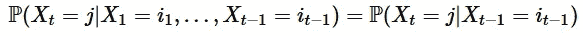
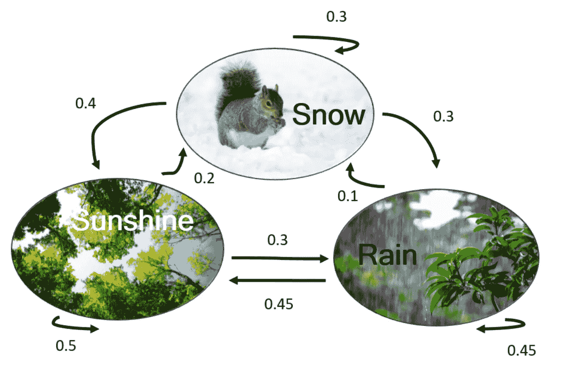
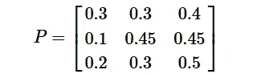
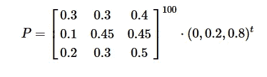
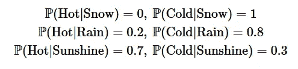
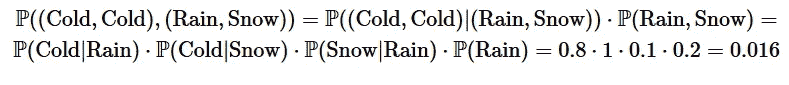
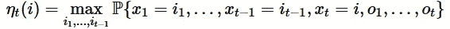
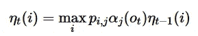
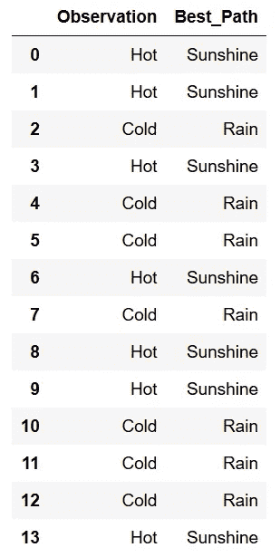

# 隐马尔可夫模型简介

> 原文：<https://towardsdatascience.com/introduction-to-hidden-markov-models-cd2c93e6b781?source=collection_archive---------2----------------------->

## 我们介绍马尔可夫链和隐马尔可夫模型。

**马尔可夫链**

让我们先简单介绍一下马尔可夫链，一种随机过程。我们从链条的几个“状态”开始，{ *S* ₁,…，*s*ₖ}；例如，如果我们的链代表每天的天气，我们可以有{雪，雨，阳光}。一个过程( *X* ₜ)ₜ应该是一个马尔可夫链)的性质是:



换句话说，处于状态 *j* 的概率只取决于前一个状态，而不取决于之前发生的事情。

马尔可夫链通常用带有转移概率的图来描述，即从状态 *i* 移动到状态 *j* 的概率，用 *p* ᵢ,ⱼ.来表示让我们看看下面的例子:



Markov chain example

该链有三种状态；例如，雪和雨之间的转移概率是 0.3，也就是说，如果昨天下雪，今天有 30%的可能性会下雨。转移概率可以总结为一个矩阵:



注意每一行的总和等于 1(想想为什么)。这样的矩阵称为随机矩阵。( *i* ， *j* )定义为*p*ᵢ,ⱼ——在 *i* 和 *j* 之间的转移概率。

事实:如果我们取矩阵的幂， *P* ᵏ，( *i* ， *j* )条目代表在 *k* 步从状态 *i* 到达状态 *j* 的概率。

在许多情况下，我们被给定一个初始概率向量 *q* =( *q* ₁,…， *q* ₖ)在时间 *t* =0 时处于每个状态。因此，在时间 *t* 处于状态 *i* 的概率将等于向量 *P* ᵏ *q* 的第 *i-* 个条目。

例如，如果今天下雪、下雨和阳光的概率是 0，0.2，0.8，那么 100 天后下雨的概率计算如下:



第二项等于≈ 0.44。

**隐马尔可夫模型**

在隐马尔可夫模型(HMM)中，我们有一个看不见的马尔可夫链(我们无法观察到)，每个状态从 *k* 个观察值中随机产生一个，这对我们来说是可见的。

让我们看一个例子。假设我们有上面的马尔可夫链，有三个状态(雪、雨和阳光)， *P* -转移概率矩阵和*q*-初始概率。这是看不见的马尔可夫链——假设我们在家，看不见天气。然而，我们可以感觉到我们房间内的温度，假设有两种可能的观察结果:热和冷，其中:



**基本示例**

作为第一个例子，我们应用 HMM 来计算我们连续两天感到寒冷的概率。这两天，底层马尔可夫状态有 3*3=9 个选项。让我们举例说明这 9 个选项之一的概率计算:



将所有选项相加得出期望的概率。

**寻找隐藏状态—维特比算法**

在某些情况下，我们被给定一系列的观察值，并想找到最有可能对应的隐藏状态。

强力解决方案需要指数级的时间(就像上面的计算)；一种更有效的方法叫做**维特比算法**；它的主要思想是这样的:给我们一个观察序列 *o* ₁,…， *o* ₜ 。对于每个状态 *i* 和 *t* =1，…， *T* ，我们定义



也就是，给定我们的观察，在状态 *i* 在时间 *t* 结束的路径的最大概率。这里的主要观察是，根据马尔可夫性质，如果在时间 *t* 以 *i* 结束的最可能路径等于在时间*t*1 的某个 *i* ，则 *i* *是在时间*t*1 结束的最可能路径的最后状态的值。这给了我们下面的前向递归:



这里， *α* ⱼ( *o* ₜ)表示当隐马尔可夫状态为 *j* 时拥有 *o* ₜ的概率。

这里有一个例子。让我们生成一个 14 天的序列，其中 1 表示高温，0 表示低温。我们会用算法找到这两周最有可能的天气预报。

```
import numpy as np
import pandas as pd

obs_map = {'Cold':0, 'Hot':1}
obs = np.array([1,1,0,1,0,0,1,0,1,1,0,0,0,1])

inv_obs_map = dict((v,k) for k, v in obs_map.items())
obs_seq = [inv_obs_map[v] for v in list(obs)]

print("Simulated Observations:\n",pd.DataFrame(np.column_stack([obs, obs_seq]),columns=['Obs_code', 'Obs_seq']) )

pi = [0.6,0.4] # initial probabilities vector
states = ['Cold', 'Hot']
hidden_states = ['Snow', 'Rain', 'Sunshine']
pi = [0, 0.2, 0.8]
state_space = pd.Series(pi, index=hidden_states, name='states')
a_df = pd.DataFrame(columns=hidden_states, index=hidden_states)
a_df.loc[hidden_states[0]] = [0.3, 0.3, 0.4]
a_df.loc[hidden_states[1]] = [0.1, 0.45, 0.45]
a_df.loc[hidden_states[2]] = [0.2, 0.3, 0.5]
print("\n HMM matrix:\n", a_df)
a = a_df.values

observable_states = states
b_df = pd.DataFrame(columns=observable_states, index=hidden_states)
b_df.loc[hidden_states[0]] = [1,0]
b_df.loc[hidden_states[1]] = [0.8,0.2]
b_df.loc[hidden_states[2]] = [0.3,0.7]
print("\n Observable layer  matrix:\n",b_df)
b = b_df.values
```

我们得到:

```
Simulated Observations:
    Obs_code Obs_seq
0         1     Hot
1         1     Hot
2         0    Cold
3         1     Hot
4         0    Cold
5         0    Cold
6         1     Hot
7         0    Cold
8         1     Hot
9         1     Hot
10        0    Cold
11        0    Cold
12        0    Cold
13        1     Hot

 HMM matrix:
          Snow  Rain Sunshine
Snow      0.3   0.3      0.4
Rain      0.1  0.45     0.45
Sunshine  0.2   0.3      0.5

 Observable layer  matrix:
          Cold  Hot
Snow        1    0
Rain      0.8  0.2
Sunshine  0.3  0.7
```

现在让我们使用算法:

```
path, delta, phi = viterbi(pi, a, b, obs)
state_map = {0:'Snow', 1:'Rain', 2:'Sunshine'}
state_path = [state_map[v] for v in path]
pd.DataFrame().assign(Observation=obs_seq).assign(Best_Path=state_path)
```

我们得到:

```
Start Walk Forward

s=0 and t=1: phi[0, 1] = 2.0
s=1 and t=1: phi[1, 1] = 2.0
s=2 and t=1: phi[2, 1] = 2.0
s=0 and t=2: phi[0, 2] = 2.0
s=1 and t=2: phi[1, 2] = 2.0
s=2 and t=2: phi[2, 2] = 2.0
s=0 and t=3: phi[0, 3] = 0.0
s=1 and t=3: phi[1, 3] = 1.0
s=2 and t=3: phi[2, 3] = 1.0
s=0 and t=4: phi[0, 4] = 2.0
s=1 and t=4: phi[1, 4] = 2.0
s=2 and t=4: phi[2, 4] = 2.0
s=0 and t=5: phi[0, 5] = 0.0
s=1 and t=5: phi[1, 5] = 1.0
s=2 and t=5: phi[2, 5] = 1.0
s=0 and t=6: phi[0, 6] = 0.0
s=1 and t=6: phi[1, 6] = 1.0
s=2 and t=6: phi[2, 6] = 1.0
s=0 and t=7: phi[0, 7] = 2.0
s=1 and t=7: phi[1, 7] = 2.0
s=2 and t=7: phi[2, 7] = 2.0
s=0 and t=8: phi[0, 8] = 0.0
s=1 and t=8: phi[1, 8] = 1.0
s=2 and t=8: phi[2, 8] = 1.0
s=0 and t=9: phi[0, 9] = 2.0
s=1 and t=9: phi[1, 9] = 2.0
s=2 and t=9: phi[2, 9] = 2.0
s=0 and t=10: phi[0, 10] = 2.0
s=1 and t=10: phi[1, 10] = 2.0
s=2 and t=10: phi[2, 10] = 2.0
s=0 and t=11: phi[0, 11] = 0.0
s=1 and t=11: phi[1, 11] = 1.0
s=2 and t=11: phi[2, 11] = 1.0
s=0 and t=12: phi[0, 12] = 0.0
s=1 and t=12: phi[1, 12] = 1.0
s=2 and t=12: phi[2, 12] = 1.0
s=0 and t=13: phi[0, 13] = 0.0
s=1 and t=13: phi[1, 13] = 1.0
s=2 and t=13: phi[2, 13] = 1.0
--------------------------------------------------
Start Backtrace

path[12] = 1
path[11] = 1
path[10] = 1
path[9] = 2
path[8] = 2
path[7] = 1
path[6] = 2
path[5] = 1
path[4] = 1
path[3] = 2
path[2] = 1
path[1] = 2
path[0] = 2
```

这导致输出:



我们基于[2]使用了以下实现:

```
def viterbi(pi, a, b, obs):

    nStates = np.shape(b)[0]
    T = np.shape(obs)[0]

    # init blank path
    path = path = np.zeros(T,dtype=int)
    # delta --> highest probability of any path that reaches state i
    delta = np.zeros((nStates, T))
    # phi --> argmax by time step for each state
    phi = np.zeros((nStates, T))

    # init delta and phi 
    delta[:, 0] = pi * b[:, obs[0]]
    phi[:, 0] = 0

    print('\nStart Walk Forward\n')    
    # the forward algorithm extension
    for t in range(1, T):
        for s in range(nStates):
            delta[s, t] = np.max(delta[:, t-1] * a[:, s]) * b[s, obs[t]] 
            phi[s, t] = np.argmax(delta[:, t-1] * a[:, s])
            print('s={s} and t={t}: phi[{s}, {t}] = {phi}'.format(s=s, t=t, phi=phi[s, t]))

    # find optimal path
    print('-'*50)
    print('Start Backtrace\n')
    path[T-1] = np.argmax(delta[:, T-1])
    for t in range(T-2, -1, -1):
        path[t] = phi[path[t+1], [t+1]]
        print('path[{}] = {}'.format(t, path[t]))

    return path, delta, phi
```

**学习和鲍姆-韦尔奇算法**

与上述方法类似的方法可以用于 HMM 模型的参数学习。我们有一些数据集，我们想找到最适合 HMM 模型的参数。 **Baum-Welch** 算法是一个迭代过程，它找到观察值 P 的概率的(局部)最大值( *O* |M)，其中 M 表示模型(带有我们想要拟合的参数)。由于我们通过模型知道 P(M| *O* ),我们可以使用贝叶斯方法找到 P(M| *O* )并收敛到一个最优值。

HMM 有各种各样的应用，从字符识别到金融预测(检测市场机制)。

**参考文献**

[1][https://CSE . buffalo . edu/~ jcorso/t/CSE 555/files/lecture _ hmm . pdf](https://cse.buffalo.edu/~jcorso/t/CSE555/files/lecture_hmm.pdf)

[2][http://www . blackarbs . com/blog/introduction-hidden-Markov-models-python-networkx-sk learn/2/9/2017](http://www.blackarbs.com/blog/introduction-hidden-markov-models-python-networkx-sklearn/2/9/2017)