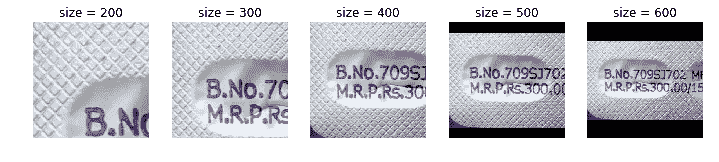

# 使用 fastai 库进行图像增强的介绍

> 原文：<https://towardsdatascience.com/introduction-to-image-augmentations-using-the-fastai-library-692dfaa2da42?source=collection_archive---------6----------------------->

## 使用 fastai 库应用图像增强的示例演练


Photo by [Thomas Willmott](https://unsplash.com/@tcwillmott?utm_source=medium&utm_medium=referral) on [Unsplash](https://unsplash.com?utm_source=medium&utm_medium=referral)

> [你也可以在这个 kaggle 内核](https://www.kaggle.com/init27/introduction-to-image-augmentation-using-fastai)中找到这个博客的可执行代码。
> 
> 关于 fastai 课程或图书馆的更多细节:请查看课程[网站](http://course-v3.fast.ai)和图书馆[文档](https://docs.fast.ai/)。

# 文章简介

这篇文章的目的是向您展示 fastai 中所有的图像增强。我将首先介绍数据增强，然后介绍图像增强。

然后我们再来做一个案例，为什么 fastai 默认“刚刚好”。

接下来，我们将看几个这种转换将非常有用的真实用例:

*   构建 SOTA 社区游泳池检测器
*   构建医学图像 OCR
*   建立一个谷歌镜头 Ripoff(咳，启动，咳)
*   建立一个车牌检测器。

我们将查看一个可爱小狗的基本图像，首先应用变换将其用作参考，然后我将展示相同的真实世界用例的示例。

注意，这些定义和解释很大程度上来自 fastai 文档，我鼓励你去看看。

此外，这并不意味着大量编写代码，而是在更高层次上讨论在何处或何时使用代码。

如果你想运行内核，请点击副标题空间的链接。

# 数据扩充

数据扩充是最常见的正则化技术之一，在图像处理任务中尤其常见。

当你在一台机器上工作[学习](https://hackernoon.com/tagged/learning)模型时，你的模型的性能只和你的数据一样好。根据您试图解决的模型和问题，您需要不同数量的数据。

然而，数据收集和清理是一个消耗资源的过程，并不总是可行的。

神经[网络](https://hackernoon.com/tagged/network)，或者通常用于图像处理相关目的:卷积神经网络，学习图像内部的“特征”。

# **为什么图像增强会起作用？**

任何机器学习项目的目标都是确保我们的代码或“模型”能够推广到现实世界的数据。然而，与此相反的是“过度拟合”，即模型只是学习识别训练数据集中的特征。

为了避免这种情况，我们在将图像输入模型时会“增加”或添加一些细微的变化。尽管 2 度的旋转对人眼来说可能不会产生巨大的差异，但这种微小的变化足以让模型更好地推广。

为了给你一个[“it just works”](https://www.youtube.com/watch?v=4u0NRgMyzEM)的例子，让我们尝试在打开/关闭图像增强的情况下，在 CIFAR-10 数据集上运行训练 ResNet 50。

[启用增强(默认)后，您可以看到模型表现得更好。](https://www.kaggle.com/init27/introduction-to-image-augmentation-using-fastai)

接下来，我将深入研究 fastai 支持的图像增强，并给出可能有用的示例用例。

# 使用 fastai 的图像增强

为了将“转换”应用到您的数据集，我们在创建“ImageDataBunch”对象时传递转换列表。

fastai 有一个默认的推荐转换列表，它是由团队经过大量实验得出的，所以对于初学者，我建议相信这些:

```
tfms = get_transforms()
```

这将返回一个长度为 2 的元组，其中包含两个列表:一个用于定型数据集，另一个用于验证数据集。

get_transforms 函数的默认参数是:

```
get_transforms(do_flip:bool=True, flip_vert:bool=False, max_rotate:float=10.0, max_zoom:float=1.1, max_lighting:float=0.2, max_warp:float=0.2, p_affine:float=0.75, p_lighting:float=0.75, xtra_tfms:Optional[Collection[Transform]]=None) → Collection[Transform]
```

这样生成的默认元组是:

```
([RandTransform(tfm=TfmCrop (crop_pad), kwargs={'row_pct': (0, 1), 'col_pct': (0, 1), 'padding_mode': 'reflection'}, p=1.0, resolved={}, do_run=True, is_random=True),
  RandTransform(tfm=TfmAffine (flip_affine), kwargs={}, p=0.5, resolved={}, do_run=True, is_random=True),
  RandTransform(tfm=TfmCoord (symmetric_warp), kwargs={'magnitude': (-0.2, 0.2)}, p=0.75, resolved={}, do_run=True, is_random=True),
  RandTransform(tfm=TfmAffine (rotate), kwargs={'degrees': (-10.0, 10.0)}, p=0.75, resolved={}, do_run=True, is_random=True),
  RandTransform(tfm=TfmAffine (zoom), kwargs={'scale': (1.0, 1.1), 'row_pct': (0, 1), 'col_pct': (0, 1)}, p=0.75, resolved={}, do_run=True, is_random=True),
  RandTransform(tfm=TfmLighting (brightness), kwargs={'change': (0.4, 0.6)}, p=0.75, resolved={}, do_run=True, is_random=True),
  RandTransform(tfm=TfmLighting (contrast), kwargs={'scale': (0.8, 1.25)}, p=0.75, resolved={}, do_run=True, is_random=True)],
 [RandTransform(tfm=TfmCrop (crop_pad), kwargs={}, p=1.0, resolved={}, do_run=True, is_random=True)])
```

如果你不理解索引中的所有单词，没关系。让我们深入探讨并尝试探索其中的一些。我分享这些的理由是:默认值总是一个好的起点，除非你正在处理非常不同的数据。例如:点突变或星系间图像。

# fastai 支持的转换

*   聪明
*   对比
*   农作物
*   作物 _ 垫
*   有两个平面的
*   二面角 _ 仿射
*   翻转 _lr
*   翻转 _ 仿射
*   振动
*   衬垫
*   透视 _ 扭曲
*   调整大小
*   辐状的
*   rgb _ 随机化
*   斜交
*   咯吱声
*   对称 _ 扭曲
*   倾斜
*   嗡嗡声
*   断流器

便利功能:

*   随机作物
*   rand_pad
*   随机缩放

这是一个很长的列表！让我们试着一个一个地探索这些问题。

**默认值:**

我从文档中(窃取)了一些助手代码:

```
*#Helper functions from fastai docs*
def get_ex(): return open_image(path/'images/beagle_192.jpg')

def plots_f(rows, cols, width, height, **kwargs):
    [get_ex().apply_tfms(tfms[0], **kwargs).show(ax=ax) for i,ax **in** enumerate(plt.subplots(
        rows,cols,figsize=(width,height))[1].flatten())]
```

这将允许我们看狗的图片。这些将是比较的基本情况。因此，我将进一步分享这种变换，它对基本的狗图片做了什么，以及在现实世界中你可能会发现它有用的地方，因为我们的狗图片可能不会作为我们将看到的所有情况的最佳示例。

# 旋转

(max_rotate=angle)在此处指定的-角度和+角度之间切换随机旋转。

```
tfms = get_transforms(max_rotate=180)
```

因为没有人会在这些角度点击他们狗狗的照片。让我们考虑另一种情况:


**真实世界用例**

你的任务是在你的社区找到游泳池。你下载卫星图像，但由于你所在的地区很小，你的模型不适合。


在这种情况下，图像增强可能是有用的:

乍一看，我可能骗你说这些是不同的照片，不是吗？我相信这对我们的模型来说是一个很好的目的。

# RGB 随机化

`rgb_randomize` ( `**x**`，`**channel**` : `int` = `***None***`，`**thresh**` : `float` = `***0.3***` ) → `[Image](https://docs.fast.ai/vision.image.html#Image)` :: `[TfmPixel](https://docs.fast.ai/vision.image.html#TfmPixel)`

众所周知，图像有三个通道(红、绿、蓝，即 RGB)。这种变换使输入图像的一个通道随机化。


*   *通道*:随机化哪个通道(RGB)。
*   *阈值*:随机化后，将数值缩放至不超过`thresh`值

这在这样的情况下可能是有用的:你的数据集应该帮助你检测汽车，但是你的实习生(或者研究生 Turk😛)做的不好，只采集了红色汽车的图像。您可以随机选择颜色，帮助学习者更好地概括。

# 聪明

我们可以在 0 到 1 之间改变亮度，默认值是 0.5。


让我们看一下我们的狗狗照片，在亮度范围内有各种变化。由于原始图像拍摄得相当完美，增强在这里没有帮助。这是另一个扩大你的形象可能会破坏你的模型的例子。因此，在对数据应用变换时要小心。

**真实世界用例**


警告远离我们。这是我工作中的一个例子:任务是从这个图像中提取文本。即使对于人眼来说，当背景和文本之间的差异最明显时，这也更容易做到。所以对于 ex:看 0.3 值——这是这种情况下最好的结果。

# **对比**

顾名思义，它允许我们从 0 到 2 的范围内改变对比度。1 是默认/原始图片。

这是我们可怜的狗狗的照片，正在进行另一组增强:


就我个人而言，我会投票给最“反差”的照片。归咎于 Instagram 滤镜。

**真实世界用例**

让我们重新开始之前的挑战。我们的任务是创建一个字符阅读器，从药品的图像中读取字符。对比度最大时效果最佳。

不相信我？看一看:


# 农作物

裁剪有助于裁剪到图像中提到的部分。

**真实世界用例**

你的任务是建立一个停车场计费机。由于我们的相机会固定在一个角度，我们可以预计大多数轿车进入很多，车牌最有可能是在一个固定的区域(中下部)。裁剪到那里将允许我们的模型只关注那个区域，使我们和模型的工作更容易。


# 作物垫

基于设置模式的 Crop_pad、crops 和 pads。fastai dev(s)推荐的是“反射填充”。有关零和反射填充，请参见下面的示例。



# 有两个平面的

二面角变换在二面体的 8 个可能的方向/角度上旋转图像。

让我们首先看看什么是二面角:


正如你所想象的，它会在所有这些可能的方向上旋转图像。定义够了，让我们从坏的角度来看我们无辜的小狗:


**真实世界用例**

现在，[我敢打赌，如果你在 Instagram 上以这样的角度给你的小狗拍照，或者是一个糟糕的父母。不管怎样，这都不是一个好例子。](https://youtu.be/U9BwWKXjVaI?t=55)

回到我们最初的夏令营任务，我们使用谷歌地图监视附近地区，寻找游泳池。


如你所见，在这种情况下，以这些角度旋转图像可能更有意义。如果你不知道，这些第一眼看上去可能是完全不同的图像。不是吗？

# **抖动**

抖动会给图像增加随机噪声。我不确定同样的最佳实际使用情况是什么，幅度可以从-x 到+x 设置，0 是原始图像。


**真实世界用例**

在幕后，抖动是来自邻域的随机像素替换。这意味着，它可能有助于避免过度拟合(认为它类似于辍学)

# 远景

这种变换改变了图像的视角，就好像我们的对象被移动了一样。

还记得苹果的这个视频吗？

这正是它的作用。

作为参考，让我们先看看我们的小狗。


**真实世界用例**

这可能有用的一个用例是，假设您正在创建一个药品检测器，您希望客户对药品拍照，并且您的“技术”应该能够检测/读取所有细节。现在，客户可能不会从最佳角度点击照片，你也不愿意教他们同样的方法。相反，你可以使用这个变换。

查看这些示例:


# 对称翘曲

[以下是文档中的定义](https://docs.fast.ai/vision.transform.html#_symmetric_warp):

同时应用四个倾斜，每个倾斜的强度在矢量`magnitude`中给出。

让我们看看我们的小狗作为参考。

**真实世界用例**

好了，现在举个真实世界的例子。[听说过谷歌镜头吗？](https://play.google.com/store/apps/details?id=com.google.ar.lens&hl=en_IN)
其在技术俱乐部中也被称为内容检索引擎/图片搜索引擎。现在想想，你使用这类服务真的不在乎角度对不对。所以这是你的工作。

例如，如果您的任务是构建一个 SOTA 谷物检测机图像引擎，这种转变将会非常突出:


# 倾斜

倾斜允许磁场“倾斜”到一个随机的方向和一个特定的大小。

`direction`是一个数字(0:左，1:右，2:上，3:下)。正面的`magnitude`是向前倾斜(朝向看图的人)，负面的`magnitude`是向后倾斜。

**真实世界用例**

我会饶了我们可爱的小狗，回到建造世界级谷物盒探测器的重要任务上。您可以看到转换对于这个用例再次非常有用:


这是一个很长的变换和例子列表。如果你有兴趣尝试这些，我会鼓励你检查我的入门内核。

如果你有任何问题，请给我发推文或在下面留言。

*如果你觉得这很有趣，并且想成为我的学习之路* *的一部分，你可以在 Twitter* [*这里*](http://twitter.com/bhutanisanyam1) *找到我。*

*如果你有兴趣阅读关于深度学习和计算机视觉的新闻，可以在这里* *查看我的* [*简讯。*](http://tinyletter.com/sanyambhutani/)

如果你有兴趣阅读机器学习英雄的一些最佳建议:从业者、研究人员和 Kagglers。 [*请点击这里*](https://hackernoon.com/interviews-with-machine-learning-heroes-504762ba5dd6)