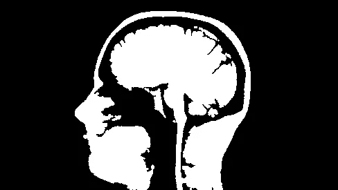

# 数字图像处理:数字图像介绍

> 原文：<https://towardsdatascience.com/introduction-to-images-c9c7abe6bfd2?source=collection_archive---------5----------------------->

## 图像类型的基本介绍

让我们讨论一下什么是图像。如果您来自信号处理背景，那么您可能会将图像视为二维信号，即具有二维 f(x，y)的函数，其中 x，y 是空间坐标。从几何学的角度来看，你可以把图像看作二维或三维空间中的一组点。每个(x，y)上的每个点称为图像的振幅或强度。当这个振幅和 x，y 点是离散的，那么我们称之为数字图像。如果值是连续值，那么我们称之为模拟图像。我们可以通过采样和量化将模拟图像转换成数字图像。用计算机处理数字图像的过程称为数字图像处理。

**像素:**在一幅数字图像中，二维函数上的所有坐标及其对应的值都是有限的。每个位置的每个可用值都被视为一个像素。换句话说，像素是图像的最小部分。因此，数字图像可以被认为是二维像素阵列。

**灰度:**每个像素都有一个强度值，称为灰度或灰度值。这些值通常用 8 位整数表示。所以取值范围从 0 到 255。接近 0 的值表示较暗的区域，接近 255 的值表示较亮的区域。

**图像类型:**二值、灰度、彩色

**二进制图像:**二进制图像只有两种可能的灰度值或强度 0 和 255，没有中间值。在许多图像处理任务中，二进制图像被用作指示感兴趣的像素的掩模。下面是二值图像的例子。

Binary Image (only 0 and 255)

**灰度图像:**灰度图像的值范围从 0 到 255，即每个像素位置可以有 0 到 255 之间的任何值。如果你看 20 世纪 50 年代左右的老电影，你看到的是灰度图像(电影只不过是视频，是按适当顺序排列的单个图像的集合)。下面是一个例子

Grayscale image (0–255 range)

**彩色图像:**二值图像和灰度图像都是二维数组，其中在每个位置，都有一个值来表示像素。记住，为了表示一幅彩色图像，我们需要每个像素有不止一个值。但是我们需要多少个值来代表一种颜色呢？通常，每个像素需要 3 个值来表示任何颜色。这来自于任何颜色都可以由红、蓝、绿三种基本颜色组合而成的想法。将红色和绿色混合就可以得到黄色，将红色和蓝色混合就可以得到紫色，等等。，这其实叫 RGB 色彩空间。还有许多其他方法来创建彩色图像，我们将在以后的讨论中讨论。下面是一个彩色图像的例子。

Color Image (3-dim array with 3 values at every pixel location)

**视频:**视频就是一组按适当顺序排列的图像。

本帖到此为止，谢谢大家！

[订阅 FOCUS](https://master-ml.ck.page/0b50556bfa)——我的每周简讯，获取人工智能的最新更新和最新进展，以及来自机器学习媒体的精选故事。