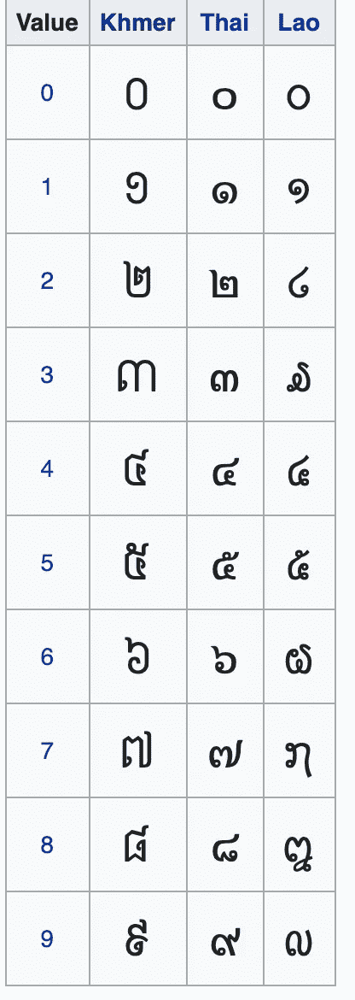
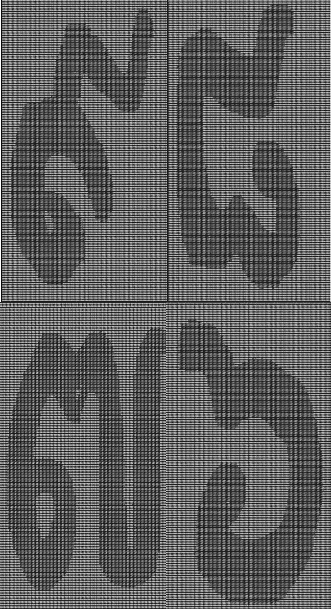
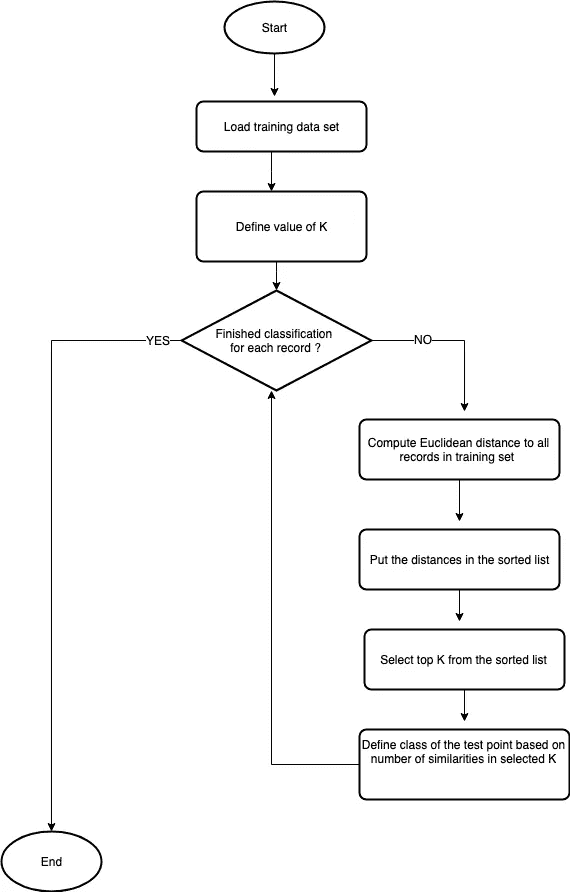
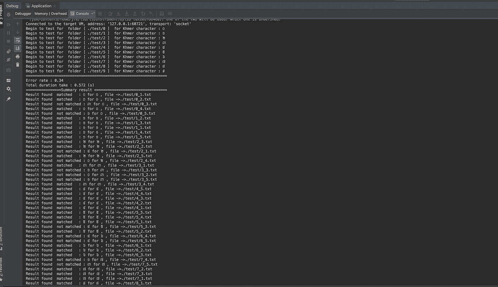

# 用 Java 8 对库美尔笔迹分类实验介绍 kNN 算法

> 原文：<https://towardsdatascience.com/introduction-to-knn-machine-learning-algorithm-by-experiment-on-khmer-handwriting-classification-66a64652a02c?source=collection_archive---------13----------------------->

机器学习是当前的热门领域，到处都在讨论。上面有很多使用一些函数式或者统计编程语言的实现，比如 [**Python**](https://www.python.org/) 或者 [**R**](https://www.r-project.org/) **。**然而 [**Java**](https://www.java.com) ，这种流行的 OOP 编程语言，仍然可以实现几乎所有的机器学习算法。作为一名 Java 开发人员，我想介绍 kNN ( [**K 近邻**](https://en.wikipedia.org/wiki/K-nearest_neighbors_algorithm) )算法，因为它易于实现，并且不需要大量的数学或统计背景就可以理解。

## 1.要应用的解决方案

**笔迹**可以是 kNN 算法解决的问题之一，我将使用 [**高棉文字字符**](https://en.wikipedia.org/wiki/Khmer_script) 作为解决的样本问题。高棉语是柬埔寨人所说的东南亚语言之一。它包含大量的辅音、从属或独立元音以及[数字](https://en.wikipedia.org/wiki/Khmer_numerals)。下图是数字脚本，我们将编写一些代码来确定它是否看起来像预期的数字，或者换句话说，对它进行分类。

Khmer numerals : source from Wikipedia

## 2.数据准备

为了对其进行测试，需要将手写图像转换为包含表示图像上绘制的像素的位(0，1)的文本。每一个机器学习都必须有训练数据集和实验测试数据集。将图像转换成文本的过程将在另一篇文章中提到。

Text represents Khmer handwriting numeral script in bit(0,1)

## 3.kNN 流程图

为了对我们将要写的东西有一个准确的概念，让我们看看下面的流程图:

kNN flowchart by [https://draw.io](https://draw.io)

## 4.使用 Java 8 实现 Java 代码

首先需要生成**数据加载器**类，以便将文本文件加载到内存中。正在使用地图，因为按文件夹分组是首选。

Data loader class

**距离计算器**用于使用欧几里德公式计算距离:

还需要生成一些类来保存一些数据和值，如下所示:

**KnnClassifer** 是本演示的主要逻辑。按照上面的流程图，下面是 Java 代码:

最后，我们创建主类，将所有的逻辑组合到一个应用程序中。

如果运行**应用**类没有任何问题，应该会显示如下图所示的结果。错误率为 **0.34** ，时间为 **0.572 秒**(根据硬件规格不同，在您的电脑上可能会有所不同)。我们可以修改***K _ CONSTANT****，****NUMBER _ OF _ THREAD****或者修改一些 **parallelStream** 部分到普通 **stream** 来查看不同时间的分类。*

**

*kNN classification result*

## *5.结论*

*kNN 可以使用 Java 进行实验，并通过多线程、并行流和许多其他 Java 8 特性进行优化。kNN 的应用可以在许多领域找到，包括推荐系统、手写和其他分类。 [**优步预测系统**](https://eng.uber.com/elk/) 是现实世界中应用 kNN 算法系统**的一个例子。**然而，它需要大量的计算、成比例的系统以及为训练集做好准备以避免性能问题。**本次演示的完整代码和数据集可以在**[**https://github.com/engleangs/knnclassifier**](https://github.com/engleangs/knnclassifier)**中找到。***

*希望这个基本介绍能对你有用。如果有任何反馈或建议，请告诉我，加油！！。*