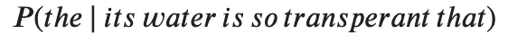
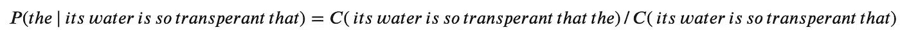
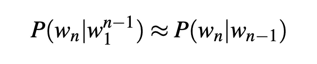

# 语言模型:N 元语法

> 原文：<https://towardsdatascience.com/introduction-to-language-models-n-gram-e323081503d9?source=collection_archive---------1----------------------->

Photo by [Erik Eastman](https://unsplash.com/@erikeae?utm_source=unsplash&utm_medium=referral&utm_content=creditCopyText) on [Unsplash](https://unsplash.com/search/photos/characters?utm_source=unsplash&utm_medium=referral&utm_content=creditCopyText)

## 介绍

## 统计语言建模的一个步骤

# 介绍

统计语言模型本质上是一种为单词序列分配概率的模型。在本文中，我们将了解为句子和单词序列分配概率的最简单模型，即 ***n 元语法***

你可以把一个 N-gram 看作是 N 个单词的序列，根据这个概念，一个 2-gram(或二元模型)是两个单词的序列，如“请转”、“转你的”或“你的作业”，而一个 3-gram(或三元模型)是三个单词的序列，如“请转你的”或“转你的作业”

# 直觉公式

先说方程 P(w|h)，给定一些历史，单词 *w* 的概率， *h* 。举个例子，

> 在这里，水是如此的透明

而且，估算上述概率函数的一种方法是通过相对频率计数法，在这里你会取一个相当大的语料库，统计你看到 ***的次数，它的水是如此透明以至于*** ，然后统计它后面是*的次数。换句话说，你在回答这个问题:*

> *在你看到历史 h 的次数中，单词 w 跟随了多少次*

**

*现在，你可以想象在整个语料库上执行这个是不可行的；尤其是它的尺寸很大。*

*这一缺点和使用链式法则分解概率函数的方式充当了 N-gram 模型的基本直觉。在这里，你不是使用整个语料库来计算概率，而是用几个历史单词来近似计算概率*

# *二元模型*

*顾名思义，二元模型通过仅使用一个前面单词的条件概率来近似给定所有前面单词的单词的概率。换句话说，你用概率来近似它:P(the | that)*

*因此，当您使用二元模型来预测下一个单词的条件概率时，您会得出以下近似值:*

**

> *这种一个词的概率只取决于前一个词的假设也被称为**马尔可夫**假设。*
> 
> *马尔可夫模型是一类概率模型，它假设我们可以预测某个未来单位的概率，而不用考虑太远的过去。*

*您可以进一步将二元模型推广到**三元模型**，它查看过去的两个单词，因此可以进一步推广到 **N 元模型***

# *概率估计*

*现在，我们理解了 N 元模型的基础，你会想，我们如何估计概率函数。最直接和直观的方法之一是**最大似然估计(MLE)***

*例如，给定前一个单词 ***x*** ，计算单词 ***y*** 的特定二元模型概率，您可以确定二元模型 C(xy)的计数，并通过共享相同首词 ***x*** 的所有二元模型的总和对其进行归一化。*

# *挑战*

*当然，每一种建模方法和评估方法都存在挑战。让我们看看影响 N-gram 模型的关键因素，以及 MLE 的使用*

***对训练语料的敏感度***

*与许多统计模型一样，N-gram 模型非常依赖于训练语料库。因此，**，**概率通常编码关于给定训练语料库的特定事实。此外，N 元模型的性能随着 N 值的变化而变化。*

*此外，你可能有一个语言任务，其中你知道所有可能出现的单词，因此我们提前知道词汇量 V。封闭词汇表假设没有未知单词，这在实际场景中不太可能。*

***平滑***

*MLE 方法的一个显著问题是数据稀疏。也就是说，任何出现足够多次的 N-gram 都可能对其概率有一个合理的估计。但是因为任何语料库都是有限的，一些完全可以接受的英语单词序列必然会从其中缺失。*

*因此，任何训练语料库的 N-gram 矩阵必然具有大量假定的“零概率 N-gram”的情况*

# ***来源:***

*[1]章节草稿— | Stanford Lagunita。[https://lag unita . Stanford . edu/c4x/Engineering/CS-224n/asset/sl P4 . pdf](https://lagunita.stanford.edu/c4x/Engineering/CS-224N/asset/slp4.pdf)*

*[2]语音和语言处理:自然语言处理、计算语言学和语音导论*

*感谢阅读。*如果您有任何反馈，请对本文发表评论，在*[*LinkedIn*](https://www.linkedin.com/in/shashankkapadia/)*上给我发消息，或者给我发电子邮件(shmkapadia[at]gmail.com)**

*如果你喜欢这篇文章，请访问我的其他文章*

* [## Python 中的主题建模:潜在狄利克雷分配(LDA)

### 如何开始使用 Python 中的 LDA 进行主题建模

towardsdatascience.com](/end-to-end-topic-modeling-in-python-latent-dirichlet-allocation-lda-35ce4ed6b3e0)  [## 评估主题模型:潜在狄利克雷分配(LDA)

### 构建可解释主题模型的分步指南

towardsdatascience.com](/evaluate-topic-model-in-python-latent-dirichlet-allocation-lda-7d57484bb5d0)  [## 构建块:文本预处理

### 本文是关于自然语言处理的后续文章的第二篇。这一系列…的目的

towardsdatascience.com](/building-blocks-text-pre-processing-641cae8ba3bf)*