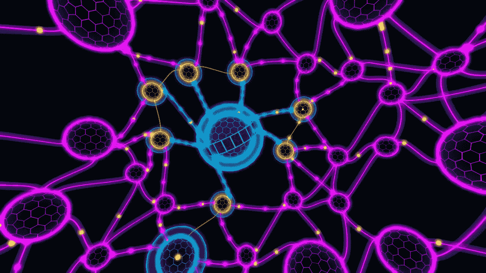
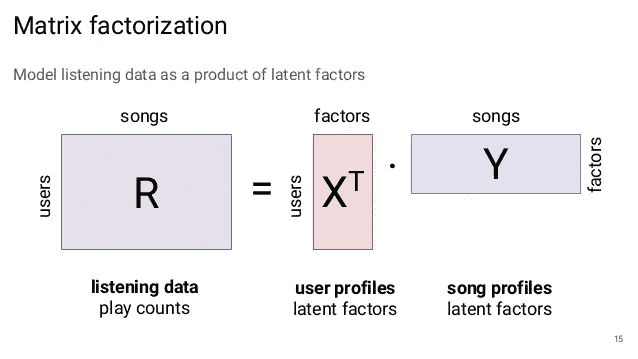
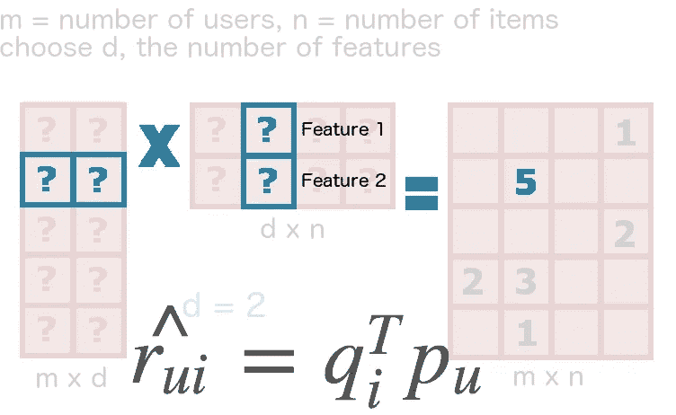

# 潜在矩阵分解推荐系统简介

> 原文：<https://towardsdatascience.com/introduction-to-latent-matrix-factorization-recommender-systems-8dfc63b94875?source=collection_archive---------5----------------------->



Latent Factors are “Hidden Factors” unseen in the data set. Let’s use their power. Image URL: [https://www.3dmgame.com/games/darknet/tu/](https://www.3dmgame.com/games/darknet/tu/)

在创建推荐系统时，潜在矩阵分解是一种非常强大的方法。自从潜在矩阵分解在网飞推荐竞赛中被证明优于其他推荐方法以来，它就成为了构建推荐系统的基石。这篇文章的目的是给你一些直觉，告诉你什么时候使用潜在矩阵分解进行推荐，同时也给你一些直觉，告诉你为什么它会起作用。如果你想看完整的实现，可以去我的 Kaggle 内核:[概率矩阵分解](https://www.kaggle.com/robottums/probabalistic-matrix-factorization-with-suprise)。

开始之前，让我们先回顾一下我们要解决的问题。潜在矩阵分解是一种解决**推荐问题的算法:**给定一组 *m* 个用户和 *n* 个项目，以及一组用户对某些项目的评分，尝试为每个用户推荐排名靠前的项目。这个问题有很多味道和交替的偏差，大多数都给问题增加了更多的维度，就像添加标签一样。潜在矩阵分解之所以强大，是因为它从核心问题中产生了非常强大的结果，并且可以成为一个很好的基础。

当使用用户项目评分矩阵，以及阅读关于矩阵分解的文章时，首先要看的是线性代数。直觉是正确的，但它不完全是你所期望的。

# **稀疏不完全矩阵代数:**

传统的线性代数是机器学习的基石，这是因为大多数机器学习应用程序拥有推荐系统所没有的东西:没有 nan(不完整数据条目)的数据集。例如，无论何时构建模型，nan 或缺失数据都会在数据预处理步骤中被删除，因为大多数函数无法处理未填充的值。如果有缺失值，则像主成分分析这样的函数是未定义的。然而，如果你摆脱了 nan，推荐系统就无法工作。那些 nan 的存在是有原因的:不是每个用户都对每个项目进行了评级，期望他们这样做有点荒谬。处理稀疏数据是非常不同的事情——这使得推荐成为一个有趣的问题。

稀疏使事情复杂化。奇异值分解是一种将矩阵分解为奇异值和正交值的分解，如果矩阵中的任何元素未定义，则该分解是未定义的。这意味着我们不能以这样一种方式显式分解矩阵，即我们可以找到哪个对角(或潜在)因子在数据集中具有最大权重。

相反，我们将使用一种叫做**概率矩阵分解的技术来近似矩阵的最佳分解。**这项技术归功于 Simon Funk，他在他的 FunkSVD 算法中使用了这项技术，并在网飞竞赛中取得了巨大成功。更多阅读，请查看西蒙的[原帖](https://sifter.org/~simon/journal/20061211.html)。

# **方法:**

我先解释算法，再解释直觉。



Image URL: [https://www.slideshare.net/RussiaAI/deep-learning-for-audiobased-music-recommendation](https://www.slideshare.net/RussiaAI/deep-learning-for-audiobased-music-recommendation)

我们将首先从高斯分布初始化两个矩阵(或者，随机初始化它们)。第一个将是一个 *m x k* 矩阵 **P** 而第二个将是一个 *k x n* 矩阵 **Q** 。当这两个矩阵相乘时，它们会产生一个 *m x n* 矩阵，这正好是我们试图预测的评级矩阵的大小。维度 *k* 是我们的超参数之一，它代表了我们用来估计评级矩阵的潜在因素的数量。一般来说， *k* 在 10–250 之间，但不要相信我的话——使用线搜索(或网格搜索)找到适合您应用的最佳值。



Source: [katbailey.github.io](http://katbailey.github.io/mf/)

对于我们的矩阵 **P，Q，**，我们将通过使用**随机梯度下降来优化它们的值。**因此，您将有另外两个超参数需要优化，即学习率和时期。对于每个时期，我们将遍历我们原始的 *m x n* 矩阵中的每个已知评级。

然后，我们将得到一个误差或残差值 **e** ，通过 P 中的原始评分用户行和 q 中的项目列的点积减去原始评分值。

在正常的随机梯度下降方式中，我们将通过将 P 和 Q 的当前行加上学习率乘以误差乘以另一个矩阵的值的乘积来同时更新矩阵 P 和 Q。

这是 python 语言。在我的 [Kaggle 内核](https://www.kaggle.com/robottums/probabalistic-matrix-factorization-with-suprise)中完整查看。

```
#randomly initialize user/item factors from a Gaussian
        P = np.random.normal(0,.1,(train.n_users,self.num_factors))
        Q = np.random.normal(0,.1,(train.n_items,self.num_factors))
        #print('fit')for epoch in range(self.num_epochs):
            for u,i,r_ui in train.all_ratings():
                residual = r_ui - np.dot(P[u],Q[i])
                temp = P[u,:] # we want to update them at the same time, so we make a temporary variable. 
                P[u,:] +=  self.alpha * residual * Q[i]
                Q[i,:] +=  self.alpha * residual * tempself.P = P
        self.Q = Qself.trainset = train 
```

现在我们有了算法，为什么它会工作，我们如何解释它的结果？

潜在因素代表数据中存在的类别。对于电影数据集的 k=5 个潜在因素，这些因素可以代表动作、浪漫、科幻、喜剧和恐怖。有了更高的 *k，*你就有了更具体的类别。我们正在尝试预测用户 *u 对项目 i.* 的评级。因此，我们查看 P 以找到代表用户 *u、*以及他们对所有潜在因素的偏好或“亲和力”的向量。然后，我们查看 Q 以找到一个代表项目 I 的向量，以及它对所有潜在因素的“亲和力”。我们得到这两个向量的点积，这将返回给我们一个用户在潜在因素的上下文中有多喜欢这个项目的感觉。

## **来源及延伸阅读:**

大量的信息和灵感来自于这篇关于[概率矩阵分解](https://papers.nips.cc/paper/3208-probabilistic-matrix-factorization.pdf)的文章和[Charu Aggarwal 的《推荐系统:教科书》第三章。](https://www.amazon.com/Recommender-Systems-Textbook-Charu-Aggarwal/dp/3319296574)

你可以在这里找到 python 实现。