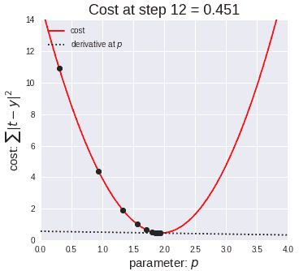

# 线性回归和多项式回归简介

> 原文：<https://towardsdatascience.com/introduction-to-linear-regression-and-polynomial-regression-f8adc96f31cb?source=collection_archive---------4----------------------->

# 介绍

在这个博客中，我们将讨论两个重要的主题，它们将构成机器学习的基础，即“线性回归”和“多项式回归”。

# 什么是回归？

> 回归分析是预测建模技术的一种形式，它研究因变量和自变量之间的关系。

以上定义是一个书生气十足的定义，简单来说回归可以定义为，“*利用变量之间的关系来寻找最佳拟合直线或可以用来进行预测的回归方程”。*

Regression | Image: Wikipedia

回归有许多类型，如“线性回归”、“多项式回归”、“逻辑回归”等，但在这篇博客中，我们将学习“线性回归”和“多项式回归”。

# 线性回归

线性回归是一种基本且常用的预测分析类型，通常用于连续数据。我们将基于一个例子来理解线性回归:

Aarav 是一个想买房子的人，他正在收集住房数据，以便根据房子的“居住面积”(以英尺为单位)来估算房子的“成本”。

Housing data | Andrew Ng course

他观察了数据，并在绘制散点图后得出数据是线性的结论。在他的第一个散点图中，Aarav 使用了两个变量:“居住面积”和“价格”。

Scatter plot | Image: Andrew Ng course

他一看到数据中的模式，就计划在图上画一条回归线，这样他就可以用这条线来预测“房子的价格”。
使用训练数据，即“价格”和“居住面积”，得到一条给出最小误差的回归线。要做到这一点，他需要画一条尽可能接近多点的线。这个“线性方程”然后被用于任何新的数据，以便他能够预测所需的输出。

这里，β1 是参数(也称为权重),β0 是 y 轴截距，єi 是随机误差项，其作用是增加偏差。上面的方程是需要以最小的误差得到的线性方程。

上面的方程是一个简单的“*直线的方程”*即

> y(预测)= (β1*x + βo) +误差值

其中' **β1** '为*斜率*，' **βo** '为 *y 轴截距*，类似于直线的方程。必须选择值“β1”和“β0 ”,以使误差最小。为了检查误差，我们必须计算误差平方和，并调整参数以尽量减少误差。

> 误差=σ(实际输出-预测输出)

Cost function

> ***键:*** *1。* ***Y(预测)*** *也叫*假设函数*。
> 2。****J(θ)****是代价函数，也可以称为*误差函数*。我们的主要目标是使成本最小化。
> 3。****y(I)****是*的预测输出*。
> 4。****【x(I))****称为*假设函数*基本上就是* Y(预测)*值。*

现在问题来了，我们如何减少误差值。嗯，这可以通过使用**梯度下降来实现。**梯度下降的主要目标是**最小化成本值。**即 min J(**θo，*θ1*T53)**

Gradient Descent Visualization | Gif: mi-academy.com

梯度下降有一个类比，我们必须想象自己在一个山谷的山顶，被蒙住眼睛，束手无策，我们的目标是到达山脚。感觉你周围地形的坡度是每个人都会做的。这个动作类似于计算梯度下降，而走一步类似于更新参数的一次迭代。

Gradient Decent Analogy | Image: Andrew Ng course

选择一个完美的 ***学习速率*** 是一项非常重要的任务，因为它取决于我们在每次迭代中走下坡路的幅度。如果我们迈得太大，我们可能会跳过最小值。然而，如果我们采取小步骤，将需要多次迭代才能达到最小值。

Linear Regression

# 多项式线性回归

在上一节中，我们看到数据集中的两个变量是相关的，但如果我们知道我们的数据是相关的，但这种关系看起来不是线性的，会发生什么呢？因此，根据数据的情况，我们可以对数据进行多项式回归，以拟合多项式方程。

Left: Linear Regression, Right: Polynomial regression | GIF: Towards Data Science

因此，如果我们试图在上图中使用一个简单的线性回归，那么线性回归线将不会很好地拟合。很难在上面的图表中拟合出误差值很低的线性回归线。因此，我们可以尝试使用多项式回归来拟合多项式线，以便我们可以实现最小误差或最小成本函数。上述图表数据的多项式回归方程为:

> y =*θo+θ*₁*x*₁*+θ*₂*x*₁

这是多项式回归的一般方程是:

> *y*=θo+θ₁*x*+θ₂*x*+…+θₘxᵐ+**残差**

**使用多项式回归的优点:**

*   多项式提供了因变量和自变量之间关系的最佳近似。
*   在它下面可以安装多种功能。
*   多项式基本上适合大范围的曲率。

**使用多项式回归的缺点**

*   数据中存在一两个异常值会严重影响非线性分析的结果。
*   这些对异常值过于敏感。
*   此外，不幸的是，用于检测非线性回归中异常值的模型验证工具比用于线性回归的工具少。

# 结论

在这篇博客中，我已经向你介绍了线性回归和多项式回归的基本概念。