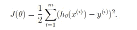
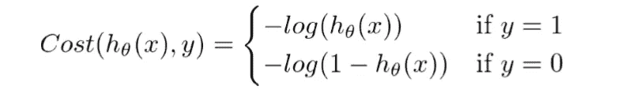
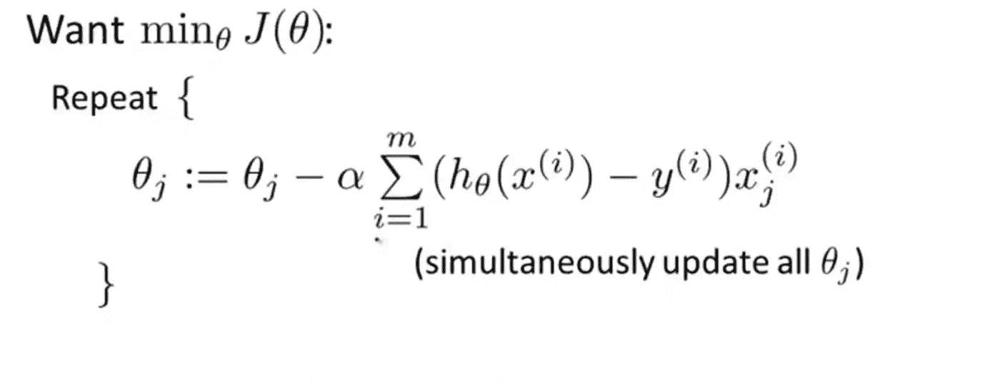
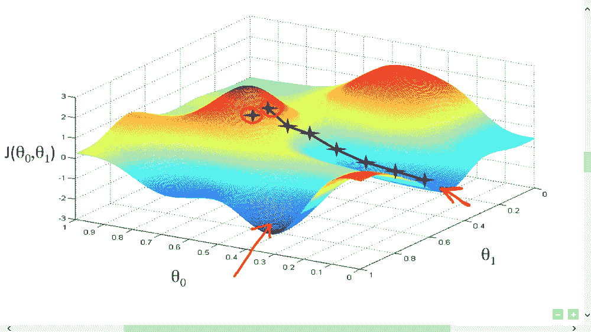

# 逻辑回归介绍

> 原文：<https://towardsdatascience.com/introduction-to-logistic-regression-66248243c148?source=collection_archive---------0----------------------->

# 介绍

在这个博客中，我们将讨论逻辑回归的基本概念以及它能帮助我们解决什么样的问题。

GIF: University of Toronto

逻辑回归是一种分类算法，用于将观察值分配给一组离散的类。分类问题的一些例子是电子邮件垃圾邮件或非垃圾邮件、在线交易欺诈或非欺诈、恶性肿瘤或良性肿瘤。逻辑回归使用逻辑 sigmoid 函数转换其输出，以返回概率值。

## **逻辑回归有哪些类型**

1.  二元(如恶性肿瘤或良性肿瘤)
2.  多线性函数失败类(如猫、狗或羊的)

# 逻辑回归

逻辑回归是一种用于分类问题的机器学习算法，它是一种基于概率概念的预测分析算法。

Linear Regression VS Logistic Regression Graph| Image: Data Camp

我们可以将逻辑回归称为线性回归模型，但是逻辑回归使用更复杂的成本函数，该成本函数可以定义为“ **Sigmoid 函数**，或者也称为“逻辑函数”，而不是线性函数。

逻辑回归的假设倾向于将成本函数限制在 0 和 1 之间。因此，线性函数不能表示它，因为它可以具有大于 1 或小于 0 的值，根据逻辑回归的假设，这是不可能的。

Logistic regression hypothesis expectation

## 什么是乙状结肠函数？

为了将预测值映射到概率，我们使用 Sigmoid 函数。该函数将任何实数值映射到 0 和 1 之间的另一个值。在机器学习中，我们使用 sigmoid 将预测映射到概率。

Sigmoid Function Graph

Formula of a sigmoid function | Image: Analytics India Magazine

# **假设表象**

使用*线性回归*时，我们使用假设的公式，即

> hθ(x)=β₀+β₁x

对于逻辑回归，我们将对其稍加修改，即

> σ(Z) = σ(β₀ + β₁X)

我们预计我们的假设将给出介于 0 和 1 之间的值。

> Z = β₀ + β₁X
> 
> hθ(x)= sigmoid(Z)
> 
> 即 hθ(x)= 1/(1+e^-(β₀+β₁x)

The Hypothesis of logistic regression

## 判别边界

当我们通过一个预测函数传递输入并返回一个介于 0 和 1 之间的概率分数时，我们期望我们的分类器根据概率给出一组输出或类。

例如，我们有 2 个类，让我们像猫和狗一样对待它们(1 —狗，0 —猫)。我们基本上确定一个阈值，高于该阈值的值我们将其分类为第 1 类，低于该阈值的值我们将其分类为第 2 类。

Example

如上图所示，我们选择阈值为 0.5，如果预测函数返回值为 0.7，则我们会将此观察结果分类为 1 类(狗)。如果我们的预测返回值为 0.2，那么我们会将观察结果分类为第 2 类(CAT)。

# 价值函数

我们在*线性回归中学习了成本函数 *J* ( *θ* ，成本函数代表优化目标，即我们创建一个成本函数并将其最小化，以便我们可以开发一个误差最小的精确模型。*

**

*The Cost function of Linear regression*

*如果我们试图在“逻辑回归”中使用线性回归的成本函数，那么它将是无用的，因为它最终将是一个具有许多局部最小值的**非凸**函数，其中很难**使**最小化成本值并找到全局最小值。*

**

*Non-convex function*

*对于逻辑回归，成本函数定义为:*

> *如果 y = 1，log( *hθ* ( *x* ))*
> 
> *如果 y = 0，log(1*hθ*(*x*))*

**

*Cost function of Logistic Regression*

****

*Graph of logistic regression*

*上述两个函数可以压缩成一个函数，即*

**

*Above functions compressed into one cost function*

# *梯度下降*

*现在问题来了，我们如何降低成本价值。嗯，这个可以用**梯度下降来实现。**梯度下降的主要目标是**最小化成本值。**即 min J( ***θ*** )。*

*现在，为了最小化成本函数，我们需要对每个参数运行梯度下降函数，即*

**

*Objective: To minimize the cost function we have to run the gradient descent function on each parameter*

**

*Gradient Descent Simplified | Image: Andrew Ng Course*

*梯度下降有一个类比，我们必须想象自己在一个山谷的山顶，被蒙住眼睛，束手无策，我们的目标是到达山脚。感觉你周围地形的坡度是每个人都会做的。这个动作类似于计算梯度下降，而走一步类似于更新参数的一次迭代。*

**

*Gradient Descent analogy*

# *结论*

*在这篇博客中，我向你介绍了逻辑回归的基本概念。我希望这篇博客对你有所帮助，并能激发你对这个话题的兴趣。*