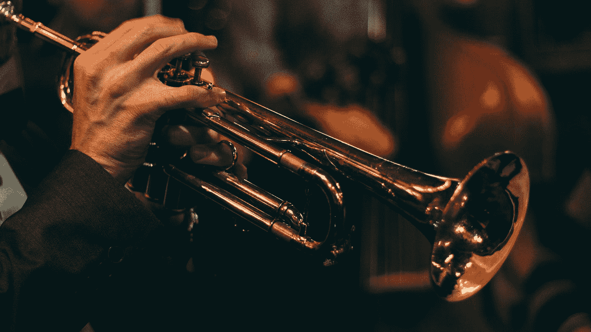
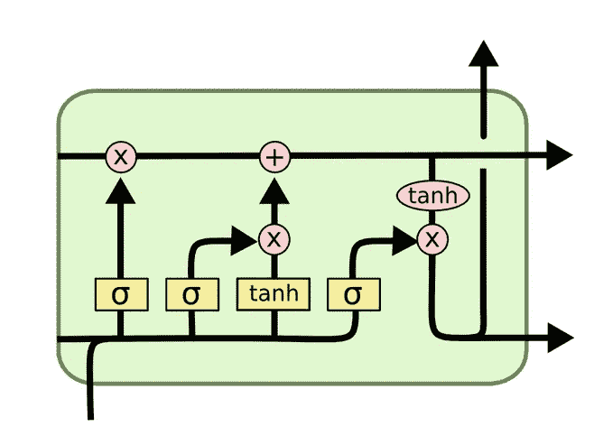
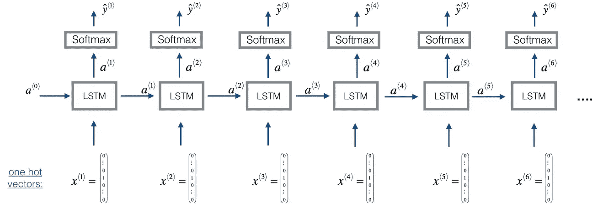
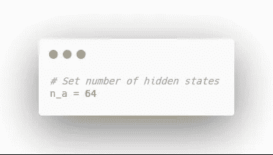
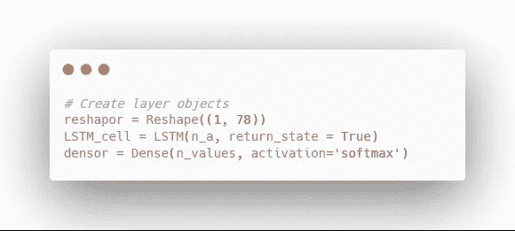
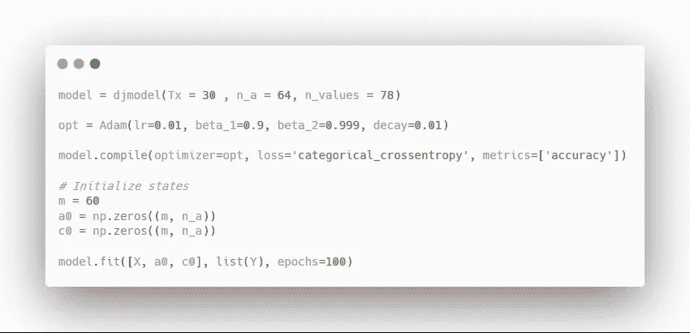
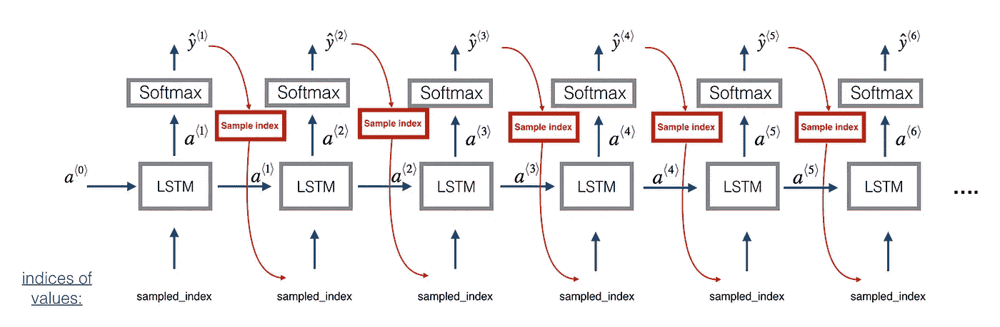
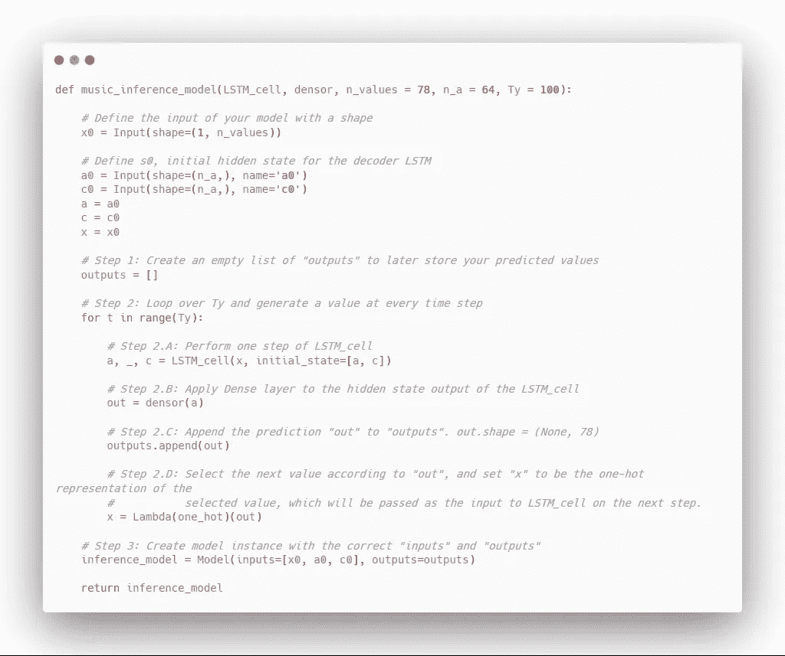
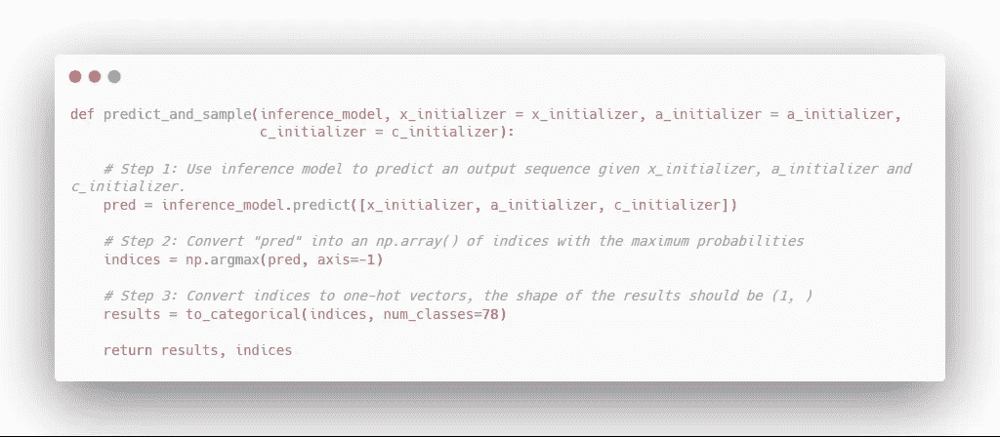

# 演奏爵士乐时介绍 LSTM 单元

> 原文：<https://towardsdatascience.com/introduction-to-lstm-units-while-playing-jazz-fa0175b59012?source=collection_archive---------15----------------------->

## 了解长短期记忆(LSTM)单位，并运用它们生成爵士乐使用 Keras



Photo by [Chris Bair](https://unsplash.com/@chrisbair?utm_source=medium&utm_medium=referral) on [Unsplash](https://unsplash.com?utm_source=medium&utm_medium=referral)

长短期记忆(LSTM)单元允许学习很长的序列。它是门控循环单元( **GRU** )的一个更加通用和健壮的版本，在这篇文章中不会讨论。

在这篇文章中，我们将学习 LSTM 单元是如何工作的，我们将应用它来生成一些爵士音乐。

我们开始吧！

> 对于机器学习、深度学习和人工智能的实践视频教程，请查看我的 [YouTube 频道](https://www.youtube.com/channel/UC-0lpiwlftqwC7znCcF83qg?view_as=subscriber)。

[*You can call me Al*](https://www.youtube.com/watch?v=uq-gYOrU8bA) is a great song!

# LSTM 的结构

LSTM 的主要特征是有三个门:

*   更新门
*   忘记大门
*   输出门

下面是一个 LSTM 单位的示意图。三个门通过三个*符号*的出现来显示:



Schema of an LSTM unit

从上图中，注意在 LSTM 单元的顶部有一条从左到右的线。这条线代表早期的信息如何在网络中传递到下一步，这就是为什么 LSTM 单元如此擅长于*记忆*长序列。因此，这允许模型捕捉更长范围的依赖性。

这看起来好像没有太多关于 LSTM 的知识，但是要理解这只是一个循环神经网络中的一个单元(MAKE LINK)。上面的绿框只是代表一个 RNN 的一个单位。然后，连接多个单元，形成一个完整的网络。

# 使用 LSTMs 生成 jazz

现在，我们将使用 LSTM 实现一个 RNN 来生成爵士乐！我们将使用 Keras 实现网络，它将生成一个 15 秒的爵士乐剪辑。

一如既往的[全笔记本](https://github.com/marcopeix/Deep_Learning_AI/blob/master/5.Sequence%20Models/1.Recurrent%20Neural%20Networks/Improvise%20a%20Jazz%20Solo%20with%20LSTM.ipynb)可供咨询。

> 不幸的是，用于训练的数据太大，无法上传到 Github 上

## 概观

我们模型的架构将如下所示:



RNN architecture to generate jazz music. [Source](https://www.deeplearning.ai/)

基本上，这个模型会被输入一个音乐值，然后它会产生一系列的音乐值来产生音乐。

在这里，“值”代表一个音符、一个持续时间，它还包含是否同时演奏另一个音符的信息(也称为和弦)。

## 步骤 1:初始模型设置

首先，我们定义网络中隐藏状态的数量。在这种情况下，我们将使用 64。



现在，Keras 有简单的内置函数来构建模型。然而，对于序列生成，不是所有的输入值都是已知的；它们一次生成一个。因此，我们需要添加一个定制的 for 循环，并定义层对象，以便在步骤之间共享权重。



## 步骤 2:构建模型

现在，我们准备构建模型:

## 步骤 3:创建、编译、适应

现在，我们可以创建模型，对其进行编译，并使其符合数据:



## 第四步:创作音乐

现在，我们开始有趣的部分:让我们用我们的模型产生音乐！

在每个采样步骤中，来自前一个 LSTM 单元的激活和单元状态将在下一个单元中传播，并且它们将用于生成另一个输出。



How the output propagates in the network. [Source](https://www.deeplearning.ai/)

要生成音乐，我们需要首先对音符进行采样:



有了这些，我们现在可以预测并创造一个音乐序列:



然后用这个代码单元生成音乐:

```
out_stream = generate_music(inference_model)
```

你可以找到我生成的音乐文件(。midi 文件)存储在[库](https://github.com/marcopeix/Deep_Learning_AI/tree/master/5.Sequence%20Models/1.Recurrent%20Neural%20Networks)中。

就是这样！您学习了什么是 LSTM 单元，以及如何用 Keras 应用它来生成音乐。请记住，LSTM 单位只是 RNN 中使用的块。

对于进一步的阅读，我建议你看看 GRU 单元，因为它是一个 LSTM 的简单版本。

干杯！