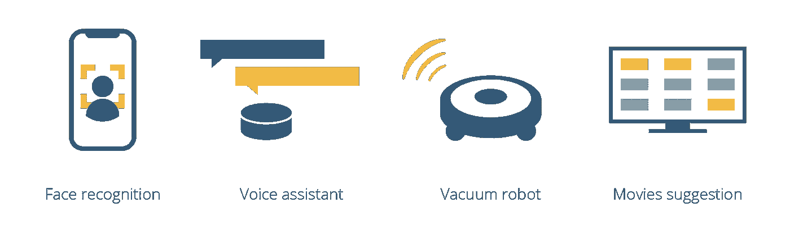
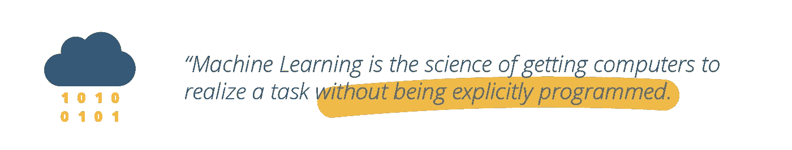
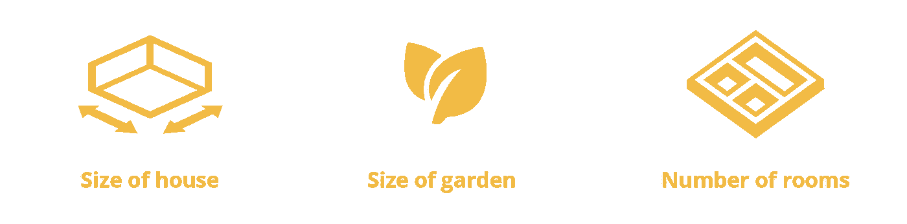
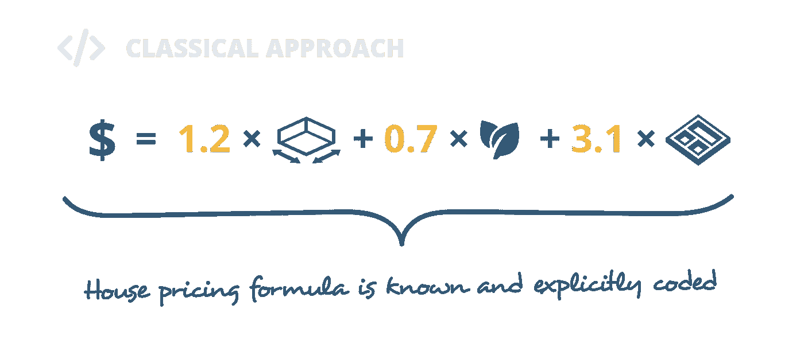
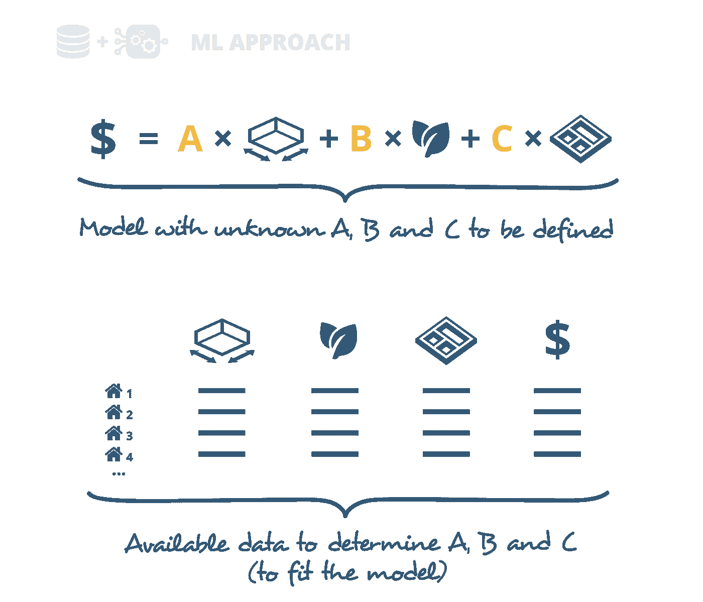
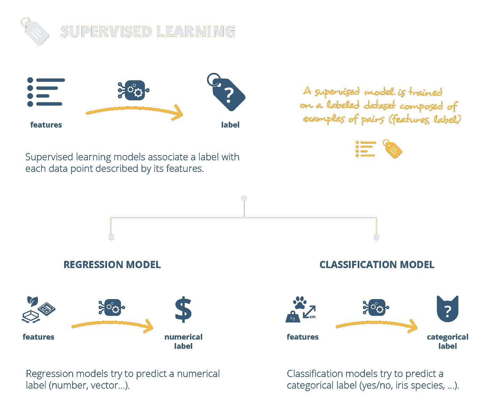
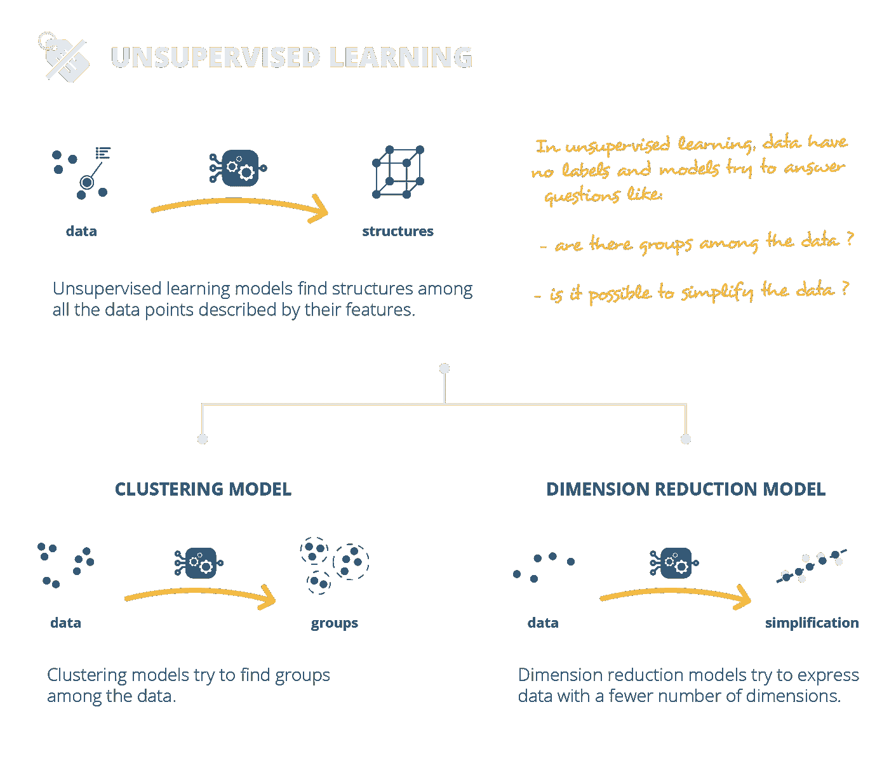

# 机器学习的简单介绍

> 原文：<https://towardsdatascience.com/introduction-to-machine-learning-f41aabc55264?source=collection_archive---------7----------------------->

## 关于 ML 的数据科学入门帖子。

Credit: [congerdesign](https://pixabay.com/fr/users/congerdesign-509903/) on [Pixabay](https://pixabay.com/)

*本帖与一个* ***视频*** *有关，名为《机器学习导论》变现为* ***走向数据科学*** *。这个视频的剧本是用* [*安妮·邦纳*](https://medium.com/u/a71060a2ef24?source=post_page-----f41aabc55264--------------------------------) *写的。视频中你能听到的声音是爱丽丝·伊里扎里的声音。*

[Introduction to Machine Learning](https://www.youtube.com/watch?v=XvZsiWj6VuU)

# 介绍

我们目前生活在一个“数据时代”，每天都有大量的数据被收集和存储。面对这种不断增长的数据量，**机器学习方法已经变得不可避免**。以至于你可能一天用几十次，甚至都没有注意到！

让我们从一个对数百万用户的“日常”机器学习贡献的例子开始:脸书新闻订阅背后的算法。脸书使用机器学习来利用用户的数据和反馈来个性化他们的订阅。如果你“喜欢”一个帖子或停止滚动阅读某个内容，该算法会从中学习，并开始用更多类似的内容填充你的提要。这种学习是持续进行的，因此新闻提要中建议的内容会随着您的偏好而发展，从而使您的用户体验更加愉快。

Facebook uses likes, comments and other signals from users to learn what they are interested in and populate their new feeds in consequences.

这只是一个例子！还有很多其他的。苹果可以在你刚拍的照片里认出你朋友的脸。亚马逊 Echo 理解你，可以回答你的问题。你的吸尘器甚至可以在你的房子周围导航，而网飞会推荐符合你个人资料的视频！机器学习已经成为我们日常生活的一个重要部分，而且不会很快消失。

Machine learning can now be found in many tools that we use on a daily basis.

# 机器学习的定义

但是机器学习到底是什么？这些看起来很神奇的算法背后是什么？他们是如何利用数据工作得如此出色的？

从形式上来说，**机器学习是让计算机在没有明确编程的情况下实现一项任务的科学。换句话说，经典算法和机器学习算法之间的巨大差异在于我们定义它们的方式。**

**经典算法**被赋予精确完整的规则来完成任务。**机器学习算法**被给予定义模型的一般准则，以及数据。这些数据应该包含模型完成任务所需的缺失信息。因此，当模型已经相对于数据进行了调整时，机器学习算法可以完成其任务。我们说**“根据数据拟合模型”**或者**“必须根据数据训练模型。”**

让我们用一个简单的例子来说明这个问题。假设我们想根据房子的大小、花园的大小和房间的数量来预测房子的价格。

Features we are going to consider in our house pricing example.

我们可以尝试建立一个经典算法来解决这个问题。该算法必须采用三种房屋特征，并根据显式规则返回预测价格。在这个例子中，确切的房价公式必须是已知的，并明确编码。但在实践中，这个公式往往不为人知。

For our house pricing example, a classical programming approach would consists in coding explicitly the formula that gives the price of a house depending on the three features we are considering.

另一方面，我们可以建立一个机器学习算法。首先，这种算法将定义一个模型，该模型可以是根据我们有限的知识创建的不完整的公式。**然后，通过对给定的房价实例进行训练来调整模型**。为此，我们将模型与一些数据结合起来。

For our house pricing example, a machine learning approach would consists in defining a model that contains a partial knowledge about the house pricing formula and use the available data to “specify” the model (we fit the model on the data).

**总的来说，当我们拥有不完整的信息或太复杂而无法手工编码的信息时，机器学习对于困难的任务非常有用。**在这种情况下，我们可以将现有的信息提供给我们的模型，让这个模型自己“学习”它需要的缺失信息。然后，该算法将使用统计技术直接从数据中提取缺失的知识。

# 监督和非监督模型

机器学习技术的两个主要类别是**监督学习**和**非监督学习**。

**在监督学习中，我们希望得到一个模型，根据数据的特征来预测数据的标签**。为了学习特征和标签之间的映射，模型必须适合于具有相关标签的特征的给定示例。我们说“模型是在一个有标签的数据集上训练的。”

预测标签可以是数字或类别。例如，我们可以构建一个预测房价的模型，这意味着我们想要预测一个数字标签。在这种情况下，我们将讨论一个回归模型。否则，我们可能还想定义一个模型，根据给定的特征预测一个类别，比如“猫”或“不是猫”。在这种情况下，我们将讨论一个**分类模型**。

Overview of supervised learning (not exhaustive).

**在无监督学习中，我们希望定义一个模型，揭示一些数据中的结构，这些数据只通过它们的特征来描述，而没有标签。**例如，无监督学习算法可以帮助回答诸如“我的数据中有组吗？”或者“有什么方法可以简化我的数据描述？”。

该模型可以在数据中寻找不同种类的底层结构。如果它试图在数据中找到组，我们将讨论一个**聚类模型**。聚类模型的一个示例是根据客户的配置文件对公司客户进行细分的模型。否则，如果我们有一个模型来转换数据，并用较少的特征来表示它们，我们会谈到一个**降维模型**。这方面的一个例子是将一些汽车的多种技术特征总结成几个主要指标的模型。

Overview of unsupervised learning (not exhaustive).

总之，监督学习模型将标签与其特征描述的每个数据点相关联，而非监督学习模型在所有数据点中寻找结构。

从某种意义上说，监督学习类似于从一本图画书中学习水果的名称:你将水果的特性——特征——与写在页面上的名称——标签联系起来。监督学习算法的经典例子是线性回归、逻辑回归、支持向量机、神经网络等等。

另一方面，无监督学习就像拿着同一本水果图画书，分析所有的水果以检测模式，然后决定按颜色和大小对水果进行分组。无监督学习算法的经典例子是 k 均值聚类、层次聚类、主成分分析、自动编码器等等。

# 结论

让我们以提到机器学习并不那么新来结束这篇文章，驱动今天的应用程序的许多算法已经存在多年了。然而，随着时间的推移，我们取得了一些重大进步:我们建立了比以往任何时候都大的数据集，我们提高了计算能力，我们想象出了新的前沿模型。如果这些进步已经使我们有可能在许多任务上接近甚至超越人类的能力，那么毫无疑问，我们只是触及了可能的表面！

我们真的希望你喜欢这篇文章。不要犹豫，留下你的反馈，在评论区告诉我们你对即将到来的视频感兴趣的话题。

感谢您的阅读，我们将在**迈向数据科学**节目中再见！

与 [Baptiste Rocca](https://medium.com/u/20ad1309823a?source=post_page-----f41aabc55264--------------------------------) 共同撰写的关于该主题的前一篇帖子:

 [## 从线性回归到神经网络的温和旅程

### 一些机器学习和深度学习概念的软介绍。

towardsdatascience.com](/a-gentle-journey-from-linear-regression-to-neural-networks-68881590760e)  [## 机器学习中不平衡数据集的处理

### 面对不平衡的班级问题，应该做什么，不应该做什么？

towardsdatascience.com](/handling-imbalanced-datasets-in-machine-learning-7a0e84220f28)