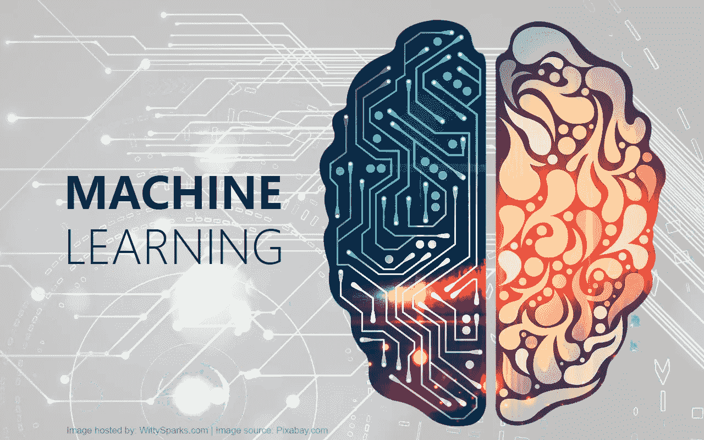
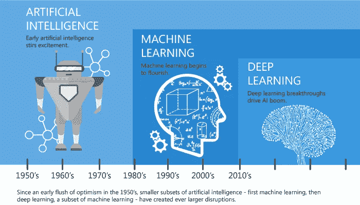
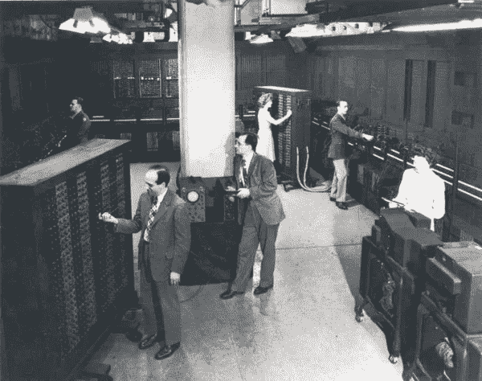
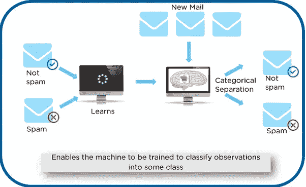
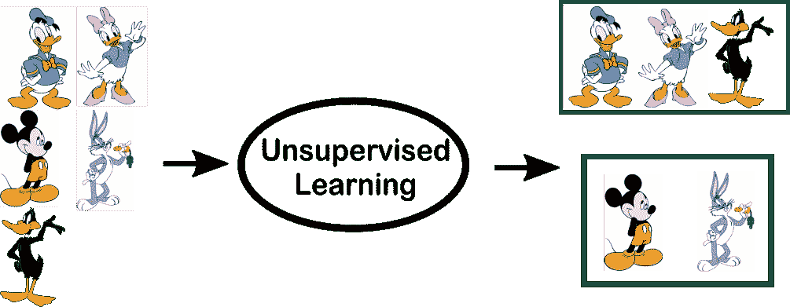
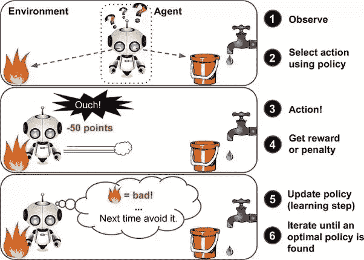

# 初学者机器学习入门

> 原文：<https://towardsdatascience.com/introduction-to-machine-learning-for-beginners-eed6024fdb08?source=collection_archive---------3----------------------->

# 初学者机器学习入门

在过去的几年中，我们已经将机器学习视为一个热门词汇，其原因可能是应用程序产生了大量的数据，过去几年中计算能力的增加以及更好的算法的开发。

从自动化日常任务到提供智能见解，机器学习被用于任何地方，每个行业都试图从中受益。您可能已经在使用利用它的设备。比如 Fitbit 这样的可穿戴健身追踪器，或者 Google Home 这样的智能家居助手。但是使用 ML 的例子要多得多。

*   预测-机器学习也可以用于预测系统。以贷款为例，为了计算错误的概率，系统需要对可用数据进行分组。
*   图像识别-机器学习也可以用于图像中的人脸检测。在几个人的数据库中，每个人都有一个单独的类别。
*   语音识别——它是将口语单词翻译成文本。它被用于语音搜索等等。语音用户界面包括语音拨号、呼叫路由和设备控制。它也可以用来进行简单的数据输入和编写结构化文档。
*   医疗诊断— ML 经过训练，能够识别癌组织。
*   金融行业和贸易—公司在欺诈调查和信用检查中使用 ML。

# 机器学习简史

Image: Linked In | Machine Learning vs Deep learning

第一个手动操作的计算机系统 ENIAC(电子数字积分器和计算机)是在 20 世纪 40 年代发明的。在那个时候,“计算机”这个词被用来称呼具有密集的数值计算能力的人，所以，ENIAC 被称为数值计算机器！嗯，你可能会说跟学习无关？！错了，从一开始这个想法就是建造一台能够模仿人类思维和学习的机器。

EIMC — Electronic Numerical Integrator and Computer | Image: www.computerhistory.org

在 20 世纪 50 年代，我们看到第一个声称能够打败跳棋世界冠军的电脑游戏程序。这个程序帮助跳棋玩家提高了他们的技能很多！大约在同一时间，弗兰克·罗森布拉特发明了感知器，这是一个非常非常简单的分类器，但当它在网络中大量组合时，它就变成了一个强大的怪物。嗯，怪物是相对于时间而言的，在那个时间里，它是一个真正的突破。然后，我们看到神经网络领域由于难以解决某些问题而停滞了几年。

多亏了统计学，机器学习在 20 世纪 90 年代变得非常有名。计算机科学和统计学的交叉催生了人工智能中的概率方法。这使得该领域进一步转向数据驱动的方法。有了大规模的可用数据，科学家们开始构建能够分析和学习大量数据的智能系统。作为一个亮点，IBM 的深蓝系统击败了国际象棋世界冠军，特级大师加里·卡斯帕罗夫。是的，我知道卡斯帕罗夫指控 IBM 作弊，但这已经是历史了，深蓝现在正在博物馆里安息。

# 什么是机器学习？

根据亚瑟·塞缪尔的说法，机器学习算法使计算机能够从数据中学习，甚至改进自己，而无需显式编程。

机器学习(ML)是一种算法，它允许软件应用程序在预测结果时变得更加准确，而无需显式编程。机器学习的基本前提是建立可以接收输入数据并使用统计分析来预测输出的算法，同时随着新数据的出现更新输出。

# 机器学习的类型？

机器学习可以分为 3 种类型的算法。

1.  监督学习—[链接将在未来的博客中发布]
2.  无监督学习—[链接即将出现在未来的博客中]
3.  强化学习—[链接将在未来的博客中发布]

3 Types of Learning

# 监督学习算法综述

在监督学习中，人工智能系统提供了带标签的数据，这意味着每个数据都贴上了正确的标签。

目标是很好地逼近映射函数，以便当您有新的输入数据(x)时，可以预测该数据的输出变量(Y)。

Example of Supervised Learning

如上例所示，我们最初获取了一些数据，并将其标记为“垃圾邮件”或“非垃圾邮件”。该标记数据由训练监督模型使用，该数据用于训练模型。

一旦它被训练，我们可以通过用一些测试新邮件测试它来测试我们的模型，并且模型的检查能够预测正确的输出。

## 监督学习的类型

*   **分类**:一个分类问题是当输出变量是一个类别时，比如“红”或“蓝”或“病”和“没病”。
*   **回归**:回归问题是当输出变量是一个实值时，比如“美元”或者“重量”。

# 无监督学习算法综述

在无监督学习中，人工智能系统呈现的是未标记、未分类的数据，系统的算法在没有事先训练的情况下对数据进行操作。输出取决于编码算法。让系统接受无监督学习是测试人工智能的一种方式。

Example of Unsupervised Learning

在上面的例子中，我们给了我们的模型一些角色，它们是“鸭子”和“不是鸭子”。在我们的训练数据中，我们不为相应的数据提供任何标签。无监督模型能够通过查看数据类型来区分两种特征，并对数据中的底层结构或分布进行建模，以便了解更多信息。

## 无监督学习的类型

*   **聚类**:聚类问题是你想要发现数据中的内在分组，比如按照购买行为对客户进行分组。
*   **关联**:关联规则学习问题是你想要发现描述大部分数据的规则，比如购买 X 的人也倾向于购买 y

# 强化学习概述

强化学习算法或代理通过与其环境交互来学习。代理通过正确执行获得奖励，通过错误执行获得惩罚。代理通过最大化它的奖励和最小化它的惩罚在没有人类干预的情况下学习。它是一种动态编程，使用奖惩系统来训练算法。

Example of Reinforcement Learning

在上面的例子中，我们可以看到代理有两个选项，即有水的路径或有火的路径。强化算法对奖励系统起作用，即，如果代理使用火道，则奖励被减去，代理试图学习它应该避开火道。如果它选择了水路或者安全的路径，那么一些点将会被加到奖励点上，代理将会试着学习什么路径是安全的，什么路径是不安全的。

它基本上是利用获得的回报，代理提高其环境知识来选择下一个行动。

# 摘要

在这篇博客中，我已经向你介绍了机器学习的基本概念，我希望这篇博客是有帮助的，并且会激发你对这个主题产生足够的兴趣。