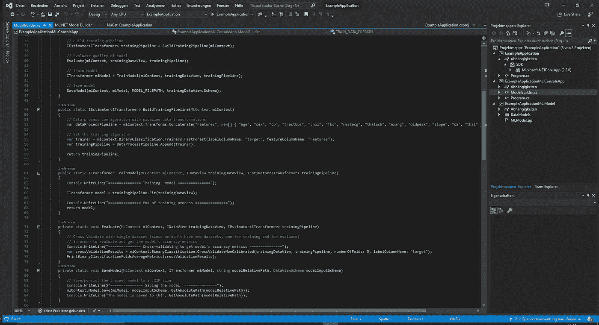
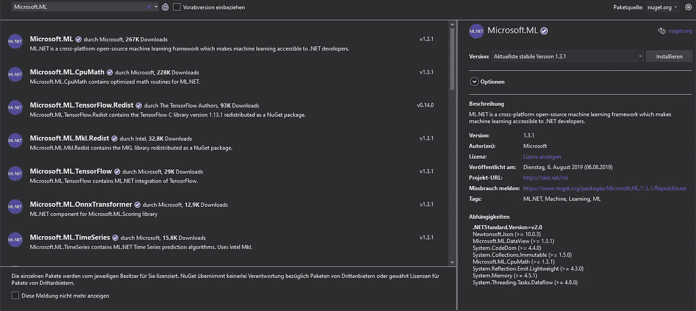
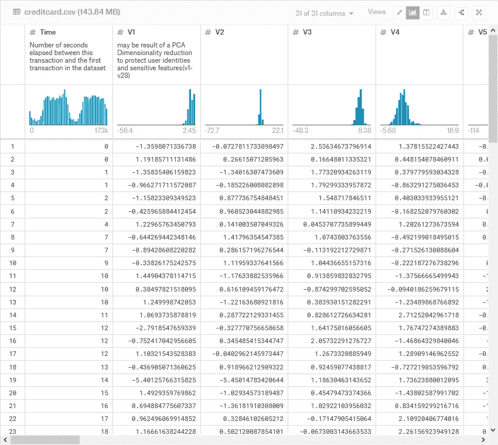
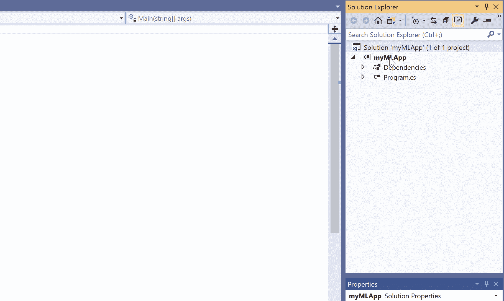
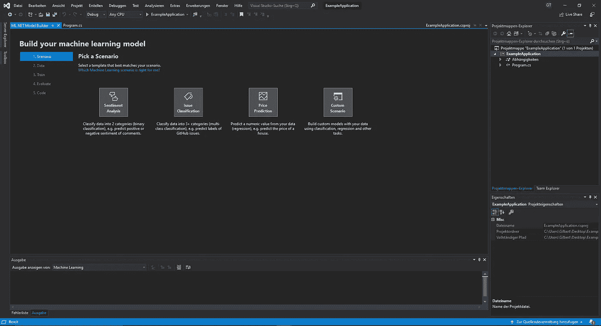

# 用 ML 介绍 C#中的机器学习。网

> 原文：<https://towardsdatascience.com/introduction-to-machine-learning-in-c-with-ml-net-bf45502d8110?source=collection_archive---------4----------------------->

当想到数据科学和机器学习时，两种编程语言 Python 和 R 立即浮现在脑海中。这两种语言支持所有常见的机器学习算法、预处理技术等等，因此可以用于几乎所有的机器学习问题。

然而，有时个人或公司不能或不想使用 Python 或 r。这可能是因为许多原因之一，包括已经有了另一种语言的代码库或没有 Python 或 r 的经验。当今最流行的语言之一是 C#，它用于许多应用程序。为了在 C#中使用机器学习的力量，微软创建了一个名为 ML.NET 的包，它提供了所有基本的机器学习功能。

在本文中，我将向您展示如何使用 ML.NET 创建一个二进制分类模型，讨论其 AutoML 功能，并向您展示如何使用张量流模型与 ML.NET。二进制分类模型的完整代码可以在 [my Github](https://github.com/TannerGilbert/Tutorials/tree/master/Introduction%20to%20Machine%20Learning%20in%20C%23%20with%20ML.NET/CreditCardFraudDetection) 上找到。

# 将 ML.NET 添加到 C#项目中

将 ML.NET 添加到你的 C#或 F#项目中实际上是相当容易的。唯一需要的就是安装微软的**T3。ML** 包。根据你的使用情况，你可能还需要安装一些额外的包，比如微软的 ***。微软图像分析公司。ML.TensorFlow*** 或 ***微软。ML 变压器*** 。

# 加载数据集并创建数据管道

在 ML.NET 加载和预处理数据集与使用其他机器学习包/框架非常不同，因为它要求我们显式地陈述我们的数据结构。为此，我们在名为 ***DataModels*** 的文件夹内创建一个名为***model input . cs***的文件。在这个文件中，我们将陈述数据集的所有列。

对于本文，我们将使用可以在 Kaggle 上免费下载的[信用卡欺诈检测数据集](https://www.kaggle.com/mlg-ulb/creditcardfraud)。这个数据集包含 31 列。交易的类别(0 或 1)、交易的金额、交易发生的时间以及 28 个匿名特征。

这里，我们为数据集中的每一列创建一个字段。重要的是指定正确的数据类型和列索引。

既然我们已经对数据进行了建模，我们还需要对我们的输出进行建模。这可以通过与上述脚本类似的方式来完成。

这里我们有两个字段。分数字段以百分比表示输出，而预测字段是布尔值。

既然我们已经建模了输入和输出数据，我们可以使用 ***LoadFromTextFile*** 方法加载实际数据。

# 创建和训练模型

要使用 model 创建和训练模型，我们需要创建一个管道，其中包含所需的数据预处理和训练算法。对于这个特殊的数据集，很难做任何预处理，因为它有 28 个匿名特征，因此我选择保持简单，只连接所有特征(这必须总是在 ML 中完成。网)。

对于模型，我选择了 [LightGBM](https://medium.com/@pushkarmandot/https-medium-com-pushkarmandot-what-is-lightgbm-how-to-implement-it-how-to-fine-tune-the-parameters-60347819b7fc) 算法。这个算法实际上并没有包含在微软的 ***中。ML*** 因此你需要安装 ***微软。ML . light GBM*来使用。**

现在我们可以使用 ***Fit*** 方法训练模型，并使用***ml context . model . save***保存它。

# 评估模型

现在我们的模型已经训练好了，我们需要检查它的性能。最简单的方法是使用[交叉验证](/why-and-how-to-cross-validate-a-model-d6424b45261f)。ML.Net 为我们提供了各种不同数据集的交叉验证方法。因为我们的数据集是一个二元分类数据集，我们将使用 ***mlContext。binary classification . CrossValidateNonCalibrated***方法对我们的模型进行评分。

# 做预测

使用 ML.NET 对新数据进行预测非常简单。我们只需要创建一个***prediction engine***，专门为我们的模型做的另一个表示，并调用它的 ***Predict*** 方法，传递它一个 ***ModelInput*** 对象。

# 自动毫升

ML.NET 的另一个伟大之处是它出色地实现了[自动 ML](/whats-auto-ml-b457d2710f9d) 。使用 Auto-ML，我们可以通过指定我们正在处理的问题并提供我们的数据来构建基本的机器学习解决方案。

要在 ML.NET 开始使用 Auto-ML，您需要下载“[ML.NET 模型构建器(预览)](https://marketplace.visualstudio.com/items?itemName=MLNET.07)”Visual Studio 扩展。这可以通过扩展选项卡来完成。

成功安装扩展后，可以通过在**解决方案浏览器**中右键单击您的项目并选择**添加- >机器学习**来使用 Auto-ML。

这将打开“模型构建器”窗口。模型构建器将指导您完成构建机器学习模型的过程。

有关如何完成所有步骤的信息，请务必查看[官方入门教程](https://dotnet.microsoft.com/learn/ml-dotnet/get-started-tutorial/intro)。完成所有步骤后，模型构建器将自动生成代码。

# 使用预先训练的张量流模型

ML.NET 的另一个伟大之处是它允许我们使用 Tensorflow 和 ONNX 模型进行推理。要使用 Tensorflow 模型，您需要安装微软的 ***。ML.TensorFlow*** 使用 NuGet。安装必要的包后，您可以使用 ***模型加载 Tensorflow 模型。LoadTensorFlowModel*** 方法。之后需要调用***ScoreTensorFlowModel***方法，并传递给它输入输出层名称。

有关如何在 ML.NET 使用 Tensorflow 模型的更多信息，请查看[“使用 ML.NET c#代码运行从 Azure Cognitive Services Custom Vision 导出的 TensorFlow 模型”](https://devblogs.microsoft.com/cesardelatorre/run-with-ml-net-c-code-a-tensorflow-model-exported-from-azure-cognitive-services-custom-vision/)。

# 结论

ML。NET 是一个. NET 包，允许您在. NET 中创建和使用机器学习模型。在本文中，您学习了如何使用 ML.NET 创建一个信用卡欺诈检测模型。

这就是这篇文章的全部内容。如果你有任何问题或者只是想和我聊天，请在下面留下评论或者在社交媒体上联系我。如果你想获得我博客的持续更新，请确保在 Medium 上关注我，并加入我的时事通讯。