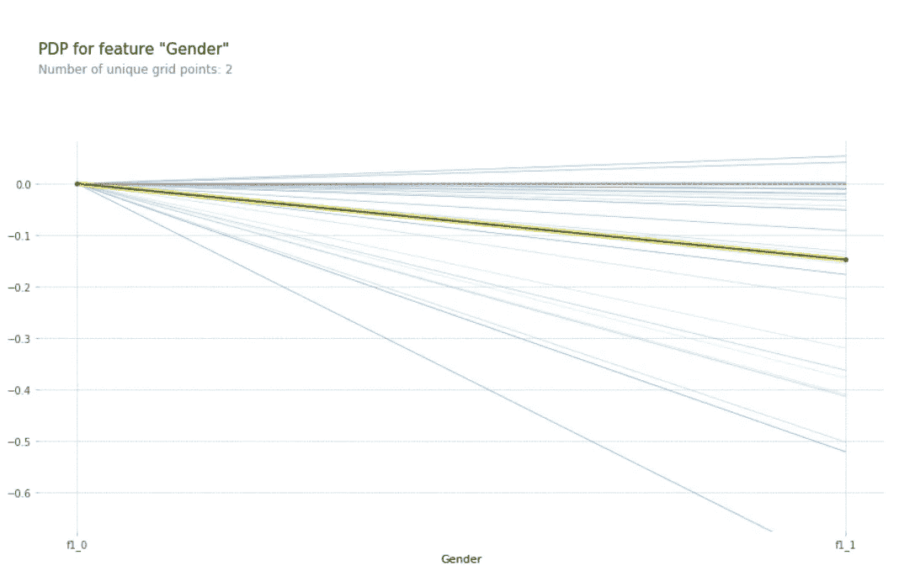

# 机器学习模型解释简介

> 原文：<https://towardsdatascience.com/introduction-to-machine-learning-model-interpretation-55036186eeab?source=collection_archive---------16----------------------->

Figure 1: Photo by [Christopher Gower](https://unsplash.com/@cgower?utm_source=medium&utm_medium=referral) on [Unsplash](https://unsplash.com?utm_source=medium&utm_medium=referral)

不管你在解决什么问题，一个可解释的模型总是首选的，因为最终用户和你的老板/同事都能理解你的模型真正在做什么。模型可解释性还可以帮助您调试您的模型，让您有机会看到模型真正认为什么是重要的。

此外，你可以使用可解释的模型来打击普遍认为机器学习算法是黑盒，我们人类无法获得关于它们如何工作的任何见解。

本文是我系列文章的第一篇，旨在解释我们如何实现可解释的机器学习/人工智能的不同方法。

# 为这个系列做计划

我的系列文章将涵盖关于如何让机器学习变得可解释的理论和实践信息。文章的结构如下:

## 第 1 部分:机器学习模型的可解释性

*   什么是模型解释？
*   模型解释的重要性
*   什么特性对模型很重要？
*   理解个人预测

## [第二部分:哪些特性是重要的](/hands-on-global-model-interpretation-3bb4264732b5)

*   如何获得不同类型模型的特征重要性
*   什么是部分相关图，如何使用它们

## 第 3 部分:解读个人预测

*   局部可解释的模型不可知解释(LIME)
*   SHapley 加法解释(shap 值)

# 为什么机器学习中的可解释性很重要？

即使在今天，数据科学和机器学习应用仍然被视为能够神奇地解决没有它就无法解决的任务的黑匣子。这是完全不正确的，为了数据科学项目的成功，开发团队必须对他们试图解决的问题有很好的理解，并且知道他们需要什么样的模型来解决手头的问题。

然而，考虑到大多数商业人士不会对机器学习管道有直观的理解，因此不会理解你花哨的精度指标或损失函数，你需要另一种方式向他们展示你的模型的性能。

此外，良好的性能并不总是意味着您的模型在做正确的事情，因此经常会出现以下问题:

*   **我为什么要相信这个模型？**
*   **模型是如何做出预测的？**

数据科学家和研究人员多年来一直试图回答这些问题，并提出了多种方法来提取有关机器学习模型决策过程的信息。

这些方法中的一些是特定于模型的，而另一些适用于所有的模型，不管模型有多复杂。说到复杂性，每个数据科学家都知道[模型可解释性与模型性能之间的权衡](https://machinelearningmastery.com/model-prediction-versus-interpretation-in-machine-learning/)，这基本上就是说，如果我们增加模型的复杂性，就更难正确解释它。

一般来说，线性模型以及基于树的模型可以很容易地解释，因为它们以直观的方式获得预测，但是您可能需要牺牲准确性，因为这些模型很简单，并且很容易根据问题欠拟合或过拟合。

另一方面，您有更复杂的模型，如集合模型(如随机森林、XGBoost 等)以及深度神经网络，由于其复杂性，这些模型尤其难以解释。

对于欺诈检测、无人驾驶汽车或贷款等现实世界的问题，该模型不仅需要表现良好，还需要易于解释，以便我们可以了解贷款被批准/未被批准的原因，并使用我们的领域专业知识来验证或纠正决策。

# 理解模型解释

如上所述，模型可解释性试图理解和解释机器学习模型在进行预测时采取的步骤和决策。它让我们能够质疑模型的决策，并了解以下方面。

*   **什么特征/属性对模型很重要？**你应该能够提取关于哪些功能是重要的，以及功能如何相互作用以创建强大信息的信息。
*   **为什么模型会得出这个结论？**你还应该能够提取关于特定预测的信息，以验证和证明为什么模型会产生某种结果。

## 模型可解释性的类型

多年来，数据科学家和研究人员开发了许多不同类型的模型可解释性技术。这些技术可以分为不同的类型，如 Christoph Molnar 的优秀免费在线书籍[“可解释的机器学习，使黑盒模型可解释的指南”](https://christophm.github.io/interpretable-ml-book/taxonomy-of-interpretability-methods.html)中所述。

**内在的还是事后的？**内在可解释性是指由于结构简单而被认为是可解释的模型，如线性模型或树。事后可解释性是指在训练模型后，通过应用模型可解释性方法(如特征重要性、部分相关性或时间)来解释类似神经网络或集成的黑盒模型。

特定于模型还是与模型无关？特定于模型的解释工具专用于单个模型或一组模型。这些工具在很大程度上依赖于特定模型的工作和功能。相比之下，模型不可知的工具可以用在任何机器学习模型上，不管它有多复杂。这些不可知的方法通常通过分析要素输入和输出对来工作。

**本土还是全球？**解释方法是解释单个预测还是整个模型行为？

# 哪些特征是重要的，它们如何影响预测

模型一般表现如何？什么特征驱动预测？哪些特性不值得收集它们所花费的金钱和时间？这些都是公司在考虑为某种任务构建机器学习解决方案时可能会问的重要问题。全局模型可解释性通过解释什么特征是重要的、它们如何重要以及它们如何相互作用来帮助回答这些问题。

## 特征重要性

> 特征的重要性是在我们置换了特征的值之后模型的预测误差的增加，这打破了特征和真实结果之间的关系。— [可解释的机器学习，一个让黑盒模型变得可解释的指南](https://christophm.github.io/interpretable-ml-book/feature-importance.html)

Figure 2: Feature Importance Example

特征重要性是一个非常简单的概念，在大多数主要的机器学习库中都有实现，包括 Scikit Learn、XGBoost、LightGBM。

如果打乱某个特征的值会使模型误差大幅增加，则该特征被认为是重要的，因为这意味着模型依赖于该特征进行预测。相比之下，如果打乱某个特征的值对模型的误差没有影响，那么该特征就不重要。

## 部分相关图

虽然特性重要性向我们展示了哪些特性是重要的，但它并没有给我们关于特性中特定变化的影响的信息。部分相关性图可以显示目标和特征之间的关系是线性的、指数的还是更复杂的。

Figure 3: Partial Dependence Plot Example

部分函数告诉我们特征 s 的给定值的平均边际效应。它通过强制所有数据点具有相同的特征值(例如，将性别列的每个值替换为女性)来获得特征中每个唯一值的 PDP 估计值。

有关部分依赖图如何工作的更多信息，请查看可解释机器学习的[部分依赖图部分，这是一个使黑盒模型可解释的指南](https://christophm.github.io/interpretable-ml-book/pdp.html)。

# 理解个人预测

模型为什么做出这个具体的预测？随着机器学习模型越来越多地用于欺诈检测或医疗任务等应用，这个问题变得越来越重要，因为对于这些类型的应用，能够验证和证明模型产生的结果尤为重要。

## LIME(局部可解释的模型不可知解释)

> 局部代理模型是可解释的模型，用于解释黑盒机器学习模型的个体预测— *Christoph Molnar*

在论文《我为什么要相信你？作者提出了一种称为局部可解释模型不可知解释(LIME)的方法，其中代理模型被训练为局部地而不是全局地近似底层黑盒模型的预测。

它通过围绕感兴趣的数据点从置换的数据点创建新的数据集，以及黑盒模型的相应预测来实现这一点。然后，LIME 使用这个新的数据集来训练一个可解释的模型，如树或线性模型，然后可以用来解释这个局部点的黑盒模型。

## 沙普利值

沙普利值是一种根据玩家对总支出的贡献将支出分配给玩家的方法。但是这和机器学习有什么关系呢？

在机器学习的情况下，“游戏”是对数据点的预测任务。“增益”是预测减去所有实例的平均预测，而“玩家”是数据点的特征值。

Shapley 值是一个特性值在所有可能的联合中的平均边际贡献。这是一种解释单个预测的极好方法，因为它不仅给出了每个特征值的贡献，而且这些贡献的大小也是正确的，这与 LIME 等其他技术不同。

Figure 4: Shap example

在本系列的第三部分中，我们将更仔细地研究局部解释方法，如 LIME 和 Shapley 值，我们不仅将学习这些技术的理论，还将在真实数据集上实现它们。

# 进一步阅读

 [## 可解释的机器学习

### 机器学习算法通常作为黑盒运行，不清楚它们如何得出某种决定。这个…

christophm.github.io](https://christophm.github.io/interpretable-ml-book/)  [## 人类可解释的机器学习的重要性

### 人类可解释机器学习和模型解释简介

towardsdatascience.com](/human-interpretable-machine-learning-part-1-the-need-and-importance-of-model-interpretation-2ed758f5f476) 

# 结论

模型可解释性不仅有助于调试您的模型，使您作为机器学习工程师的生活更加轻松，而且还有助于建立人类与模型之间的信任，随着机器学习在越来越多的行业中得到使用，这变得越来越重要。

# 下一步是什么？

在本系列的第 2 部分中，我们将更仔细地研究特性重要性和部分依赖图，不仅深入研究这些技术的细节，还将使用 eli5 和 pdpbox 库应用我们的知识。

感谢您阅读帖子。如果你对我接下来应该报道的内容有任何反馈、建议或想法，请随时在社交媒体上发表评论或联系我。