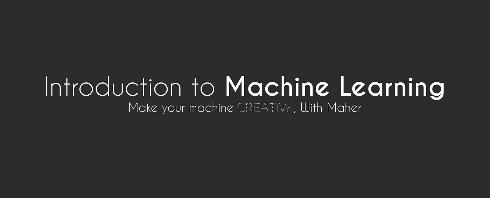
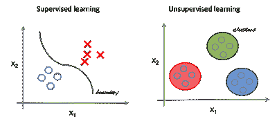

# 机器学习自顶向下方法简介

> 原文：<https://towardsdatascience.com/introduction-to-machine-learning-top-down-approach-8f40d3afa6d7?source=collection_archive---------3----------------------->

## 超级流畅的机器学习入门

我们从未想象过计算机会改进到什么程度，成为我们今天拥有的巨大机器，它们不仅在自己的工作上变得更好，还在征服其他工作。

在我写这篇文章的时候

*   互联网上有 4，156，513，325 个用户，如果你试图去数他们，需要 128 年以上。
*   互联网上的 1755606975 个网站。
*   仅今天就发了 168，673，726，872 封邮件。
*   仅今天就有 4723747823 次谷歌搜索。
*   仅今天就有 4033234 篇博文。
*   仅今天在 youtube 上就有 4553543234 次视频观看。

我可以永远这样下去，这些数字增长得令人难以置信地快，大量的数据存在，我们甚至可以让计算机了解这些数据，我们可以对计算机进行编程，从这些数据中获得某种经验，并形成一个简单的小型**大脑**(大多数情况下是愚蠢的)，但致力于解决一个特定的问题，甚至一个以上的问题，只要你是忍者级别的程序员/研究员。

这个**大脑**我们经常称之为模型，它很可能是一个**函数**，如果你有大量的数据，并且想要大脑/模型变得复杂和精密，你可以让它成为一个更高次的函数**(又名神经网络)**，我说的更高次不是指我们在学校学的三次或二次函数，我指的是更高。

这并不像听起来那么复杂，一切都很容易

好消息是(**机器学习介绍)**不是带你深入这个复杂的数学东西的地方。

首先，我会让你相信机器学习是一个非常有趣的领域，并告诉你一些关于机器人、人脸检测、垃圾邮件检测等等的东西，但我希望这是简短而中肯的，所以请阅读下面的内容，尝试在你的脑海中绘制一幅地图，并保持专注，从现在开始！

# 定义一个大纲

—**机器学习系统**读取**数据集**并优化**大脑/模型**以解决**问题**。

关注这些关键词，我们将逐一讨论。 **-machine learning-System(ML-System):**控制整个过程的算法 **- Dataset:** 提供给系统的数据。 **-模型:**我们优化解决问题的大脑或功能。 **-问题:**令人惊讶的是这正是我们要解决的问题。

# 机器学习系统

让我们从谈论**machine learning-System(ML-System)**开始，它只是一个完成工作的算法，遍历数据集，初始化模型并将数据馈送给模型以从中学习。

## 机器学习系统的分类:

我们可以将机器学习系统分为多个类别，如下所示。

1.模型是否经过人工监督训练(**有监督**、**无监督**、**半监督**和**强化学习**)、**、**用更简单的话说:

*   在**监督**ML-系统中，您输入算法的训练数据(数据集)包括所需的解决方案，称为 ***标签。***
*   在**无监督** ML-System 中，你馈送给算法的训练数据(数据集)是**未标记的**(不包括期望的解)，系统尝试在没有老师的情况下学习。
*   在**半监督**ML-系统中，您提供给算法的训练数据(数据集)被**部分标记。**
*   在**强化**ML-系统中，它有一点不同，这里的模型被称为*代理*，它的工作是执行动作，他获得奖励，代理然后学习，因为他试图最大化奖励，这就像用糖果训练你的宠物。

2.模型是否可以动态增量学习(**在线学习**、**批量学习**)，用更简单的话来说:

*   在**批量学习中，**模型不能增量学习。首先，我们让模型根据所有数据进行训练，然后将其投入生产。
*   在**在线学习中，**模型通过顺序输入实例进行增量训练，或者单独输入，或者通过称为*小批量的小组输入。*

# 资料组

它是提供给系统进行训练的训练数据，我们将数据集的复杂性降低到**特征**中，以便于模型从数据中学习

**特征***是被观察现象的个体可测量的属性或特征。*

例如，让我们使用房价数据集，它主要是一个表，其中每行代表一所房子，列= [ 'house_id '，' house_size '，' no_of_rooms '，' price' ]，而**问题**是预测房子的价格。

决定使用哪些功能是非常重要的一步，您必须考虑很多事情，我将在另一篇文章中带您完成这一步，但我们可以从 features = [house_size，no_of_rooms]开始，因为这是一个简单的示例。

我们正在使用的模型将试图了解如何根据给定的特征来估计这些标签(输出)，换句话说，房子的价格如何受到其大小和房间数量的影响。这个过程叫做，*训练* **。**

## 我们在数据集上可能面临的问题

1.  **训练数据量不足。** 模型需要成千上万个例子来解决简单的问题，而对于图像识别等更复杂的问题，它们需要数百万个例子
    在 2001 年发表的一篇著名论文中，微软研究人员 Michele Banko 和 Eric Brill 表明，一旦给定足够的数据，非常不同的机器学习算法(包括简单的算法)在复杂的问题上表现得一样好。
    由此可见训练数据的数量有多重要。
2.  **非代表性训练数据。** 使用代表您想要归纳的案例的训练数据至关重要，数据集应覆盖尽可能多的不同案例。
3.  **数据质量差。** 这意味着它充满了意想不到的错误、噪音和异常值，这将使模型更难检测模式，并且很可能不会执行得很好。有一些时间清理数据或者丢弃有噪声的部分。
4.  **无关的特征。** 特征选择是一个非常重要的步骤，模型可以检测出期望的标签(解)和一个不相关的特征之间的关系，这将使预测更加随机。
5.  **过拟合。** 表示模型在训练数据上表现很好，但泛化能力不好。换句话说，模型已经很好地学习了训练数据，它记住了它，这很可能是因为模型相对于数据量和噪声来说太复杂了。(如果你在另一篇文章中遇到这个问题，我会告诉你怎么做)。
6.  **营养不良。** 很明显是过度拟合的反义词，这种情况发生在模型过于简单无法理解数据的时候。

**要知道**为你的项目选择哪个模型，**阅读本文** [**使用哪个机器学习模型？**](/which-machine-learning-model-to-use-db5fdf37f3dd)

这里有一些模型你可以看看，我会写文章解释它们是如何工作的。

## 监督学习算法示例

*   k-最近邻
*   线性回归
*   逻辑回归
*   支持向量机
*   决策树和随机森林
*   神经网络——注意:一些神经网络可以是无监督的(如自动编码器和受限玻尔兹曼)或半监督的。

## 无监督学习算法示例

*   聚类(例如，k 均值、层次聚类分析 HCA)
*   可视化和维度缩减(例如主成分分析 PCA)
*   关联规则学习(例如 Eclat)

你可以阅读 [5 步和 10 步，来学习机器学习](/5-steps-and-10-steps-to-learn-machine-learning-c4b61f78c712)发表在《走向数据科学》刊物上的文章

祝你的机器制造愉快***创意*** *。*