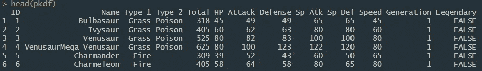
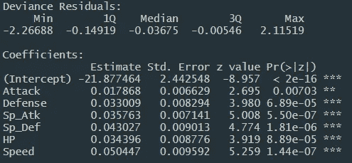
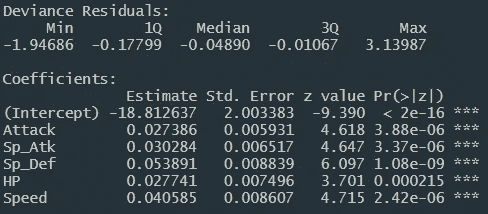
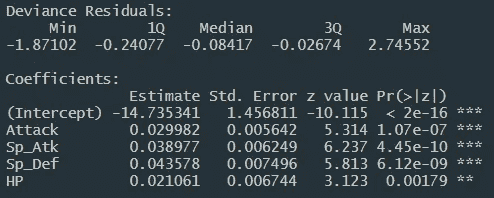
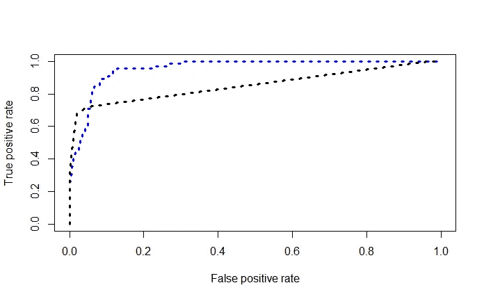

# 用口袋妖怪介绍机器学习

> 原文：<https://towardsdatascience.com/introduction-to-machine-learning-with-pokemon-ccb7c9d1351b?source=collection_archive---------15----------------------->

## 使用 [*R*](https://www.r-project.org/about.html) 进行逻辑回归和决策树分析的指南。


Photo by [Kamil S](https://unsplash.com/@16bitspixelz?utm_source=medium&utm_medium=referral) on [Unsplash](https://unsplash.com?utm_source=medium&utm_medium=referral)

## R 是什么？

r 是一种免费的统计编程语言。

根据 [guru99](https://www.guru99.com/r-tutorial.html) ，

> r 是一种编程语言，被数据科学家和大公司广泛使用，如谷歌、Airbnb、脸书等。用于数据分析。

## 什么是机器学习？

机器学习是人工智能的一个分支。机器学习的主要目的是教会程序如何训练自己并从错误中学习。目标是让程序不断学习和发展其预测的准确性**，而不需要**定期接受训练。如果你有兴趣了解更多，这里有一个有用的[链接](https://expertsystem.com/machine-learning-definition/)。

许多类型的模型可以用于机器学习，但是对于本文的目的；我将重点介绍逻辑回归和决策树。

## 逻辑模型

逻辑回归用于确定事件发生或不发生的概率。当因变量是分类变量时使用。

例如，预测某人是男性(1)还是女性(0)。

## 决策图表

决策树是用于分类和预测的标准工具。它使用一个易于理解的图表来展示测试并输出两个结果。这种模式一直持续到测试有一个合理的预测结果。

对于这个分析，我将使用一个包含 800 个口袋妖怪角色和几个变量的数据集。如果你想访问这个数据集来进行你的实验，这里有一个[链接](https://drive.google.com/open?id=1nUwdfPHiqXmz8Zh89SxPSiIFwbm9IOvv)来下载它。

# 目标

这样做的目的是建立一个逻辑模型和一个决策树来帮助预测一个口袋妖怪是否会被归类为传奇的概率。只有少数口袋妖怪被认为是传奇，所以我们想看看我们的模型是否能准确预测它。

我的分析假设你已经熟练使用 r。

## 设置

```
library(ggplot2)
library(gplots)
library(readr)
library(rpart)
library(ROCR)
library(rpart.plot)
```

库 [*rpart*](https://www.rdocumentation.org/packages/rpart/versions/4.1-15/topics/rpart) *，* [*ROCR*](https://cran.r-project.org/web/packages/ROCR/ROCR.pdf) ， [*rpart.plot*](https://www.rdocumentation.org/packages/rpart.plot/versions/1.4-5/topics/rpart.plot) 是 r 中决策树所必需的

## 读入文件

```
pkdf <- read.csv("Pokemon.csv")
head(pkdf)
```



We see in the last column on the right the Legendary status of the pokemon

## 逻辑回归模型

我们将需要使用[*glm()*](https://www.rdocumentation.org/packages/stats/versions/3.6.2/topics/glm)*函数来获取 logistic 模型。该函数要求我们传入自变量，后跟一个*波浪号(~)。**

1.  ***第一个逻辑模型—所有变量***

*首先，我将尝试使用所有因变量的模型。*

```
*pk_logit_model_1 <- glm(Legendary ~ Attack + Defense + Sp_Atk + Sp_Def + HP + Speed, data = pkdf, family = "binomial")
summary(pk_logit_mode_1)*
```

**

*Logistic Model 1*

*在 R 中，每个变量右边的*让我们知道这个变量是否重要。正如我们看到的，所有的变量都是重要的。让我们再测试几个模型，看看是否会得到不同的结果。*

***2。第二个逻辑模型—移除*防御*变量***

*对于这个模型，我将去掉防御变量，观察结果。每次删除变量时，一次删除一个变量是很重要的。*

```
*pk_logit_model_2 <- glm(Legendary ~ Attack + Sp_Atk + Sp_Def + HP + Speed, data = pkdf, family = "binomial")
summary(pk_logit_mode_2)*
```

**

*Logistic Model 2*

*我们可以看到所有变量都保持显著，但如果我们看一下顶部的*偏差残差，*我们可以看到*中值偏差残差*下降了，这很好。*

*如果你不熟悉中位数偏差残差，这里的[是一个很好的解释。](https://www.graphpad.com/support/faq/what-is-the-median-absolute-deviation-mad-/)*

***3。第三个逻辑模型—移除*速度*变量***

*为了测试另一个模型，让我们试着移除*速度*并查看结果。*

```
*pk_logit_model_3 <- glm(Legendary ~ Attack + Sp_Atk + Sp_Def + HP, data = pkdf, family = "binomial")
summary(pk_logit_model_3)*
```

**

*Logistic Model 3*

*我们可以再次看到*中值偏差残差*下降，这意味着我们的第三个模型更适合我们的预测。*

***我们如何解释基本回归系数？***

*让我们看看我们刚刚做的第三个模型。查看第一列，标有*的估计值*(系数)帮助我们更好地理解我们的模型。重点是*攻击*变量，其系数为 0.029982。*

*使用 exp()，[计算一个数或数向量的指数值。](http://www.endmemo.com/program/R/exp.php)*

```
*exp(0.029982)-1*
```

*这一行代码的输出是 **0.0304** 。这可以理解为，*

> *如果攻击增加 **1 点**，这个口袋妖怪成为传奇的几率增加 **3.04%***

# *决策图表*

*我们已经为决策树模型加载了所有必要的库。使用 [*rpart()*](https://www.rdocumentation.org/packages/rpart/versions/4.1-15/topics/rpart) 函数，其结构类似于逻辑建模中使用的[*【glm()*](https://www.rdocumentation.org/packages/stats/versions/3.6.2/topics/glm)函数。*

```
*pk_tree_model <- rpart(Legendary ~  Attack + Sp_Atk + Sp_Def + HP, data = pkdf, method = "class")rpart.plot(pk_tree_model, type = 1, extra=1, box.palette =c("pink", "green"), branch.lty=3, shadow.col = "gray")*
```

*现在，我们已经完成了决策树模型，我们将把它与我们的第三个逻辑模型进行比较，看看它们在预测一个传奇口袋妖怪方面如何相互竞争。*

# *比较两种模型*

*接下来的几个代码步骤是必要的，以查看哪个模型执行得最好。获得我们的结果有四个步骤。我称之为 4p。*

1.  *预测*
2.  *预言；预测；预告*
3.  *性能*
4.  *情节*

*我们的目标是预测每个观察值为 1 的概率。*

## *预测*

*在我们的模型上使用 [predict()函数](https://www.rdocumentation.org/packages/stats/versions/3.6.2/topics/predict)，并提供我们的数据集进行测试。*

```
*pk_predict_logit <- predict(pk_logit_model, pkdf, type="response")
pk_predict_tree <- predict(pk_tree_model, pkdf, type="prob")*
```

*在继续之前，我们可以做一些初步的测试来了解我们的模型性能。*

*对 ID 为 59 的口袋妖怪进行测试*

```
*pk_predict_logit[59]
pk_predict_tree[59]*
```

*结果表明 **Logit 是 0.002，**和 **Tree 是 0.974** 。这意味着树(97%)非常有信心认为口袋妖怪 59 是传奇，而 Logit (0.2%)并不这么认为。我们可以通过手动拉起口袋妖怪 59 来查看，就是口袋妖怪— [***波斯***](https://bulbapedia.bulbagarden.net/wiki/Persian_(Pok%C3%A9mon)) **。**波斯不是传说中的口袋妖怪，所以我们的树模型不好。*

*让我们测试另一个口袋妖怪来仔细检查。*

*使用 **ID 799** 对口袋妖怪进行测试*

```
*pk_predict_logit[799]
pk_predict_tree[799]*
```

*结果表明 **Logit 为 0.983，**和**树为 0.3** 。这意味着树(3%)不认为口袋妖怪 799 是传奇，Logit (98%)认为它是传奇。口袋妖怪 799 是 [***胡帕胡帕未绑定***](https://www.pokemon.com/us/pokemon-tcg/pokemon-cards/sm-series/sm35/55/)*其中，根据数据集，被归类为传奇。从而再次证明我们的逻辑模型比树表现得更好。**

**下面我们可以继续测试这两种模型。**

## **预言；预测；预告**

**对我们的预测输出使用[预测()函数](https://www.rdocumentation.org/packages/ROCR/versions/1.0-7/topics/prediction)，并提供传奇变量。它用于转换输入数据。**

```
**pk_logit_prediction <- prediction(pk_predict_logit, pkdf$Legendary)
pk_tree_prediction <- prediction(pk_predict_tree[,2], pkdf$Legendary)**
```

## **表演**

**在我们的预测输出上使用[性能()函数](https://www.rdocumentation.org/packages/ROCR/versions/1.0-1/topics/performance)，来评估谁被评估得好。**

**输入“tpr”表示真阳性，“fpr”表示假阳性。**

```
**pk_performance_logit <- performance(pk_logit_prediction,"tpr","fpr")
pk_performance_tree <- performance(pk_tree_prediction,"tpr","fpr")**
```

## **情节**

**在我们的性能上使用 [plot()函数](https://www.rdocumentation.org/packages/graphics/versions/3.6.1/topics/plot)来获得我们的两个模型表现如何的可视化表示。**

```
**plot(pk_performance_logit,col="blue",lty=3, lwd=3)
plot(pk_performance_tree,col="black",lty=3, lwd=3, add=TRUE)**
```

****

**Comparisons of the two models**

**蓝线代表逻辑模型，黑线代表决策树模型。**

**正如我们所看到的，蓝线(逻辑)在那里表现更好，这是一个更好的选择，用来帮助确定口袋妖怪有*传奇*分类的概率。**

## **我的资源:**

*   **[RPub 文档](http://rpubs.com/jasonmchlee/pokemon)**
*   **[Github 库](https://github.com/jasonmchlee/machine-learning/tree/master/Classifying%20Pokemon%20Status)**
*   **[口袋妖怪数据集](https://drive.google.com/open?id=1nUwdfPHiqXmz8Zh89SxPSiIFwbm9IOvv)**