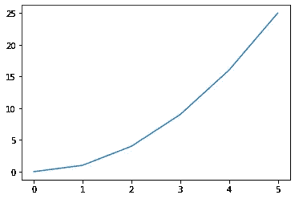
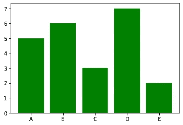
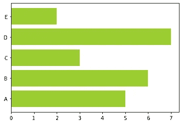
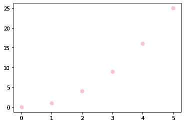
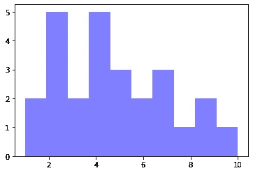
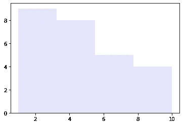

# Python 中 Matplotlib 的介绍

> 原文：<https://towardsdatascience.com/introduction-to-matplotlib-in-python-5f5a9919991f?source=collection_archive---------16----------------------->

## 在[***matplotlib***库中使用数据可视化技术的快速指南](https://matplotlib.org/)


# 什么是数据可视化？

> *是以图形、图标、演示等方式可视化数据的实践。它最常用于将复杂的数据转化为非技术受众易于理解的见解。*

如果你是数据可视化的新手，这是一本很好的入门书籍— [用数据讲故事](https://www.amazon.com/Storytelling-Data-Visualization-Business-Professionals/dp/1119002257)

# Python 是什么？

[**Python**](https://www.python.org/) 是一种编程语言，可以让你更快地工作，更有效地集成你的系统。

Python 是最流行的编程语言之一，有各种各样有用的应用。对于本文，我假设您已经掌握了 Python 语言的基本知识。

如果你不知道，这里有一些很好的资源，

1.  [w3schools](https://www.w3schools.com/python/)
2.  [数据营](https://www.datacamp.com/)
3.  [Udemy，Python Bootcamp](https://www.udemy.com/course/complete-python-bootcamp/)

# 什么是 Matplotlib？

Python 中有成千上万个 [**库**](https://www.quora.com/What-is-a-Python-library-and-what-can-I-use-it-for) ，Matplotlib 是 Python 中最强大的数据可视化工具之一。

[**Matplotlib**](https://matplotlib.org/) 试图让容易的事情变得容易，让困难的事情变得可能。您可以生成图表、直方图、功率谱、条形图、误差图、散点图等。，只需要几行代码。

让我们开始吧！

# 导入库

为了让 matplotlib 在我们的环境中运行，我们需要导入它。

```
import **matplotlib.pyplot** as plt
```

在别名 **plt —** 下导入 matplotlib 是常见的做法，这样，我们只需键入更少的代码来引用它。

无论何时使用 matplotlib 绘图，两个主要代码行应该是:

1.  图表类型—这是您定义条形图、折线图等的地方。
2.  显示图表—这是为了显示图表

# 曲线图

```
#create data for plotting
x_values = [0,1,2,3,4,5]
squares = [0,1,4,9,16,25]#the default graph style for plot is a line
plt.**plot**(x_values, squares)#display the graph
plt.show
```



# 条形图

```
#create data for plotting
x_values = [5,6,3,7,2]
y_values = ["A", "B", "C", "D", "E"]plt.**bar**(y_val,x_values, **color = "green"**)
plt.show()
```

当使用条形图时，代码的变化将从 *plt.plot()* 变为 *plot.bar()* 将其变为条形图。如果你看看代码的内部，我还添加了一个参数 [**颜色**](https://matplotlib.org/3.1.0/gallery/color/named_colors.html)——这有助于我们快速定制图形的颜色。



我们也可以用下面的方法水平翻转条形图，

```
#create data for plotting
x_values = [5,6,3,7,2]
y_val = ["A", "B", "C", "D", "E"]# Adding an "h" after bar will flip the graph
plt.**barh**(y_val,x_values, color ="**yellowgreen**")
plt.show()
```



Notice the change in the color argument

# 散点图

```
#create data for plotting
x_values = [0,1,2,3,4,5]
squares = [0,1,4,9,16,25]plt.**scatter**(x_values,squares, **s=10,** color = "pink")
plt.show()
```

你能看出模式吗？现在代码从 *plt.bar()* 变成了 *plt.scatter()。*我还加了 **s** 的参数。s 代表大小，它允许我们控制我们想要图上的点有多大。



# 直方图

```
#generate fake data
x = [2,1,6,4,2,4,8,9,4,2,4,10,6,4,5,7,7,3,2,7,5,3,5,9,2,1]#plot for a histogram
plt.**hist**(x, **bins = 10**, color='blue', **alpha=0.5**)
plt.show()
```



查看代码片段，我添加了两个新参数。

1.  bin-是直方图特有的参数，允许用户自定义想要多少个 bin。
2.  Alpha 显示数据点透明度级别的参数。

如果我同时调整仓位和 alpha，我会得到这样的结果，

```
x = [2,1,6,4,2,4,8,9,4,2,4,10,6,4,5,7,7,3,2,7,5,3,5,9,2,1]
num_bins = 10plt.hist(x, **bins= 4**, color='blue', **alpha=0.1**)
plt.show()
```



# 概观

我们只是触及了 matplotlib 强大功能的表面。一旦你更深入地研究这个主题，你会发现你可以有多少定制能力来创建丰富多彩的、详细的和生动的图形。

matplotlib 库和 python 中的其他流行库提供了更多的图形，包括 [**seaborn**](https://seaborn.pydata.org/) ，**[**pandas plot**](https://pandas.pydata.org/pandas-docs/stable/user_guide/visualization.html)**，**和 [**plotly**](https://plot.ly/python/) 。探索所有不同的选项并找到适合您的编码和分析风格的库是值得的。**

**请继续关注——我将分享一个关于在 matplotlib 中定制图表的教程。**