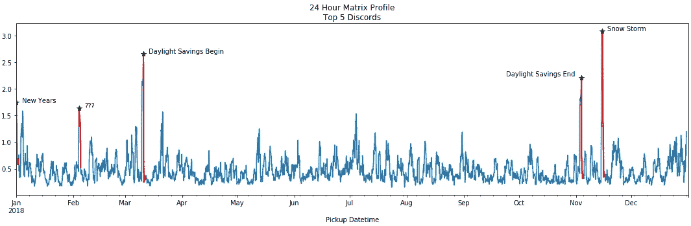

# 矩阵轮廓简介

> 原文：<https://towardsdatascience.com/introduction-to-matrix-profiles-5568f3375d90?source=collection_archive---------3----------------------->

## 一种新的时间序列挖掘数据结构

在时间序列分析中，人们通常对两件事感兴趣；异常和趋势。例如，医生检查 EKG(心电图——心跳读数),看是否有异常事件表明患者存在风险。在零售业工作的个人需要了解销售什么商品以及何时销售(季节性)以增加利润。发现时间序列中异常和趋势的一种方法是执行**相似性连接**。本质上，您可以通过计算每对片段之间的距离来比较时间序列的片段。虽然使用嵌套循环实现一个简单的算法只需很少的努力，但使用这种方法可能需要几个月或几年的时间才能得到中等大小的时间序列的答案。利用矩阵轮廓算法大大减少了计算时间。

Matrix Profile 是一种相对较新的数据结构，于 2016 年推出，由加州大学河滨分校的[埃蒙·基奥](https://www.cs.ucr.edu/~eamonn/)和新墨西哥大学的[阿卜杜拉·穆恩](https://www.cs.unm.edu/~mueen/)开发。使用矩阵轮廓的一些优点是它是领域不可知的、快速的、提供精确的解决方案(当需要时是近似的)并且只需要单个参数。

本文的主要目标是让您熟悉这些好处，以便您可以利用它们。由于矩阵轮廓主要是可视化的，所以我们在本文中利用这一点，尽可能避开数学符号，而将重点放在可视化上。如果你想要学术描述，请阅读基奥博士网页上的研究出版物。

这篇介绍性文章将涵盖以下内容:

*   矩阵轮廓由什么组成？
*   什么是不和？
*   什么是主题？
*   哪些算法用于计算矩阵轮廓？
*   这些算法有什么区别？
*   从哪里可以得到这些算法？
*   一个简短但实用的不和谐发现的例子。

# 矩阵简介概述

矩阵轮廓有两个主要组成部分；一个**距离轮廓**和**轮廓索引**。距离轮廓是最小 Z 归一化欧几里德距离**的矢量**。轮廓索引包含其第一个最近邻**的索引。换句话说，它是其最相似的子序列的位置。**

计算矩阵轮廓的算法使用**滑动窗口**方法。窗口大小为 **m** ，算法:

1.  计算加窗子序列相对于整个时间序列的距离
2.  设置一个排除区域以忽略无关紧要的匹配
3.  用最小值更新距离轮廓
4.  设置第一个最近邻索引

上面概述的距离计算发生 **n-m + 1** 次；其中 **n** 是时间序列的长度，而 **m** 是窗口大小。由于子序列是从时间序列本身中提取的，因此需要一个**排除区**来防止**的琐碎匹配**。例如，匹配自身的代码片段或非常接近自身的代码片段被认为是微不足道的匹配。在当前窗口索引之前和之后，禁止区仅仅是窗口大小的一半( **m** )。计算最小距离和最近邻索引时，这些索引处的值将被忽略。显示从第二个窗口开始的距离轮廓计算的可视化如下所示。

第二个值窗口，从 X2 到 X5，在时间序列上滑动，计算每个子序列的点积。计算完所有的点积后，将排除区域应用于距离，最小距离存储在矩阵配置文件中。扔掉多余的距离，只保留最小距离，将空间复杂度降低到 0(n)。

# 主题和主题

简单地说，**母题是时间序列中的重复模式**，而**不一致是异常**。计算出矩阵的轮廓后，很容易找到前 K 个基序或不一致。矩阵轮廓在欧几里德空间中存储距离，这意味着接近 0 的距离最类似于时间序列中的另一个子序列，而远离 0 的距离，比如 100，不像任何其他子序列。提取最小的距离给出了主题，最大的距离给出了主题。

# 矩阵轮廓算法

有一些算法可以计算矩阵轮廓。下表提供了算法的非穷举列表和关于它们的简短描述。

下面的图说明了使用 STAMP、STOMP 或 SCRIMP++比简单的方法有明显的优势。时间序列长度为 1，024，窗口大小为 32，naive 算法需要 50 多秒才能完成！另一方面，其他算法只需几分之一秒就能完成。

# 矩阵轮廓挖掘算法

一旦计算出矩阵轮廓，就必须使用额外的算法来从中提取信息。在讨论主题和不一致时，我简单地提到了这一点。以下是在矩阵配置文件上运行的算法的非详尽列表。

# 例子

对于我们的实际示例，我们将检查 2018 年的“纽约市黄色出租车乘客数量”。纽约市公开了许多数据集，以便每个人都可以探索它们。原始数据集带有许多其他属性，并且每分钟都提供详细信息。我汇总并整理了数据，以获得每小时的乘客数量。为了使这个例子简短，我就不详细介绍数据是如何聚合的了。我也避免在整个例子中展示代码。对于那些感兴趣的人，本文有一个[公共代码库。](https://github.com/matrix-profile-foundation/article-matrix-profile-intro)

上面显示的原始数据为我们正在处理的问题提供了一些背景信息。您可能已经在数据中直观地看到了一些模式，但是想象一下，如果这是一年多的数据，或者我们查看每分钟的乘客数。如果没有某种类型的转换，很难直观地看到发生了什么。我们将计算不同窗口大小的矩阵轮廓，看看是否有什么有趣的东西突出出来。

上面使用的不同窗口大小说明了选择适当值的重要性。我不明白纽约出租车系统在 4、8 甚至 12 小时周期内的复杂细节。然而，我能够使用搜索引擎研究每天甚至每周的事件。由于在 24 小时和 7 天的窗口内有一些明显的不一致(图中的峰值),我们将把重点放在那些矩阵曲线上。为了提取不一致，我们使用“前 K 个不一致”算法。

上面的图用红色显示了前 5 个不一致。我花了一些时间研究这些可能与什么有关，并在情节中对它们进行了注释。对于每日矩阵配置文件，夏令时似乎对乘客数量有巨大影响。在夏令时，我们在凌晨 2 点左右各慢一个小时。乘客计数受到重复计数的影响，或者计数的乘客非常少。例如，在夏令时开始，我们失去了凌晨 2 点，但一些系统仍然设法在这个时候计数乘客。在这个特定的数据集中，仍然计算了 3 名乘客。

用 7 天矩阵图来观察时间序列，我们会得到稍微不同的结果。独立日和圣诞节在 7 天内有不同的波动。这并不罕见，因为大多数人在独立日会花时间在户外，在圣诞节会和家人在一起。

# 收尾工作

在本文中，向您介绍了 Matrix Profile 以及如何使用它来分析时间序列数据。这是一种鲜为人知的方法，因为它仍然是新的，但它是一种快速和领域不可知的方法。一旦你有了矩阵的轮廓，提取共同的模式(图案)和异常(不一致)是很容易的。在我们简短的纽约出租车例子中，我通过可视化说明了异常提取。

请记住，我只介绍了矩阵概要文件和一些概念。它提供了更多的功能。流数据分析的增量模式、语义分段和片段发现是更多的功能。我强烈建议任何对 Matrix Profile 或时间序列分析感兴趣的人查看补充部分。

# 承认

感谢 Tawni Marrs、Andrew Van Benschoten、Francisco Bischoff 和 Jackson Green 花时间阅读本文。最重要的是，我要感谢埃蒙·基奥、阿卜杜拉·穆恩和他们的合作者。没有他们的研究努力，这篇文章就不会存在。

# 补充的

1.  本文的源代码:

[https://github . com/matrix-profile-foundation/article-matrix-profile-intro](https://github.com/matrix-profile-foundation/article-matrix-profile-intro)

2.关于矩阵简介的研究论文在埃蒙·基奥的网页上:

【https://www.cs.ucr.edu/~eamonn/MatrixProfile.html 号

3.一个志愿者组织，矩阵档案基金会，链接可以在这里找到:

【https://matrixprofile.org/ 

4.矩阵轮廓算法的 Python 实现可在此处找到:

[https://github.com/matrix-profile-foundation/matrixprofile](https://github.com/matrix-profile-foundation/matrixprofile)

5.矩阵分析算法其余实现可在此处找到:

[https://github.com/franzbischoff/tsmp](https://github.com/franzbischoff/tsmp)

6.矩阵轮廓算法的 Golang 实现可在此处找到:

[https://github . com/matrix-profile-foundation/go-matrix profile](https://github.com/matrix-profile-foundation/go-matrixprofile)