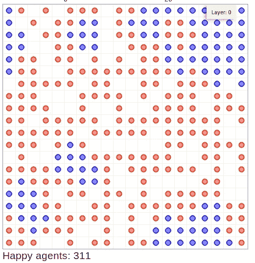
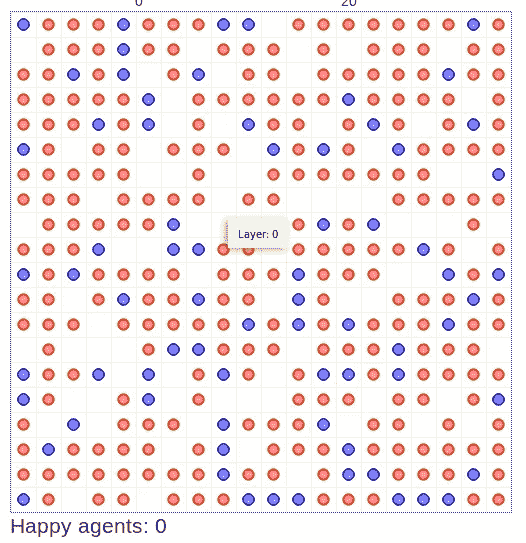
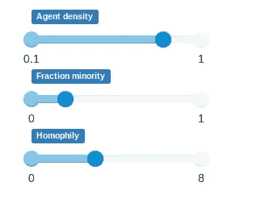
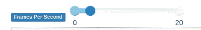
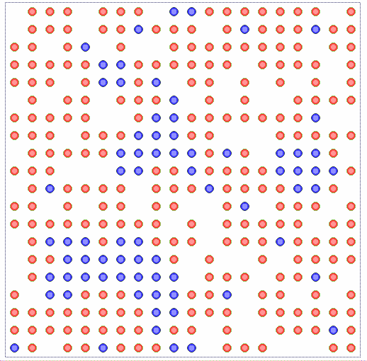
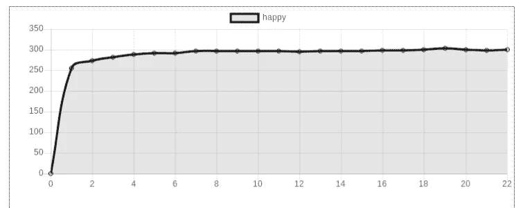

# Mesa 简介:Python 中基于代理的建模

> 原文：<https://towardsdatascience.com/introduction-to-mesa-agent-based-modeling-in-python-bcb0596e1c9a?source=collection_archive---------0----------------------->

基于 Python 的 NetLogo、Repast 或 MASON 的替代品，用于基于代理的建模



Simulation result showing segregation between blue and red agent

基于代理的建模依赖于模拟自主代理的动作和交互来评估它们对系统的影响。它通常用于预测给定复杂现象时我们将获得的投影。主要目的是在给定一组特定规则的情况下，获得关于代理将如何行为的解释性见解。基于 Agent 的建模已经广泛应用于生物学、社会科学、网络和商业等众多行业。本文涵盖了使用名为 Mesa 的开源 python 模块启动基于代理的建模项目的必要步骤。本教程有 4 个部分:

1.  设置
2.  谢林分离模型
3.  形象化
4.  结论

# 1.设置

对于 Mesa 来说，设置非常简单。确保创建一个新的虚拟环境。我把这个环境命名为 mesaenv。打开您的终端，将目录更改为 mesaenv，并使用以下代码激活虚拟环境:

## 虚拟环境

根据您的使用情形，运行以下命令来激活虚拟环境。

```
#Anaconda
conda activate mesaenv#Terminal
source bin/activate
```

## Python 模块

本教程需要三个模块:

*   平顶山
*   matplotlib
*   朱皮特

```
python3 -m pip install mesa
python3 -m pip install matplotlib
python3 -m pip install jupyter
```

## 基本文件夹

创建一个名为 **Mesa** 的基本文件夹，用于存储所有 python 文件。在本节末尾的基本文件夹中应该有以下文件:

1.  [Model.py](https://github.com/projectmesa/mesa/blob/master/examples/schelling/model.py)
2.  [Run.py](https://github.com/projectmesa/mesa/blob/master/examples/schelling/run.py)
3.  [Server.py](https://github.com/projectmesa/mesa/blob/master/examples/schelling/server.py)

如果您在教程中迷失了方向，请随意下载它。完成后，让我们继续下一部分。

# 2.谢林分离模型

在本教程中，我们将使用著名的谢林分离模型作为用例。请注意，mesa 官方网站上的介绍性教程是基于波尔兹曼财富模型的。谢林隔离模型是一个更好的用例，用来解释我们如何利用基于主体的建模来解释为什么种族隔离问题难以根除。尽管实际的模型非常简单，但它提供了关于个体如何自我隔离的解释性见解，即使他们没有明确的愿望这样做。我们来看看 Mesa 官方 github 页面提供的对这个模型的解释:

> 谢林隔离模型是一个经典的基于主体的模型，它证明了即使是对相似邻居的轻微偏好也能导致比我们直觉预期更高的隔离程度。该模型由正方形网格上的代理组成，每个网格单元最多可以包含一个代理。代理有两种颜色:红色和蓝色。如果他们八个可能的邻居中有一定数量的人是同一种颜色，他们会感到高兴，否则会不高兴。不开心的代理会随机选择一个空单元格移动到每一步，直到他们开心为止。模型一直运行，直到没有不开心的代理。
> 
> 默认情况下，代理需要满意的相似邻居的数量设置为 3。这意味着代理会非常满意他们的大多数邻居是不同的颜色(例如，一个蓝色代理会满意五个红色邻居和三个蓝色邻居)。尽管如此，该模型始终导致高度隔离，大多数代理最终没有不同肤色的邻居。

## Model.py

创建一个名为 model.py 的新 python 文件。

**代理:**我们将从单个代理类开始。

代码非常简单:

1.  初始化**代理**类。
2.  创建一个**步骤**功能。
3.  计算相似邻居的数量。
4.  如果代理不满意，请将代理移到空的位置。

**型号:**为型号类。我们将逐一浏览每一部分，以便更清楚地了解基于代理的建模是如何工作的。首先，创建一个谢林类，并将一个 **init** 函数定义为构造函数。

```
class Schelling(Model):
    def __init__():
```

**变量:**系统将由至少一个基本代理类和一个模型类组成。我们先从写模型开始。我们需要定义 5 个主要变量:

*   **Width** :网格的横轴，与高度一起用于定义系统中代理的总数。
*   **高度**:网格的纵轴，与宽度一起定义系统中代理的总数。
*   **密度**:定义系统中代理的群体密度。从 0 到 1 的浮点值。
*   **分数少数**:蓝色和红色的比例。蓝色代表少数，而红色代表多数。从 0 到 1 的浮点值。如果该值高于 0.5，蓝色反而会成为多数。
*   **同向性**:定义代理快乐所需的相似邻居的数量。整数值范围从 0 到 8，因为你只能被 8 个邻居包围。

```
self.height = height
self.width = width
self.density = density
self.minority_pc = minority_pc
self.homophily = homophily
```

记住在 **init** 函数中添加所需的参数作为输入参数。

**网格:**我们需要使用 mesa 下的**空间**模块来设置网格。

```
from mesa.space import SingleGridself.grid = SingleGrid(height, width, torus=True)
```

**调度器:**接下来，我们需要一个调度器。调度程序是一个特殊的模型组件，它控制代理的激活顺序。最常见的调度程序是随机激活，它以随机顺序每步激活所有代理一次。还有一种叫同时激活。查看 [API 参考](https://mesa.readthedocs.io/en/master/apis/time.html)以了解更多信息。

```
from mesa.time import RandomActivationself.schedule = RandomActivation(self)
```

**数据收集:**数据收集对于确保我们在模拟的每一步后都获得必要的数据至关重要。您可以使用内置的**数据收集**模块。在这种情况下，我们只需要知道代理人是否快乐。

```
from mesa.datacollection import DataCollectorself.happy = 0self.datacollector = DataCollector(                                   {"happy": "happy"},
{"x": lambda a: a.pos[0], "y": lambda a: a.pos[1]}
)
```

**代理设置:**我们现在将使用以下代码设置代理:

**init** 函数的最后一部分是设置以下参数:

```
self.running = True                               self.datacollector.collect(self)
```

一旦满足条件，运行变量**可有条件地关闭模型。一旦所有的代理都满意了，我们就把它设置为假。**

**步骤:**这个类需要一个表示每次运行的步骤函数。

1.  在每一步重置快乐代理的计数器。
2.  开始收集数据并确定满意的代理人数。
3.  一旦所有代理都满意，就停止模型。

## Run.py

创建一个名为 run.py 的新 python 文件，并输入以下代码。

## Server.py

创建一个名为 server.py 的新 python 文件。

**导入:**将以下导入语句添加到文件中:

```
from mesa.visualization.ModularVisualization import ModularServerfrom mesa.visualization.modules import CanvasGrid, ChartModule, TextElementfrom mesa.visualization.UserParam import UserSettableParameter from model import Schelling
```

**HappyElement:** 创建一个名为 HappyElement 的类，并添加两个函数:

*   初始化
*   提供；给予

**Draw 函数:**定义一个名为谢林 _draw 的函数。

在运行服务器时，该部件充当可视化部件。

1.  首先，我们定义基础波特拉尔。描绘是一个字典(可以很容易地转换成 JSON 对象),它告诉 JavaScript 方如何绘制它。
2.  我们根据代理的类型改变描绘的颜色和笔触。在这种情况下，我们将有红色和蓝色的代理。
3.  初始化画布和图表。
4.  设置模型的参数。 **UserSettableParameter** 表示用户可以在网页中修改该参数。它有 6 个参数(类型、名称、初始值、最小值、最大值、每步值)。
5.  最后，我们用上面定义的所有配置初始化服务器。

# 3.形象化

让我们通过在终端运行下面的代码来测试一下。确保你在基本文件夹(**台面**)。

```
mesa runserver
```

将启动一个 web 浏览器，您应该会看到以下输出:

## 帆布

我们之前定义的画布网格的可视化。每个点代表一个代理。



Image by Author

## 环境

您可以修改设置来测试它将如何影响模拟。修改这不会影响当前模拟。记得点击**重置**按钮进行更改。



Image by Author

## 每秒传输帧数

您可以定义自己的每秒帧数来加快模拟速度。



Image by Author

## 开始、步进、复位

您可以使用以下按钮:

*   **开始/停止:**开始模拟。一旦启动，你可以点击相同的按钮来关闭它。
*   **步骤:**只运行一个步骤来查看变化。
*   **复位:**根据设置复位板卡。如果您在模拟运行时使用它，电路板将被重置，模拟将照常运行。


Image by Author

## 运转

点击**开始**按钮，您应该会看到画布的以下变化。



Gif by Author

## 图表

底部有一个图表，显示了满意的代理人数和满意的步骤数。



Image by Author

## 结果

模型应该在某一点停止，这取决于您设置的设置。你可以注意到代理人几乎是隔离的。


Image by Author

# 4.结论

让我们回顾一下今天所学的内容。

我们从设置和安装必要的 python 模块的一些简单步骤开始。

然后，我们学习了谢林分离模型，以及如何使用 Mesa 轻松地对其建模。我们创建了 3 个 python 文件，并进一步深入研究了 Mesa 中可用组件的基本用法。

之后，我们运行服务器来查看可视化效果。我们修改了一些设置，并进行模拟。事实上，官方的 Mesa github 为我们提供了更多可以探索的例子。查看以下[链接](https://github.com/projectmesa/mesa/tree/master/examples)了解更多信息。

希望你喜欢这个教程。祝您愉快，下次教程再见。

# 参考

1.  [https://github.com/projectmesa/mesa](https://github.com/projectmesa/mesa)
2.  [https://mesa . readthe docs . io/en/master/tutorials/adv _ tutorial . html](https://mesa.readthedocs.io/en/master/tutorials/adv_tutorial.html)
3.  [https://mesa . readthe docs . io/en/master/tutorials/intro _ tutorial . html](https://mesa.readthedocs.io/en/master/tutorials/intro_tutorial.html)
4.  [https://github.com/projectmesa/mesa/tree/master/examples](https://github.com/projectmesa/mesa/tree/master/examples)
5.  [https://mesa.readthedocs.io/en/master/apis/api_main.html](https://mesa.readthedocs.io/en/master/apis/api_main.html)