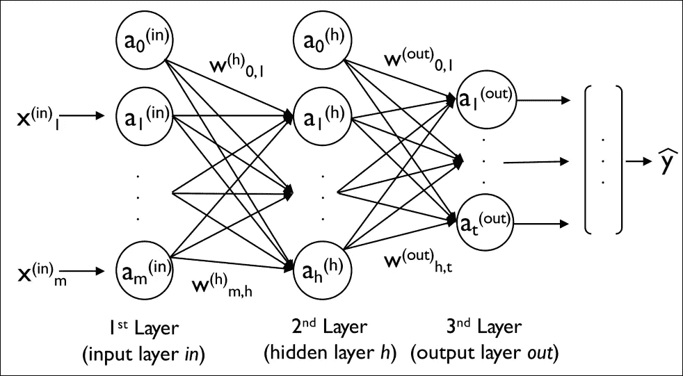
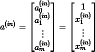
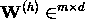
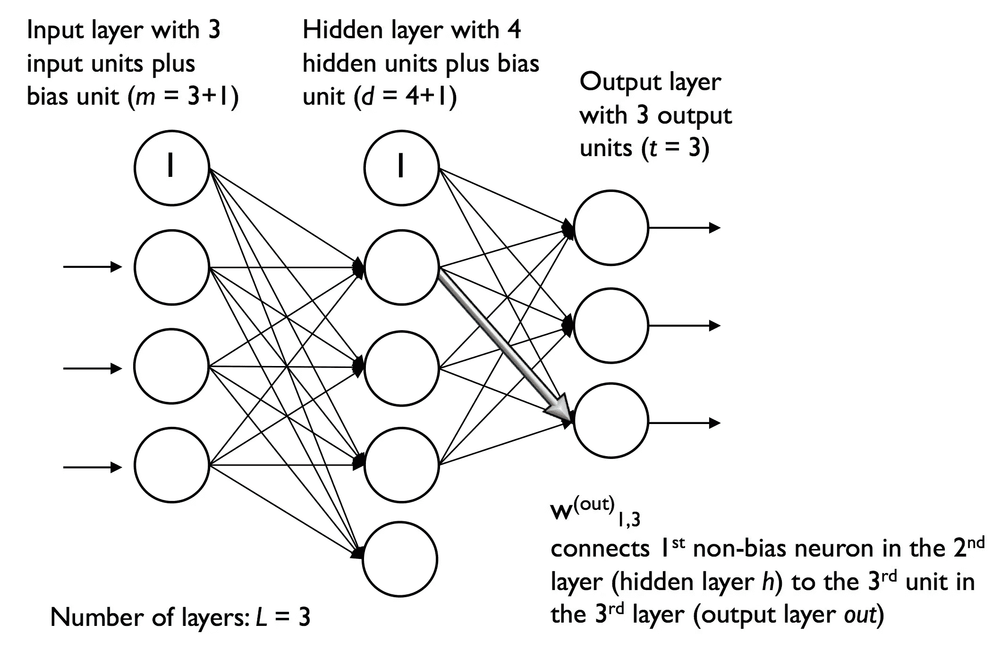
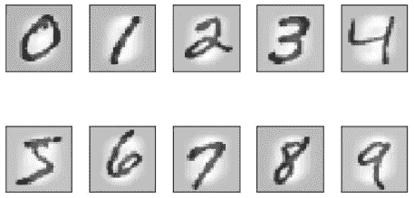

# 使用 TensorFlow 的 Keras API 介绍多层神经网络

> 原文：<https://towardsdatascience.com/introduction-to-multilayer-neural-networks-with-tensorflows-keras-api-abf4f813959?source=collection_archive---------11----------------------->


了解如何使用 TensorFlow 的高级 API Keras 构建和训练多层感知器！

`Keras`的开发始于 2015 年初。时至今日，它已经发展成为构建在`Theano`和`TensorFlow`之上的最流行和最广泛使用的库之一。它的一个突出特点是，它有一个非常直观和用户友好的 API，允许我们只用几行代码来实现神经网络。

`Keras`也从 1.1.0 版本集成到了`TensorFlow`中。它是`contrib`模块的一部分(包含由`TensorFlow`贡献者开发的包，被认为是实验代码)。

在本教程中，我们将通过浏览以下内容来了解这个高级`TensorFlow` API:

*   前馈神经网络的基础
*   加载和准备流行的 MNIST 数据集
*   构建图像分类器
*   训练神经网络并评估其准确性

我们开始吧！

> *本教程改编自 Next Tech 的* ***Python 机器学习*** *系列的* Part 4 *，带你从 0 到 100 用 Python 进行机器学习和深度学习算法。它包括一个浏览器内沙盒环境，预装了所有必要的软件和库，以及使用公共数据集的项目。这里* *可以免费上手* [***！***](https://c.next.tech/2YrZOMz)

# 多层感知器

多层前馈神经网络是一种特殊类型的具有多个单个神经元的*全连接*网络。它们也被称为**多层感知器** ( **MLP** )。下图说明了由三层组成的 MLP 的概念:



上图中描绘的 MLP 有一个输入图层、一个隐藏图层和一个输出图层。隐藏层中的单元完全连接到输入层，输出层完全连接到隐藏层。如果这样的网络有不止一个隐含层，我们也称之为**深度人工神经网络**。

我们可以向 MLP 添加任意数量的隐藏层来创建更深层次的网络架构。实际上，我们可以将神经网络中的层数和单元数视为我们希望针对给定问题任务进行优化的附加超参数。

如上图所示，我们将第 *i* 层中的第 *i* 个激活单元表示为 *a_i^(l).*为了使数学和代码实现更加直观，我们将使用上标中的*作为输入层，使用 *h* 上标作为隐藏层，使用 *o* 上标作为输出层。*

例如， *a_i^(in)* 是指输入层的第 *i* 个值， *a_i^(h)* 是指隐藏层的第 *i* 个单元， *a_i^(out)* 是指输出层的第 *i* 个单元。这里，激活单元 *a_0^(in)* 和 *a_0^(out)* 是**偏置单元**，我们设置为等于 *1* 。输入层中单元的激活仅仅是其输入加上偏置单元:



层 *l* 中的每个单元通过一个权重系数连接到层 *l + 1* 中的所有单元。例如，层 *l* 中第 *k* 个单元到层 *l + 1* 中第 *j* 个单元的连接将写成 *w_{k，j}^(l)* 。回头参考前面的图，我们将连接输入到隐藏层的权重矩阵表示为 *W^(h)* ，将连接隐藏层到输出层的矩阵表示为 *W^(out)* 。

我们通过矩阵总结了连接输入层和隐藏层的权重:



其中 *d* 是隐藏单元的数量， *m* 是包括偏置单元在内的输入单元的数量。因为理解这种符号对于理解本教程后面的概念很重要，所以让我们在一个简化的 3–4–3 多层感知器的描述性图示中总结一下我们刚刚学到的内容:



# MNIST 数据集

为了查看通过`tensorflow.keras` ( `tf.keras`)高级 API 进行的神经网络训练是什么样的，让我们实现一个多层感知器来对来自流行的混合国家标准与技术研究所( **MNIST** )数据集的手写数字进行分类，该数据集用作机器学习算法的流行基准数据集。

为了跟随本教程中的代码片段，您可以使用这个 Next Tech [沙箱](https://c.next.tech/2YUIiAQ)，它已经安装了 MNIST 数据集和所有必要的包。否则，您可以使用您的本地环境，在这里下载数据集。

MNIST 数据集分为四个部分，如下所示:

*   **训练集图像** : `train-images-idx3-ubyte.gz` — 6 万个样本
*   **训练集标签**:`train-labels-idx1-ubyte.gz`—60000 个标签
*   **测试集图像** : `t10k-images-idx3-ubyte.gz` — 1 万个样本
*   **测试集标签**:`t10k-labels-idx1-ubyte.gz`—10000 个标签

训练集由来自 250 个不同人的手写数字组成(50%是高中生，50%是人口普查局的员工)。测试集包含来自不同人的手写数字。

注意`TensorFlow`也提供了相同的数据集，如下所示:

但是，我们将使用 MNIST 数据集作为外部数据集，分别学习数据预处理的所有步骤。通过这种方式，您可以了解需要如何处理自己的数据集。

第一步是通过在终端中运行以下命令来解压缩 MNIST 数据集的四个部分:

`load_mnist`函数返回两个数组，第一个是一个 *n x m* 维`NumPy`数组(`images`)，其中 *n* 是样本的数量， *m* 是特征的数量(这里是像素)。MNIST 数据集中的图像由 28 x 28 像素组成，每个像素由一个灰度强度值表示。这里，我们将 28 x 28 像素展开成一维的行向量，表示我们的`images`数组中的行(每行或每幅图像 784)。由`load_mnist`函数返回的第二个数组(`labels`)包含相应的目标变量，即手写数字的类标签(整数 0-9)。

然后，按如下方式加载和准备数据集:

```
[Out:]
 Rows: 60000,  Columns: 784
 Rows: 10000,  Columns: 784
 (60000, 784) (60000,)
 (10000, 784) (10000,)
```

为了了解 MNIST 的这些图像，让我们通过 Matplotlib 的`imshow`函数来可视化数字 0-9 的例子:

我们现在应该可以看到一个 2 x 5 子图形的图，显示了每个唯一数字的代表性图像:



现在让我们开始建立我们的模型！

# 使用 TensorFlow 的 Keras API 构建 MLP

首先，让我们为`NumPy`和`TensorFlow`设置随机种子，以便获得一致的结果:

为了继续准备训练数据，我们需要将类标签(整数 0–9)转换为独热格式。幸运的是，`Keras`为此提供了一个方便的工具:

```
First 3 labels:  [5 0 4]First 3 labels (one-hot):
 [[0\. 0\. 0\. 0\. 0\. 1\. 0\. 0\. 0\. 0.]
 [1\. 0\. 0\. 0\. 0\. 0\. 0\. 0\. 0\. 0.]
 [0\. 0\. 0\. 0\. 1\. 0\. 0\. 0\. 0\. 0.]]
```

现在，让我们实现我们的神经网络！简而言之，我们将有三层，其中前两层(输入层和隐藏层)各有 50 个带有`tanh`激活函数的单元，最后一层(输出层)有 10 层，用于 10 个类别标签，并使用`softmax`给出每个类别的概率。`Keras`让这些任务变得非常简单:

首先，我们使用`Sequential`类初始化一个新模型，以实现一个前馈神经网络。然后，我们可以添加尽可能多的层。然而，由于我们添加的第一层是输入层，我们必须确保`input_dim`属性匹配训练集中的特征(列)数量(在神经网络实现中为 784 个特征或像素)。

此外，我们必须确保两个连续层的输出单元(`units`)和输入单元(`input_dim`)的数量匹配。我们的前两层各有 50 个单元和一个偏置单元。输出图层中单元的数量应等于唯一分类标注的数量-一次性编码分类标注数组中的列数。

注意，我们使用`glorot_uniform` to 作为权重矩阵的初始化算法。 [**Glorot 初始化**](https://keras.io/initializers/#glorot_uniform) 是深度神经网络更鲁棒的初始化方式。偏差被初始化为零，这更常见，事实上是`Keras`中的默认设置。

在编译我们的模型之前，我们还必须定义一个优化器。我们选择了**随机梯度下降**优化。此外，我们可以设置权重衰减常数和动量学习的值，以调整每个时期的学习速率。最后，我们将成本(或损失)函数设置为`categorical_crossentropy`。

二元交叉熵只是逻辑回归中成本函数的技术术语，分类交叉熵是通过 [softmax](%5Bhttps://en.wikipedia.org/wiki/Softmax_function%5D(https://en.wikipedia.org/wiki/Softmax_function)) 对多类预测的推广。

编译完模型后，我们现在可以通过调用`fit`方法来训练它。这里，我们使用小批量随机梯度，批量大小为每批 64 个训练样本。我们训练 MLP 超过 50 个历元，我们可以通过设置`verbose=1`在训练过程中跟踪代价函数的优化。

`validation_split`参数特别方便，因为它将在每个时期后保留 10%的训练数据(这里是 6000 个样本)用于验证，这样我们可以监控模型在训练期间是否过度拟合:

打印成本函数的值在训练期间非常有用，可以快速发现训练期间成本是否在下降，并尽早停止算法。否则，需要调整超参数值。

为了预测类标签，我们可以使用`predict_classes`方法直接返回整数形式的类标签:

```
First 3 predictions: [5 0 4]
```

最后，让我们在训练集和测试集上打印模型准确性:

```
Training accuracy: 98.81
Test accuracy: 96.27
```

我希望你喜欢这篇关于使用`TensorFlow`的`keras` API 来建立和训练一个用于图像分类的多层神经网络的教程！注意，这只是一个非常简单的神经网络，没有优化的调整参数。

在实践中，你需要知道如何通过调整学习率、动量、重量衰减和隐藏单元的数量来优化模型。您还需要学习如何处理消失梯度问题，即随着网络中图层的增加，误差梯度会变得越来越小。

*我们将在 Next Tech 的* ***Python 机器学习(第四部分)*** *课程中讨论这些主题，以及:*

*   *分解* `*TensorFlow*` *的机制，如张量、激活函数、计算图、变量、占位符*
*   *低级* `*TensorFlow*` *和另一个高级 API，* `*Layers*`
*   *建模时序数据使用* ***递归神经网络****【RNN】和* ***长短期记忆****【LSTM】网络*
*   *用深度* ***卷积神经网络*** *(CNN)对图像进行分类。*

*这里* *可以免费上手* [*！*](https://c.next.tech/2YrZOMz)