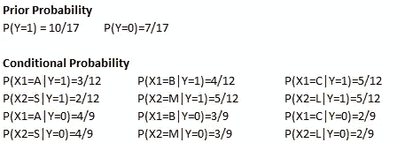

# 朴素贝叶斯分类器简介

> 原文：<https://towardsdatascience.com/introduction-to-na%C3%AFve-bayes-classifier-fa59e3e24aaf?source=collection_archive---------5----------------------->

## 机器学习和深度学习之旅

## 从理论到实践，学习朴素贝叶斯的基本原理

Source: [https://thatware.co/naive-bayes](https://thatware.co/naive-bayes/)/

本博客将涵盖以下问题和主题:

1.什么是朴素贝叶斯分类器？

2.如何在朴素贝叶斯分类器中计算参数并进行预测？

3.拉普拉斯平滑

4.python 中的应用

1.  什么是朴素贝叶斯分类器？

朴素贝叶斯分类器属于概率分类器家族，使用贝叶斯定理。之所以称之为‘幼稚’，是因为它要求输入变量之间刚性的独立性假设。因此，称之为简单贝叶斯或独立贝叶斯更为恰当。自 20 世纪 60 年代以来，该算法得到了广泛的研究。尽管简单，朴素贝叶斯分类器仍然是解决文本分类问题的流行方法之一，即判断文档属于一个类别或另一个类别的问题，如垃圾邮件检测。

朴素贝叶斯分类器的目标是计算条件概率:

对于每个 *K* 可能的结果或类别 *Ck。*

设 *x=(x1，x2，…，xn)* 。利用贝叶斯定理，我们可以得到:

联合概率可以写成:

假设所有特征 *x* 相互独立，我们可以得到:

因此，公式可以写成:

因此，这是朴素贝叶斯分类器的最终公式。

**2。** **如何在朴素贝叶斯分类器中计算参数并进行预测？**

最大似然估计(MLE)用于估计参数——先验概率和条件概率。

先验概率等于 y 发生的某些情况的数量除以记录总数。

*p(x1=a1|y=C1)* 的条件概率等于 x1 等于 a1 **和** y 等于 C1 的情况数除以 y 等于 C1 的情况数。

朴素贝叶斯分类器使用以下公式进行预测:

例如，下表中的 15 条记录用于训练朴素贝叶斯模型，然后对新记录 *X(B，S)进行预测。*

使用上面的公式来估计先验概率和条件概率，我们可以得到:

最后，截止到 *X(B，S)*我们可以得到:

*P(Y = 0)P(X1 = B | Y = 0)P(X2 = S | Y = 0)>P(Y = 1)P(X1 = B | Y = 1)P(X2 = S | Y = 1)*所以 *y=0。*

**3。拉普拉斯平滑**

在统计学中，拉普拉斯平滑是一种平滑分类数据的技术。引入拉普拉斯平滑来解决零概率问题。应用这种方法，先验概率和条件概率可以写成:

*K* 表示 *y* 中不同值的个数， *A* 表示 *aj 中不同值的个数。*通常公式中的λ等于 1。

通过应用拉普拉斯平滑，先前示例中的先验概率和条件概率可以写成:

**4。python 中的应用**

步骤 1:创建数据集。

步骤 2:通过计算先验和条件概率来训练朴素贝叶斯模型。

第三步:做一个预测。

**概要:**

朴素贝叶斯分类器易于快速训练，可作为基准模型。当变量选择适当时，朴素贝叶斯可以表现得和其他统计模型一样好，甚至更好，如逻辑回归和 SVM。朴素贝叶斯需要对独立预测器的强假设，因此当模型表现不佳时，导致这种情况的原因可能是预测器之间的相关性。

你可以点击以下链接阅读更多博客:

 [## 机器学习和深度学习之旅

### 这一系列博客将从理论和实现两个方面对深度学习进行介绍。

medium.com](https://medium.com/@songyangdetang_41589/table-of-contents-689c8af0c731) 

**参考:**

[1] Christopher M. Bishop，(2009)，*模式识别和机器学习*

[https://en.wikipedia.org/wiki/Naive_Bayes_classifier](https://en.wikipedia.org/wiki/Naive_Bayes_classifier)

[https://en.wikipedia.org/wiki/Additive_smoothing](https://en.wikipedia.org/wiki/Additive_smoothing)