# 面向 Noobs 的自然语言处理介绍

> 原文：<https://towardsdatascience.com/introduction-to-natural-language-processing-for-noobs-8f47d0a27fcc?source=collection_archive---------14----------------------->

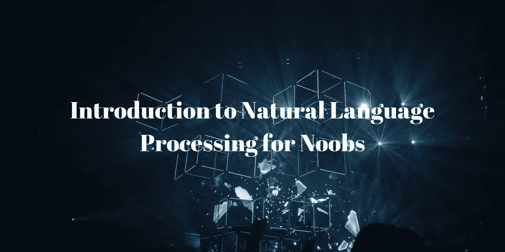

Photo by [fabio](https://unsplash.com/@fabioha?utm_source=unsplash&utm_medium=referral&utm_content=creditCopyText) on [Unsplash](https://unsplash.com/search/photos/ai?utm_source=unsplash&utm_medium=referral&utm_content=creditCopyText)

## 使用 Kaggle 竞争的 NLP 及其基本流水线概述

这篇文章是我试图给出一个可能对新手有帮助的基本概念的概述。为了更好地理解，我将关注一个完整的 Kaggle 竞赛 [Quora 虚假问题分类](https://www.kaggle.com/c/quora-insincere-questions-classification/overview)。在这里，我们提供了 131 万个带标签的问题和 37.6 万个问题，我们必须预测这些问题的标签。这个竞赛是一个二元分类问题的例子。我已经包含了可以用来解决这个问题的 python 代码示例。代码使用了 *Keras* 库，非常容易理解。这场竞赛的基线解决方案是在 Kaggle [内核](https://www.kaggle.com/vksbhandary/introduction-to-nlp-for-noobs)上。

所以先从基础开始吧。

# 介绍

NLP 是计算机科学的一个分支，它用自然语言处理人和机器之间的交互。它是语言学和计算机科学的交叉，因此它使机器能够理解并以自然语言回复人类的查询。自然语言处理的主要问题是人类语言是不明确的。人类非常聪明，能够理解上下文和单词的意思，但对计算机来说，这个问题完全是另一个层面，因为计算机既不理解概念也不理解上下文。为了让计算机理解概念，它们需要对世界、语言句法和语义有一个基本的理解。

# 文本表示

我们可以理解和阅读一段文本，但对计算机来说，每段文本都是一系列数字，不代表任何概念。一个简单的例子，字母“A”在英语中有特殊的含义，它被认为是所有字母表中的第一个字母。但是计算机认为它是 65(因为 65 是字母“A”的 ASCII 码)。ASCII 是基于英文字符的传统编码系统。这些字符的集合在 NLP 中通常被称为*标记*。

> 一个[标记](https://nlp.stanford.edu/IR-book/html/htmledition/tokenization-1.html)是某个特定文本中的一个字符序列的实例，这些字符被组合在一起以在自然语言中产生某种意义。

在 NLP 管道中表示任何文本的最简单方法是通过一键编码的向量表示法。如果一个句子包含某个单词，那么向量中相应的条目表示为“1”，否则为“0”。例如，让我们考虑下面两句话:

1.  “自然语言处理是最好的领域”
2.  “我是自然语言处理的新手”

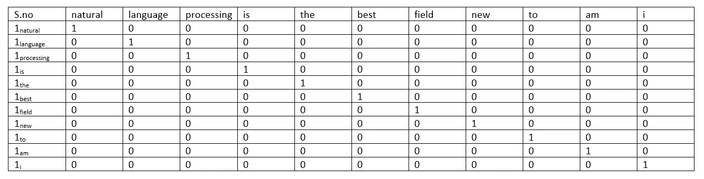

**Table 1**. One hot encoding of all words in sentence 1 and 2

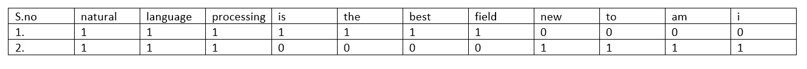

**Table 2**. Collapsed One hot encoded vector for sentence 1 and 2

一种流行的编码是将分类变量表示为二进制向量。一种单词的热编码用于对文本进行编码，其中除了当前单词之外，每个单词都用零表示。如果我们有一千个唯一单词的语料库，那么每个单词表示将需要大小为 1000 的向量。尽管大小依赖于词汇，但即使在今天，一键编码表示仍在产品中使用。

表 1 显示了句子 1 和 2 中所有单词的一次性编码。表 2 所示的表示称为折叠或“二进制”表示。

现代 NLP 系统有一个单词字典，其中每个单词都有一个整数表示。所以那句“自然语言处理是最好的领域！”可以表示为“2 13 6 34 12 22 90”(忽略标点符号，将每个单词都视为小写)。这种表示在内存使用方面更有效，并且还保留了语言语义。

# 基本 NLP 流水线

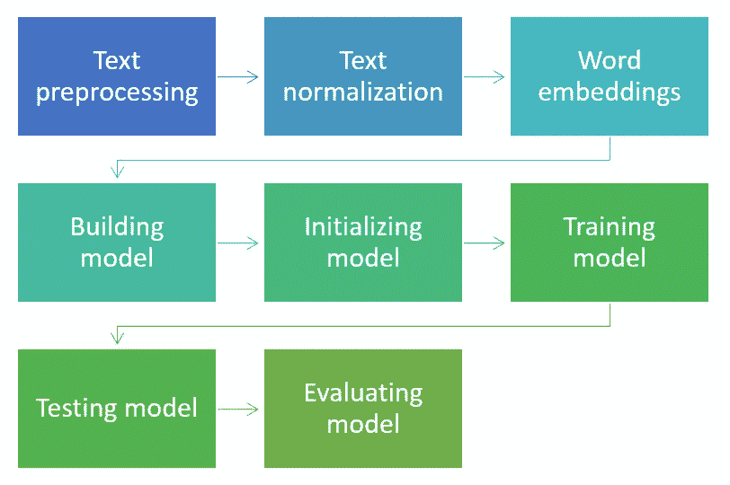

**Figure 1**: Basic NLP pipeline

NLP 中有很多任务可以使用上面显示的管道。大多数 Kaggle 比赛都清理了数据，这在现实生活中不会发生，因为这些数据集是由比赛协调员收集和预处理的。在现实世界的场景中，**我们必须总是假设数据需要一些预处理**。预处理之后，我们需要将文本分解成*记号*和*句子*。在分解文本之后，我们使用预先训练的嵌入来初始化我们的模型。

为了这篇文章的简单，我从我们的管道中跳过了文本分析。文本分析是任何 NLP 管道中非常重要的一部分。根据分析的见解，可以修改管道流程以提高应用程序的性能。

# **文本预处理**

文本数据可能非常混乱。所以大多数时候我们需要对文本进行预处理。预处理可以包括去除最常见的拼写错误、替换文本中的数字、替换俚语词、消除常见的语法错误、匿名化数据、去除停用词等。

**代码示例:**

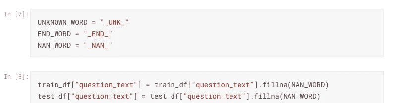

**Code sample 1**: Replacing empty records

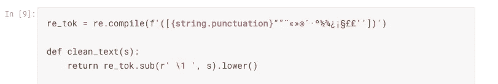

**Code sample 2**: Declaring function to clear text

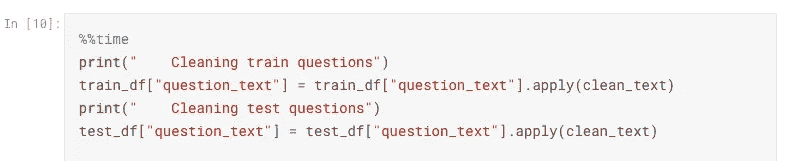

**Code sample 3**: Cleaning question text

在上面的代码样本中 *train_df、* *test_df* 是熊猫 dataframe。首先，我们使用[*fillna()*](https://pandas.pydata.org/pandas-docs/stable/reference/api/pandas.DataFrame.fillna.html)*函数删除数据集中的空记录。然后我们声明 *clean_text* 函数来分离令牌。在代码示例 3 中，我们通过使用 pandas dataframe 的 *apply()* 函数，调用 *clean_text* 函数将其应用于我们的训练和测试数据集。*

# ***文本规范化***

> *文本规范化是将文本转换成单一规范形式的过程。*

*有许多文本规范化技术，如标记化、词条化、词干化、句子分割、拼写纠正等。其中，标记化是最常用的文本规范化方法。*

> *标记化是将一段文本转换成在自然语言中有意义的一系列单词或特殊字符的过程。*

*例如文本“NLP 是最好的！”可以转换成列表“NLP”、“is”、“the”、“best”和“！”(注意特殊字符"！"与“最佳”分开，因为它在英语中有特殊的含义)。像中文这样的一些语言没有用空格分隔的单词，所以这些语言的标记化就更加困难。*

*词汇化是确定两个单词是否有相同词根的任务。例如，单词“got”和“gone”是动词“go”的形式。词干化类似于词汇化，但它只是从单词的末尾剥离。使用词汇化或词干化意味着从数据中丢弃一些信息。拼写校正可以在你的自然语言处理系统中使用，以消除输入错误，提高自然语言处理系统的性能。然而，NLP 系统被假定为对由于未知令牌引起的输入的小变化是鲁棒的。*

***代码示例:***

*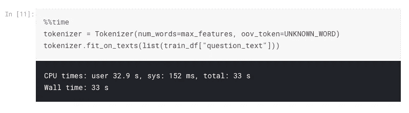*

***Code sample 4**: Declaring and fitting tokenizer on training data*

*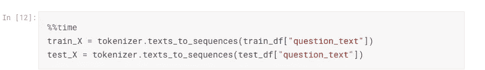*

***Code sample 5**: Using trained tokenizer to tokenize all questions*

*在上面的代码示例中，我们通过使用一个*标记器*对象的 *fit_on_texts()* 函数来训练一个标记器。该对象可用于将文本转换为输入数据的整数表示形式。之后，我们可以通过使用 *Keras* 包中的 *pad_sequences()* 函数来限制输入序列的大小。*

# *单词嵌入*

*单词嵌入是文档词汇在向量空间中的表示。嵌入向量的大小范围从 50 到 600，可以捕获语法和语义信息。如果有足够的计算资源可用，那么甚至可以使用更大的向量大小。单词嵌入的性能可能因为所使用的不同算法或嵌入向量的大小而不同。但是在某些时候，增加嵌入大小并不能提高性能。*

*语言模型可以代替自然语言处理系统中的单词嵌入。LM 不同于单词嵌入，因为它们可以在语料库上被训练和微调。单词嵌入被视为单个层，不能进一步调整。统计语言模型是单词序列的概率分布。一个这样的例子是 N-gram 模型。N-gram 模型计算单词“w”出现在单词“h”之后的概率。*

***代码示例:***

*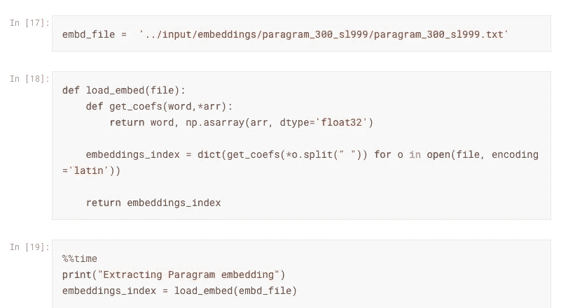*

***Code sample 6**: Reading embedding file format*

*为了在代码中使用单词嵌入，我们读取并处理嵌入文件。在每一行中，嵌入文件包含一个单词及其嵌入向量。在代码示例 6 中，我们拆分了这一行，并创建了一个字典来存储每个单词的嵌入向量。*

*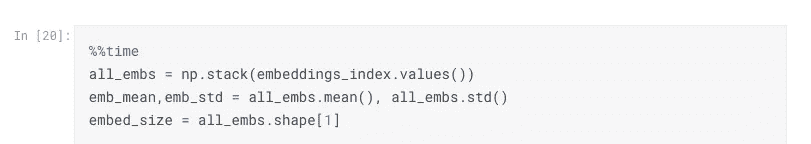*

***Code sample 7**: Extracting embedding vectors and calculating mean and standard deviation*

*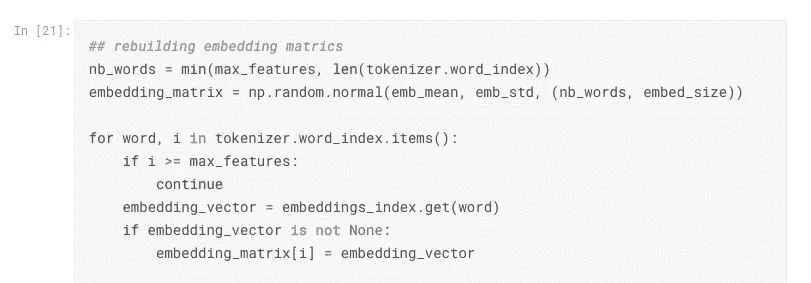*

***Code sample 8**: Recreating embedding matrics*

*在读取嵌入文件后，我们可以创建一个使用单词和嵌入矩阵的列表。注意，代码示例 8 使用*标记器*对象来访问词汇单词。这里，我们使用正态分布重新创建嵌入矩阵。这有助于初始化字典 *embeddings_index 中不存在的单词向量。**

* [## 单词嵌入和 Word2Vec 简介

### 单词嵌入是最流行的文档词汇表示之一。它能够捕捉…的上下文

towardsdatascience.com](/introduction-to-word-embedding-and-word2vec-652d0c2060fa) 

要详细了解单词嵌入和 word2vec，请阅读上面的文章。* 

# ***建筑模型***

*机器学习管道中的模型是一系列数学运算，可以学习估计未知数据的输出。选择您的型号非常重要，因为它可以决定您系统的性能。*

*新手的话可以从非常基础的机型入手。但是您应该至少用几个模型进行试验，看看哪个参数设置能得到最好的结果。一旦你有了六个或更多运行良好的模型，你就可以把它们整合成一个巨大的模型。*

*最初，您可以选择使用双 LSTM 或 GRU 层和平均池层进行测试。实验之后，您可以通过使模型更深入或使用更先进的模型来对模型进行更改。为了跟踪 NLP 的进展，你可以访问这个[站点](http://nlpprogress.com)，看看哪个模型在特定的任务中表现得更好。*

*下图给出了我们为第一个测试选择的模型的概念表示。*

*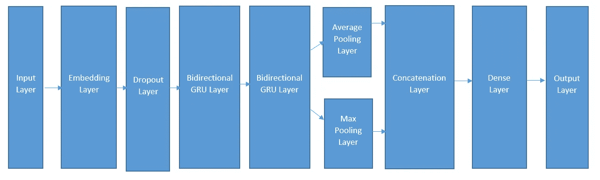*

***Figure 2**: Conceptual representation of our model*

*在上图中，您可以看到我们模型的概念性布局。模型中的层代表特定的数学运算。一个模型至少可以有两层，输入层和输出层。Keras 中的**输入层**用于实例化一个张量。模型中的**输出层**是具有多个节点的神经网络。*

***模型中的嵌入层**对输入序列和嵌入矩阵进行点积，将每个词索引转换成对应的嵌入向量。*

***丢弃层**以给定的百分比随机丢弃输入。这一层将输入单位转换为零。这个过程有助于防止过度拟合。*

*门控递归单元是一种不存在消失梯度问题的递归层。**双向 GRU** 的输出是前向和后向 GRU 的组合*

*汇集操作通过执行数学平均、最大值等来减小输入序列的大小。因此，**平均池层**执行平均池，同时**最大池层**执行最大池。**级联层**组合不同的输入序列。*

***密集层**是一个简单的神经网络，具有固定的节点数和指定的激活函数。*

*为了完全理解递归神经网络和 GRU 网络的工作原理，你可以阅读下面的文章。*

* [## 递归神经网络图解指南

### 理解直觉

towardsdatascience.com](/illustrated-guide-to-recurrent-neural-networks-79e5eb8049c9)  [## 了解 GRU 网络

### 在这篇文章中，我将试图给出一个相当简单和易懂的解释，一个真正迷人的类型…

towardsdatascience.com](/understanding-gru-networks-2ef37df6c9be) 

**代码示例:**

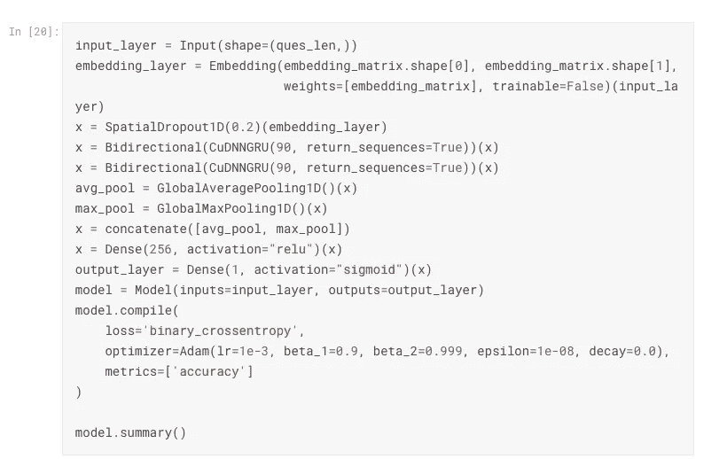

**Code sample 9**: Model definition code

在代码示例 9 中，输入层接受大小等于 *ques_len 的输入。*嵌入层以嵌入矩阵及其维数为参数。嵌入层的输出大小为*ques _ len*x*embedding _ matrix . shape[1]*。*空间丢弃*层随机丢弃*嵌入*层的输出，分数为 0.2。

接下来的两层是双向 GRU，这是一种递归神经网络。*全局平均池 1D* 和*全局最大池 1D* 从第二双向 GRU 层的输出中提取平均和最大特征。输出 *avg_pool、*和 *max_pool* 被连接以馈入密集层。最后一层是输出层，给出一个介于 0 和 1 之间的数字。

# 初始化模型

> 迁移学习是通过从已经学习过的相关任务中迁移知识来提高在新任务中的学习。

在这一阶段，我们试图在我们的自然语言处理系统中利用以前的知识。使用在不同设置中训练的独立模型可以提高我们的模型的性能。这个过程被称为知识转移。在 NLP 系统中初始化神经网络的最流行的方法是单词嵌入。

NLP 的最新发展清楚地表明迁移学习是前进的方向。使用预先训练的 LMs，新的最先进的模型变得越来越好。LMs 是在一个巨大的数据集上预先训练的，它们也基于 Transformer 架构。

如果你想了解更多关于变压器模型的信息，请阅读下面的文章。

 [## 你需要的只是关注

### 主导序列转导模型是基于复杂的递归或卷积神经网络在一个…

arxiv.org](https://arxiv.org/abs/1706.03762) 

在编码样本 9 中，我们使用*嵌入 _ 层*初始化我们的模型，它被初始化为*嵌入 _ 矩阵*的权重。

# **培训模式**

在您决定第一次使用哪个模型后，您可以训练您的模型。您应该总是在十分之一的训练数据集上开始测试您的模型，因为这会使测试更快。有些问题是，不同的预处理方法可能会产生不同的性能。

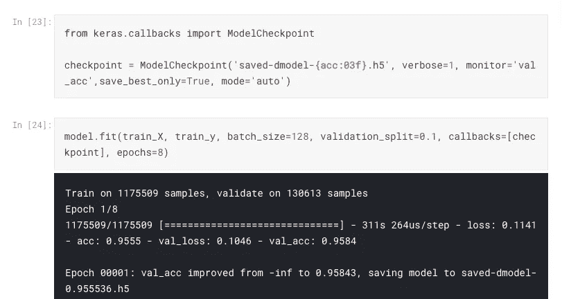

**Code sample 10**: Training our model using model.fit() method

在代码示例 10 中，我们添加了每次保存模型的功能，如果它的验证准确性增加的话。最后，我们调用函数 *fit()，*来使用 *train_X，train_y* (我们的特征和标签)和一系列其他参数训练模型。如果我们想以更快的速度进行训练，我们可以随时增加批量。*历元的数量*表示相同的训练数据将被输入模型的次数。

# 测试和评估模型

在训练模型之后，我们必须测试我们的模型的准确性，并评估它在看不见的数据上的表现。为此，我们预测结果并与实际标签进行比较。如果模型的性能不符合我们的预期，我们需要在我们的管道中做出改变。在 Kaggle 比赛中，排行榜分数是评估我们模型的一个很好的方式。*