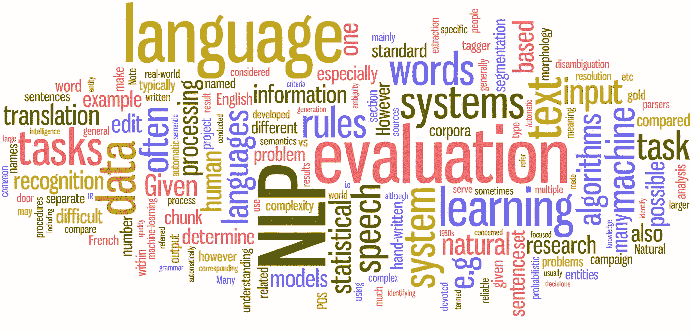
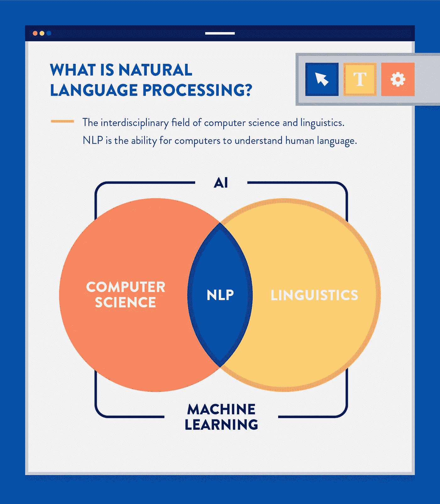
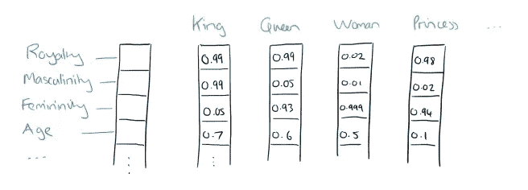

# 自然语言处理(NLP)简介

> 原文：<https://towardsdatascience.com/introduction-to-natural-language-processing-nlp-323cc007df3d?source=collection_archive---------6----------------------->

## 你有没有想过你的私人助理(比如 Siri)是怎么打造的？你想自己做吗？超级！先说自然语言处理。

Source: [http://www.contrib.andrew.cmu.edu/~dyafei/NLP.html](http://www.contrib.andrew.cmu.edu/~dyafei/NLP.html#)

# 那么，什么是自然语言处理(NLP)？

NLP 是一个跨学科领域，涉及计算机和自然人类语言(*例如*英语)——语音或文本之间的交互。NLP 支持的软件在日常生活中以各种方式帮助我们，例如:

*   **个人助理** : Siri、Cortana、谷歌助理。
*   **自动完成**:在搜索引擎中(*例如*谷歌)。
*   **拼写检查**:几乎无处不在，在你的浏览器，你的 IDE ( *如* Visual Studio)，桌面应用(*如*微软 Word)。
*   **机器翻译**:谷歌翻译。

好了，现在我们明白了，NLP 在我们日常的计算机交互中扮演着重要的角色；让我们来看一些 NLP 的业务相关用例示例:

*   快餐连锁店每天都会收到大量的订单和投诉；手动处理这将是令人厌倦的和重复的，并且在时间、劳动和成本方面效率低下。由于最近在对话式人工智能方面的进步，他们可以建立虚拟助手来自动化这些过程并减少人工干预。
*   品牌推出新产品，并在社交媒体平台上营销；他们可以使用覆盖范围和互动次数等指标来衡量活动的成功率。然而，他们不能自动理解消费者的公众情绪。这项任务可以使用 [**情感分析**](https://en.wikipedia.org/wiki/Sentiment_analysis) 来自动化，这是一项文本分类任务，其中机器学习模型被训练来量化情感状态和主观信息。

Source: [https://clevertap.com/blog/natural-language-processing](https://clevertap.com/blog/natural-language-processing/)

NLP 主要分为两个领域:语言学和计算机科学。

**语言学**方侧重于理解语言的结构，包括以下子领域[ [*Bender，2013*](https://www.morganclaypool.com/doi/abs/10.2200/S00493ED1V01Y201303HLT020) ]:

1.  ***语音学*** :研究人类语言的声音。
2.  ***音系学*** :研究人类语言中的声音系统。
3.  *:研究词的构成和内部结构。*
4.  ****句法*** :研究句子的构成和内部结构。*
5.  ****语义学*** :对句子意义的研究。*
6.  **:研究句子及其语义用于特定交际目的的方法。**

****计算机科学**方面是在子领域如**人工智能**的帮助下，将语言知识和领域专长转化为计算机程序。**

# **让我们谈谈科学**

**NLP 的科学进步可以分为基于规则的系统、经典的机器学习模型和最近的深度学习模型。**

*   ****基于规则的系统**在很大程度上依赖于制作特定领域的规则(例如*正则表达式)。它可以自动执行简单的任务，例如从非结构化数据(*例如*网页、电子邮件)中提取结构化数据(*例如*日期、姓名)。然而，由于人类语言的复杂性，基于规则的系统不够健壮，难以维护，并且不能跨不同领域通用。***
*   ***经典的机器学习**方法可以解决更具挑战性的问题(*例如*垃圾邮件检测)。使用特征工程(*例如*单词包、词性标签)来构建机器学习模型(*例如*朴素贝叶斯)。这些模型利用训练数据中的系统模式，可以对看不见的数据进行预测。*
*   ***深度学习模型**是目前 NLP 研究和应用中最流行的。它们甚至比经典的机器学习方法更能概括。它不需要手工制作的特征或特征工程，因为它们自动作为特征提取器工作，实现端到端的模型训练。深度学习模型的学习能力比浅层/经典的 ML 模型更强大，这为在各种具有挑战性的 NLP 任务中获得最高分数铺平了道路(*例如*机器翻译)。*

# *计算机如何理解文本？*

*计算机理解数字，但不能理解字符、单词、或句子，所以在建立 NLP 模型之前需要一个中间步骤，就是**文本表示。我将把重点放在单词级的表达上，因为它们很容易理解。使用其他表示技术，例如字符或子词。***

**

*在经典的 NLP/ML 时代(深度学习之前)，文本表示技术主要建立在一个基本思想上: **one-hot encodings** ，其中一个句子由一个形状矩阵( *N x N* )表示，其中 N 是句子中唯一记号的数量。例如，在上图中，句子(猫坐在垫子上)被表示为一组稀疏向量(*大部分为零*)。这种方法有两个*的显著缺点:**

*   **巨大的**存储容量**问题，因为稀疏表示矩阵。**
*   ****缺乏语义理解**。它不能理解单词之间的关系(*如*学校和书)。**

****

**2013 年，来自谷歌的研究人员推出了一种新的文本表示模型，这在 NLP 中是革命性的，命名为**word 2 vec**[[*miko lov 等人，2013*](https://www.google.com/url?sa=t&rct=j&q=&esrc=s&source=web&cd=&cad=rja&uact=8&ved=2ahUKEwjRg-iTsO_yAhVHyzgGHYsoAsAQFnoECAYQAQ&url=https%3A%2F%2Fpapers.nips.cc%2Fpaper%2F5021-distributed-representations-of-words-and-phrases-and-their-compositionality.pdf&usg=AOvVaw3lEm7W86bi2fXnfFRBIz1j) 。这种浅层深度学习模型可以在**密集向量**中表示单词，并捕捉相关术语之间的**语义**(*例如*巴黎和法国、马德里和西班牙)。进一步的研究建立在 word2vec 之上，如**GloVe**[*Pennington 等人，2014*](https://aclanthology.org/D14-1162/)**和**fast text**[*Bojanowski 等人，2016*](https://arxiv.org/abs/1607.04606) 。****

****2018 年末，来自谷歌的研究人员再次提出了另一个模型( **BERT** )，它被认为是当今最先进的 NLP 研究的基础[ [*Devlin 等人，2019*](https://www.google.com/url?sa=t&rct=j&q=&esrc=s&source=web&cd=&cad=rja&uact=8&ved=2ahUKEwjf0P6ssO_yAhXPyjgGHbDCBlkQFnoECCUQAQ&url=https%3A%2F%2Faclanthology.org%2FN19-1423&usg=AOvVaw14wCQZwGJubV4lXW6D19b9) ]，完全基于 **Transformer** 架构[ [*Vaswani 等人，2017*](https://www.google.com/url?sa=t&rct=j&q=&esrc=s&source=web&cd=&cad=rja&uact=8&ved=2ahUKEwiZt9mksO_yAhU9yzgGHQZ4A9gQFnoECAIQAQ&url=https%3A%2F%2Fpapers.nips.cc%2Fpaper%2F7181-attention-is-all-you-need.pdf&usg=AOvVaw3kEBeZrZ2pF4145fPhK2j4) ]。****

# ****任务和研究****

****让我们看看一些 NLP 任务，并根据对**英语**语言的研究进展对它们进行分类(阅读: [*#BenderRule*](https://thegradient.pub/the-benderrule-on-naming-the-languages-we-study-and-why-it-matters/) )。****

## ****1.大部分已解决:****

*   ****文本分类*(例如 Gmail 中的*垃圾邮件检测)。****
*   ****词性(**词性**)标注:给定一个句子，确定每个单词的词性标注(*如*名词、动词、ADV、ADJ)。****
*   ****命名实体识别( **NER** ):给定一个句子，确定命名实体(*例如*人名、地点、组织)。****

## ****2.稳步前进:****

*   ****情感分析:给定一个句子，确定它的极性(*如*积极、消极、中性)，或情绪(*如*高兴、悲伤、惊讶、愤怒等)****
*   ****共指解析:给定一个句子，确定哪些词(“提及”)指的是相同的对象(“实体”)。例如(**曼宁**是一位伟大的 NLP 教授，**他**在这个领域工作了二十多年)。****
*   ****词义消歧( **WSD** ):很多词有不止一个意思；我们必须根据上下文选择最有意义的意思(*例如*我去银行取些钱，这里的银行是指金融机构，而不是河边的土地。****
*   ****机器翻译。****

## ****3.仍然具有挑战性:****

*   ****对话代理和聊天机器人，尤其是开放域的。****
*   ****问题回答。****
*   ****抽象概括。****
*   ****低资源语言的 NLP(如非洲语言，参见[马萨坎](http://masakhane.io/)和[*∀等人，2020*](https://arxiv.org/pdf/2003.11529.pdf) )。****

# ****NLP 实时演示****

*   ****[空间命名实体识别](https://explosion.ai/demos/displacy-ent)****
*   ****[空间语义相似度](https://explosion.ai/demos/sense2vechttps://explosion.ai/demos/sense2vec)****
*   ****[AllenNLP 情绪分析](https://demo.allennlp.org/sentiment-analysis)****
*   ****[AllenNLP 文本到 SQL](https://demo.allennlp.org/atis-parser)****
*   ****[用变压器拥抱脸写字](https://transformer.huggingface.co)****
*   ****[拥抱脸多任务模型](https://huggingface.co/hmtl)****
*   ****[斯坦福 CoreNLP 情绪分析](http://nlp.stanford.edu:8080/sentiment/rntnDemo.html)****

# ****在线综合学习计划****

## ******1。基础:******

*   ****学习用 Python 编程( [Udacity 课程](https://www.udacity.com/course/introduction-to-python--ud1110))。****
*   ****数学基础(线性代数，概率，统计)，可汗学院曲目就足够了。我在[这篇文章](/mathematics-for-data-science-e53939ee8306)中更详细地讨论了如何为机器学习学习数学。****

## ******2。机器/深度学习:******

*   ****经典机器学习([吴恩达在 Coursera 上的课](https://www.coursera.org/learn/machine-learning)，用 Python 解决[的作业)。](https://github.com/dibgerge/ml-coursera-python-assignments)****
*   ****深度学习([吴恩达在 Coursera 上的专业化](https://www.coursera.org/specializations/deep-learning))。****

## ******3。自然语言处理:******

*   ****经典的 NLP，虽然现在使用的不是很广泛，但是它涵盖了一些基本的概念和永恒的技术( [Jurafsky 和 Manning](https://www.youtube.com/playlist?list=PLQiyVNMpDLKnZYBTUOlSI9mi9wAErFtFm) class)。****
*   ****[斯坦福 CS224N:具有深度学习的 NLP](https://www.youtube.com/playlist?list=PLoROMvodv4rOhcuXMZkNm7j3fVwBBY42z)。****
*   ****[CMU CS11–747:自然语言处理的神经网络](https://www.youtube.com/playlist?list=PL8PYTP1V4I8AkaHEJ7lOOrlex-pcxS-XV)。****
*   ****CMU 低资源 NLP 训练营。****

## ******4。语言学:******

*   ****Emily Bender 的语言学书籍(上册:[词法和句法](https://www.morganclaypool.com/doi/abs/10.2200/S00493ED1V01Y201303HLT020)，下册:[语义和语用](https://www.morganclaypoolpublishers.com/catalog_Orig/product_info.php?products_id=1451))。****
*   ****YouTube 上的语言学速成班。****
*   ****莱顿大学:人类语言的奇迹:语言学导论，Coursera 的在线课程。****

## ****5.杂项主题:****

*   ****NLP 中 [*伦理的资源集合。*](https://aclweb.org/aclwiki/Ethics_in_NLP)****
*   ****能源消耗和环境问题:*NLP 中深度学习的能源和政策考虑，* [*Sturbell 等，2019*](https://arxiv.org/abs/1906.02243) 。****
*   ****关于随机鹦鹉的危险:语言模型会不会太大？ 🦜 *，* [*本德，格布鲁等人，2021*](https://www.google.com/url?sa=t&rct=j&q=&esrc=s&source=web&cd=&cad=rja&uact=8&ved=2ahUKEwjhoJbEs-_yAhUd8HMBHXQED0QQFnoECAgQAQ&url=https%3A%2F%2Fdl.acm.org%2Fdoi%2F10.1145%2F3442188.3445922&usg=AOvVaw3dTAgsOJC51gF4E2GBFlqX) *。*****
*   ****大规模预训练模型会解决语言吗？ [*NLP 的聪明汉斯时刻已经到来*](https://bheinzerling.github.io/post/clever-hans/) *。*****

## ****更喜欢书吗？****

*   ****丹·茹拉夫斯基和詹姆斯·h·马丁，[语音和语言处理](https://web.stanford.edu/~jurafsky/slp3/)。****
*   ****雅各布·爱森斯坦的[自然语言处理](https://github.com/jacobeisenstein/gt-nlp-class/blob/master/notes/eisenstein-nlp-notes.pdf)。****
*   ****Yoav Goldberg 的教程，[自然语言处理的神经网络模型入门](https://arxiv.org/abs/1510.00726)。****
*   ****伊恩·古德菲勒、约舒阿·本吉奥和亚伦·库维尔，深度学习。****

# ****让我们破解一些代码！****

****现在我们已经讨论了什么是 NLP，以及它背后的科学，让我们进入实用部分。这里列出了在您的下一个项目中使用的最广泛的开源库(*排名不分先后*):****

*   ****[空间](https://github.com/explosion/spaCy)****
*   ****[变形金刚](https://github.com/huggingface/transformers/)****
*   ****[Gensim](https://github.com/RaRe-Technologies/gensim)****
*   ****[AllenNLP](https://github.com/allenai/allennlp)****
*   ****[NLTK](https://github.com/nltk/nltk)****
*   ****[第三节](https://github.com/stanfordnlp/stanza)****

****我希望这篇文章能让你对这个激动人心的领域有一个大致的了解。如果您有任何建议或问题，请在回复中留言或联系我[[Ibrahim sharaf . github . io](https://ibrahimsharaf.github.io/)]。****