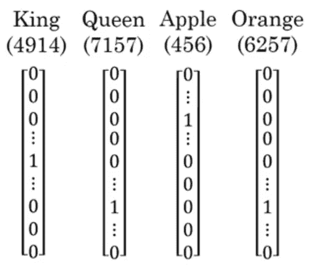
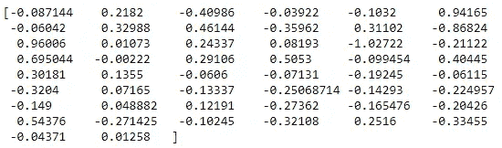

# 自然语言处理和人工智能中的偏见介绍

> 原文：<https://towardsdatascience.com/introduction-to-natural-language-processing-nlp-and-bias-in-ai-877d3f3ee680?source=collection_archive---------13----------------------->

## 人工智能中处理自然数据和消除偏差的实用指南

Photo by [Bewakoof.com Official](https://unsplash.com/@bewakoofofficial?utm_source=medium&utm_medium=referral) on [Unsplash](https://unsplash.com?utm_source=medium&utm_medium=referral)

自然语言处理(NLP)是一个正在被深度学习革命的领域。从语音助手到 Gmail 的 Smart Compose，深度学习已经使机器能够以更直观的方式理解我们。

当然，处理自然数据与处理表格数据有很大不同，因为我们现在需要用机器可以理解的方式来表示单词和句子。

在这篇文章中，我将介绍 NLP 的关键概念，如单词嵌入，我们将看到算法如何变得有偏差，以及我们如何消除这种偏差。

我们开始吧！

> 关于机器学习、深度学习和人工智能的实践视频教程，请查看我的 [YouTube 频道](https://www.youtube.com/channel/UC-0lpiwlftqwC7znCcF83qg?view_as=subscriber)。

So much talking!

# 如何表示文字？

通常，当使用 NLP 应用程序时，我们会访问包含数千个不同单词的词典。现在，我们需要用神经网络可以理解的方式来表达每个单词。

## 一键向量

使用一键编码是在字典中表示单词的一种常见方式。例如，如果您有一个 10 000 个单词的字典，并且“King”是第 4914 个单词，那么它的独热向量表示将是填充有 0 的 10000×1 向量，但是在位置 4914 是 1。

One-hot vector representations of possible words in a dictionary. [Source](https://www.deeplearning.ai/)

这种表示法的缺点是它将每个单词单独作为一个独特的元素。这意味着它不会识别苹果和桔子都是水果，或者国王和王后是相关的单词。因此，它不允许算法容易地概括单词的意思。

为什么？

假设你有线性代数的基础知识，你意识到上面给出的任意两个向量之间的点积都将是 0！因此，算法没有办法理解某些词是相关的。

## 单词嵌入

将单词表示为特征的集合，而不是一个热点向量，会很有用。例如，可以有“性别”特征、“食物”特征、“年龄”特征等。

这形成了单词嵌入的基础。这允许建立矩阵，该矩阵展示不同的单词，每个特征有相应的分数。

Example of word embedding

这样，每个单词现在都是一个向量，其中每个值都是某个特征的分数。

从上图来看，我们来考虑一下“君主”和“国王”。它们各自的向量是[0.5，0.5，1]和[0，0，1]。现在，我们知道这些词是相关的，两个向量之间的点积不再是 0！于是，算法现在可以理解“君主”和“国王”是有关系的，就像“君主”和“人”没有关系一样。

我们可以使用 t-SNE 进一步简化这种表示，并将维度空间减少到 2D。

Example of reducing the dimension space with t-SNE. [Source](https://www.deeplearning.ai/)

正如您所看到的，相似的单词被分组在一起，这显示了使用单词嵌入的优势。

# 使用自然语言处理进行词语类比

现在，让我们将 NLP 应用于单词类比。在继续之前，如果你想继续编码，你可以找到完整的笔记本。

单词类比任务看起来像:

*男人对女人就像国王对 _____(女王)*

为了完成这样的任务，算法必须有办法理解两个单词是相似的。

一种简单的方法是应用余弦相似性。这度量了两个嵌入向量之间的相似程度。数学上，余弦相似性表示为:

Cosine similarity equation

根据上面的等式，如果两个向量非常相似，值将接近 1。否则，它将呈现较小的值。然而，如果向量相似但方向相反，则值将更接近-1。

Cosine similarity between different words. [Source](https://www.deeplearning.ai/)

在 Python 中实现余弦相似性:

现在，我们可以用它来计算不同单词之间的余弦相似度:

上面的单元格输出以下内容:

如你所见，*父亲*和*母亲*是关联词，而*球*和*鳄鱼*不是。同样，*巴黎*和*罗马*相似，但相反，所以余弦相似度给出一个接近-1 的负数。

太好了！有余弦相似度工作，如何应用于单词类比？

如前所述，单词类比包括根据两个其他单词的关系找到与另一个单词相关的单词。例如:

男人对女人就像国王对王后一样

从数学上来说，这意味着每对字向量之间的差大致相等。所以每个差的余弦相似度也要相等。

将每个单词向量定义为 *e* ，下面的等式描述了单词类比的逻辑:

The math of word analogy

将此写入代码:

现在，我们可以运行下面的代码单元格，我们得到:

厉害！看来算法只用余弦相似度就能有效理解基本的单词类比！

花些时间去体会这种方法是如何简单、直观、高效地表示单词和理解它们的意思。

# 消除偏见

我们有一个算法可以进行单词类比。然而，事实证明，我们的单词表征是有偏差的。

查看*性别*向量的一种方法是，我们可以从*女人*向量中减去*男人*向量:

我们得到了:

这就是性别的编码方式。现在，让我们通过输出不同姓名之间的余弦相似度和*性别*向量来进一步探究性别偏见:

如您所见，女性名字的余弦相似度为正，男性名字的余弦相似度为负。

现在，让我们运行相同的操作，但是使用其他随机单词:

可以看到，*工程师*和*技术*更接近*男人*，而*前台*和*文学*更接近*女人*。

很明显，我们的算法有偏差，我们需要修正它。

为此，我们需要识别偏差分量，并将其从单词向量中移除。偏置分量只是单词向量在偏置向量上的投影:

Bias component equation, where **g** is the gender vector. [Source](https://www.deeplearning.ai/)

然后，我们简单地从单词向量中减去它，以获得无偏的单词表示:

代表 2D 平面中的矢量，这是消除偏差前后的样子:

Word vectors before and after removing bias. [Source](https://www.deeplearning.ai/)

对上述逻辑进行编码，我们首先定义一个消除性别偏见的函数:

现在，我们可以使单词对相等:

让我们看看我们是否成功地消除了偏见:

我们得到了:

太神奇了！我们确实在我们的文字表述中消除了任何性别偏见！

在这篇文章中，您了解了自然语言处理中单词是如何表示的，您了解了如何构建一个可以执行单词类比的简单算法，您了解了如何消除算法中的性别偏见。

人工智能算法中的偏见有时可能是一个大问题，社区越来越意识到这一点。当你开发一个算法的时候要小心，确保它尽可能的中立。

干杯！