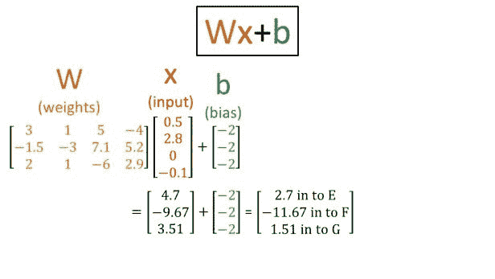

# 神经网络导论

> 原文：<https://towardsdatascience.com/introduction-to-neural-networks-1d81f471a803?source=collection_archive---------19----------------------->

## 什么是神经网络？

引用人类所有知识的宝库“人工神经网络[……]是受构成动物大脑的生物神经网络启发的计算系统。”

生物神经元和人工神经网络中的“神经元”都从其他神经元接收信号，并相应地产生一些输出。这两种神经网络的力量都不是来自单个神经元单独行动，而是来自许多神经元一起的累积效应。但相似之处仅限于此。生物神经元包含非常复杂的分子机制，而人工神经网络神经元包含一些简单的数学运算。

人工神经网络已经成功地应用于图像、音频、文本和医学数据。这篇文章将向你介绍人工神经网络是如何计算的。

**概述**

假设您想要建立一个模型，根据患者的医疗记录来预测其住院风险。您可以为医疗记录的不同组成部分分配数值以构建风险模型，例如，您可以将糖尿病诊断的权重设为“2”，将流感诊断的权重设为“1.5”，将第 4 阶段肺癌诊断的权重设为“10”，以获得以下“模型方程”:

2 *糖尿病+1.5 *流感+10 *癌症=风险。

例如，Fred 患有糖尿病和流感，但没有癌症，因此他的风险是(2*1) + (1.5*1)+ (10*0) = 3.5。

但是，您如何知道每个诊断应该具有什么样的权重(即，在这个等式中使用什么系数)？糖尿病实际上应该有 2 的权重吗？可能权重应该是 1.63，或者 6，或者 0.0001。

这就是机器学习方法可以发挥作用的地方。在受监督的机器学习中，您提供一个具有输入/输出对的模型(例如，输入= Fred 的病史，输出= Fred 是否去过医院)，该模型学习将输入的每一部分分配什么权重，以便最好地预测所需的输出。换句话说，该模型计算出每个输入部分(不同的诊断)对于预测输出(未来住院)有多重要或不重要。

神经网络有很多种。最简单的神经网络是前馈神经网络，这意味着信息只通过神经元向前流动。在这篇文章的剩余部分，我将描述前馈神经网络的监督学习。

**数据**

如果您想要预测患者入院的风险，您可以从该患者的病历中提取诊断、程序、药物和实验室值(输入“X”)，然后检查该患者后来是否入院(输出“y”，正确答案)。你想用“X”来预测“y”，也就是用他们的病历来预测他们会不会去医院。你还需要许多训练样本，也就是说，你需要成千上万的样本病人，而不仅仅是一个。

**前馈神经网络的剖析**

这个神经网络有三层:输入层、隐藏层和输出层。输入和输出之间的一切都被称为“隐藏层”如果你愿意，你可以建立一个有数百个隐藏层的神经网络。

**输入层**只接受输入数据的一个例子:例如，一个病人的病历。在这里，从上到下的原始输入值以红色显示为 0.5、2.8、0 和-0.1，对应于我标记为 A、B、C 和 d 的输入神经元。这些输入值有一个含义。根据您正在解决的问题和使用的数据，其含义是不同的。或许在这里，输入 A、B 和 C 是特定的实验室值，而 D 是过去一年中体重变化的百分比(例如-0.1 表示患者在过去一年中体重减轻了 10%)。)

输入可以是任何正数或负数。通常，原始值被“归一化”以将值压缩为小值，因为如果一些输入是巨大的(例如 183 cm 的身高)而一些输入是微小的(例如 0.6 mg/dL 肌酸酐)，则神经网络具有更难的学习时间。)

**隐藏层**可以被认为是在神经网络的计算中捕捉一些中间值。如果你听到人们谈论输入数据的“隐藏表示”(或“潜在空间”)，他们通常指的是神经网络的隐藏层。在这幅图中，“潜在空间”是三维的，因为有 3 个隐藏的神经元:E、F 和 g。如果你制作了一个有 300 个隐藏神经元的神经网络，你可以说有一个“300 维潜在空间”关键是隐藏层捕获一些介于输入和输出之间的中间数字表示。

**输出层**输出最终答案。这里只显示了一个输出神经元。也许这个输出节点产生了一个入院概率。如果你想同时预测许多不同的事情，你也可以有多个输出节点。例如，您可能有两个输出节点:一个预测住院风险，另一个预测死亡率。

**权重:**连接神经元的蓝线就是神经网络的权重。它们代表乘法运算。我用红色写下了第一批重量的值。请注意，该图中没有写出通向输出层的权重的示例值。将节点 A 连接到节点 E 的权重值“3”表示您获取节点 A 中的当前值，将其乘以 3，并将结果用作节点 E 的值的分量。

**偏差:**标有“偏差”的绿线是神经网络的偏差。它们代表加法运算。应用于节点的偏移值“6”意味着您获取该节点的值，并向其添加“6”。

权重和偏差最重要的区别是，权重表示乘法，偏差表示加法。

“机器学习”的“学习”部分指的是用于计算出权重和偏差的良好设置的算法。权重和偏差是“可训练参数”,因为我们使用神经网络训练过程来计算权重和偏差的良好值。

**网络结构从何而来？**

当你在设计一个神经网络时，你选择它的结构。

您可以根据数据的大小选择输入图层的大小。如果您的数据每个示例包含 100 条信息，那么您的输入层将有 100 个节点。如果您的数据每个示例包含 56，123 条数据，则您的输入层将有 56，123 个节点。

您还可以选择隐藏层的数量，以及每个隐藏层中的节点数量。通常，一个好的经验法则是，输入层中的节点数和隐藏层中的节点数之间不应有太大差异。例如，您不希望输入大小为 300，000，隐藏层大小为 2，因为这将导致丢弃大量信息。一些神经网络有数百个隐藏层，但使用只有 1 或 2 个隐藏层的神经网络来解决许多有趣的问题是可能的。

您可以根据想要预测的内容选择输出图层的大小。如果您想要预测糖尿病的风险，您将有 1 个输出节点。如果您想要预测 10 种疾病的风险，您将有 10 个输出节点。

**训练网络**

训练神经网络包括查看数据集中的所有训练示例，以学习权重和偏差的良好值。培训可以分为几个具体步骤:

**(1)初始化:**为模型中的每个权重和偏差选择随机数。在这一点上，模型什么都不知道。

(注意:在实践中，权重的随机初始化不是完全随机的。您不会将一个权重初始化为 99，003，而将另一个权重初始化为 0.000004。以有原则的方式设置随机初始化对成功的神经网络训练很有帮助。一种流行的权重初始化方法称为[“Glorot”或“Xavier”初始化](https://jamesmccaffrey.wordpress.com/2017/06/21/neural-network-glorot-initialization/)。每个权重被设置为一个小的随机数，例如在-0.01 和+0.01 之间。这个数字是从基于神经网络结构的具有零均值和方差的正态分布中提取的。)

**(2)正向传递:**给神经网络一个训练示例:例如，输入“X”可以是来自单个患者病历的数据，对应的正确答案“y”可以是该单个患者后来是否入院。对于这个训练示例，神经网络将使用随机初始化的权重来计算它自己的答案。神经网络的答案很可能不会与正确答案“y”匹配，因为神经网络还没有学到任何东西。

**(2)反向传递:**在你刚刚给出的例子上，量化你的网络有多错误。这就涉及到一个“损失函数”——比如【输出答案——正确答案】2(这是一个平方误差损失)。如果您的网络计算出“0.4”作为其输出答案，但正确答案是 1(即患者入院)，那么损失将是[0.4–1]2 = 0.36。

一旦你知道了损失，你就可以计算神经网络所有权重的导数，告诉你如何调整权重，这样神经网络下次就不会出错。回想一下微积分，导数可以被认为是测量曲线上特定位置的斜率。这里我们关心的斜率是损失函数的斜率，因为损失函数告诉我们我们有多错。我们想知道如何“下坡”——也就是说，如何“下坡”以使我们的损失函数更小。计算导数(斜率)告诉我们如何将每个权重推向正确的方向，以使神经网络在未来减少错误。

注意:(a)如果你正在使用 Tensorflow 这样的流行机器学习框架，你实际上并没有自己计算任何导数——导数的计算已经内置在软件中。(b)在大多数其他关于反向传播的在线资源中，导数通常被称为“梯度”“梯度”只是一个多变量的导数。

该方法被称为“[反向传播](https://en.wikipedia.org/wiki/Backpropagation)”，因为你正在通过你的整个神经网络“反向传播错误”，以找出如何使神经网络变得更好。在下一次向前传递/向后传递之前，每个权重和偏差将被稍微修改。

**(3)重复向前传球和向后传球**进行数千次训练示例。对于每个训练示例，神经网络的权重都会变得更好一点。最终，有了足够多的训练样本，神经网络变得非常擅长使用输入来预测输出，你就有了一个有用的模型！

**详细例子:向前传球**

这是一个向前传递的详细示例，其中神经网络使用一些输入数据来计算答案。

上图显示了导致隐藏节点 E 的所有权重，以金色突出显示。权重的当前值从上到下是 3、1、5 和-4。在右下角，您可以看到输入到节点 E 的值是如何计算的。您将输入值 0.5(对应于输入节点 A)乘以链接输入节点 A 和隐藏节点 E 的权重，在本例中值为 3。将输入值 2.8(对应于输入节点 B)乘以链接输入节点 B 和隐藏节点 E 的权重。对所有输入节点执行此操作，并将结果相加:(0.5 来自节点 A)(3 来自 A-E 权重)+ (2.8 来自节点 B)(1 来自 B-E 权重)+ (0 来自节点 C)(5 来自 C-E 权重)+ (-0.1 来自节点 D)(-4 来自 D-E 权重)= 4.7。

“偏向”的绿线呢？回想一下，偏见意味着加法。分配给该层的偏移值为-2。这意味着我们从刚刚计算的值中减去 2:4.7–2 = 2.7。因此，值 2.7 是我们提供给隐藏节点 e 的最终值

在上图中，导致隐藏节点 F 的权重都用金色突出显示。这些权重的值从上到下依次是-1.5，-3，7.1，5.2。我们执行与之前相同的计算:(a)将输入值(红色)乘以相应的权重值(金色)；(b)将这些相加；添加偏差项(绿色)。

在上图中，我们看到了导致隐藏节点 G 的权重以金色突出显示，以及提供给节点 G 的值的计算。

**非线性**

到目前为止，我们只做过乘法和加法运算。然而，仅使用乘法和加法会限制我们从输入到输出的转换种类。我们假设输入和输出之间的关系是线性的。在对真实世界建模时，拥有更大的灵活性是件好事，因为输入和输出之间的真实关系可能是非线性的。我们如何让神经网络代表一个非线性函数？

我们加入“非线性”:每个神经元对它接收的值应用一个非线性函数。一个流行的选择是 sigmoid 函数。因此，在这里，节点 E 将对 2.7 应用 sigmoid 函数，节点 F 将对-11.67 应用 sigmoid 函数，节点 G 将对 1.51 应用 sigmoid 函数。

这是 sigmoid 函数:

关键点:

(sigmoid 函数不是线性的，这有助于神经网络学习输入和输出之间更复杂的关系

(sigmoid 函数将其输入值压缩到 0 和 1 之间。

**将神经网络表示为矩阵**

如果你在网上阅读有关神经网络的内容，你可能会看到“Wx+b”形式的矩阵方程，用来描述神经网络的计算。原来我刚才描述的所有加法和乘法都可以用矩阵乘法来概括。

概述如何执行矩阵乘法:

**矩阵乘法应用于我们的例子:**

这里，我将所有第一层权重排列在标有 w 的金色矩阵中。我将输入 x 排列为红色向量。偏置单位显示为绿色，对于给定的层都是一样的(在这种情况下，它们都是-2)。

如果通过矩阵乘法和偏置加法，您会看到我们获得了与之前完全相同的答案:节点 E 为 2.7，节点 F 为-11.67，节点 g 为 1.51。

回想一下，这些数字中的每一个随后都被 sigmoid 函数压缩在 0 和 1 之间:

**获得输出**

这里显示了输出的最终计算结果。节点 E 输出值 0.937，节点 F 输出值 0.000009，节点 G 输出值 0.819。按照与前面相同的方式，我们将每个数字乘以相应的重量(黄金),将它们相加，加上偏差，然后应用非线性，得到最终输出 0.388。

这就是“正向传递”:神经网络如何根据输入数据计算输出预测。

**后传呢？**

在这里，我会向你推荐马特·马祖尔的精彩文章[“一步一步反向传播的例子”如果你完成了他的反向传播的例子，我保证你会对反向传递的工作原理有很好的理解，也就是说，神经网络如何调整每一个权重以在下一次得到更正确的答案。](https://mattmazur.com/2015/03/17/a-step-by-step-backpropagation-example/)

修改神经网络以获得更正确答案的过程也称为“梯度下降”“梯度”只是损失函数的导数，“下降”表示我们试图“下降导数”，或者使损失函数变小。如果你把损失函数想象成一座小山，我们正在努力“下山”，这样我们的损失就更小，我们的答案就更少错误(更正确)。

[滑雪](https://en.wikipedia.org/wiki/Skiing)下降损失功能

结束了！**敬请关注**未来关于多类与多标签分类、不同种类的非线性、随机与批量、小批量梯度下降的帖子！

*原载于 2019 年 1 月 17 日*[*http://glassboxmedicine.com*](https://glassboxmedicine.com/2019/01/17/introduction-to-neural-networks/)*。*