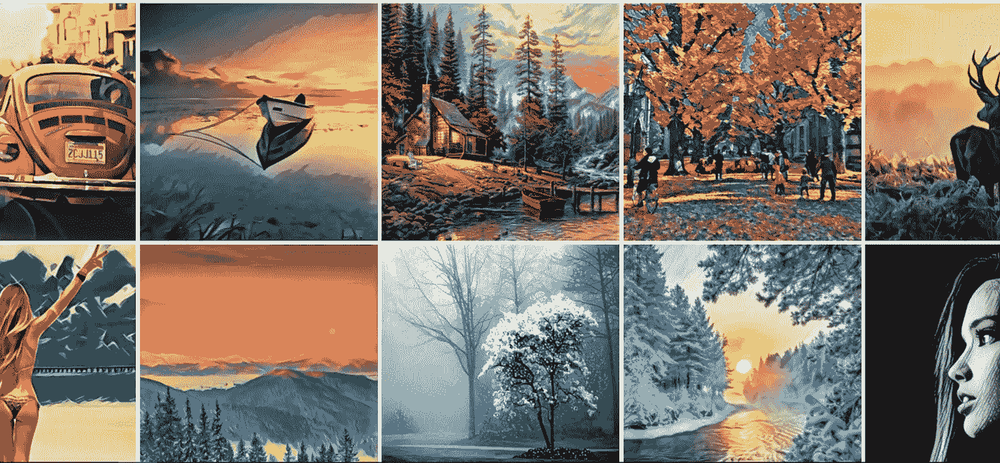

# 用张量流进行神经类型转换的介绍

> 原文：<https://towardsdatascience.com/introduction-to-neural-style-transfer-with-tensorflow-99915a5d624a?source=collection_archive---------18----------------------->

## 学会复制 Prisma 背后的逻辑，生成艺术！


Photo by [Juan Di Nella](https://unsplash.com/@juandinella?utm_source=medium&utm_medium=referral) on [Unsplash](https://unsplash.com?utm_source=medium&utm_medium=referral)

神经风格转移是[卷积神经网络](/introduction-to-convolutional-neural-networks-cnn-with-tensorflow-57e2f4837e18)最具创造性的应用之一。通过拍摄*内容*图像和*风格*图像，神经网络可以将内容和风格图像重新组合，有效地创建*艺术*图像！

这些算法非常灵活，内容和风格的几乎无限可能的组合产生了非常有创意和独特的结果。


Source: [Deeplearning.ai](https://www.deeplearning.ai/)

事实上，一家公司优化了算法，并发布了一款名为 [Prisma，](https://prisma-ai.com/)的移动应用程序，该程序使用神经风格转移将艺术风格应用到从您的手机拍摄的图片上！



Example of generated images using [Prisma](https://prisma-ai.com/)

在这篇文章中，我们将重新创建由 [Gatys *等人*](https://arxiv.org/abs/1508.06576) 提出的算法，以实现如上所示的类似结果。请注意，我是在笔记本电脑上工作的，因此，如果您在 CPU 更好的台式机上工作，结果可能会略有不同。

一如既往，随时查阅[完整笔记本](https://github.com/marcopeix/Deep_Learning_AI/blob/master/4.Convolutional%20Neural%20Networks/4.Special%20Applications%20-%20Facial%20Recognition%20%26%20Neural%20Style%20Transfer/Neural%20Style%20Transfer.ipynb)你有没有被卡住过。

我们开始吧！

> 关于机器学习、深度学习和人工智能的实践视频教程，请查看我的 [YouTube 频道](https://www.youtube.com/channel/UC-0lpiwlftqwC7znCcF83qg?view_as=subscriber)。

Let’s make some art!

# 第一步:装载 VGG-19

从头开始构建算法将需要大量的时间和计算能力，这不是每个人都可以轻易获得的。

相反，我们将加载现有网络的权重来实现神经类型转移。

将神经网络用于不同目的的过程被称为*迁移学习*。

让我们像这样加载模型:

```
model = load_vgg_model(“pretrained-model/imagenet-vgg-verydeep-19.mat”)
```

太好了！现在，我将使用卢浮宫的一张图片作为内容图片。您可以加载任何您想要的图片，但请确保图片不要太大:

```
content_image = scipy.misc.imread(“images/louvre.jpg”)imshow(content_image)
```

在我的例子中，输出如下:


# 步骤 2:定义内容成本函数

为了让我们的算法生成漂亮的图像，我们需要确保生成图像的内容与输入图像的内容相匹配。

换句话说，生成的图像还应该有金字塔、周围的建筑、云彩、太阳等。

因此，我们希望生成的图像和内容图像的层激活相似。因此，内容成本函数可以定义为:


Content cost function

根据上面的等式，n_H 和 n_W 分别是图像的高度和宽度，其中 n_c 是隐藏层中的通道数。

为了计算成本，更有效的方法是*将 3D 体积展开*成 2D 矩阵，因为这将加速计算。


Unrolling the convolution layer to compute the cost. [Source](https://www.deeplearning.ai/)

现在，我们编码这个逻辑:


# 步骤 3:定义风格成本函数

现在，我们需要一个*风格的*图像。就我而言，我将使用莫奈的印象派作品，但也可以随意使用任何其他类型的艺术作品:


Can someone tell me the name of this painting?

定义风格成本函数比定义内容成本函数稍微复杂一些。让我们把它分解成更小的部分。

## 步骤 3.1:定义 Gram 矩阵

样式矩阵也被称为 **Gram 矩阵**，它代表一组向量的点积。

这捕获了每个向量之间的相似性，因为如果两个向量彼此相似，那么它们的点积将会很大，因此克矩阵将会很大。


Gram matrix. [Source](https://www.deeplearning.ai/)

这就是 Gram matrix 如何有效地*测量*图像的风格。

将它写入代码:


## 步骤 3.2:定义风格成本

现在，我们要确保生成的图像和*样式*图像的样式是相似的。

换句话说，我们希望最小化两个 Gram 矩阵之间的距离。这表示为:


Style cost function

逻辑编码:


## 步骤 3.3:分配样式权重

在上一步中，我们只获取了单一图层的样式成本。将所有图层的样式成本结合起来以生成更好的图像将是有用的。

从数学上讲，风格成本变成了:


Combined style cost for all layers

其中*λ*是每层的权重。

因此，我们添加了这个代码单元:


## 第 3.4 步:结合一切

现在，我们简单地将所有内容合并到一个单一的风格成本函数中:


# 步骤 4:定义总成本函数

现在我们有了内容和样式的成本函数，我们可以将两者结合起来，以获得将被优化的总成本函数:


Total cost function

其中*α*和*β*是任意权重。


# 第五步:解决优化问题并生成图像

现在，最精彩的部分！一切就绪，就可以解决优化问题，生成艺术形象了！

在我的例子中，我得到以下结果:


Content image to generated image

当然，如果你训练网络的时间更长，学习率更小，你可以得到好得多的结果。

恭喜你！你刚刚在 TensorFlow 里进行了神经风格转移！可以随意改变内容和样式图像，可以随意调整迭代次数和学习率。

下次见！

来源: [Deeplearning.ai](https://www.deeplearning.ai/)