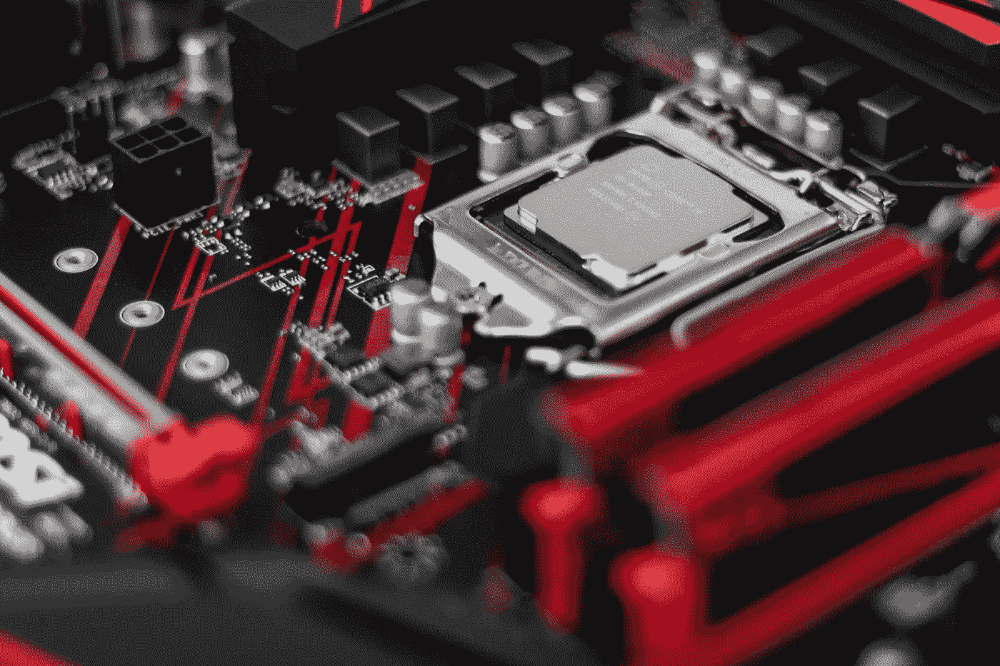

# OpenVINO 简介

> 原文：<https://towardsdatascience.com/introduction-to-openvino-897e705a1f0a?source=collection_archive---------6----------------------->

理解 OpenVINO 工具包功能的综合指南



Photo by [Christian Wiediger](https://unsplash.com/@christianw?utm_source=unsplash&utm_medium=referral&utm_content=creditCopyText) on [Unsplash](https://unsplash.com/s/photos/intel?utm_source=unsplash&utm_medium=referral&utm_content=creditCopyText)

OpenVINO 代表开放视觉推理和神经网络优化。它是英特尔提供的一个工具包，用于促进深度学习模型的更快推理。它帮助开发人员创建具有成本效益且健壮的计算机视觉应用。它在边缘实现深度学习推理，并支持跨计算机视觉加速器(CPU、GPU、英特尔 Movidius 神经计算棒和 FPGA)的异构执行。它支持大量开箱即用的深度学习模型。你可以查看这个[链接](https://github.com/opencv/open_model_zoo)来了解更多关于模型动物园的信息。

# 先决条件

如果您想运行本文末尾提供的代码示例，那么请确保您已经正确下载并配置了 OpenVINO toolkit。

[](https://software.intel.com/en-us/openvino-toolkit/documentation/get-started) [## 开始使用|英特尔发布的 OpenVINO 工具包

### 使用该计算机视觉工具包的资源和培训材料快速上手。

software.intel.com](https://software.intel.com/en-us/openvino-toolkit/documentation/get-started) [](https://software.intel.com/en-us/openvino-toolkit/choose-download) [## 选择并下载|英特尔发布的 OpenVINO 工具包

### 下载英特尔发布的 open vino toolkit for Linux、Windows 或 macOS 版本。

software.intel.com](https://software.intel.com/en-us/openvino-toolkit/choose-download) 

# 概观

执行过程如下—

*   我们将预先训练好的模型输入到模型优化器中。它优化模型并将其转换为中间表示形式(。xml 和。bin 文件)。
*   推理机有助于模型在不同设备上的正确执行。它管理在不同平台上正确运行代码所需的库。

OpenVINO 工具包的两个主要组件是模型优化器和推理引擎。因此，我们将深入了解它们的细节，以便更好地理解它们的角色和内部工作方式。

# 模型优化器

Model optimizer 是一个跨平台的命令行工具，有助于在培训和部署环境之间进行转换。它调整深度学习模型，以便在端点目标设备上实现最佳执行。

## 工作

模型优化器将模型加载到内存中，读取它，构建模型的内部表示，优化它，并产生**中间表示**。中间表示是推理机接受和理解的唯一格式。

> 模型优化器不推断模型。它是一个离线工具，在推理发生之前运行。

模型优化器有两个主要目的:

*   **产生一个有效的中间表示**。模型优化器的主要职责是生成两个文件(。xml 和。bin)，它们形成中间表示。
*   **产生优化的中间表示**。预训练模型包含对训练很重要的层，例如下降层。这些层在推理过程中没有用，可能会增加推理时间。在许多情况下，这些层可以从生成的中间表示中自动移除。但是，如果一组层可以表示为一个数学运算，因此可以表示为一个层，则模型优化器可以识别这种模式，并用一个层来替换这些层。结果是一个比原始模型层数更少的中间表示。这减少了推断时间。

## 操作

1.  **重塑** —

*   模型优化器允许我们重塑输入图像。假设您已经使用 256 * 256 的图像大小训练了您的模型，并且您想要将图像大小转换为 100 * 100，那么您可以简单地将新的图像大小作为命令行参数传递，模型优化器将为您处理剩下的工作。

2.**配料** —

*   我们可以在推理时改变模型的批量大小。我们可以将批处理大小的值作为命令行参数传递。
*   我们也可以像这样传递我们的图像大小[4，3，100，100]。这里，我们指定需要 4 个尺寸为 100*100*3 的图像，即具有 3 个通道且宽度和高度为 100 的 RGB 图像。这里需要注意的重要一点是，现在的推断会更慢，因为我们使用一批 4 张图片进行推断，而不是只使用一张图片。

3.**修改网络结构** —

*   我们可以修改我们网络的结构，也就是说，我们可以从顶部或底部去掉一些层。我们可以指定一个特定的层，从这里开始执行，或者从这里结束执行。

4.**标准化和规模化** —

*   我们可以对输入数据执行标准化(均值减法)和标准化等操作。

## 量化

这是优化过程中的重要一步。大多数深度学习模型通常使用 FP32 格式作为输入数据。FP32 格式消耗大量内存，因此增加了推断时间。因此，直觉上我们可能认为，我们可以通过改变输入数据的格式来减少我们的推理时间。还有各种其他格式，如 FP16 和 INT8，我们可以使用，但我们需要小心执行量化，因为它也可能导致精度损失。

使用 INT8 格式可以帮助我们显著减少推理时间，但目前只有某些层与 INT8 格式兼容:卷积、ReLU、池化、Eltwise 和 Concat。因此，我们本质上执行混合执行，其中一些层使用 FP32 格式，而一些层使用 INT8 格式。有一个单独的层来处理这些转换。也就是说，我们不必明确指定从一层到另一层的类型转换。

校准层处理所有这些复杂的类型转换。它的工作方式如下—

*   最初，我们需要定义一个阈值。它决定了我们愿意接受的准确度下降。
*   然后，校准图层获取数据的子集，并尝试将图层的数据格式从 FP32 转换为 INT8 或 FP16。
*   然后检查精度下降，如果低于指定的阈值，则进行转换。

# 推理机

在使用模型优化器创建中间表示(IR)之后，我们使用推理引擎来推理输入数据。

推理机是一个 C++库，有一组 C++类来推断输入数据(图像)并得到一个结果。C++库提供了一个 API 来读取中间表示，设置输入和输出格式，并在设备上执行模型。

由于推理机的存在，模型的异构执行成为可能。它为不同的设备使用不同的插件。

# 异构插件

*   我们可以在多个设备上执行相同的程序。我们只需要将目标设备作为命令行参数传入，推理引擎会处理剩下的事情，也就是说，我们可以在 CPU、GPU、VPU 或任何其他与 OpenVINO toolkit 兼容的设备上运行相同的代码。
*   我们还可以在不同的设备上执行程序的各个部分，即程序的某些部分可能在 CPU 上运行，而其他部分可能在 FPGA 或 GPU 上运行。如果我们指定 HETERO: FPGA，CPU，那么代码将主要在 FPGA 上运行，但是如果它遇到与 FPGA 不兼容的特定操作，那么它将切换到 CPU。
*   我们还可以在特定设备上执行某些层。假设你想只在你的 GPU 上运行卷积层，那么你可以明确地指定它。
*   这里需要注意的重要一点是，在指定不同的硬件时，我们需要注意数据格式。并非所有设备都支持所有数据类型。例如，配备 Movidius 芯片的神经计算棒 NCS2 不支持 INT8 格式。你可以查看[这个](https://docs.openvinotoolkit.org/latest/_docs_IE_DG_supported_plugins_Supported_Devices.html)链接来获得关于支持的设备及其各自格式的完整信息。

# 代码示例

英特尔提供的原始代码样本可以在[这里](https://github.com/intel-iot-devkit/store-aisle-monitor-python)找到。
我修改了代码样本，使其更简单，我的版本可以在[这里](https://github.com/Dhairya10/people-count-vino)找到。

这里我只解释 OpenVINO 的具体代码。

```
# Initialize the classinfer_network = Network()# Load the network to IE plugin to get shape of input layern, c, h, w = infer_network.load_model(args.model, args.device, 1, 1, 2, args.cpu_extension)[1]
```

我们正在初始化网络类，并使用`load_model`函数加载模型。
`load_model`函数返回插件和输入形状。
我们只需要输入形状，这就是为什么我们在函数调用后指定了[1]。

```
infer_network.exec_net(next_request_id, in_frame)
```

`exec_net`函数将启动一个异步推理请求。
我们需要传入请求 id 和输入框。

```
res = infer_network.get_output(cur_request_id)for obj in res[0][0]: if obj[2] > args.prob_threshold: xmin = int(obj[3] * initial_w) ymin = int(obj[4] * initial_h) xmax = int(obj[5] * initial_w) ymax = int(obj[6] * initial_h) class_id = int(obj[1])
```

这是代码中最重要的部分。
`get_output`函数将给出模型的结果。
每个检测用以下格式表示—
`[image_id,class_label,confidence,x_min,y_min,x_max,y_max]`

这里，我们已经提取了边界框坐标和类 id。

[](https://github.com/Dhairya10/people-count-vino) [## dhairya 10/人数-葡萄酒

### 这个项目使用 Python 和 OpenVINO toolkit 来计算给定帧中的人数。OpenVINO toolkit 是…

github.com](https://github.com/Dhairya10/people-count-vino) 

# 参考

该项目大量借鉴了英特尔 IOT 开发套件的商店通道监视器 python 项目。

[](https://github.com/intel-iot-devkit/store-aisle-monitor-python) [## 英特尔-物联网-开发套件/商店-过道-监视器-python

### 这个参考实现在 C++中也是可用的。这个参考实现计算人数…

github.com](https://github.com/intel-iot-devkit/store-aisle-monitor-python) 

要探索英特尔的其他激动人心的项目，请查看英特尔物联网开发套件。

[](https://github.com/intel-iot-devkit) [## 英特尔物联网开发套件

### 用 C 语言编写的用于低速 IO 通信的 Linux 库，绑定了 C++、Python、Node.js 和 Java。支持通用 io…

github.com](https://github.com/intel-iot-devkit) 

说到这里，我们已经到了这篇文章的结尾。非常感谢你的阅读。

我的 [LinkedIn](https://www.linkedin.com/in/dhairya-kumar/) 、 [Twitter](https://twitter.com/DhairyaKumar16) 和 [Github](https://github.com/Dhairya10) 。
你可以查看我的[网站](https://alpha-dev.in/)了解更多关于我和我的工作。