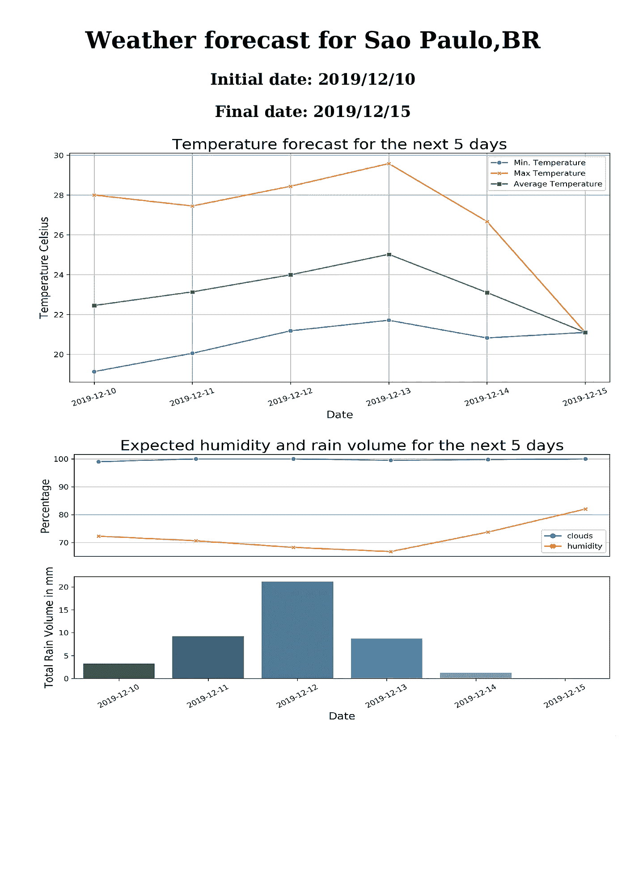
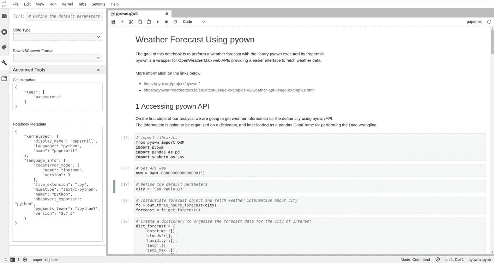
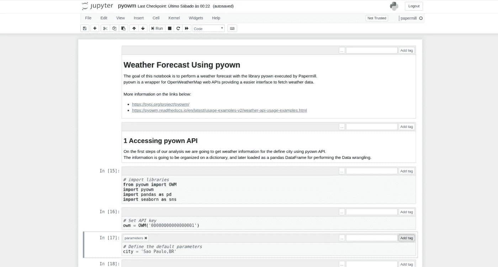

# 造纸厂简介

> 原文：<https://towardsdatascience.com/introduction-to-papermill-2c61f66bea30?source=collection_archive---------3----------------------->

## 如何将您的 Jupyter 笔记本转变为工作流程工具


Figure 1\. Papermill and Jupyter Project logos

# 1.介绍

[Jupyter 笔记本](https://jupyter.org/)是探索性数据分析(EDA)的黄金标准，也是记录数据科学项目的绝佳工具。虽然数据科学家通常在其中迭代工作(不遵循自上而下的单元顺序)，但它可以从第一个到最后一个单元运行，逐步再现数据分析。

使用 Jupyter 笔记本执行重复性任务和 ETL 时出现的一个问题是，它缺乏自动化和日志记录功能。缺乏自动化意味着您必须在需要时打开相应的笔记本并手动运行它，并且缺乏日志记录，您无法控制执行过程中可能出现的错误和异常。

## 1.1 进入造纸厂

[**Papermill**](https://github.com/nteract/papermill) 是一个可以让我们参数化执行笔记本的工具。它在数据工作流工具上通过顺序执行每个单元格来转换您的 Jupyter 笔记本，而无需打开 JupyterLab(或笔记本)。它试图填补自动化和日志记录的空白，为我们提供了一种将笔记本作为文件执行的方式，并为每次执行生成一份报告。

**目标**:本文的目标是集成 Papermill 和 Jupyter 笔记本来创建数据工作流。为了说明这一点，我们将开发一个 Python 笔记本，使用天气预报 API ( [**PyOWM**](https://pyowm.readthedocs.io/en/latest/) )运行一个简单的分析，执行数据辩论，生成一些可视化结果，并创建一个最终报告。

Jupyter 笔记本和其他具有更多数据分析细节的文件可以在 [**GitHub 项目资源库**](https://github.com/GabrielSGoncalves/papermill_medium) **中找到。**要重现分析，您需要安装[**paper mill _ env . YAML**上列出的库。](https://github.com/GabrielSGoncalves/papermill_medium/blob/master/papermill_env.yaml)

# 2.配置我们的开发环境

## 2.1 安装 Papermill 和 JupyterLab

我们将首先使用 Conda **(1，2)** 创建一个开发环境，并安装 JupyterLab 和其他用于分析的库 **(3)** 。

```
**# 1) Create a conda environment** conda create -n papermill python=3.7**# 2) Activate it** conda activate papermill **# 3) Install the libraries using pip (or conda)** pip install papermill pyowm jupyterlab pandas seaborn boto3 pdfkit
```

有关如何使用 [conda](https://docs.conda.io/en/latest/miniconda.html) 和其他开源工具来组织您的项目的更多信息，请查看我以前的文章 [**“创建坚实的数据科学开发环境”。**](/creating-a-solid-data-science-development-environment-60df14ce3a34)

安装 Papermill 后，我们可以通过终端 **(4)** 获得更多信息。

```
**# 4) Papermill Documentation** papermill -hUsage: papermill [OPTIONS] NOTEBOOK_PATH OUTPUT_PATHThis utility executes a single notebook in a subprocess.Papermill takes a source notebook, applies parameters to the source
  notebook, executes the (4)notebook with the specified kernel, and saves the
  output in the destination notebook.The NOTEBOOK_PATH and OUTPUT_PATH can now be replaced by `-` representing
  stdout and stderr, or by the presence of pipe inputs / outputs. Meaning
  that`<generate input>... | papermill | ...<process output>`with `papermill - -` being implied by the pipes will read a notebook from
  stdin and write it out to stdout.Options:
  -p, --parameters TEXT...        Parameters to pass to the parameters cell.
  -r, --parameters_raw TEXT...    Parameters to be read as raw string.
  -f, --parameters_file TEXT      Path to YAML file containing parameters.
  -y, --parameters_yaml TEXT      YAML string to be used as parameters.
  -b, --parameters_base64 TEXT    Base64 encoded YAML string as parameters.
  --inject-input-path             Insert the path of the input notebook as
                                  PAPERMILL_INPUT_PATH as a notebook
                                  parameter.
  --inject-output-path            Insert the path of the output notebook as
                                  PAPERMILL_OUTPUT_PATH as a notebook
                                  parameter.
  --inject-paths                  Insert the paths of input/output notebooks
                                  as
                                  PAPERMILL_INPUT_PATH/PAPERMILL_OUTPUT_PATH
                                  as notebook parameters.
  --engine TEXT                   The execution engine name to use in
                                  evaluating the notebook.
  --request-save-on-cell-execute / --no-request-save-on-cell-execute
                                  Request save notebook after each cell
                                  execution
  --prepare-only / --prepare-execute
                                  Flag for outputting the notebook without
                                  execution, but with parameters applied.
  -k, --kernel TEXT               Name of kernel to run.
  --cwd TEXT                      Working directory to run notebook in.
  --progress-bar / --no-progress-bar
                                  Flag for turning on the progress bar.
  --log-output / --no-log-output  Flag for writing notebook output to the
                                  configured logger.
  --stdout-file FILENAME          File to write notebook stdout output to.
  --stderr-file FILENAME          File to write notebook stderr output to.
  --log-level [NOTSET|DEBUG|INFO|WARNING|ERROR|CRITICAL]
                                  Set log level
  --start_timeout INTEGER         Time in seconds to wait for kernel to start.
  --report-mode / --no-report-mode
                                  Flag for hiding input.
  --version                       Flag for displaying the version.
  -h, --help                      Show this message and exit.
```

正如我们从 [**Papermill 文档**](https://papermill.readthedocs.io/en/latest/) 中看到的，基本用法非常简单，我们只需要提供目标 Jupyter 笔记本的路径和输出笔记本的名称(作为日志工作)。我们将在本文后面探讨一些额外的选项。

## **2.2 安装 Jupyter 内核**

尽管 Jupyter 笔记本以运行 Python 而闻名，但我们可以通过安装不同的内核来使用几乎任何编程语言。有了特定的内核，我们可以在 Papermill 定义的环境中运行我们的笔记本，避免了缺少库的问题 **(5)** 。

```
**# 5) Install Jupyter kernel for papermill environment** pip install ipykernelipython kernel install --user --name=papermill-tutorial
```

# 3.创建工作流

我们将使用 Jupyter 笔记本进行天气预报数据分析。其想法是创建一个简单的工作流，使用名为 [**的 Python API 获取特定城市的数据，执行数据争论，创建一些图表并在 pdf 报告上组织信息。**](https://pyowm.readthedocs.io/en/latest/)

## 3.1 使用 PyOWM 天气 API

如[库主页](https://pyowm.readthedocs.io/en/latest/)所述，“PyOWM 是 OpenWeatherMap web APIs 的客户端 Python 包装库”。它通过提供一个“简单的对象模型”来方便访问天气数据。使用这个库的唯一要求是一个 API 密匙，可以在 [OpenWeather 链接](https://openweathermap.org/appid)上免费获得。

## 3.2 工作流第 1 部分:使用 PyOWM API 获取天气数据

工作流的第一部分包括使用 PyOWM 库获取关于预定义的`city`(圣保罗，BR 在原始笔记本上)的信息。我们迭代`forecast`对象，在 DataFrame 上组织返回的信息，使我们在接下来的步骤中更加轻松。

## 3.3 工作流第 2 部分:使用 PyOWM API 获取天气数据

在工作流程的第二部分，我们将汇总白天的数据，并在一个图中绘制温度信息，在另一个图中绘制降雨、湿度和云量百分比信息。

## **3.4 工作流程第 3 部分:创建 PDF 格式的天气报告**

在我们工作流程的最后一部分，我们将使用为城市和地块收集的数据创建天气报告。我们将使用库 [*pdfkit*](https://pypi.org/project/pdfkit/) 将我们的 HTML 模板转换成 pdf 文件。

## 3.5 使用造纸厂前的最终测试

在我们的 Jupyter 笔记本上完成分析后，建议通过重启内核并运行所有单元来测试工作流( *Run > Run all cells* )。如果我们观察到所有的单元都被成功地执行了，并且输出完全符合我们的预期，那么我们的笔记本就可以和 Papermill 一起使用了。我们的工作流 can 生成的圣保罗市(巴西)的预期天气报告如图 2 所示。在接下来的会话中，我们将配置 Jupyter 笔记本，以接受任何城市作为工作流的参数，并使用 Papermill 自动执行它。



Figure 2\. The weather forecast report created with our workflow for the city of Sao Paulo, BR.

# 4.为 Papermill 配置笔记本

现在我们已经为生产准备好了笔记本，我们只需要对配置进行一些更改，就可以在 Papermill 中使用它了。您可以选择使用 Jupyter Lab 或与 Papermill 集成的 Jupyter Notebook。对于每个平台，带有参数的单元的配置是不同的，因此我们在进行这一步时需要注意。

## **4.1 在 Jupyter Lab 上定义参数**

当使用 Jupyter Lab 运行笔记本时，我们必须为工作流中使用的参数创建一个缺省值的单元格。接下来，我们选择带有参数的单元格，单击*笔记本工具*(左侧面板上的扳手图标)和*高级工具*(图 3) *。*



Figure 3\. Configuring a notebook cell to receive the parameters from Papermill on JupyterLab.

在*单元元数据*框中，我们需要添加以下描述:

```
{
    "tags": [
        "parameters"
    ]
}
```

不要忘记点击方框上方的勾号图标保存它。现在，您的 Jupyter 实验室笔记本已准备好接收来自 Papermill 的参数。

## 4.2 在 Jupyter 笔记本上定义参数

要在 Jupyter 笔记本上配置参数单元格，我们需要点击*视图>单元格工具栏>标签。*然后将标签`parameters`写入并添加到相应的笔记本单元格中(图 4)。



Figure 4\. Configuring a notebook cell to receive the parameters from Papermill on JupyterNotebook.

# 5.执行 Papermill

我们可以通过命令行或者使用 Python API 来执行 Papermill [。](https://papermill.readthedocs.io/en/latest/usage-execute.html#execute-via-the-python-api)为了使用终端运行 Jupyter 笔记本，我们运行命令 **(6):**

```
**# 6) To execute Papermill from the terminal** papermill weather_forecast_using_pyowm.ipynb \
          weather_forecast_using_pyowm_output.ipynb \
          -p city 'Sao Paulo,BR' \
          -k papermill-tutorial
```

前两个参数是目标 Jupyter 笔记本的名称(来自会话 3)和输出笔记本的名称(输入的执行版本)。`-p`代表参数，所以我们描述每个参数的名称及其各自的值(在我们的例子中，我们只有`city`)。最后，`-k`代表内核，我们选择在第 5 步中创建的`papermill-tutorial`内核。

如果我们想要使用 Papermil Python API 来运行相同的过程，我们必须键入以下命令:

## 5.1 输出笔记本

Papermill Python API 可用于将笔记本的执行与其他操作集成在一起。例如，如果在执行过程中出现错误，我们可以解析输出文件，识别问题并将其保存在数据库结构中。

[朱庇特笔记本文件](https://nbformat.readthedocs.io/en/latest/)(。ipynb 扩展)是 JSON 文件，包含每个单元格文本、源代码、输出和元数据的信息。Papermill 会创建一个输出文件，该文件对应于使用用户指定的参数执行的输入笔记本。它基本上包含了记录流程所需的所有信息，这意味着我们可以将它作为类似日志的数据来记录我们的工作流执行。因此，保存输出 JSON 文件的一种方法是使用 NoSQL 键值数据库( [Amazon DynamoDB](https://aws.amazon.com/dynamodb/?nc1=h_ls) 、 [MongoDB](https://www.mongodb.com/) 、 [CassandraDB](http://cassandra.apache.org/) 、 [BigTable](https://cloud.google.com/bigtable/) 等)。

# 6.最后的想法

Papermill 是一个简单方便的工具，可以将 Jupyter 笔记本转换为数据工作流。它扩展了笔记本电脑的使用可能性，打破了可视化/文档环境的障碍，成为一个生产就绪的平台。在创建最终的 ETL 以在更复杂的数据管道工具如 [Airflow](https://github.com/apache/airflow) 或 [Luigi](https://github.com/spotify/luigi) 上运行之前，它可以作为一个快速便捷的工具用于数据工作流的原型化。

我们试图向读者简单介绍 Papermill，但是将该工具与其他资源集成的可能性是无限的。我们相信一个活跃的社区将围绕它成长，将这个项目转化为一个更成熟的工具。

# 非常感谢你阅读我的文章！

*   你可以在我的[个人资料页面](https://medium.com/@gabrielsgoncalves) **找到我的其他文章🔬**
*   如果你喜欢并且**想成为中级会员**，你可以使用我的 [**推荐链接**](https://medium.com/@gabrielsgoncalves/membership) 来支持我👍

# 其他资源

[](/creating-a-solid-data-science-development-environment-60df14ce3a34) [## 创建可靠的数据科学开发环境

### 如何使用 Conda、Git、DVC 和 JupyterLab 来组织和复制您的开发环境。

towardsdatascience.com](/creating-a-solid-data-science-development-environment-60df14ce3a34) [](https://medium.com/capital-fund-management/automated-reports-with-jupyter-notebooks-using-jupytext-and-papermill-619e60c37330) [## 使用 Jupyter 笔记本自动生成报告(使用 Jupytext 和 Papermill)

### Jupyter 笔记本是交互式运行代码和用数据编写叙述的最佳可用工具之一…

medium.com](https://medium.com/capital-fund-management/automated-reports-with-jupyter-notebooks-using-jupytext-and-papermill-619e60c37330) [](https://medium.com/y-data-stories/automating-jupyter-notebooks-with-papermill-4b8543ece92f) [## 使用 Papermill 自动化 Jupyter 笔记本

### Jupyter 笔记本是探索数据、测试假设、协作和报告发现的绝佳方式。与 Jupyter 一起…

medium.com](https://medium.com/y-data-stories/automating-jupyter-notebooks-with-papermill-4b8543ece92f) [](/data-pipelines-luigi-airflow-everything-you-need-to-know-18dc741449b7) [## 数据管道、Luigi、气流:你需要知道的一切

### 这篇文章是基于我最近给同事们做的关于气流的演讲。

towardsdatascience.com](/data-pipelines-luigi-airflow-everything-you-need-to-know-18dc741449b7)