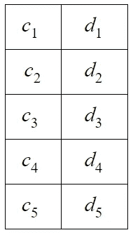
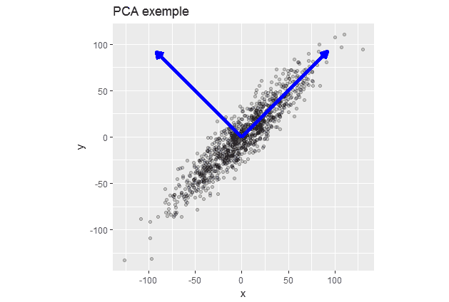
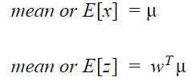
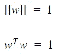
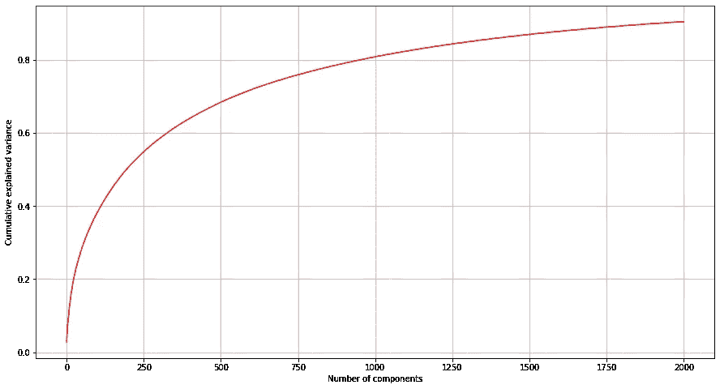

# 主成分分析(PCA)简介-使用 Python 代码

> 原文：<https://towardsdatascience.com/introduction-to-principal-component-analysis-pca-with-python-code-69d3fcf19b57?source=collection_archive---------15----------------------->

## PCA 介绍——原因、时间和方式

## **动机**

想象一个有 100000 个句子的文本数据。文本中唯一单词的总数是 10000(词汇量)。如果每个句子由长度等于词汇大小的向量表示。在这个长度为 10000 的向量中，每个位置属于一个唯一的单词。对于我们这个句子的向量，如果某个词出现 ***k*** 次，那么这个词的索引对应的向量中元素的值就是 ***k*** 。对于词汇表中没有出现在我们句子中的每一个单词，向量元素是 0。这被称为一键编码。

现在，如果我们为这些句子中的每一个创建向量，我们有一组 100000 个向量。在矩阵形式中，我们有一个 100000*10000 大小的矩阵。这意味着我们的矩阵中有 10⁹元素。在 python 中，要估计占用的内存，

```
import numpy as np
import sys
sys.getsizeof(np.zeros((100000,10000)))
>>> 8000000112
```

这个数字以字节为单位，转换成 8000 兆字节。

如果我们能够在一个更小的矩阵上工作，一个具有更少但更重要的特征的矩阵，会怎么样？比方说，大约 100 个特征可以捕获数据的大部分信息。拥有更多功能通常是好事。但是更多的特征通常也包括噪声。噪声会降低任何机器学习算法的鲁棒性，尤其是在小数据集上(阅读**维度的诅咒**了解更多)。此外，我们将节省 100-1000 倍的内存消耗。当您将应用程序部署到生产环境中时，这一点非常重要。

带着这个目的，我们来讨论一下 PCA 是如何帮助我们解决这个问题的。

## 方差作为信息

在机器学习中，我们需要算法的功能来找出有助于区分数据类别的模式。特征的数量越多，差异(数据的变化)就越大，因此模型发现很容易做出“分割”或“边界”。但并不是所有的功能都能提供有用的信息。他们也会有噪音。如果我们的模型开始适应这种随机噪声，它将失去其鲁棒性。事情是这样的— *我们希望从可用的特征空间中组合出* ***m 个*** *特征，以获得最大的方差。注意，我们要组合而不是仅仅选择* ***m*** *特征。*

## 从数学角度来说

假设一个数据点由矢量 ***x*** 表示，原本具有 ***n*** 特征。


vector x

我们的工作是将它转换成一个向量 ***z*** ，维数比*n 少，比如说 ***m****

**

*vector z*

*这是通过**线性变换**实现的。具体来说，我们将一个矩阵乘以 ***x*** ，将其映射到一个 ***m-*** 维空间。考虑一个大小为 ***n*m*** 的矩阵*。使用 ***W*** ，我们希望将 ***x*** 转换为 ***z*** 为—**

****

**PCA transformation. Wt is the transpose of W**

**对上述等式的简单解释—假设您有一个包含列的原始数据框—**

****

**Original Dataframe**

**在 PCA 之后，如果我们选择，比方说 3 个分量，数据帧看起来像这样—**

****

**在哪里，**

****

**c1，c2，..而 d1，d2，…是标量。w 矩阵是**

****

**W — a 5*2 matrix**

**考虑下面的示例图。指向东北的轴沿其方向覆盖了更多的分布。那么第二大“覆盖”轴指向西北。**

****

**Image credits: [https://i1.wp.com/enhancedatascience.com/wp-content/uploads/2017/05/PCA1.png?resize=629%2C424](https://i1.wp.com/enhancedatascience.com/wp-content/uploads/2017/05/PCA1.png?resize=629%2C424)**

## **如何获得 W？**

**上面的描述对于一个关于 PCA 的小对话来说已经足够好了。但是如果你对 W 的计算很好奇，这一节是给你的。如果你对数学不感兴趣，你可以跳过它。**

**我们讨论过 PCA 是关于计算方差最大化的轴。考虑一个**单轴 w** ，我们希望沿着它最大化方差。数学上，**

****

**为了计算方差，我们需要均值。在统计学中，最好称之为期望，用 *E 表示。*随机变量的期望就是它的均值。在我们的例子中，我们将原始特征的期望值 x 表示为μ。对于我们转换后的特征， *z* 我们的期望值是 *wt** μ(见下图)**

****

**如果你感到困惑，参考下面的等式，取 LHS 和 RHS 的平均值**

****

**matrix multiplication is commutative**

**设变换特征的平均值为**

****

**随机变量 z 的样本方差由下式给出:**

****

**用期望和从期望操作中取出 *w* 来表示(因为它是一个常数，不依赖于 *z***

****

**原来， *z* 的方差就是*wt * x(sigma)* w*的协方差。协方差是多维随机变量的方差，在我们的例子中是 *x* 。它是一个大小为 *k*k* 的方阵，其中 *k* 是 *x* 的尺寸。是一个**对称矩阵**。[关于协方差矩阵的更多信息](https://stattrek.com/matrix-algebra/covariance-matrix.aspx)**

**在我们最大化方差之前，我们对我们的 *w* 矩阵的范数施加一个重要的条件。标准应该是 1**

****

**Norm = 1**

**为什么？否则，最大化方差的简单方法就是增加范数，而不是以最大化方差的方式重新调整主轴。这个条件包括使用拉格朗日乘数**

****

**如果我们对上面的表达式求导，我们得到—**

****

**看看最后一个表情。协方差矩阵乘以 *w* 等于标量α乘以 *w* 。这意味着， *w* 是协方差矩阵的**特征向量**，α是对应的**特征值**。利用这个结果，**

****

**var(z) is the eigenvalue**

**如果要使 *var(z)* 最大化，那么α必须是所有特征值中最大的。并且对应的特征向量是主分量**

***这为我们提供了第一个主成分，与任何其他成分相比，沿着该主成分解释的方差是最大的。以上是第一个轴的推导。类似地导出其他轴。重点是深入研究 PCA 背后的数学。***

## **数学说够了！给我看看代码**

**我们使用的数据集是 Coursera 的课程评论，可在 [Kaggle](https://www.kaggle.com/septa97/100k-courseras-course-reviews-dataset) 上获得。这个练习的代码可以在我的 [GitHub](https://github.com/DhruvilKarani/PCA-blog-notebook/blob/master/PCA.ipynb) repo 上找到。**

**顾名思义，由评论(句子)和评分(1，2，3，4，5)组成。我们收集了 50，000 条评论，使用 **TF-IDF** 对它们进行清理和矢量化。**

****TF-IDF** 是一种给句子中的每个单词分配分数的评分方法。如果该词在所有评论中不常出现，但在总体上频繁出现，则得分高。比如*课程*这个词出现频率很高，但是几乎每隔一个复习就出现一次。所以这个词的 TF-IDF 分数会在下面。另一方面，*差*这个词出现频率很高，而且只针对负面评论。所以它的分数更高。**

**因此，对于每次审查，我们有固定长度的 TF-IDF 向量。向量的长度就是词汇量的大小。在我们的例子中，TF-IDF 矩阵的大小为 50000*5000。而且 99%以上的元素都是 0。因为如果一个句子有 10 个单词，5000 中只有 10 个元素是非零的。**

**我们使用主成分分析来降低维数。*但是怎么决定要带多少组件呢？***

**让我们来看一下解释的方差图与组件或轴数的关系**

****

**Variance explained vs the number of components**

**如您所见，前 250 个组件解释了 50%的变化。前 500 个组件占 70%。如您所见，增量收益减少了。当然，如果你取 5000 个组件，解释的方差将是 100%。但是那么做 PCA 有什么意义呢？**

**— — — —**

**我已经开始了我的个人博客，我不打算在媒体上写更多令人惊叹的文章。通过订阅[帮助空间](https://thenlp.space/)来支持我的博客**