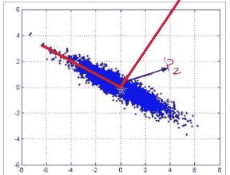
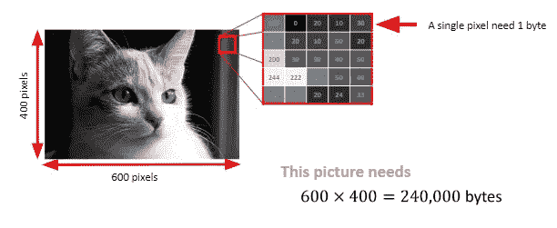

# 主成分分析导论

> 原文：<https://towardsdatascience.com/introduction-to-principle-component-analysis-d705d27b88b6?source=collection_archive---------15----------------------->

*由 In Visal，Yin Seng，Choung Chamnab & Buoy Rina 撰写—本文于 2019 年 7 月 20 日提交给“脸书开发商圈:金边”小组。这里是原幻灯片包—*

# **为什么是 PCA？**

**据 DataCamp 称，可通过以下方式查看五氯苯甲醚:**

*   **应用线性代数中更有用的方法之一**
*   **从混乱的数据集中提取有意义信息的非参数方法**
*   **揭示数据背后隐藏的低维结构**
*   **这些结构更容易可视化，并且通常可以被内容专家解释**

# **形式定义**

**根据维基百科:**

**“主成分分析(PCA)是一种统计过程，它使用正交变换将一组可能相关的变量(每个变量都具有不同数值的实体)的观察值转换为一组称为主成分的线性不相关变量的值。”**

**对上述定义的第一反应是“管它呢？”。**

**从我的经验来看，任何数学或统计定理的正式定义一开始都是难以理解和令人生畏的。这并不是因为这些定义含糊不清，而是因为我们最初缺乏对主题的理解。在掌握和理解了这个主题之后，我们将会体会到形式定义的简洁。**

# **正交投影**

**在深入 PCA 的计算之前，让我们回顾一下作为 PCA 支柱的正交投影概念。**

****

**Illustration of orthogonal projection**

*   **Ai 向量在主分量上的投影通过勾股定理将剩余方差与残差平方联系起来。**
*   **选择最大化方差的分量与选择最小化残差平方和的分量是一样的。**

****

**Maximising variance = minimizing the residuals**

*   **在 ***分量 x*** 上的投影具有比 ***分量*** 和 ***分量 y.*** 更小的损失方差**
*   **在 ***分量 y*** 上的投影比 ***分量*** 和 ***分量 x.*** 具有更高的损失方差**

# **计算主成分**

**根据下面的散点图，X1 和 X2 是数据集的特征。这个数据集的主要成分的方向是什么？**

****

**Raw dataset**

**可通过以下步骤计算 PCA:**

1.  **从质心(Xavg，Yavg)开始**
2.  **确定投影误差/残差之和最小化的方向。我们称之为“第一”主成分。**
3.  **“第二”主分量是与第一主分量正交的方向。**

**这是一个 ***顺序*** 算法。**

****

**Step-1 & Step-2**

****

**Step-3**

**还有另外两种更好的算法来计算 PCA:**

1.  **样本协方差矩阵的特征分解**
2.  **数据矩阵的奇异值分解(下一节)**

# **在 Scikit Learn 中计算 PCA**

**使用 sklearn.decomposition 包中的 PCA 函数可以很容易地计算 PCA。**

**我们首先从 sklearn.decomposition 导入 PCA，并初始化数据 2D numpy 数组。**

****

**Import PCA function and initialize data array**

**接下来，我们通过设置 n_components = 2 来创建一个名为“pca”的 PCA 对象。需要数据作为输入参数的 Fit()方法执行 PCA 计算。**

****

**一旦“pca”对象适合输入数据，它现在可以用于通过“变换”功能将数据变换成主成分。**

****

**The principal components of the data**

**我们可以通过提取已解释的方差来对分量的显著性进行排序。**

*   **解释的方差越高，该成分越重要。**
*   **具有较小解释方差的分量可以被丢弃，而不会丢失重要信息。**

****

**Extracting the components ‘ explained variance**

****

**Histogram of the components’ explained variance**

# **从 Numpy SVD 计算 PCA**

**计算 PCA 的另一种方法是使用 Numpy 对原始数据执行奇异值分解(SVD)。**

****

**SVD**

**我们首先导入整个 Numpy 库，并应用线性代数模块中的‘SVD’函数。“svd”函数返回三个矩阵 U、S 和 Vt。**

****

**主成分是通过取 U 和 s 的点积得到的。**

****

**The principal components = dot product of U and S**

# **应用程序**

## **MNIST 数据集的 2D 可视化**

*   **数据集包含手写数字的图像:10 个类别，每个类别指一个数字。**
*   **代表数字的 8×8 图像的 1797 个样本和 64 个特征**

****

**MNIST images**

**因为有 64 个特征，所以不可能可视化特征关系。PCA 通过将 64 维特征空间减少到 2D 空间(2 个主成分)来拯救我们。**

**为此，我们从 sklearn.datasets 导入 load_digits 并创建一个名为“pca”的 PCA 对象。n_components 设置为 2。通过调用“fit_transform”函数来获得主分量，该函数执行计算并返回主分量。然后，将得到的主成分进行交会图。**

****

**Performing PCA on MNIST dataset**

****

**Cross-plot of principal component 1 and 2**

## **MNIST 数据集的降维**

**为了证明主成分分析在降低特征空间维数方面的鲁棒性，我们在 MNIST 数据集上执行了两种情况的 SVM 分类，并比较了结果的准确性。**

*   **情况 1:使用原始的 64 个特征来分类 MNIST 数字。**
*   **案例 2:使用 10 个主成分对 MNIST 数字进行分类。**

**如下图，精度差只有~1%。**

****

**SVM classification — Case 1**

****

**SVM classification — Case 2**

## **图像压缩**

**PCA 的另一个有趣的应用是图像压缩(有损！).如下图，400*600 像素的图像需要 240000 字节来存储。**

****

**240,000 bytes required to store an image of 400*600 pixels**

**我们可以对原始图像应用 SVD，并截断不太重要的分量。在这种情况下，400 个主成分中只有 50 个被保留，其余的被截断。**

****

**Applying SVD on the original image and keeping only the top 50 components**

**通过仅使用前 50 个组件，存储压缩图像所需的存储器仅为 50，050 字节。**

****

**Only 50,050 bytes required to store**

**下面给出了使用 SVD 执行图像压缩的 Python 代码:**

****

**Image compression with SVD**

**下图显示了随着保留组件数量(k)的增加，图像质量的变化。正如所料，k 越高，图像质量越好，所需内存也越高。保留组件的最佳数量(k)是一个主观问题，并且是特定于应用的。**

****

# **总结**

**PCA 是应用线性代数的迷人案例之一，它在数据科学中有更多的应用，超出了本文的范围。我们不太可能需要从头开始编写 PCA 代码；然而，当我们需要使用机器学习库来使用 PCA 时，对 PCA 如何工作有一个坚实的理解将是有用的。**

**特别感谢主要贡献者 Visal 的*、Yin Seng、Choung Chamnab* ,是他们使这项工作成为可能。**