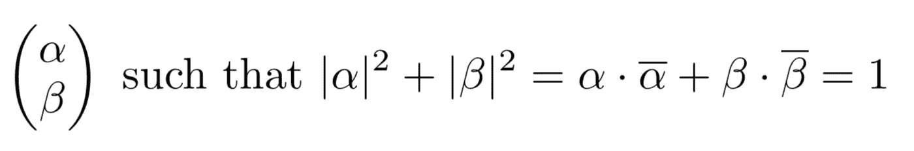

# 量子编程导论

> 原文：<https://towardsdatascience.com/introduction-to-quantum-programming-a19aa0b923a9?source=collection_archive---------0----------------------->

## 从量子位到运行真正的量子程序的量子编程演练！


Quantum Computer — Courtesy of Rigetti

问终极电脑存在！量子编程也是！在本文中，我将带您了解开始量子编程所需要知道的一切。我将从一些关于量子计算机与你的笔记本电脑等计算机有何不同的背景开始，然后解释量子编程的基础，并以你今天如何在真正的量子计算机上免费运行程序结束。

在我们开始之前，请注意这篇文章是为那些想学习量子编程全部技术细节的人准备的。这篇文章建立在量子位、量子门和量子电路图的数学基础之上。本文将不解释量子算法或它们的优点，因为那些主题值得它们自己的文章。

因为我们将通过量子编程的基础数学，读者将需要知道什么是向量、矩阵、线性组合和复数。我推荐 [3Blue1Brown](https://youtu.be/fNk_zzaMoSs) 学习线性代数，推荐 [BetterExplained](https://betterexplained.com/articles/a-visual-intuitive-guide-to-imaginary-numbers/) 学习什么是复数。

# 量子计算机

让我们从理解量子计算机到底是什么以及它们与其他计算机有何不同开始。

> 量子计算机是一种使用量子力学进行计算的机器。

那么这和其他电脑有什么不同呢？嗯，计算机，就其最基本的形式而言，只是一种执行计算的机器。有许多不同类型的计算机。在计算机的早期，我们实际上有机械计算机——查尔斯·巴贝奇在 1837 年设计了这样一台[机器](https://en.wikipedia.org/wiki/Analytical_Engine)来执行通用计算。如今，我们的计算机是基于数字电子技术，使用比特和逻辑门操作。相反，量子计算机使用量子力学来执行计算。量子计算机使用的不是比特和逻辑门，而是量子比特和量子门。

那么什么是量子位和量子门呢？在物理上，它们可以是许多不同事物中的任何一种——谷歌、IBM、微软和 Rigetti 都有自己的量子位和量子门实现。目前，我们不会担心量子位和量子门的物理性质，因为在最初学习量子编程时这是不必要的。

# 量子编程

在我们开始之前，我强烈推荐你在 ***干净的精神石板*** 上接近量子编程。不要去寻找如何声明和设置变量，循环代码，创建函数等。你对编程的任何先入之见可能 ***不会*** 有用。量子编程不仅仅是让我们现有的程序运行得更快的某种方式——量子编程与当代编程有着根本的不同。

## 理解量子位

先说 ***什么是*** 一个量子位。

> 一个量子位是两个单位长度复数的向量。

让我们看看 ***为什么*** 量子位是这样的，以及*的真正含义。量子位与比特有很大不同。对于初学者来说，一个位要么是 0，要么是 1。这里没有概率，要么已知是 0，要么已知是 1。相反，一个量子位天生就是概率性的，这意味着两个 ***相同的*** 量子位一旦被测量，可能会有 ***不同的*** 值！花点时间认真考虑一下这件事的严重性。这意味着量子计算天生就是概率性的。*

*这是第二个关键区别。有了位，我们可以任意多次读取该位，而不会影响该位的状态。但是有了量子比特，一旦被测量，它 ***解聚*** (失去量子属性)，坍缩到两个可测量状态中的一个(因此才有了‘量子比特’中的‘比特’)。因此，我们不能“不测量”一个量子位；一旦测得，量子性质为 ***被破坏*** 无法恢复。我们使用两个数字来量化测量量子位的概率性质:|𝛼|，量子位被测量为 0 的概率，和|𝛽|，量子位被测量为 1 的概率。*

*尽管|𝛼|和|𝛽|反映了量子位将被 ***测量为*** 的概率，我们认为一个量子位的内部*状态是两个“概率振幅”，𝛼和𝛽.这些是复数，定义了 0 和 1 之间的叠加(叠加是线性组合)，不能测量*。***

***换句话说，我们把一个量子位想象成两个单位长度复数的向量(向量的长度等于 1)。我们可以简明地用下图所示的数学来表达这一点(包含α和β的向量就是量子位；α和β上方的柱表示复共轭):***

******

***概括地说，量子位是两个复数的向量，𝛼和𝛽，其中向量有单位长度。量子位被测量为 0 的概率等于|𝛼|𝛼的平方。量子位被测量为 1 的概率等于|𝛽|𝛽的平方。一个量子位的状态，𝛼和𝛽，是无法测量的。只有一个量子位坍缩成的值才能被测量。***

## ***量子位符号***

***我们经常用 ***狄拉克符号*** 来表示量子位，也称为 ***布拉基特符号*** 。这种符号只是写向量的一种方便的方法。bra 表示行向量，记为`⟨ ∣`；ket 代表列向量，被标为`∣ ⟩`。例如，我们可以用 Bra-ket 符号写一个量子位的‘0’和‘1’状态如下(注意不要把 bra/ket 里面的东西和 vector 里面的东西搞混了！):***

****

**量子位既可以处于 ***纯态*** 也可以处于 ***混合态*** 。如果一个量子位的状态可以用`∣0⟩`和`∣1⟩`的线性组合来完全描述，那么我们说它处于纯态。我们通常用以下符号表示纯态量子位:**

****

**这里有一些纯态量子位的例子和表示它们的常用简写。**

****

**其他量子比特需要纯态的混合才能完整描述，所以我们称之为混合态量子比特。换句话说，混合态量子位由纯态的概率分布来描述。我们将在本文后面看到一个混合态量子位的例子(我会指出来)。**

## **多量子位**

**到目前为止，我们只定义了单个量子位的状态。多个量子位 的组合 ***态是什么样子的？*****

> **多个量子位的组合状态是所有量子位的张量积。**

**不知道张量积是什么也不用担心；我们将通过一个例子(⊗是张量积运算的符号)。**

****

**一般来说，我们可以通过以下两个步骤来张量积任何两个矩阵:**

1.  **标量将第一个矩阵中的每个元素乘以整个第二个矩阵**
2.  **根据元素的原始位置组合生成的矩阵**

**下面是第二个例子，说明它如何适用于二维矩阵:**

****

**例如，我们也可以用 Bra-ket 符号表示多个量子位为`∣0⟩⊗∣1⟩`。作为速记，我们可以省略⊗，只写`∣0⟩∣1⟩`。作为更短的速记，我们可以只写一个偈，`∣01⟩`。**

## **理解量子门**

**现在让我们考虑一下 ***什么是*** 量子门。**

> **量子门是酉矩阵。**

**让我们来了解一下 ***为什么*** 量子门是酉矩阵。首先，量子门将由物理设备实现，因此它们必须遵守量子物理定律。一个相关的物理定律是，当在过去和未来之间转换时，信息不会丢失。这就是所谓的[单一性](https://en.wikipedia.org/wiki/Unitarity_(physics))。既然我们的量子门定义了我们如何在状态间转换，它们也必须遵守么正性。**

**其次，注意我们的量子门将应用于量子比特。我们之前了解到量子位实际上只是向量，因此这意味着量子门必须以某种方式对向量进行操作。幸运的是，我们记得矩阵实际上只是向量的线性变换！**

**结合这两个想法，我们把量子门想象成 ***酉矩阵*** 。酉矩阵是任意复数方阵，使得 ***共轭转置*** 等于其 ***逆*** 。快速复习一下，矩阵的共轭转置是通过取矩阵中每个元素的共轭(`a + bi` → `a — bi`)，然后取矩阵的转置(元素 ij →元素 ji)得到的。我们通常用匕首表示共轭转置。**

**关于酉矩阵的一个关键观察是，它们 ***保持范数*** (向量的长度)。假设我们允许改变常态的门，那麽我们量子位元的机率总和可能不是 1！这没有意义，因为所有概率的总和必须总是等于 1。**

**还要注意，根据定义，酉矩阵有一个逆。这意味着我们不能将量子比特“分配”到任意的状态。为了理解为什么不能，让我们假设我们确实有一个量子门，可以“分配”值，因此，将两个复数的任何向量转换为两个复数的特定向量。这个量子门将会有一些作为酉矩阵的基本表示，而这个矩阵将会有一个逆，能够将一个特定的向量转换回运算前量子位的任何状态！但是量子位在手术前可能处于任何状态，没有办法知道是哪种状态！因此，我们无法将量子位元「指派」到任意的状态。在更高的层面上，所有量子门都是*可逆的事实，就是为什么我们经常把量子计算看成是 ***可逆计算*** 的一种形式。***

**最后，请注意，因为我们的量子门是酉矩阵，根据定义，它们是 ***方*** ，所以我们的量子门必须具有 ***相等的*** 个输入和输出量子位(因为方矩阵将 n 个标准基向量映射到 n 列)！这与大多数逻辑门大相径庭；例如，[和](https://en.wikipedia.org/wiki/AND_gate)门接受两个输入并产生一个输出。**

## **H 和 CNOT 量子门**

**现在我们知道了一点我们正在做的事情，让我们考虑一个例子， ***哈达玛门*** ，h**

****

**我们可以通过检查共轭转置等于其逆矩阵来检查 H 是否是酉的，或者换句话说，H 乘以其共轭转置等于单位矩阵:**

****

**另一个重要的量子门是 ***受控非门*** ，也被称为 CNOT。CNOT 作用于两个量子位，一个控制量子位和一个目标量子位。我们可以把 CNOT 想象成一个***‘if 语句’***——如果控制量子位等于 1，那么 CNOT 对目标量子位应用 NOT(逆门)(因此得名，受控 NOT)。**

**这是代表 CNOT 的矩阵。这个矩阵将控制量子位视为 ket 中最右边的值，将目标量子位视为最左边的值。**

****

**我们来看看它对`∣00⟩`的影响。**

****

**在这个例子中，我们看到 CNOT 没有修改`∣00⟩`的值。这是预期的行为，因为 CNOT 只在控件为 1 时反转目标。**

**让我们看看它对`∣01⟩`的影响。**

****

**在这里，我们可以看到控制等于 1，所以 CNOT 反转目标。因此，结果是`∣11⟩`。**

**试着解决另外两种情况，`∣10⟩`和`∣11⟩`。你应该发现 CNOT 有以下行为:**

*   **`∣00⟩ -> ∣00⟩`**
*   **`∣01⟩ -> ∣11⟩`**
*   **`∣10⟩ -> ∣10⟩`**
*   **`∣11⟩ -> ∣01⟩`**

**请注意，当控制位为 1 时，这正是对目标位应用 NOT 的行为。**

**概括地说，我们可以把量子门想象成酉矩阵。这种单一性加强了一个量子位的概率总和为 1 的约束，并使量子计算是可逆的。由于酉矩阵是正方形的，我们发现量子门必须有相等数量的输入和输出量子位。我们学习了哈达玛和 CNOT，这是两个重要的量子门。存在更多的量子门。**

## **量子电路图**

**现在我们知道了量子位和量子门的基础知识，让我们来看看我们的第一个量子电路图。**

****

**量子电路图是我们思考量子“程序”的方式。我们将量子位定义为行，从左到右依次应用量子门。**

**让我们看一下这张图的每一部分。首先，我们有两个量子位。每行对应一个量子位。顶行对应于名为 x0 的量子位，而底行对应于名为 x1 的量子位。我们认为 x0 是第 0 个量子位，因为我们从 0 开始计数(与编程的其余部分相同)。我们将`x0 : ∣0⟩`和`x1 : ∣0⟩` 写成表示`x0`和`x1`从状态`∣0⟩`开始。**

**`H`是 Hadamard 门，被应用于量子位 x0。`●-⊕`是 CNOT 门，`●`是控制量子位，`⊕`是目标量子位。`-`只是帮助我们看到哪两个量子位受到影响。换句话说，我们正在应用 CNOT，其中控制是量子位 x0，目标是 x1。注意，我们应用这些门的顺序很重要。在这个图表中，我们首先应用了 H，然后应用了 CNOT。**

## **翻译量子电路图**

**量子电路图只是我们程序的一种表示。它帮助我们思考我们的量子计算，但其他表示也可能是有用的。我们可以把我们的图表翻译成一串符号，这有助于我们准备把它写成计算机代码。以字符串的形式存在也使得它很容易转化为底层的数学。这个数学将告诉我们程序的预期输出。**

**让我们从将图表转换成一串符号开始。我们将使用 Bra-ket 符号，而不是将量子位写成行。第 0 个量子位将是`∣00⟩`中最右边的量子位，就像写出二进制数时一样。这意味着量子位 x1 是`∣00⟩`中最左边的量子位。(注意，量子物理的人倾向于颠倒这种顺序。总是检查量子位排序，因为它是 ***难以置信的*** 常见错误来源。)**

**我们还需要翻译大门。由于我们将`H`应用于量子位 x0，而不对量子位 x1 应用任何东西(这相当于应用了身份门`I`)，我们将把它写成`(I⊗H)`。最后，我们翻译 CNOT，指定哪个量子位是控制，哪个是目标。结果是`CNOT[control=0, target=1] (I⊗H) ∣00⟩` (注意，这个字符串是从*右向左读取的)。太好了！这在编写量子计算机上运行的代码时会很有用。***

## ***写出潜在的数学***

***有了量子电路图的字符串表示，就很容易把我们的程序翻译成底层的数学。有三件，`CNOT[control=0, target=1]`、`(I⊗H)`和`∣00⟩`。每个片段都可以转换成矩阵，如下图的第一行所示:***

******

***我们甚至可以将矩阵相乘来找到结果状态向量，如上所示。这个状态向量就是量子计算完成后，我们两个量子位的预期状态。或者，我们可以认为它是我们程序的输出。它告诉我们每个可测状态的概率幅度。***

***还有，还记得我们的混合态量子比特吗？注意，我们不能再写纯态的量子位 x0 和 x1，因为没有办法用张量积分解矢量。所以我们的量子位处于混合状态！***

## ***测量状态向量***

***如果我们现在测量我们的量子位会怎么样？我们会收到什么？我们可以通过将状态向量分解成每个可测状态来找出答案。我们将在 ***标准基*** 中测量我们的量子位，也称为`∣0⟩`和`∣1⟩`(我们可以在其他基中测量，但现在不用担心)。因此，我们的两个量子位系统的可测量状态是`∣00⟩`、`∣01⟩`、`∣10⟩`和`∣11⟩`。***

****

**我们可以确定测量值的概率，就像我们 used|𝛼|确定单个量子位的`∣0⟩`的概率一样。由于`∣01⟩`和`∣10⟩`的概率幅度为 0，我们知道我们永远无法测量那个状态。并且我们将以概率(1/sqrt(2)) = 1/2 来度量`∣00⟩`和`∣11⟩`。**

**现在，假设我们把这两个量子位分开一个很大的距离，然后我们测量其中一个。当我们测量它的时候，我们也会知道另一个量子位的值！这是因为我们知道量子位只能是`∣00⟩`或者`∣11⟩`。**

**这就是爱因斯坦所说的‘幽灵般的超距作用’，也被称为 ***量子纠缠*** 。我们认为信息是相互关联的，而不是相互传播的。如果它在旅行，那么它可能会比光速更快，这打破了物理定律。**

# **运行在量子计算机上**

**现在我们已经了解了量子位、量子门和量子电路图的幕后发生的事情，让我们看看如何在真正的量子计算机上运行。我将使用 Rigetti 的量子计算机，因为他们目前正在向 beta 用户发放免费积分。或者，我们也可以使用 [IBM 的量子计算机](https://www.research.ibm.com/ibm-q/technology/experience/)。**

**以下是 Rigetti 量子编程过程的基本概述:**

1.  **写一个 Python 程序，指定你的量子电路和任何必要的附加代码**
2.  **使用量子模拟器测试 Python 程序**
3.  **在里盖蒂的量子计算机上预留时间**
4.  **把你的程序发送到里盖蒂的服务器上**
5.  **在 Rigetti 的服务器上执行你的程序(他们会把你的量子程序发给他们的量子计算机)**

**这是我们上面的量子电路图的 Python 版本。**

**结果将与此类似:**

```
**[(0, 0), (1, 1), (1, 1), (0, 0), (0, 0), (0, 0), (1, 1), (0, 0), (0, 0), (1, 1)]
[(0, 0), (0, 1), (1, 1), (1, 1), (1, 1), (0, 0), (0, 0), (1, 1), (1, 0), (0, 0)]**
```

**第一行对应于模拟器，结果似乎是合理的——大约一半时间我们得到[0，0],其余时间得到[1，1]。但是，用真正的量子计算机，除了预期的[0，0]和[1，1]，我们还接收到[0，1]和[1，0]。根据数学，我们应该只接收[0，0]和[1，1]，那么这是怎么回事呢？**

**问题是今天(2019 年 7 月)真正的量子计算机仍然很容易出错。⁴举例来说，当我们试图将量子位初始化为 0 时，我们可能会看到 2–3%的错误率。每一个单量子比特的门操作可能会有 1-2%的错误率，而两量子比特的门操作可能会有 3-4%的错误率。在测量量子位时，我们甚至有误差率！实际上，这些误差累积起来会导致不正确的值。**

# **关闭**

**在这篇文章中，我们了解到量子计算机今天确实存在并工作，尽管错误率相当高。虽然这些机器的物理实现在不同的公司之间有很大的不同，但是对它们进行编程的许多概念是相同的。**

**我们认为量子位是两个单位长度的复数的向量，我们认为量子门是酉矩阵。我们记得量子计算是概率性的，因为两个相同的量子位一旦被测量就可能有不同的值。由于量子门是酉的，我们知道量子计算本质上是可逆的。在高层次上，我们可以将量子编程视为复数上的应用线性代数。**

**我们使用量子电路图来表示我们的量子程序，然后将其转换为 Python，以便在真实的量子计算机上运行。**

**我希望你学到了一些东西，我很高兴听到你的任何意见或建议！**

## **常见问题解答**

**问:我用谷歌搜索了 CNOT 的矩阵表，它看起来和你的不一样，为什么？**

**a)如果你在看[[1，0，0，0]，[0，1，0，0]，[0，0，0，1]，[0，0，1，0]]，这是因为他们颠倒了目标和控制量子位的排序。如果你看到的不是我在上面或者这篇文章里写的，那么它就是错的。**

**问:那么我们有了常规计算机的比特和三比特，量子比特是否存在类似的东西？**

**a)是的，qutrits。量子位是两能级量子系统的一部分。量子是三能级量子系统的一部分。还有 qudits，它概括了级别的数量。**

## **参考**

**[1] L. Susskind，[第一讲量子纠缠，第一部分](https://www.youtube.com/watch?v=0Eeuqh9QfNI&feature=youtu.be&t=2745) (2008)**

**[2][Qiskit 中的基向量排序](https://qiskit.org/documentation/terra/summary_of_quantum_operations.html#basis-vector-ordering-in-qiskit) (2019)，Qiskit**

**[3]r·史密斯，[有人大喊“01000”！谁激动了？](https://arxiv.org/pdf/1711.02086.pdf) (2017)，arxiv**

**[4] [量子比特质量](https://quantumcomputingreport.com/scorecards/qubit-quality/) (2019)，量子计算报告**