# 推荐系统简介

> 原文：<https://towardsdatascience.com/introduction-to-recommender-systems-6c66cf15ada?source=collection_archive---------0----------------------->

## 几种主要推荐算法综述。

Credit: [StockSnap](https://pixabay.com/fr/users/stocksnap-894430/?utm_source=link-attribution&utm_medium=referral&utm_campaign=image&utm_content=2596809) on [Pixabay](https://pixabay.com/)

*本帖与* [*约瑟夫·罗卡*](https://medium.com/u/b17ebd108358?source=post_page-----6c66cf15ada--------------------------------) *共同撰写。*

# 介绍

在过去的几十年里，随着 Youtube、亚马逊、网飞和许多其他类似的网络服务的兴起，推荐系统在我们的生活中占据了越来越多的位置。从电子商务(向买家推荐他们可能感兴趣的文章)到在线广告(向用户推荐合适的内容，符合他们的偏好)，推荐系统在我们日常的在线旅程中是不可避免的。

一般来说，推荐系统是一种算法，旨在向用户建议相关的项目(项目可以是要看的电影、要读的文本、要买的产品或任何其他取决于行业的东西)。

推荐系统在一些行业中非常重要，因为当它们有效时，可以产生大量的收入，或者是从竞争对手中脱颖而出的一种方式。作为推荐系统重要性的证明，我们可以提到，几年前，网飞组织了一次挑战(“网飞奖”)，目标是产生一个比自己的算法性能更好的推荐系统，并赢得 100 万美元的奖金。

在这篇文章中，我们将介绍推荐系统的不同范例。对于它们中的每一个，我们将介绍它们是如何工作的，描述它们的理论基础并讨论它们的优点和缺点。

## 概述

在第一部分，我们将概述推荐系统的两个主要范例:协作和基于内容的方法。接下来的两节将描述各种各样的协同过滤方法，比如用户-用户、项目-项目和矩阵分解。下一节将专门介绍基于内容的方法及其工作原理。最后，我们将讨论如何评估一个推荐系统。

# 协作与内容

推荐系统的目的是向用户推荐相关的项目。为了完成这个任务，存在两大类方法:协同过滤方法和基于内容的方法。在深入研究特定算法的细节之前，让我们简单讨论一下这两个主要范例。

## 协同过滤方法

用于推荐系统的协作方法是仅基于用户和项目之间记录的过去交互来产生新推荐的方法。这些交互存储在所谓的“用户-项目交互矩阵”中。

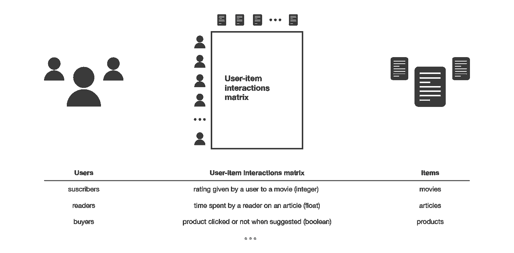

Illustration of the user-item interactions matrix.

然后，规则协作方法的主要思想是，这些过去的用户-项目交互足以检测相似的用户和/或相似的项目，并基于这些估计的接近度做出预测。

协同过滤算法类分为两个子类别，一般称为基于记忆和基于模型的方法。基于记忆的方法直接与记录的交互值一起工作，假设没有模型，并且本质上基于最近邻居搜索(例如，从感兴趣的用户中找到最近的用户，并且在这些邻居中建议最受欢迎的项目)。基于模型的方法假设一个潜在的“生成”模型，该模型解释用户-项目交互并试图发现它以便做出新的预测。

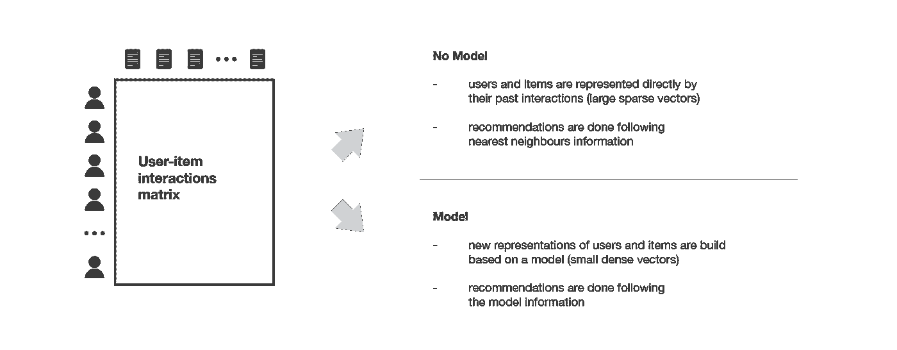

Overview of the collaborative filtering methods paradigm.

协作方法的主要优点是它们不需要关于用户或项目的信息，因此，它们可以在许多情况下使用。此外，用户与项目的交互越多，新的推荐就越准确:对于一组固定的用户和项目，随着时间的推移记录的新交互会带来新的信息，并使系统越来越有效。

然而，由于它仅考虑过去的交互来进行推荐，协同过滤遭受“冷启动问题”:它不可能向新用户推荐任何东西或向任何用户推荐新项目，并且许多用户或项目具有太少的交互而不能被有效地处理。这个缺点可以用不同的方式来解决:向新用户推荐随机项目或者向随机用户推荐新项目(随机策略)，向新用户推荐流行项目或者向最活跃的用户推荐新项目(最大期望策略)，向新用户推荐一组各种项目或者向一组各种用户推荐新项目(探索策略)，或者最后，在用户或者项目的早期使用非协作方法。

在下面的章节中，我们将主要介绍三种经典的协同过滤方法:两种基于记忆的方法(用户-用户和项目-项目)和一种基于模型的方法(矩阵分解)。

## 基于内容的方法

与仅依赖于用户-项目交互的协作方法不同，基于内容的方法使用关于用户和/或项目的附加信息。如果我们考虑电影推荐系统的例子，这个附加信息可以是例如用户的年龄、性别、工作或任何其他个人信息，以及电影(项目)的类别、主要演员、持续时间或其他特征。

然后，基于内容的方法的思想是试图建立一个模型，基于可用的“特征”，解释观察到的用户-项目交互。仍然考虑用户和电影，我们将尝试，例如，模拟年轻女性倾向于更好地评价一些电影，年轻男性倾向于更好地评价一些其他电影，等等。如果我们设法得到这样的模型，那么，为用户做出新的预测是相当容易的:我们只需要看看这个用户的个人资料(年龄、性别等)，并根据这些信息，确定相关的电影建议。

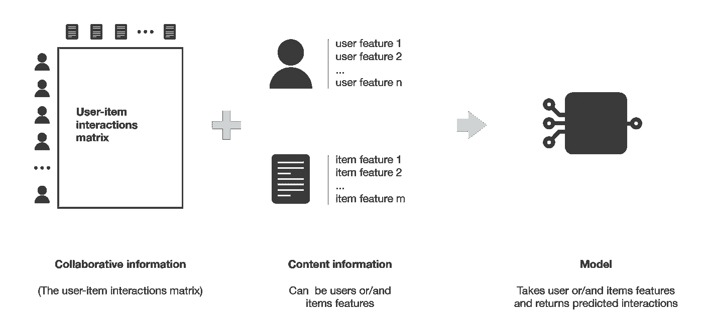

Overview of the content based methods paradigm.

基于内容的方法比协作方法更少遭受冷启动问题:新用户或项目可以通过它们的特征(内容)来描述，因此可以为这些新实体提供相关建议。只有新用户或具有以前看不到的功能的项目才会在逻辑上遭受这种缺点，但是一旦系统足够老，这种情况就很少或没有机会发生。

在这篇文章的后面，我们将进一步讨论基于内容的方法，并看到，根据我们的问题，可以使用各种分类或回归模型，从非常简单到复杂得多的模型。

## 模型、偏差和方差

让我们更关注前面提到的方法之间的主要区别。更具体地说，让我们看看建模水平对偏差和方差的影响。

在基于记忆的协作方法中，没有假设潜在模型。该算法直接处理用户-项目交互:例如，用户通过他们与项目的交互来表示，并且使用对这些表示的最近邻搜索来产生建议。由于没有假设潜在模型，这些方法理论上具有低偏差但高方差。

在基于模型的协作方法中，假设了一些潜在的交互模型。该模型被训练成从其自己的用户和项目的表示来重建用户-项目交互值。然后可以根据这个模型提出新的建议。由该模型提取的用户和项目潜在表示具有人类难以解释的数学含义。由于假设了用户-项目交互的(相当自由的)模型，这种方法在理论上比假设没有潜在模型的方法具有更高的偏差但更低的方差。

最后，在基于内容的方法中，还假设了一些潜在的交互模型。然而，在这里，模型提供了定义用户和/或项目的表示的内容:例如，用户由给定的特征来表示，并且我们尝试为每个项目建模喜欢或不喜欢该项目的用户简档的种类。这里，对于基于模型的协作方法，假设了用户-项目交互模型。然而，该模型更受限制(因为用户和/或项目的表示是给定的),因此，该方法倾向于具有最高的偏差但最低的方差。

Summary of the different types of recommender systems algorithms.

# 基于记忆的协作方法

用户-用户和项目-项目的主要特征在于，它们仅使用来自用户-项目交互矩阵的信息，并且它们假设没有模型来产生新的推荐。

## 用户-用户

为了向用户做出新的推荐，用户-用户方法粗略地尝试识别具有最相似的“交互简档”(最近邻居)的用户，以便建议在这些邻居中最受欢迎的项目(并且对我们的用户来说是“新的”)。这种方法被称为“以用户为中心”,因为它基于用户与项目的交互来表示用户，并评估用户之间的距离。

假设我们想为一个给定的用户做推荐。首先，每个用户都可以通过其与不同项目的交互向量来表示(交互矩阵中的“其行”)。然后，我们可以计算我们感兴趣的用户和其他用户之间的某种“相似性”。该相似性度量使得对相同项目具有相似交互的两个用户应该被认为是接近的。一旦计算了与每个用户的相似性，我们可以保留与我们的用户最近的 k 个邻居，然后推荐其中最受欢迎的项目(只查看我们的参考用户还没有与之交互的项目)。

请注意，当计算用户之间的相似性时，“共同交互”的数量(多少项目已经被两个用户考虑过？)要慎重考虑！事实上，大多数时候，我们希望避免与我们的参考用户只有一个共同交互的人可能有 100%的匹配，并被认为比有 100 个共同交互并“只”同意其中 98%的人“更接近”。因此，我们认为两个用户是相似的，如果他们以相同的方式与许多共同的项目交互(相似的评级，相似的时间悬停…)。

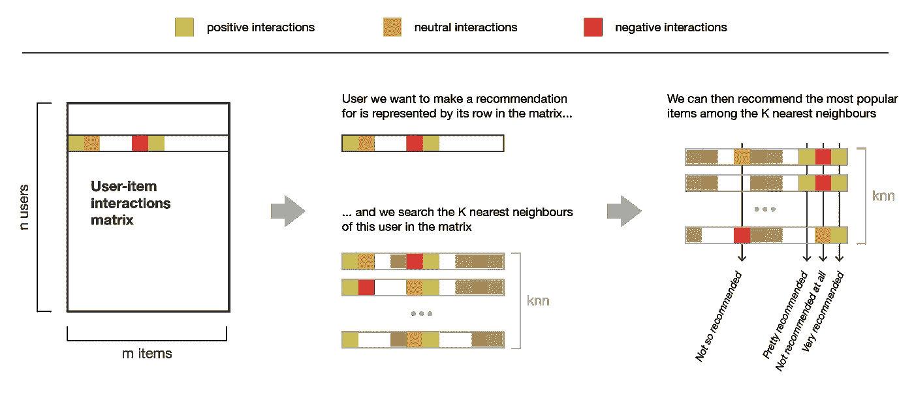

Illustration of the user-user method. The same colour code will be used in the remaining of the post.

## 项目-项目

为了向用户进行新的推荐，项目-项目方法的思想是找到与用户已经“积极地”交互过的项目相似的项目。如果与两个项目交互的大多数用户以相似的方式进行交互，那么这两个项目被认为是相似的。这种方法被称为“以项目为中心”,因为它基于用户与项目的交互来表示项目，并评估这些项目之间的距离。

假设我们想为一个给定的用户做推荐。首先，我们考虑这个用户最喜欢的项目，并通过它与每个用户的交互向量(交互矩阵中的“它的列”)来表示它(和所有其他项目一样)。然后，我们可以计算“最佳项目”和所有其他项目之间的相似性。一旦计算出相似性，我们就可以保留对我们感兴趣的用户来说是新的所选“最佳项目”的 k 个最近邻居，并推荐这些项目。

请注意，为了获得更多相关的推荐，我们可以不仅仅针对用户最喜欢的项目进行这项工作，而是考虑 n 个首选项目。在这种情况下，我们可以推荐与这些首选项目中的几个接近的项目。

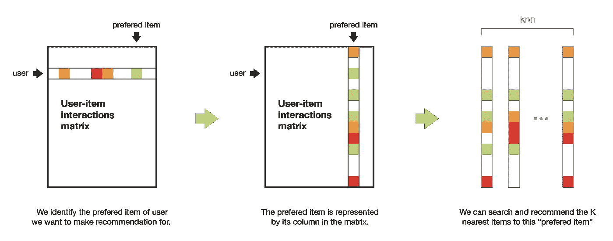

Illustration of the item-item method.

## 比较用户-用户和项目-项目

用户-用户方法基于在与项目的交互方面搜索相似的用户。因为，一般来说，每个用户只与几个项目交互，这使得该方法对任何记录的交互非常敏感(高方差)。另一方面，由于最终推荐仅基于为与我们感兴趣的用户相似的用户记录的交互，所以我们获得了更个性化的结果(低偏差)。

相反，条目-条目方法基于在用户-条目交互方面搜索相似条目。一般来说，由于许多用户已经与一个项目进行了交互，所以邻域搜索对单个交互的敏感度要低得多(方差更低)。作为对应，来自各种用户(甚至是与我们的参考用户非常不同的用户)的交互在推荐中被考虑，使得该方法不那么个性化(更有偏见)。因此，这种方法没有用户对用户的方法那么个性化，但是更加健壮。

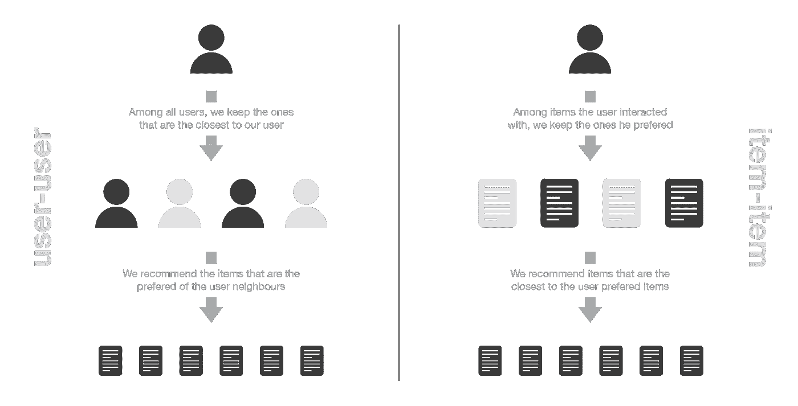

Illustration of the difference between item-item and user-user methods.

## 复杂性和副作用

基于记忆的协同过滤的最大缺陷之一是它们不容易扩展:对于大型系统来说，生成一个新的推荐是非常耗时的。事实上，对于具有数百万用户和数百万项目的系统，如果不仔细设计，最近邻居搜索步骤会变得难以处理(KNN 算法的复杂度为 O(ndk ),其中 n 是用户数量，d 是项目数量，k 是考虑的邻居数量)。为了使大型系统的计算更易处理，我们可以在设计算法时利用交互矩阵的稀疏性，或者使用近似最近邻方法(ANN)。

在大多数推荐算法中，有必要非常小心，以避免流行项目的“越来越丰富”效应，并避免让用户陷入所谓的“信息限制区”。换句话说，我们不希望我们的系统倾向于推荐越来越多的流行项目，我们也不希望我们的用户只收到与他们已经喜欢的项目非常接近的项目的推荐，而没有机会了解他们可能也喜欢的新项目(因为这些项目不够“接近”以至于不能被建议)。正如我们提到的，如果这些问题会出现在大多数推荐算法中，那么对于基于记忆的协作算法来说尤其如此。事实上，由于缺乏“规范化”的模式，这种现象可能会更频繁地被强调和观察。

# 基于模型的协作方法

基于模型的协作方法仅依赖于用户-项目交互信息，并假设一个潜在模型来解释这些交互。例如，矩阵分解算法包括将庞大且稀疏的用户-项目交互矩阵分解成两个更小且密集的矩阵的乘积:用户因素矩阵(包含用户表示)乘以因素-项目矩阵(包含项目表示)。

## 矩阵分解

矩阵分解背后的主要假设是，存在一个非常低维的特征潜在空间，其中我们可以表示用户和项目，并且用户和项目之间的交互可以通过计算该空间中相应密集向量的点积来获得。

例如，考虑我们有一个用户电影评级矩阵。为了对用户和电影之间的交互进行建模，我们可以假设:

*   存在一些很好地描述(和区分)电影的特征。
*   这些特征也可以用于描述用户偏好(高值表示用户喜欢的特征，低值表示用户不喜欢)

然而，我们不想给我们的模型显式地提供这些特性(因为对于我们将在后面描述的基于内容的方法，这是可以做到的)。相反，我们更喜欢让系统自己发现这些有用的特性，并对用户和项目做出自己的表示。由于它们是习得的而不是给定的，单独提取的特征具有数学意义，但没有直观的解释(因此，很难(如果不是不可能的话)被人类理解)。然而，从这种算法中产生的结构非常接近人类可以想到的直觉分解，这并不罕见。事实上，这种分解的结果是，就偏好而言接近的用户以及就特征而言接近的项目最终在潜在空间中具有接近的表示。

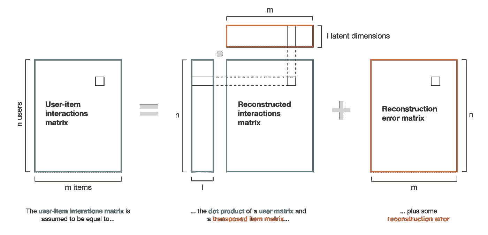

Illustration of the matrix factorization method.

## 矩阵分解的数学

在这一小节中，我们将给出矩阵分解的一个简单的数学概述。更具体地说，我们描述了一种基于梯度下降的经典迭代方法，这种方法可以获得非常大的矩阵的分解，而无需将所有数据同时加载到计算机的存储器中。

让我们考虑评级的交互矩阵 M (nxm ),其中只有一些项目被每个用户评级(大多数交互被设置为无以表示缺少评级)。我们想分解这个矩阵

其中 X 是“用户矩阵”(nxl)，其行代表 n 个用户，Y 是“项目矩阵”(mxl)，其行代表 m 个项目:

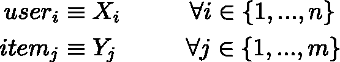

这里 l 是潜在空间的维度，其中用户和项目将被表示。因此，我们寻找矩阵 X 和 Y，它们的点积最接近现有的相互作用。表示 E 对(I，j)的系综，使得 M_ij 被设置(不是没有)，我们想要找到最小化“评级重构误差”的 X 和 Y

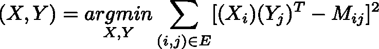

添加正则化因子并除以 2，我们得到

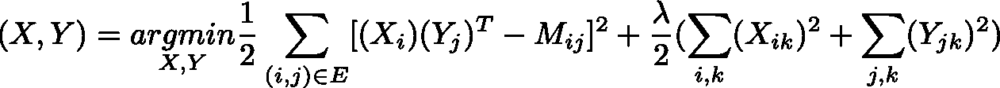

矩阵 X 和 Y 可以通过梯度下降优化过程获得，我们可以注意到两件事。首先，不必在每一步计算 E 中所有对的梯度，我们可以只考虑这些对的一个子集，这样我们可以“分批”优化我们的目标函数。第二，X 和 Y 中的值不必同时更新，梯度下降可以在每一步在 X 和 Y 上交替进行(这样做时，我们认为一个矩阵是固定的，并在下一次迭代中进行相反的操作之前为另一个矩阵进行优化)。

一旦矩阵被因式分解，我们就有更少的信息来操作以做出新的推荐:我们可以简单地将用户向量乘以任何项目向量，以估计相应的评级。请注意，我们还可以使用用户-用户和项目-项目方法来表示用户和项目:(近似)最近邻搜索不会在巨大的稀疏向量上进行，而是在小的密集向量上进行，这使得一些近似技术更容易处理。

## 矩阵分解的扩展

我们最终可以注意到，这种基本分解的概念可以扩展到更复杂的模型，例如，更通用的神经网络，如“分解”(我们不能再严格地谈论“分解”)。我们能想到的第一种直接适应关系到布尔交互。如果我们想要重建布尔交互，简单的点积并不适合。然而，如果我们在点积的基础上添加一个逻辑函数，我们会得到一个取值为[0，1]的模型，因此，更适合这个问题。在这种情况下，要优化的模型是

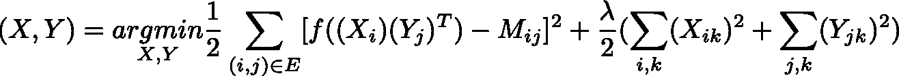

用 f(。)我们的后勤职能。在复杂的推荐系统中，更深层次的神经网络模型经常被用来实现接近现有技术水平的性能。

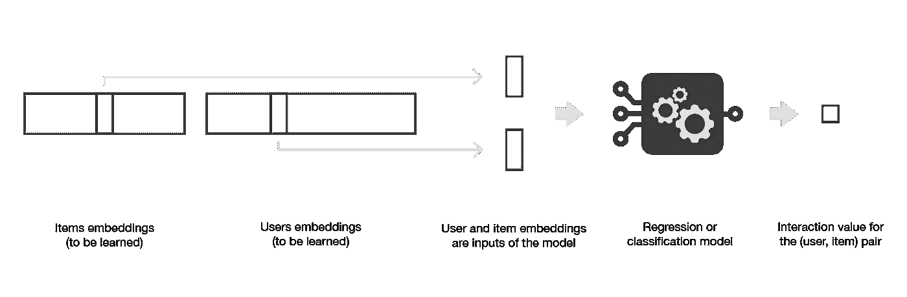

Matrix factorization can be generalized with the use of a model on top of users and items embeddings.

# 基于内容的方法

在前两节中，我们主要讨论了用户-用户、项目-项目和矩阵分解方法。这些方法仅考虑用户-项目交互矩阵，因此属于协同过滤范例。现在让我们描述一下基于内容的范例。

## 基于内容的方法的概念

在基于内容的方法中，推荐问题被分为分类问题(预测用户是否“喜欢”某个项目)或回归问题(预测用户对某个项目的评分)。在这两种情况下，我们都将设置一个基于用户和/或项目特征的模型(我们的“基于内容”方法的“内容”)。

如果我们的分类(或回归)是基于用户的特征，我们说这种方法是以项目为中心的:建模、优化和计算可以“按项目”进行。在这种情况下，我们基于用户特征逐个项目地构建和学习一个模型，试图回答“每个用户喜欢这个项目的概率是多少？”(或者“每个用户给这个物品的评分是多少？”，用于回归)。与每个项目相关联的模型自然地在与该项目相关的数据上被训练，并且一般来说，它导致相当健壮的模型，因为许多用户已经与该项目进行了交互。然而，被考虑来学习模型的交互来自每个用户，并且即使这些用户具有相似的特性(特征),他们的偏好也可能不同。这意味着，即使这种方法更健壮，它也可以被认为比以用户为中心的方法更不个性化(更有偏见)。

如果我们正在处理项目特征，那么这个方法就是以用户为中心的:建模、优化和计算可以由“用户”来完成。然后，我们根据项目特征按用户训练一个模型，试图回答问题“这个用户喜欢每个项目的概率是多少？”(或者“这个用户给每个项目的评分是多少？”，用于回归)。然后，我们可以为每个接受数据训练的用户建立一个模型:由于该模型只考虑了被考虑用户的互动，因此比以商品为中心的模型更加个性化。然而，大多数时候，用户与相对较少的项目进行交互，因此，我们获得的模型远不如以项目为中心的模型健壮。

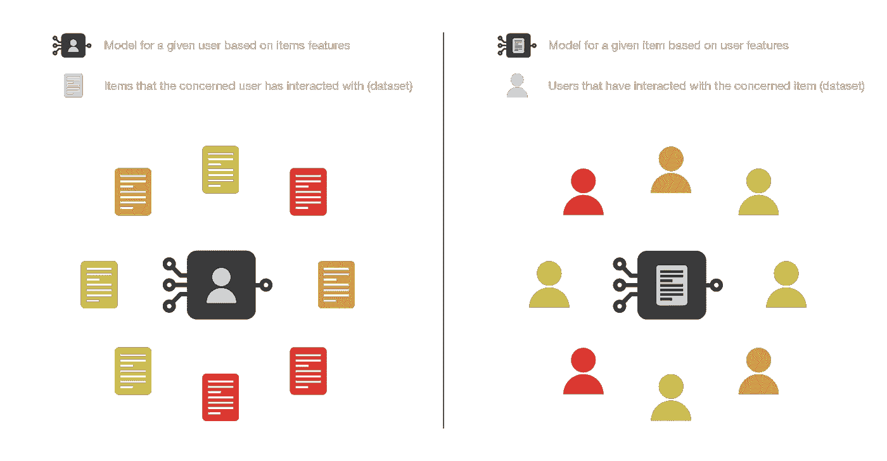

Illustration of the difference between item-centred and user-centred content based methods.

从实践的角度来看，我们应该强调的是，在大多数情况下，向新用户询问一些信息(用户不想回答太多问题)比询问大量关于新项目的信息(添加他们的人有兴趣填写这些信息，以便将他们的项目推荐给正确的用户)要困难得多。我们还可以注意到，根据要表达的关系的复杂性，我们建立的模型可以或多或少地复杂，范围从基本模型(用于分类/回归的逻辑/线性回归)到深度神经网络。最后，让我们提一下，基于内容的方法也可以既不以用户为中心也不以项目为中心:关于用户和项目的信息都可以用于我们的模型，例如通过堆叠两个特征向量并使它们通过神经网络架构。

## 以项目为中心的贝叶斯分类器

让我们首先考虑以项目为中心的分类的情况:对于每个项目，我们希望训练一个贝叶斯分类器，它将用户特征作为输入，输出“喜欢”或“不喜欢”。因此，为了完成分类任务，我们需要计算

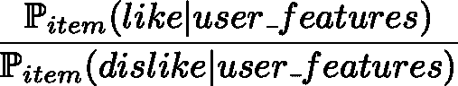

具有给定特征的用户喜欢所考虑的项目的概率和不喜欢它的概率之间的比率。定义我们的分类规则(具有简单阈值)的条件概率的比率可以按照贝叶斯公式来表示

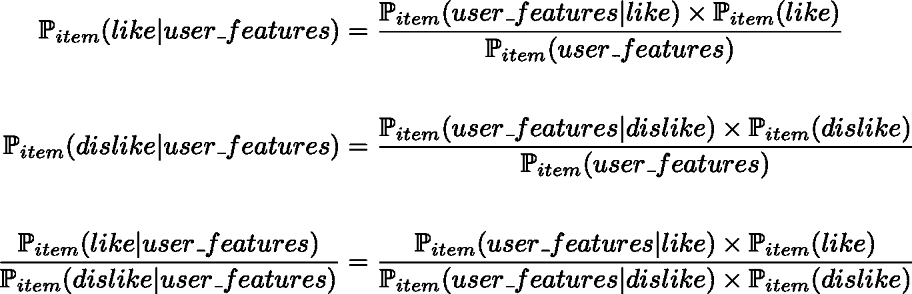

在哪里

先验是从数据中计算出来的

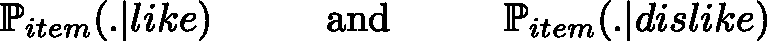

假设可能性遵循高斯分布，参数也由数据确定。可以对这两种似然分布的协方差矩阵进行各种假设(无假设、矩阵相等、矩阵相等和特征独立)，从而产生各种众所周知的模型(二次判别分析、线性判别分析、朴素贝叶斯分类器)。我们可以再次强调，在这里，可能性参数必须仅基于与所考虑的项目相关的数据(相互作用)来估计。

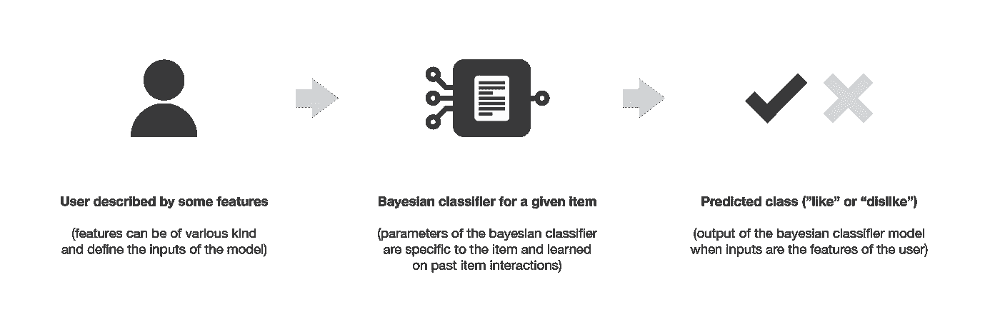

Illustration of the item-centred content based Bayesian classifier.

## 用户为中心的线性回归

现在让我们考虑以用户为中心的回归的情况:对于每个用户，我们希望训练一个简单的线性回归，它将项目特征作为输入，并输出该项目的评级。我们仍然将 M 表示为用户-项目交互矩阵，我们将表示要学习的用户系数的 X 行向量堆叠成矩阵，并将表示给定项目特征的 Y 行向量堆叠成矩阵。然后，对于给定的用户 I，我们通过求解以下优化问题来学习 X_i 中的系数

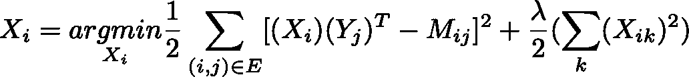

我们应该记住，I 是固定的，因此，第一次求和只针对与用户 I 相关的(用户，项目)对。我们可以观察到，如果我们同时为所有用户解决这个问题，优化问题与我们在“交替矩阵分解”中解决的问题完全相同，当我们保持项目固定时。这种观察强调了我们在第一部分中提到的联系:基于模型的协作过滤方法(例如矩阵分解)和基于内容的方法都假设用户-项目交互的潜在模型，但是基于模型的协作方法必须学习用户和项目的潜在表示，而基于内容的方法基于用户和/或项目的人类定义的特征建立模型。

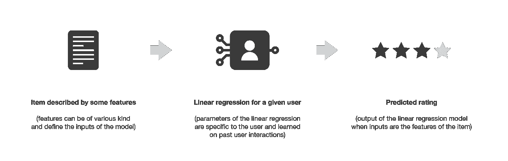

Illustration of the user-centred content based regression.

# 推荐系统的评价

至于任何机器学习算法，我们需要能够评估我们的推荐系统的性能，以便决定哪个算法最适合我们的情况。推荐系统的评价方法主要可以分为两类:基于良好定义的度量的评价和主要基于人的判断和满意度估计的评价。

## 基于度量的评估

如果我们的推荐系统是基于输出数值的模型，例如评级预测或匹配概率，我们可以使用误差测量度量，例如均方误差(MSE ),以非常经典的方式评估这些输出的质量。在这种情况下，模型仅在一部分可用的交互上被训练，并在剩余的交互上被测试。

然而，如果我们的推荐系统基于预测数值的模型，我们也可以用经典的阈值方法将这些值二进制化(阈值以上的值为正，阈值以下的值为负)，并以更“分类的方式”评估模型。事实上，由于用户-项目过去交互的数据集也是二进制的(或者可以通过阈值化来二进制化)，因此我们可以在不用于训练的交互的测试数据集上评估模型的二进制化输出的准确性(以及精度和召回率)。

最后，如果我们现在考虑一个不基于数值的推荐系统，它只返回一个推荐列表(例如基于 knn 方法的用户-用户或项目-项目)，我们仍然可以通过估计真正适合我们用户的推荐项目的比例来定义一个类似精度的度量。为了估计这个精度，我们不能考虑用户没有与之交互的推荐项目，我们应该只考虑来自测试数据集中有用户反馈的项目。

## 基于人的评估

在设计推荐系统时，我们感兴趣的不仅仅是获得能够产生我们非常确定的推荐的模型，我们还可以期待其他一些好的特性，比如推荐的多样性和可解释性。

正如在协作部分提到的，我们绝对希望避免让用户陷入我们之前称之为信息封闭的区域。“意外发现”的概念经常被用来表达一个模型有或没有创建这样一个限制区域的趋势(推荐的多样性)。可以通过计算推荐项目之间的距离来估计的意外收获，不应该太低，因为这会产生限制区域，但也不应该太高，因为这意味着我们在进行推荐时没有充分考虑用户的兴趣(探索与开发)。因此，为了在建议的选择中带来多样性，我们想要推荐既非常适合我们的用户又彼此不太相似的项目。例如，与其向用户推荐“开始战争”1、2 和 3，不如推荐“星球大战 1”、“开始黑暗之旅”和“印第安纳琼斯和夺宝奇兵”:后两者可能会被我们的系统视为用户不太感兴趣，但推荐看起来太相似的 3 个项目并不是一个好的选择。

可解释性是推荐算法成功的另一个关键点。事实上，已经证明，如果用户不理解他们为什么被推荐为特定项目，他们倾向于对推荐系统失去信心。因此，如果我们设计了一个可以清楚解释的模型，我们可以在推荐时添加一个小句子，说明为什么推荐了一个项目(“喜欢这个项目的人也喜欢这个”，“你喜欢这个项目，你可能会对这个项目感兴趣”，…)。

最后，除了多样性和可解释性本质上难以评估的事实之外，我们可以注意到，评估不属于测试数据集的推荐的质量也是相当困难的:如何在实际向用户推荐之前知道一个新的推荐是否相关？出于所有这些原因，在“真实条件”下测试模型有时会很有诱惑力。由于推荐系统的目标是生成一个动作(看电影、购买产品、阅读文章等)，我们确实可以评估它生成预期动作的能力。例如，系统可以按照 A/B 测试方法投入生产，或者可以只在用户样本上进行测试。然而，这种过程要求对模型有一定程度的信心。

# 外卖食品

这篇文章的主要观点是:

*   推荐算法可以分为两大类:仅基于用户-项目交互矩阵的协作方法(如用户-用户、项目-项目和矩阵分解)和使用关于用户和/或项目的先验信息的基于内容的方法(如回归或分类模型)
*   基于记忆的协作方法不假设任何潜在模型，因此具有低偏差但高方差；基于模型的协作方法假设一个潜在的交互模型，该模型需要从零开始学习用户和项目表示，因此具有较高的偏差但较低的方差；基于内容的方法假设围绕明确给出的用户和/或项目特征建立潜在的模型，因此具有最高的偏差和最低的方差
*   推荐系统在许多大型行业中越来越重要，在设计系统时必须考虑一些规模因素(更好地使用稀疏性、因子分解或优化的迭代方法、最近邻搜索的近似技术……)
*   推荐系统很难评估:如果可以使用一些经典的度量标准，如 MSE、准确度、召回率或精确度，人们应该记住一些期望的属性，如多样性(意外发现)和可解释性不能以这种方式评估；真实条件评估(如 A/B 测试或样本测试)最终是评估新推荐系统的唯一真实方式，但需要对模型有一定的信心

我们应该注意到，在这篇介绍性的文章中，我们没有讨论混合方法。这些方法结合了协同过滤和基于内容的方法，在许多情况下获得了最先进的结果，并且因此被用在当今许多大规模推荐系统中。在混合方法中进行的组合可以主要采取两种形式:我们可以独立地训练两个模型(一个协作过滤模型和一个基于内容的模型)并组合它们的建议，或者通过使用先验信息(关于用户和/或项目)以及“协作”交互信息作为输入来直接构建统一两种方法的单个模型(通常是神经网络)。

正如我们在这篇文章的引言中提到的，推荐系统在许多行业中变得越来越重要，因此，在最近几年里受到了越来越多的关注。在本文中，我们介绍了更好地理解与这些系统相关的问题所需的基本概念，但我们强烈鼓励感兴趣的读者进一步探索这一领域…讽刺的是，没有给出任何具体的阅读建议！

感谢阅读！

与[约瑟夫·罗卡](https://medium.com/u/b17ebd108358?source=post_page-----6c66cf15ada--------------------------------)一起写的最后一篇文章:

 [## 整体方法:装袋、助推和堆叠

### 理解集成学习的关键概念。

towardsdatascience.com](/ensemble-methods-bagging-boosting-and-stacking-c9214a10a205)  [## 马尔可夫链简介

### 定义、属性和 PageRank 示例。

towardsdatascience.com](/brief-introduction-to-markov-chains-2c8cab9c98ab)