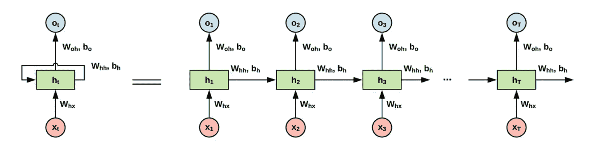
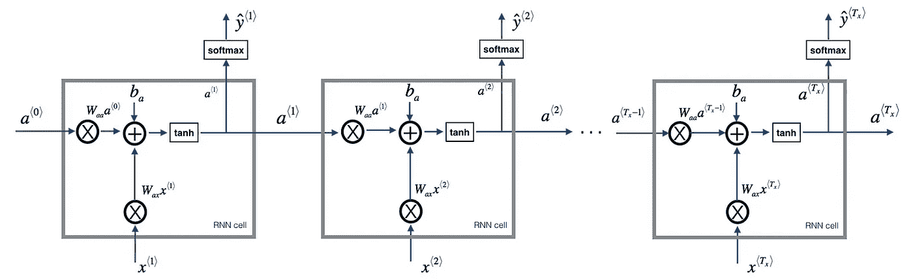
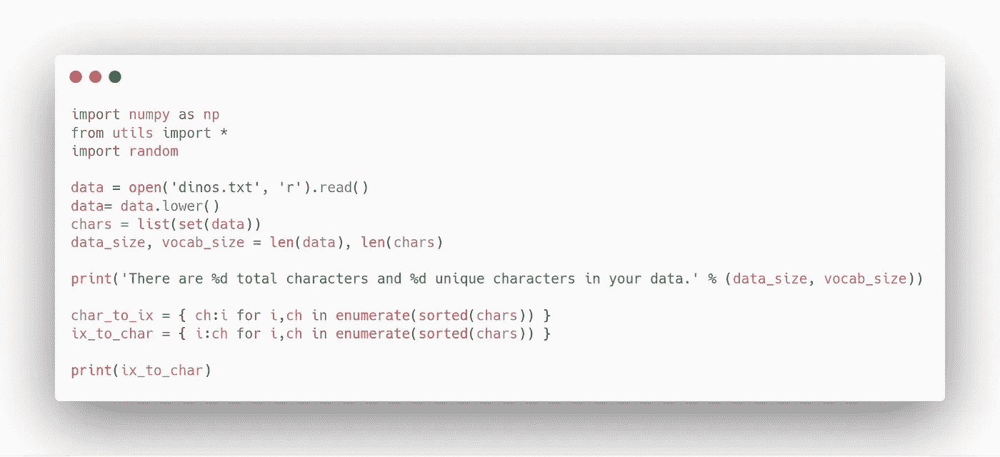
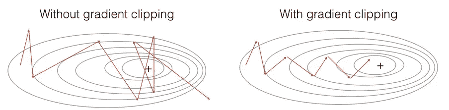
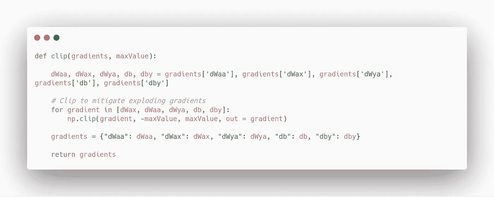
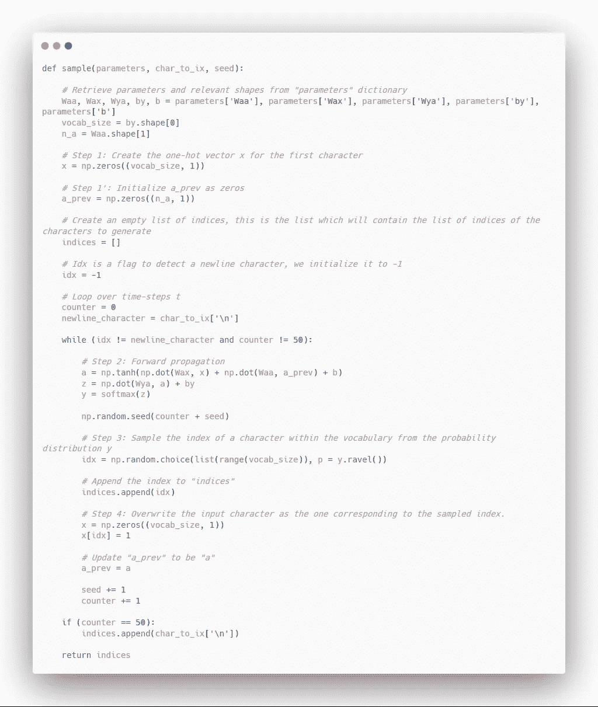
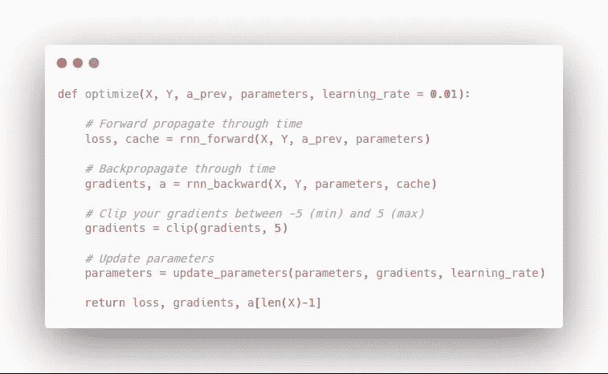

# 恐龙递归神经网络(RNN)简介

> 原文：<https://towardsdatascience.com/introduction-to-recurrent-neural-networks-rnn-with-dinosaurs-790e74e3e6f6?source=collection_archive---------18----------------------->

## 了解关于 RNNs 的一切，并构建一个恐龙名称生成器


Photo by [Daiga Ellaby](https://unsplash.com/@daiga_ellaby?utm_source=medium&utm_medium=referral) on [Unsplash](https://unsplash.com?utm_source=medium&utm_medium=referral)

递归神经网络(RNN)是称为**序列模型**的更大算法组的一部分。序列模型在语音识别、音乐生成、DNA 序列分析、机器翻译等领域取得了巨大的进步。

在这篇文章中，介绍了 RNN 的理论，我们将通过建立一个能产生新恐龙名字的模型来巩固一切。

我们走吧！

> 对于机器学习、深度学习和人工智能的实践视频教程，请查看我的 [YouTube 频道](https://www.youtube.com/channel/UC-0lpiwlftqwC7znCcF83qg?view_as=subscriber)。

Now, that’s a specie I don’t know about…

# 为什么要使用递归神经网络？

假设你想建立一个神经网络来识别句子中的人名。

在这种情况下，传统的神经网络不适合这种类型的应用。首先，输入和输出不会有相同的长度，因为一个人的名字可能有很大的不同。第二，学习到的特征不会在文本的不同位置共享，导致低于标准的性能。

这就是为什么 rnn 非常受序列数据的欢迎，比如句子或音乐。

# 一种递归神经网络的结构

在 RNN 中，输入被馈送到网络的一个层，并且它输出预测。然后，第二输入被馈送到另一层，并且网络输出预测。然而，它也使用从前一层计算的信息。

重复该过程，直到获得最终输出。

因此，典型的 RNN 看起来是这样的:



Left: folded schema of an RNN. Right: unfolded schema of an RNN. [Source](http://www.easy-tensorflow.com/tf-tutorials/recurrent-neural-networks/vanilla-rnn-for-classification)

这种结构允许 rnn 将信息从早期步骤链接到当前步骤。然而，如果 RNN 很深，意味着它有许多层，它将容易出现**消失**或**爆发**渐变。

当渐变接近 0 时，渐变消失，因此权重不再更新。另一方面，爆炸梯度是当梯度太大时，并且永远不会达到优化函数的全局最小值。当然，有办法防止爆炸和消失的梯度，我们会看到当我们编码一个 RNN。

# 对 RNN 进行编码以生成新的恐龙名称

## 概观

现在，我们将使用 Python 编写一个 RNN，它将为我们生成新的恐龙名称。我们将学习如何:

*   存储文本数据，并使用 RNN 对其进行处理
*   如何合成数据
*   如何生成文本
*   如何裁剪渐变以避免渐变爆炸

我们的 RNN 将会是这样的:



RNN schema. [Source](https://www.deeplearning.ai/)

当然，如果你想继续写代码的话，可以使用[全笔记本](https://github.com/marcopeix/Deep_Learning_AI/blob/master/5.Sequence%20Models/1.Recurrent%20Neural%20Networks/Dinosoraus%20Land.ipynb)。您还将找到复制结果所需的所有实用工具。

## 步骤 1:导入库并浏览数据集

我们首先导入必要的库和实用程序，并查看我们将使用的数据。



你应该看到我们有相当多的恐龙名字，我们也有 27 个独特的角色。它们对应于字母表中的每个字母，我们有一个特殊的字符“\n”来定义一个新行。这将是我们的句尾字符( **EOS** )。

## 步骤 2:定义渐变裁剪函数

如前所述，rnn 容易消失或爆炸梯度，所以我们将实现梯度裁剪，以防止梯度“爆炸”。

渐变裁剪非常简单:如果计算出的渐变大于某个阈值，我们将它缩放回阈值。否则，我们就让它保持原样。像这样，我们将确保我们的优化函数会收敛。



Gradient descent with and without clipping. [Source](https://www.deeplearning.ai/)

在代码中:



## 步骤 3:定义采样函数

一旦我们的模型被训练，我们将需要一个函数来选择最有可能生成一个似乎合理的恐龙名字的角色。

换句话说，它需要从字符库中抽取一个字符并生成一个单词。

在代码中:



## 步骤 4:构建模型

现在，我们准备好构建模型了。首先，我们实现一个函数，该函数执行带有梯度裁剪的随机梯度下降的一个步骤:



完美！现在我们可以编写并训练我们的模型:

现在，我们只需要运行下面的单元格来获得新的恐龙名称:

```
parameters = model(data, ix_to_char, char_to_ix)
```

你应该看到算法在生成更可信的恐龙名字方面变得越来越好。我得到的几个例子是:

*   Trokalenator
*   尼沃龙
*   卢特龙

如果您有更多的时间和计算能力，请随意调整模型并训练它更长时间，因为它应该会生成更好的名称。

就是这样！您学习了 RNNs 的基础知识，并应用它们来生成新的恐龙名称！

在未来的帖子中，我们将讨论长短期记忆(LSTM)单位，这是另一种类型的循环网络，我们将生成爵士乐。

敬请期待！

来源: [Deeplearning.ai](https://www.deeplearning.ai/)