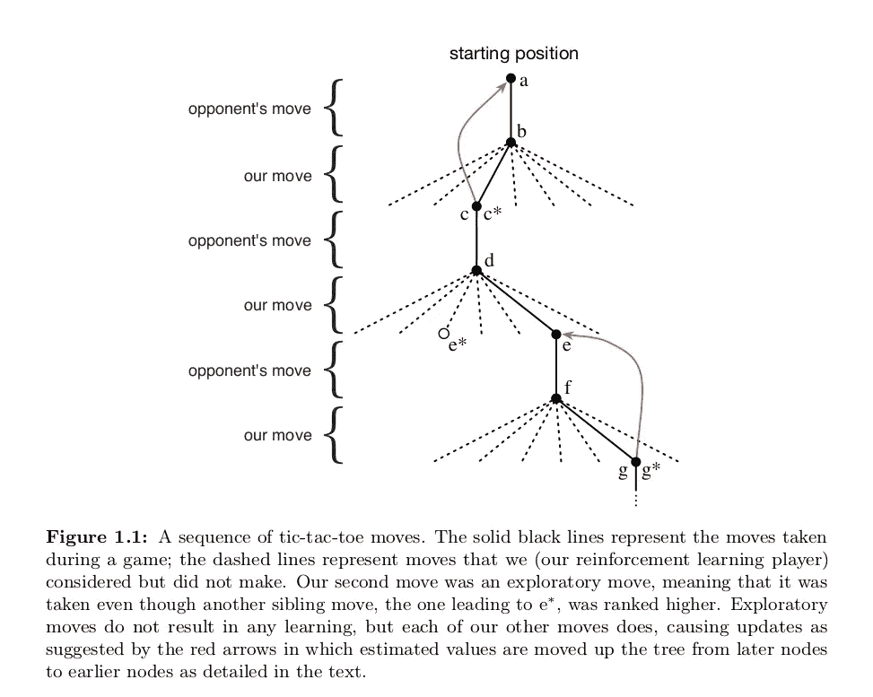

# 强化学习简介—第 1 章

> 原文：<https://towardsdatascience.com/introduction-to-reinforcement-learning-chapter-1-fc8a196a09e8?source=collection_archive---------16----------------------->

## RLBook 的章节摘要。

**Fig 1\. Toons talking about Reinforcement Learning**

*这是从一本最流行的强化学习书中摘出的一章，作者是* ***理查德·萨顿*** *和* ***安德鲁·g·巴尔托*** *(* 第二版)*。书可以在这里找到:* [*链接*](http://incompleteideas.net/book/the-book-2nd.html) *。*

强化学习是学习做什么——如何将情况映射到行动——以便最大化数字奖励信号。学习代理可以采取影响环境状态的行动，并且具有与环境状态相关的目标。强化学习中出现的挑战之一，而不是其他类型的学习，是探索和利用之间的权衡。在所有形式的机器学习中，强化学习是最接近人类和其他动物所做的学习。

## 强化学习的要素

除了 ***代理*** 和 ***环境*** 之外，人们可以识别 RL 的四个主要子元素

1.  ***策略—*** *是从感知的环境状态到处于这些状态时要采取的行动的映射。策略是强化学习代理的核心，因为它本身就足以决定行为。它可能是随机的，规定了每个动作的概率。*
2.  ***奖励—*** *在每个时间步上，环境向强化学习代理发送一个称为奖励的单一数字。代理人的唯一目标是最大化其长期获得的总回报。因此，回报信号定义了对代理人来说什么是好信号，什么是坏信号。它可能是状态和行为的随机函数。*
3.  ***价值函数—*** *粗略地说，一个状态的价值就是一个主体从那个状态开始，在未来可以期望积累的报酬总额。奖励决定了环境状态的直接的、内在的可取性，而值在考虑了可能发生的状态和这些状态中可用的奖励之后，指示了状态的长期可取性。例如，一个州可能总是产生较低的即时奖励，但仍然有很高的价值，因为它经常被产生高奖励的其他州跟随，或者相反。*
4.  ***环境模型—*** *这模仿了环境的行为，允许对环境将如何表现做出推断。例如，给定一个状态和一个动作，模型可以预测下一个状态和下一个奖励。使用模型解决强化学习问题的方法称为基于模型的方法，与更简单的无模型方法，即试错学习器相对。*

> 从某种意义上说，回报是第一位的，而作为回报预测的价值是第二位的。没有回报就没有价值，评估价值的唯一目的是为了获得更多的回报。然而，在做决策和评估决策时，我们最关心的是价值观。

## 一个例子:井字游戏

**Fig 2\. Sequence of Tic-Tac-Toe Moves**

解决井字游戏的强化学习方法；

1.  建立一个数字表，每个数字代表一种可能的游戏状态。
2.  每一个数字都是我们对该州获胜概率的最新估计。
3.  这个估计值就是状态的 ***值*** ，整个表就是学习值函数。
4.  假设我们总是玩 x，那么对于一行(列和对角线)中有 3 个 x 的所有状态，获胜的概率是 1.0
5.  对于一行(列和对角线)中有 3 个 0 的所有州，获胜的概率是 0.0
6.  我们将所有其他状态的初始值设置为 0.5 *(表示我们有 50%的胜算。)*

然后我们和对手打很多场比赛。要选择我们的行动:

1.  我们检查每个可能的移动所产生的状态，并在表中查找它们的当前值。
2.  大多数时候，我们贪婪地行动，选择能带来最大价值的行动。*(最高中奖概率)*
3.  偶尔，我们会从其他动作中随机选择。*(探索)*

玩的时候，我们会改变自己所处状态的价值观:

1.  在每次贪婪的移动之后，从 A 到 B，我们更新 A 的值以更接近 B 的值。
2.  这是通过以下公式实现的

**Fig 3\. Temporal Difference Learning Update**

其中，
***【S _ t】***—旧状态的值，贪心移动前的状态*(A)* ***V(S _ t+1)***—新状态的值，贪心移动后的状态*(B)* ***alpha***—学习率

这个更新规则是 ***时间差异学习*** 方法的一个例子，这样称呼是因为它的变化是基于两个连续时间的估计值之间的差异`V(S_t+1) — V(S_t)`。

> *感谢阅读！如果我从书中发现一些需要提及的见解，我会更新。*