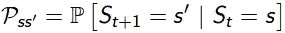

# 强化学习:马尔可夫决策过程(上)

> 原文：<https://towardsdatascience.com/introduction-to-reinforcement-learning-markov-decision-process-44c533ebf8da?source=collection_archive---------0----------------------->

## #InsideRL

> 在一个典型的强化学习(RL)问题中，有一个学习者和一个决策者，称为**代理**，与其交互的环境称为**环境**。作为回报，环境基于代理的**动作**提供**奖励**和一个**新状态**。因此，在强化学习中，我们不教代理应该如何做某事，而是根据它的行为给它奖励，无论是积极的还是消极的。**所以我们这个博客的根本问题是，我们如何用数学方法来表述 RL 中的任何问题**。这就是马尔可夫决策过程(MDP)的用武之地。

Typical Reinforcement Learning cycle

在我们回答我们的根本问题之前，即我们如何用数学方法(使用 MDP)表述 RL 问题，我们需要发展我们对以下问题的直觉:

*   代理-环境关系
*   马尔可夫性质
*   马尔可夫过程和马尔可夫链
*   马尔可夫奖励过程(MRP)
*   贝尔曼方程
*   马尔可夫奖励过程

拿起你的咖啡，直到你感到自豪才停下来！🧐

## 代理-环境关系

首先让我们看看一些正式的定义:

> **代理**:做出智能决策的软件程序，它们是 RL 中的学习者。这些代理通过行动与环境互动，并根据他们的行动获得奖励。
> 
> **环境**:是待解决问题的演示。现在，我们可以有一个真实世界的环境或一个模拟的环境，我们的代理将与它进行交互。

Demonstrating an environment with which agents are interacting.

> **状态**:这是代理在环境中特定时间步的位置。因此，每当代理执行一个动作时，环境给予代理奖励和代理通过执行该动作所达到的新状态。

代理**不能任意改变**的任何东西都被认为是环境的一部分。简单来说，动作可以是**我们希望代理学习的任何决定**和**状态可以是在选择动作**时有用的任何东西。我们并不假设环境中的一切对代理人来说都是未知的，例如，奖励计算被认为是环境的一部分，即使代理人知道一点它的奖励是如何作为它的动作和状态的函数来计算的。这是因为**奖励不能由代理人任意**更改。有时，代理人可能完全知道其环境，但仍然发现很难最大化奖励，就像我们可能知道如何玩魔方，但仍然无法解决它。因此，我们可以有把握地说，代理-环境关系代表了代理控制的极限，而不是它的知识。

## 马尔可夫性质

> **跃迁**:从一种状态转移到另一种状态叫做跃迁。
> 
> **转移概率**:智能体从一种状态转移到另一种状态的概率称为转移概率。

*中的* ***马氏性*** *表述为:*

> “鉴于现在，未来独立于过去”

从数学上讲，我们可以将这一陈述表达为:

Markov Property

S[t]表示代理的当前状态，s[t+1]表示下一个状态。这个等式的意思是，从状态 S[t]到 S[t+1]的转变完全独立于过去。因此，如果系统具有马尔可夫性质，方程的 **RHS** 与 **LHS** 的含义相同。直观上意味着我们的当前状态已经捕获了过去状态的信息。

***状态转移概率:***

现在我们知道了转移概率，我们可以将状态转移概率定义如下:

对于从 S[t]到 S[t+1]的马尔可夫状态，即任何其他后续状态，状态转移概率由下式给出

State Transition Probability

我们可以通过以下方式将状态转移概率公式化为状态转移概率矩阵:

State Transition Probability Matrix

矩阵中的每一行代表从我们的原始或开始状态移动到任何后续状态的概率。每行的总和等于 1。

## 马尔可夫过程或马尔可夫链

*马尔可夫过程是记忆较少的* ***随机过程*** *即一个随机状态的序列 S[1]，S[2]，…。S[n]具有马尔可夫性质*。所以，它基本上是一个具有马尔可夫性质的状态序列。它可以用一组状态(S)和转移概率矩阵(P)来定义。使用状态(S)和转移概率矩阵(P)可以完全定义环境的动态。

但是 ***随机过程*** 是什么意思呢？

为了回答这个问题，我们来看一个例子:

Markov chain

树的边表示**转移概率**。让我们从这个链条上取一些样品。现在，假设我们在睡觉，根据概率分布，有 0.6%的几率我们会跑，0.2%的几率我们会睡得更久，0.2%的几率我们会吃冰淇淋。类似地，我们可以从这条链中提取其他序列。

来自链条的一些样品:

*   睡觉——跑步——冰淇淋——睡觉
*   睡眠——冰淇淋——冰淇淋——奔跑

在上面的两个序列中，我们看到的是，每次运行链时，我们都会得到一组随机的状态(即睡眠、冰淇淋、睡眠)。霍普，现在清楚了为什么马尔可夫过程被称为随机序列集。

在进入马尔可夫奖励流程之前，让我们先来看一些有助于理解 MRP 的重要概念。

## 奖励和回报

> **奖励**是代理在环境中的某个**状态**下执行某个动作时收到的**数值**。根据代理的动作，数值可以是正的，也可以是负的。
> 
> 在**强化学习**中，我们关心的是**最大化**累积奖励(代理从环境中获得的所有奖励)而不是，代理从当前状态获得的奖励(也称为即时奖励)。这个**代理人从环境中得到的报酬**的总和称为**回报**。

我们可以将回报定义为:

Returns (Total rewards from the environment)

r[t+1]是代理在时间步长 t[0]执行从一个状态移动到另一个状态的动作(a)时收到的奖励。类似地，r[t+2]是代理在时间步长 t[1]通过执行移动到另一个状态的动作而收到的奖励。r[T]是代理在最后一个时间步通过执行移动到另一个状态的动作而收到的奖励。

**间断和连续任务**

> **偶发任务**:这些任务有一个**终止状态**(结束状态)。我们可以说它们有有限的状态。比如赛车游戏，我们开始游戏(开始比赛)，一直玩到游戏结束(比赛结束！).这叫插曲。一旦我们重启游戏，它将从初始状态开始，因此，每一集**都是独立的。**
> 
> **连续任务**:没有结束的任务，即**没有任何终止状态**。这些类型的任务将**永不结束**。比如学习如何编码！

现在，很容易计算出阶段性任务的回报，因为它们最终会结束，但连续任务呢，因为它会一直持续下去。从求和到无穷大的收益！那么，我们如何定义连续任务的回报呢？

这就是我们需要**贴现 factor(ɤ)** 的地方。

> **贴现因子(ɤ)** :决定**当前奖励和**未来奖励**的重要性**的大小。这基本上帮助我们避免**无穷大**作为连续任务中的奖励。它的值介于 0 和 1 之间。值 **0** 意味着给予**即时奖励**更大的重要性，值 **1** 意味着给予**未来奖励**更大的重要性。**在实践中**，折扣系数 0 永远不会学习，因为它只考虑即时奖励，而折扣系数 1 将继续用于未来奖励，这可能导致无穷大。因此，**折扣系数的最佳值在 0.2 到 0.8 之间**。

因此，我们可以使用贴现因子定义回报如下:**(假设这是等式 1，因为我们稍后将使用该等式来推导贝尔曼等式)**

Returns using discount factor

让我们用一个例子来理解它，假设你住在一个面临水资源短缺的地方，如果有人来找你，说他会给你 100 升水！(请假设！)作为某个参数的函数( **ɤ)** 。让我们看看两种可能性:(假设这是等式 1，因为我们将在后面使用这个等式来推导贝尔曼等式)

一个带有折扣系数( **ɤ) 0.8 :**

Discount Factor (0.8)

这意味着我们应该等到第 15 个小时，因为下降不是非常显著，所以直到最后仍然是值得的。这意味着我们也对未来的回报感兴趣。所以，如果贴现因子接近 1，那么我们将努力达到终点，因为奖励非常重要。

二、用贴现因子( **ɤ) 0.2 :**

Discount Factor (0.2)

这意味着我们对早期的奖励更感兴趣，因为奖励在第一小时变得非常低。所以，我们可能不想等到最后(直到第 15 个小时)，因为这将是毫无价值的。因此，如果贴现因子接近于零，那么眼前的回报比未来更重要。

> **那么使用哪个折扣系数值呢？**

这取决于我们想要训练代理的任务。假设，在一盘棋中，目标是击败对手的王。如果我们重视直接的奖励，如棋子击败任何对手的奖励，那么代理人将学习执行这些子目标，不管他的玩家是否也被击败。所以，在这个任务中，未来的回报更重要。在某些情况下，我们可能更喜欢使用即时奖励，就像我们之前看到的水的例子一样。

## 马尔可夫奖励过程

到目前为止，我们已经看到马尔可夫链是如何使用状态集(S)和转移概率矩阵(P)来定义环境的动态性的。但是，我们知道强化学习的目的是最大化回报。所以，让我们把 ***加奖励*** 到我们的马尔可夫链中。这给了我们**马尔科夫的奖励过程。**

> **马尔可夫奖励过程**:顾名思义，MDP 就是有价值判断的马尔可夫链。基本上，我们从代理所处的每个状态中获取一个值。

在数学上，我们将马尔可夫奖励过程定义为:

Markov Reward Process

这个等式的意思是我们从一个特定的状态 S[t]中得到多少奖励(Rs)。这告诉我们，从我们的代理所处的特定状态中可以得到直接的回报。正如我们将在下一个故事中看到的，我们如何从我们的代理所处的每个状态中最大化这些奖励。简单来说，最大化我们从每个州获得的累积奖励。

我们将 MRP 定义为(标准普尔，R,ɤ)，其中:

*   s 是一组状态，
*   p 是转移概率矩阵，
*   r 是奖励函数，我们之前看到过，
*   ɤ是贴现因子

## 马尔可夫决策过程

现在，让我们发展对贝尔曼方程和马尔可夫决策过程的直觉。

## 政策功能和价值功能

**价值函数决定了代理处于某个特定状态有多好**。当然，要确定一个特定的状态有多好，必须依赖于它将要采取的一些行动。这就是政策发挥作用的地方。策略定义了在特定状态下要执行的操作。

策略是一个简单的函数，它为每个状态(s ∈ S)定义了动作(a∈ A)的概率分布**。如果代理在时间 t 遵循策略π，那么 **π(a|s)** 是代理在特定时间步长(t)采取行动(a)的概率。在强化学习中，代理人的经验决定了策略的变化。数学上，策略定义如下:**

Policy Function

现在，**我们如何找到一个状态的值**。当代理人遵循 vπ(s)表示的策略π时，状态 s 的值是从 s 开始并遵循下一个状态的策略π直到到达终端状态的期望收益。我们可以将其公式化为:(**该函数也称为状态值函数**)

Value Function

这个等式给出了从**状态**开始到后续状态的**预期收益**，策略为π。需要注意的一点是，我们得到的回报是随机的，而一个状态的价值是**而不是**随机的。它是从起始状态 s 到任何其它状态的期望收益。还要注意，终端状态的值(如果有的话)是零。让我们看一个例子:

Example

假设我们的开始状态是类 2，我们移动到类 3，然后通过，然后睡眠。简而言之，二班>三班>及格>睡觉。

我们的预期回报是 0.5 的贴现因子:

Calculating the Value of Class 2

**注:** *是****-2+(-2 * 0.5)+10 * 0.25+0****而不是****-2 *-2 * 0.5+10 * 0.25+0***。**那么 Class 2 的值就是-0.5** 。

## 价值函数的贝尔曼方程

**贝尔曼方程**帮助我们找到**最优策略**和**价值函数**。我们知道我们的政策会随着经验而改变，所以根据不同的政策，我们会有不同的价值函数。 ***最优价值函数是与所有其他价值函数*** 相比给出最大值的函数。

贝尔曼方程表明价值函数可以被分解成两部分:

*   即时奖励，R[t+1]
*   继承国的贴现值，

数学上，我们可以将贝尔曼方程定义为:

Bellman Equation for Value Function

让我们借助一个例子来理解这个等式的含义:

假设，有一个机器人处于某个状态，然后他从这个状态移动到另一个状态。现在，问题是机器人处于这种状态有多好。利用贝尔曼方程，我们可以得出，它是离开状态时得到的**奖励**的期望值加上它所移动到的状态(s’)的**值。**

让我们看另一个例子:

Backup Diagram

我们想知道状态 s 的**值**。状态的值是我们离开该状态时得到的回报，加上我们到达的状态的贴现值乘以我们将进入该状态的转移概率。

Value Calculation

上述等式可以用矩阵形式表示如下:

Bellman Linear Equation

其中 v 是我们所处状态的价值，它等于**即时回报加上下一个状态的贴现值乘以进入该状态的概率**。

本次计算的运行时间复杂度为 **O(n )** 。因此，这对于**解决更大的 MRP**(同样对于**MDP**)显然不是一个实用的解决方案。在后面的博客中，我们将关注更有效的方法，如**动态规划**(价值迭代和策略迭代)**蒙特-克拉罗方法**和 **TD-Learning** 。

我们将在下一个故事中更详细地讨论贝尔曼方程。

> **什么是马尔科夫决策过程？**
> 
> **马尔可夫决策过程**:是一个决策的马尔可夫回报过程。一切都像 MRP 一样，但现在我们有了真正的机构来做决定或采取行动。

它是一个( ***S*** ， ***A*** ， ***P*** ， ***R*** ， **𝛾** )的元组，其中:

*   s 是一组状态，
*   a 是代理可以选择采取的一组操作，
*   p 是转移概率矩阵，
*   r 是代理人的行动所累积的报酬，
*   **𝛾** 是贴现因子。

p 和 R 将有轻微的变化，如下所示:

> **转移概率矩阵**

Transition Probability Matrix w.r.t action

> **奖励功能**

Reward Function w.r.t action

现在，我们的奖励函数依赖于行动。

到目前为止，我们已经讨论了当我们的代理遵循一个策略π通过一组状态时获得奖励(r)。实际上，在马尔可夫决策过程(MDP)中，策略是做出决策的机制。所以现在我们有了一个选择采取行动的机制。

MDP 的政策取决于当前的状态。他们不依赖于历史。这就是马尔可夫性质。因此，我们目前所处的状态是历史的特征。

我们已经看到代理处于特定状态(状态-值函数)有多好。现在，让我们看看遵循状态 s 的政策π(行动-价值函数)采取特定行动有多好。

## 状态-动作值函数或 Q 函数

该函数指定**代理在具有**策略π** 的状态下采取行动(a)的效果有多好。**

数学上，我们可以将**状态-动作**值函数定义为:

State-action value function

基本上，它告诉我们在具有策略π的状态下执行某个动作(a)的值。

让我们看一个马尔可夫决策过程的例子:

Example of MDP

现在，我们可以看到没有更多的概率。事实上，现在我们的代理可以做出选择，比如醒来后，我们可以选择看《网飞》或者编码和调试。当然，代理人的行为是根据某个策略π来定义的，并且会得到相应的报酬。

太棒了。

恭喜你坚持到最后！👍

到目前为止，我们已经讨论了 MDP 的构建模块，在接下来的故事中，我们将讨论和**贝尔曼期望方程**，**更多关于最优策略和最优价值函数，**和**高效的价值发现方法，即动态规划**(价值迭代和策略迭代算法)并用 **Python** 编程。

希望这个故事能增加你对 MDP 的了解。很乐意在 [Instagram](https://www.instagram.com/ayush07x/) 上与您联系。

谢谢你与我分享你的时间！

## 关于马尔可夫决策过程的第 1 部分、第 2 部分和第 3 部分:

*   强化学习:马尔可夫决策过程(上)
*   [强化学习:贝尔曼方程与最优性(第二部分)](/reinforcement-learning-markov-decision-process-part-2-96837c936ec3)
*   [强化学习:使用动态规划解决马尔可夫决策过程](/reinforcement-learning-solving-mdps-using-dynamic-programming-part-3-b53d32341540)
*   [强化学习:蒙特卡罗学习](https://pub.towardsai.net/reinforcement-learning-monte-carlo-learning-dc9b49aa16bd)

参考资料:

*   [https://web . Stanford . edu/class/psych 209/Readings/suttonbartoiprlbook 2 nded . pdf](https://web.stanford.edu/class/psych209/Readings/SuttonBartoIPRLBook2ndEd.pdf)

***待深***