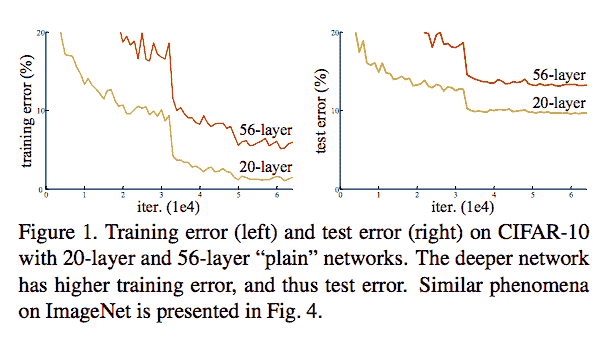
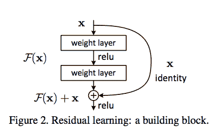
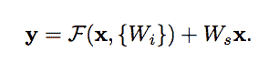
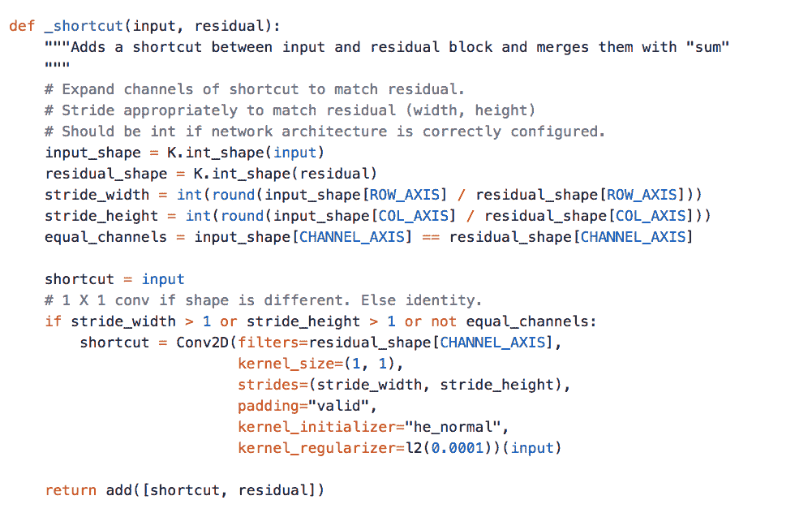
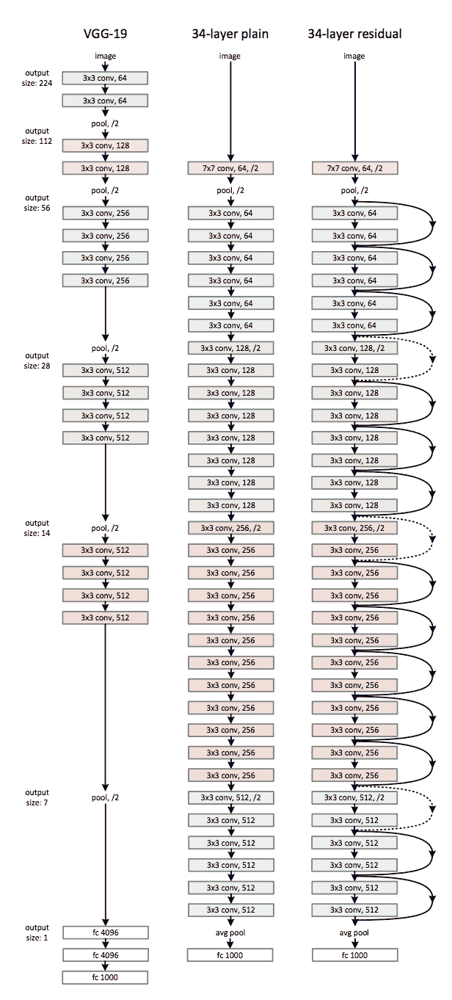
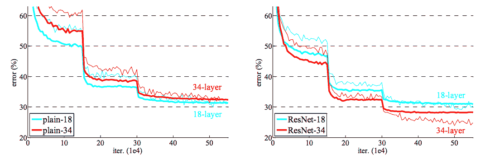
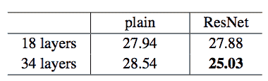

# ResNets 简介

> 原文：<https://towardsdatascience.com/introduction-to-resnets-c0a830a288a4?source=collection_archive---------1----------------------->

‘We need to go Deeper’ Meme, classical CNNs do not perform well as the depth of the network grows past a certain threshold. ResNets allow for the training of deeper networks.

本文基于何等人【2】(微软研究院)的图像识别深度残差学习

2012 年，Krizhevsky 等人[1]为深度卷积神经网络铺上了红地毯。这是该架构第一次比 ImageNet 上的传统手工特征学习更成功。他们的 DCNN 被命名为 AlexNet，包含 8 个神经网络层，5 个卷积层和 3 个全连接层。这为传统的 CNN 奠定了基础，卷积层之后是激活函数，之后是最大池操作(有时池操作被省略以保持图像的空间分辨率)。

深度神经网络的大部分成功都归功于这些附加层。其功能背后的直觉是这些层逐渐学习更复杂的特征。第一层学习边缘，第二层学习形状，第三层学习物体，第四层学习眼睛，以此类推。尽管《盗梦空间》电影中人工智能社区共享的流行模因声称“我们需要更深入”，但何等人[2]从经验上表明，传统 CNN 模型存在深度的最大阈值。

何等人[2]绘制了 20 层 CNN 与 56 层 CNN 的训练和测试误差。这个图挑战了我们的信念，即增加更多的层将创建一个更复杂的函数，因此失败将被归因于过度拟合。如果是这种情况，额外的正则化参数和算法，如 dropout 或 L2 范数，将是修复这些网络的成功方法。然而，该图显示 56 层网络的训练误差高于 20 层网络，突出了解释其失败的不同现象。

*有证据表明，使用卷积和全连接层的最佳 ImageNet 模型通常包含 16 到 30 层。*

56 层 CNN 的失败可以归咎于优化功能、网络初始化或著名的消失/爆炸梯度问题。消失梯度尤其容易被归咎于此，然而，作者认为批量标准化的使用确保了梯度具有健康的规范。在众多解释为什么深层网络比浅层网络表现更好的理论中，有时最好是寻找经验结果来解释，并从那里反向工作。通过引入新的神经网络层— **残差块，训练非常深的网络的问题得到了缓解。**

上图是这篇文章要学习的最重要的东西。对于希望快速实现并测试它的开发人员来说，要理解的最重要的修改是“跳过连接”，即身份映射。这个身份映射没有任何参数，只是将前一层的输出添加到前面的层。然而，有时 x 和 F(x)不会有相同的维数。回想一下，卷积运算通常会缩小图像的空间分辨率，例如，32 x 32 图像上的 3×3 卷积会产生 30 x 30 图像。恒等式映射乘以线性投影 W 以扩展捷径的通道来匹配残差。这允许将输入 x 和 F(x)合并作为下一层的输入。

*当 F(x)和 x 具有不同维数时使用的等式，例如 32x32 和 30x30。这个 Ws 项可以用 1x1 卷积实现，这给模型引入了额外的参数。*

使用来自[的 keras 实现快捷方式块 https://github . com/raghakot/keras-resnet/blob/master/resnet . py](https://github.com/raghakot/keras-resnet/blob/master/resnet.py)。这种快捷连接基于后续论文“深度剩余网络中的身份映射”中更高级的描述[3]。

*这里可以找到 keras 中剩余网络的另一个伟大实现* →

*   [https://gist . github . com/mjdietzx/0cb 95922 AAC 14d 446 a 6530 f 87 B3 a 04 ce](https://gist.github.com/mjdietzx/0cb95922aac14d446a6530f87b3a04ce)

层之间的跳过连接将先前层的输出添加到堆叠层的输出。这使得能够训练比以前更深的网络。ResNet 架构的作者在 CIFAR-10 数据集上用 100 和 1，000 个层测试了他们的网络。他们在具有 152 层的 ImageNet 数据集上进行测试，该数据集仍然比 VGG 网络[4]具有更少的参数，后者是另一种非常流行的深度 CNN 架构。深度残差网络的集合在 ImageNet 上实现了 3.57%的错误率，在 ILSVRC 2015 分类竞赛中获得了第一名。

一种类似的方法被称为“高速公路网”。这些网络也实现跳跃连接，然而，类似于 LSTM，这些跳跃连接通过参数门。这些门决定了有多少信息通过跳过连接。作者指出，当门接近关闭时，层表示非剩余函数，而 ResNet 的标识函数从不关闭。根据经验，作者注意到，高速公路网络的作者没有显示出他们用 ResNets 显示的网络深度的准确性收益。

他们用来测试跳过连接的架构遵循了 2 个启发自 VGG 网络的启发[4]。

1.  如果输出特征图具有相同的分辨率，例如 32×32→32×32，那么滤波器图深度保持不变
2.  如果输出特征图大小减半，例如 32 x 32 → 16 x 16，则过滤器图深度加倍。

总的来说，34 层剩余网络的设计如下图所示:

*In the image above, the dotted skip connections represent multiplying the identity mapping by the Ws linear projection term discussed earlier to align the dimensions of the inputs.*

*Training Results of the Architectures Shown Above: The straight line depicts training error and the static line depicts testing error. The 34-layer ResNet achieves sub 30% error rate, unlike the Plain Network on the left plot. The 34-Layer ResNet outperforms the 18-Layer ResNet by 2.8%.*

Table Showing Testing Error of the different depths and the use of Residual Connections

总之，跳过连接是深度卷积网络的一个非常有趣的扩展，经验表明它可以提高 ImageNet 分类的性能。这些层也可以用于需要深度网络的其他任务，例如定位、语义分割、生成对抗网络、超分辨率等。残差网络不同于 LSTMs，LSTMs 门控先前的信息，使得不是所有的信息都通过。此外，本文中显示的跳过连接基本上安排在 2 层块中，它们不使用从相同的第 3 层到第 8 层的输入。残差网络更类似于注意力机制，因为它们模拟与输入相反的网络内部状态。希望这篇文章是对 ResNets 有用的介绍，感谢阅读！

**参考文献**

[1]亚历克斯·克里热夫斯基、伊利亚·苏茨基弗、杰弗里·e·辛顿。基于深度卷积神经网络的图像网分类。2012.

[2]何、、任、。用于图像识别的深度残差学习。2015.

[3]，何，，，任，.深剩余网络中的身份映射。2016.

[4]卡伦·西蒙扬，安德鲁·齐泽曼。用于大规模图像识别的非常深的卷积网络。2014.