# RNNs 介绍，序列到序列语言翻译及注意事项

> 原文：<https://towardsdatascience.com/introduction-to-rnns-sequence-to-sequence-language-translation-and-attention-fc43ef2cc3fd?source=collection_archive---------9----------------------->

这篇文章的目标是简要介绍 RNNs(递归神经网络)，序列到序列语言翻译(seq2seq)和注意力。我会尽量使它简单。你只需要知道:

1.  [线性代数](http://cs229.stanford.edu/section/cs229-linalg.pdf)
2.  [神经网络](/comprehensive-introduction-to-neural-network-architecture-c08c6d8e5d98)

如果你对这些主题感到生疏，在开始阅读之前，请点击上面的链接，随意查看。

我记得当我第一次学习前馈神经网络时，我对自己说，有可能以更好的方式建立这个神经元网络吗？因为在人脑中，神经元的连接方式比前馈神经网络更复杂。事实证明，研究人员不断找到新的方法来排列神经元，让它们做一些有用的事情。rnn 就是其中之一。

在神经网络中，每个输入有一个输出。例如，你有一个图像和一个标签。你不可能在神经网络上输入一幅又一幅图像，然后得到基于所有图像的输出。神经网络的性质使它们无法处理顺序数据。

另一方面，rnn 非常适合处理顺序数据。它们有一种“记住”先前输入并基于所有输入产生输出的机制。这使得它们非常适合序列类型的数据，如文本、音频、视频或任何时序数据。

下图显示了 RNNs 的五种变体。红色向量是输入，而蓝色向量是输出。第一种是一个输入到一个输出的情况。本质上是一个神经网络。其他的能够顺序输入和输出，例如:

**一对多:**图片- >字幕句子
**多对一:**句子- >情绪(正面/负面标签)
**多对多:**英语中的一个句子- >土耳其语中的一个句子
**其他多对多:**视频的帧- >对象周围边界框的坐标

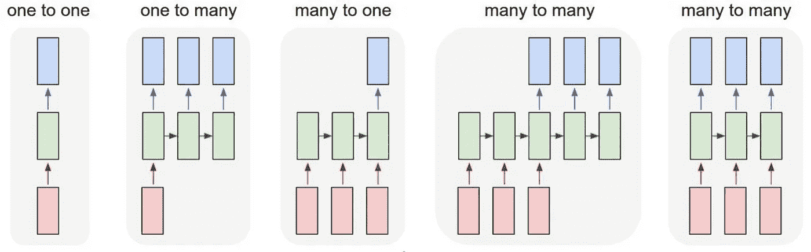

让我们通过查看具有一个隐藏层的前馈神经网络来开始深入了解。由于每一层本质上都是线性变换，因此是矩阵乘法，我用矩阵形式的一组参数来表示每一层的操作。

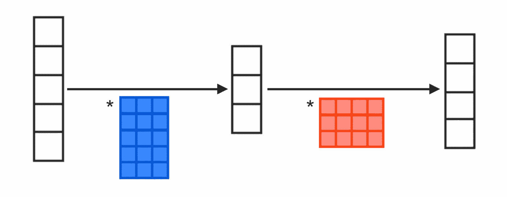

大小为 5 的输入经过与 5×3 矩阵的矩阵乘法，产生隐藏层的输入，大小为 3 的向量。然后，它乘以一个 3x4 矩阵，产生 4 的输出。注意这里大小为 3 的向量。在 RNNs 中，我们称之为*隐藏状态。*

让我们来看看稍微修改后的版本。我们只添加了虚线矩形内的区域。此外，我们还增加了一个参数矩阵，在本例中为 3x3。实际情况是，我们从底部增加了一个输入。所有输入都需要相同的大小。因为它也经历了和底部一样的蓝色矩阵乘法。请注意，我们之前的隐藏输出在与新输入组合之前会乘以一个方阵。我们永远不知道那是什么操作。这只是 RNN 在训练时学会自己做的事情。

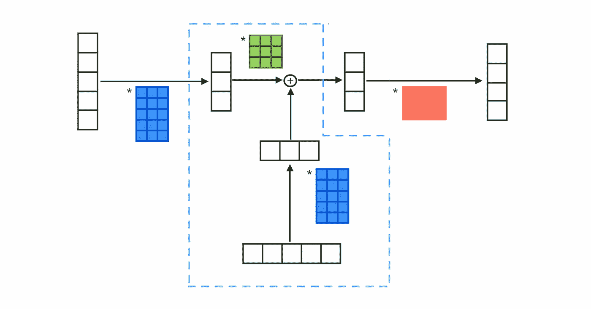

现在，让我们扩展虚线区域，使其成为一个循环。这样，输入可以是大于或等于 1 的任何大小。

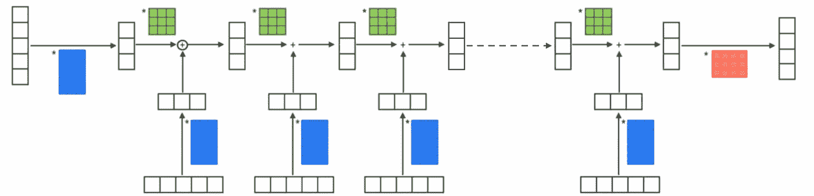

我们本质上所做的是，我们将一个递归公式应用于序列中的每个输入。我们最后得到的取决于整个输入序列。

注意:在每个时间步使用相同的函数和相同的参数集。

深入研究:

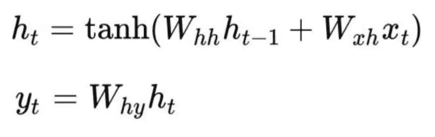

用我们最初的参数来描绘它:

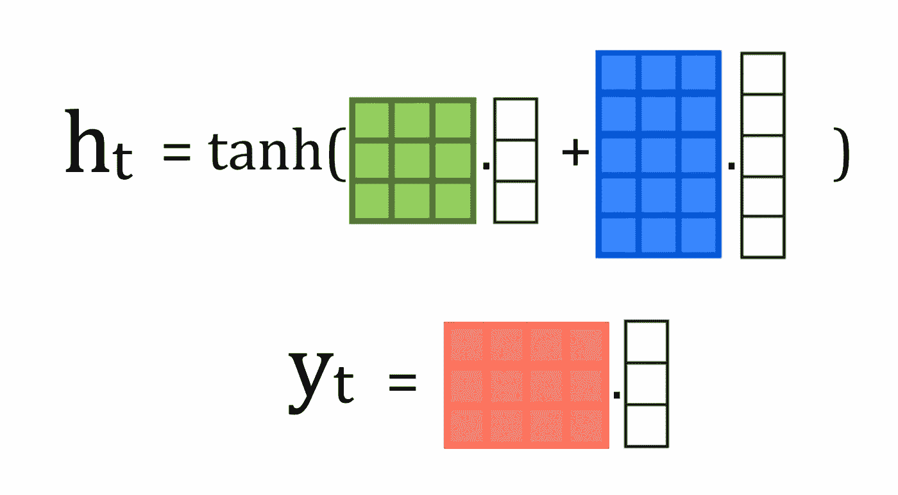

你刚刚读到的是对普通 RNNs 的解释，它是 RNNs 的最基本形式。这很容易学，但是，他们很难训练。原因是，隐藏状态中的值倾向于指数爆炸或消失。更先进的 rnn，如 LSTM 和 GRUs，通过采用更复杂的机制来缓解这一问题。Michael Nguyen 在 LSTMs 和 GRUs 上发表了一篇精彩的博文。我强烈建议你去看看，以便进一步阅读。

# 第 2 部分:带单词的 RNNs:语言模型

给定一个单词序列，语言模型试图预测下一个单词。起初听起来可能没什么用，就像我一样。然而，它们通常是其他更有用的自然语言处理系统的组件。

让我们看一个与我们的香草 RNN 非常相似的图表。

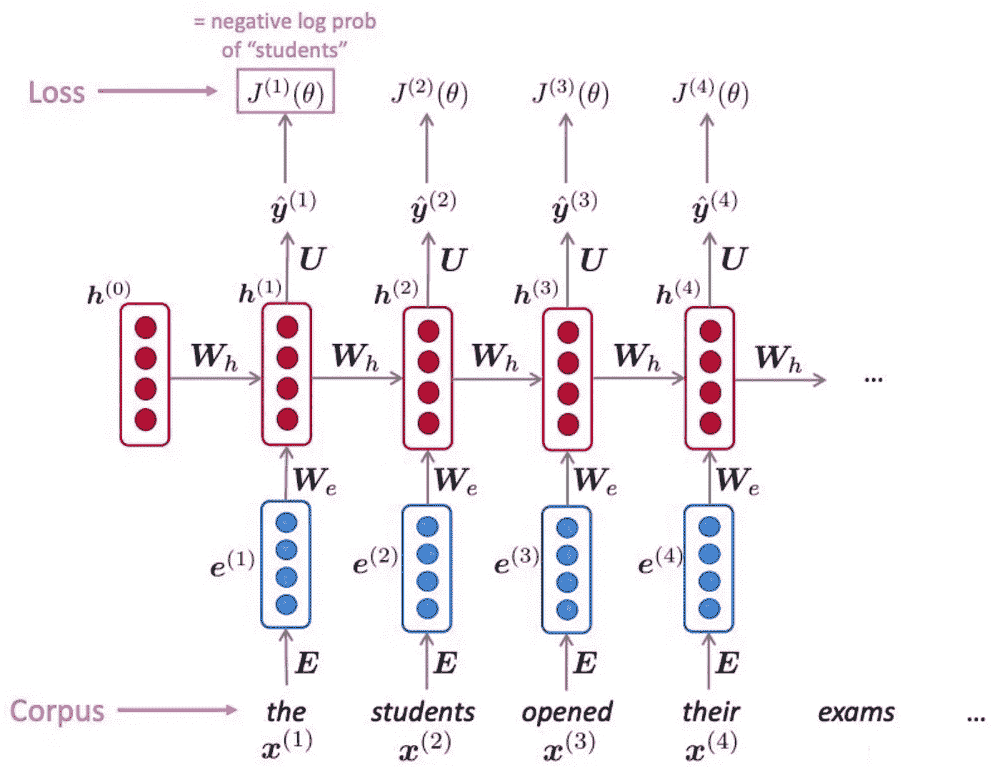

这里，RNN 的输入是单词嵌入，而不是实际的单词。如果你不知道什么是单词嵌入，可以考虑哈希函数，但是对于向量来说。嵌入将词汇表示为低维向量，而不是将词汇表示为一次性编码向量。由于向量维数较低，它提供了更快的线性运算的好处。这就是图中 *E* 的意思。

We、Wh 和 U 分别是前面图中的蓝色、绿色和橙色矩阵。此图描述了语言模型的训练。“学生打开他们的考试…”来自训练语料库；这句话确实存在。我们通过比较 y_hat^(1 和 x^(2、y_hat^(2 和 x^(3 等对的损失函数来惩罚语言模型。请注意，当我们向右移动时，model 也保持隐藏状态，以便跟踪过去的单词。

经过一段时间的训练后，语言模型可以通过反复预测下一步来生成文本。注意，预测的单词 y_hat^(i 是下一步操作的输入。

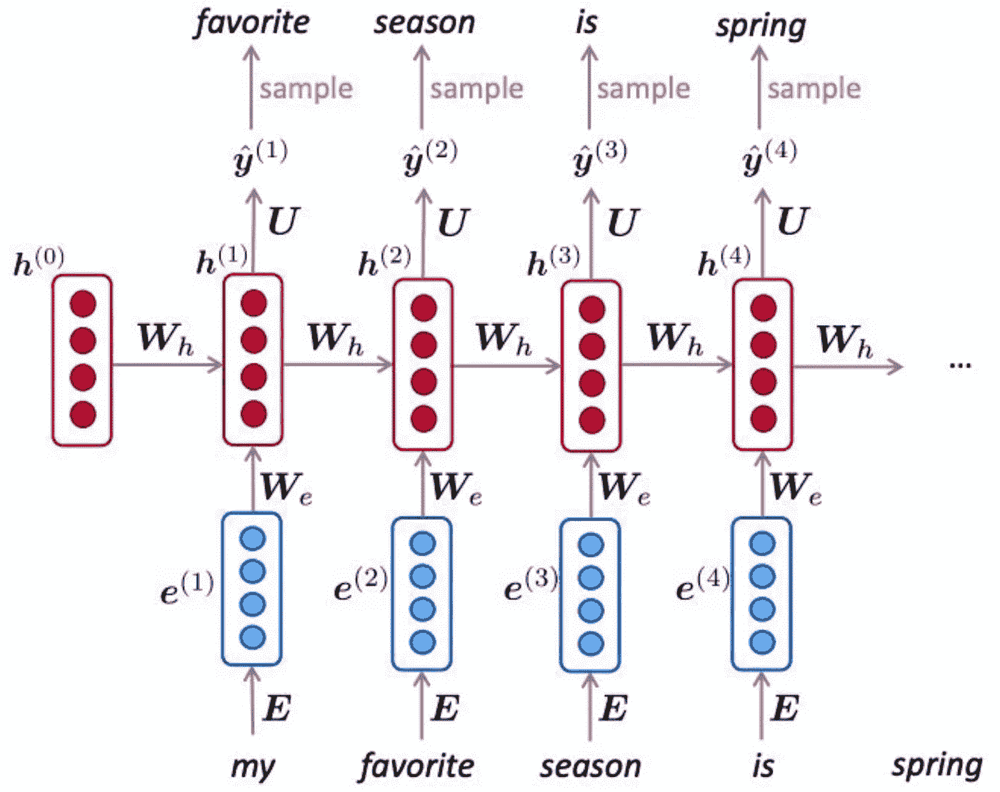

# 第 3 部分:序列到序列的机器翻译

rnn 也有能力做自然语言翻译，又名。机器翻译。它涉及两个 rnn，一个用于源语言，一个用于目标语言。其中一个叫做*编码器，*，另一个叫做*解码器。*原因是，第一个将句子编码成向量，第二个将编码的向量转换成目标语言的句子。

## 编码器

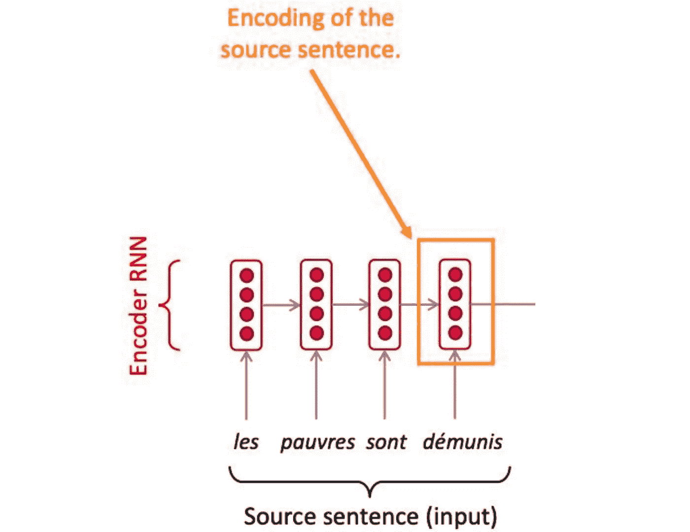

编码器是一个 RNN。给定源句子，它产生一个编码。注意这里 RNNs 的好处。输入句子的大小可以是任意大小。

## 解码器

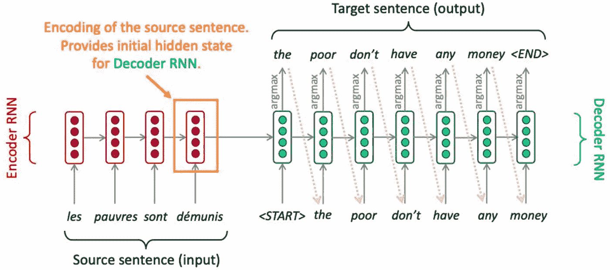

解码器是一个独立的 RNN。给定编码的句子，它产生目标语言的翻译句子。注意紫色的虚线箭头。每个预测的单词都是下一个预测的输入。这是 rnn 的重复性质，我很感兴趣的是，它们可以通过这样的连接来做重要的工作，如语言翻译。

在解码器的每一步，给定隐藏状态和输入单词向量作为输入，单词概率分布的 argmax 被选择作为最可能的单词。这就是所谓的贪婪解码。问题是，解码器是一个接一个的。在某一点上，如果句子没有意义，它就不能返回。

此外，用一个向量编码的整个句子很难翻译成一个句子。在编码步骤之后，它实质上是从句子到向量的映射。解码器很难推导出目标语言中单词的顺序。这就是注意力发挥作用的地方。

# 第 4 部分:注意

注意力让解码者将注意力集中在每个输出单词的输入句子的特定部分。这有助于输入和输出句子彼此对齐。

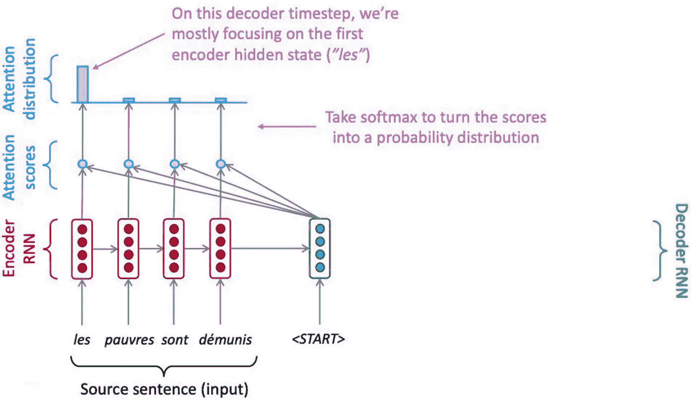

在图中，蓝色的椭圆只是带有句子编码和隐藏状态的点积。

对于上面的法语句子，关注度最高的属于“les”。这将导致解码器以“the”开始翻译的句子。当我第一次看到那个图的时候，我想，如果正确的翻译是从“pauvres”开始的，解码器就不可能得到正确的翻译。然而，由于这个神经网络应该是端到端训练的，它也将学习产生正确的注意力分数。

# 结束语

对于完全的初学者来说，这可能是一篇短文中的大量信息。瑞秋·托马斯在 USF 大学的一堂课上介绍 RNN 的方式激发了我写这篇博客的灵感。我想从高层次上总结一下我感兴趣的东西。如果你有任何问题，请随时联系我！🎉 🎊