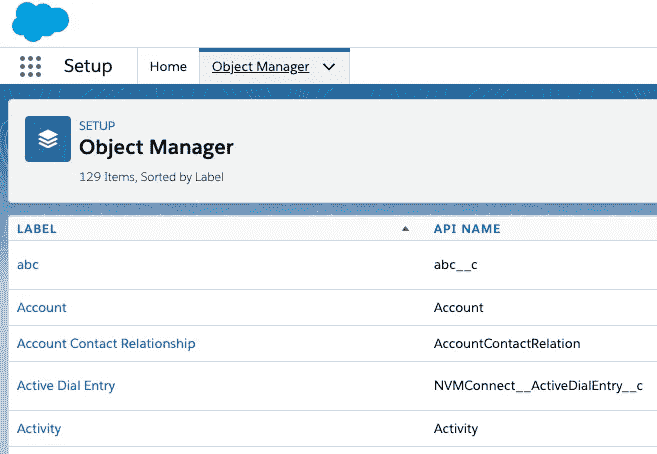

# 使用 Python 的 SalesForce 对象查询语言(SOQL)简介

> 原文：<https://towardsdatascience.com/introduction-to-salesforce-object-query-language-soql-with-python-1448d497cf2c?source=collection_archive---------23----------------------->


Photo by [Denys Nevozhai](https://unsplash.com/@dnevozhai?utm_source=medium&utm_medium=referral) on [Unsplash](https://unsplash.com?utm_source=medium&utm_medium=referral)

SalesForce 有自己的 SQL 语言，理解起来有点棘手。但是有时候就是这样。

**SalesForce 对象查询语言示例**

我们来分解一下。如果您以前使用过 SQL 查询，并且了解它们是如何工作的，那么这将更有意义。

在 SalesForce 中，我们有 ***对象*** *，*这相当于 SQL 中的数据库表。
我们还有 ***字段*** *，*等同于数据库中的列。
那么我们有 ***记录*** ，代表数据库中的行。理想情况下，它应该是这样的:

```
SELECT {*fields*} FROM *object* WHERE condition
```

为了理解 SOQL 查询，我们需要了解所有这些数据存储在哪里。我将使用一个名为`simple_salesforce`的 Python 模块。如果你还没有看我这篇关于如何获取 SalesForce 数据的文章，你可以在这里 查看 [***。我们实际上不能使用 Python 来查找对象，所以这里有一个关于如何查找对象的小指南***](/using-python-to-get-salesforce-data-97bb5a7ef2cf)

**我在哪里可以找到 SOQL 对象？** 1。登录 SalesForce
2。右上角应该有一个齿轮图标，点击那个
3。出现下拉菜单，点击设置
4。在标题上，点击对象管理器
5。将填充一个对象列表



List of first 5 objects

我在哪里可以找到 SOQL 字段？
这个我们就用 Python 和`simple_salesforce`了。我们希望使用 Python 模块登录，然后我们将在 SalesForce 对象上使用`.describe`方法。对于本例，我们将在对象帐户上使用它。所以像这样的代码就足够了:

**我在哪里可以找到 SOQL 记录？** 我们现在可以完整地编写 SalesForce 查询以便检索记录。我们现在可以把它添加到前面代码的末尾，我们也可以导入`pandas`来把它转换成数据帧。

这只是一个关于如何从 SalesForce 提取数据的小教程。我们可以探索更多的对象和领域。

我在这里也有家教和职业指导！

如果你喜欢这些内容，请随时在 [Patreon](https://www.patreon.com/join/melvfnz) 上支持我！

如果你们有任何问题、意见或担忧，请不要忘记通过 LinkedIn 与我联系！