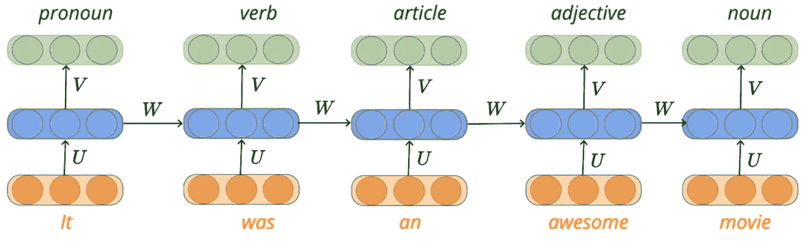

# 序列建模问题介绍

> 原文：<https://towardsdatascience.com/introduction-to-sequence-modeling-problems-665817b7e583?source=collection_archive---------8----------------------->

Photo by [Nick Fewings](https://unsplash.com/@jannerboy62?utm_source=medium&utm_medium=referral) on [Unsplash](https://unsplash.com?utm_source=medium&utm_medium=referral)

考虑基于多个健康参数预测一个人的健康风险的问题，我们决定使用前馈神经网络(也称为**多层神经元网络**)对输入和输出之间的真实关系进行建模。

在前向神经网络(FNN)中，一个数据点的输出完全独立于先前的输入，即…第二个人的健康风险不依赖于第一个人的健康风险，依此类推。

类似地，在卷积神经网络(CNN)的情况下，在图像分类的上下文中来自 softmax 层的输出完全独立于先前的输入图像。

FNN 和 CNN 的特点是:

*   输出独立于先前的输入。
*   输入是固定长度的。

> **引用说明:**本文的内容和结构是基于我对四分之一实验室——[pad hai](https://padhai.onefourthlabs.in/)深度学习讲座的理解。

# 序列建模

序列建模是预测下一个单词/字母的任务。与 FNN 和 CNN 不同，在序列建模中，当前输出依赖于先前输入，并且输入的长度不固定。

在这一节中，我们将讨论序列建模的一些实际应用。

# 自动完成

让我们看看序列建模环境中的自动完成问题。在这个问题中，每当我们键入一个字符( **d** )时，系统试图根据先前键入的字符来预测下一个可能的字符。

换句话说，假设我们已经输入了' **d** '，网络试图从可能的 26 个英文字母中预测下一个字符。神经网络将具有大小为 26 的 softmax 输出，表示给定前一个字母的下一个字母的概率。由于这个网络的输入是字符，我们需要将它们转换成大小为 26 的独热编码向量，并且对应于字母表的索引的元素将被设置为 1，其他的都被设置为 0。

# 词性标注

在词性标注的问题中，我们给定了每个单词的单词序列，我们需要预测该单词的词性标签(例如:动词、名词、代词等……)。同样在这个问题中，输出不仅依赖于当前输入(当前字)，还依赖于先前的输入。例如，如果我们知道前面的单词是形容词，那么将单词“movie”标记为名词**的概率会更高。**

# 序列分类

> 我们需要在每个时间步产生输出吗？

假设你想通过分析影评来预测电影的脉搏。在这种情况下，我们不需要在输入的每个单词后输出，而是我们只需要在阅读整个句子后理解情绪，即…积极或消极。用机器学习从一段文字中理解情绪，叫做**情感分析**。

# 序列学习问题建模

在上一节中，我们已经了解了序列学习问题的实际应用，但是我们如何对这样的问题建模呢？。

在序列学习问题中，我们知道时间步长“t”的真实输出取决于模型在时间步长“t”之前看到的所有输入。由于我们不知道真实的关系，我们需要得出一个近似值，使函数依赖于所有以前的输入。

这里要注意的关键点是，无论我们是预测下一个字符还是标记一个单词的词性，这项任务在每个时间步都不会改变。该函数的输入在每个时间步长都是变化的，因为对于较长的句子，该函数需要跟踪较大的单词集。

换句话说，我们需要定义一个具有以下特征的函数:

*   确保输出 Yt 取决于先前的输入
*   确保函数可以处理可变数量的输入
*   确保在每个时间步执行的功能是相同的。

# 递归神经网络

**递归神经网络(RNN)** 是一种神经网络，前一步的输出作为当前步骤的输入。

在 RNN，你可以看到第一个时间步的输出和原始输入一起被输入到下一个时间步。

该功能的输入以橙色表示，并表示为 **xᵢ** 。使用向量 **U** 来表示与输入相关联的权重，并且将单词的隐藏表示( **sᵢ)** 计算为先前时间步长的输出和当前输入以及偏差的函数。隐藏表示的输出( **sᵢ)** 由下面的等式给出，

一旦我们计算了输入的隐藏表示，来自网络的最终输出( **yᵢ** )是隐藏表示和与其关联的权重以及偏差的 softmax 函数。我们能够提出一个近似函数，它能够满足我们为解决序列学习问题而设定的所有三个条件。

# 继续学习

如果你想用 Keras & Tensorflow 2.0 (Python 或者 R)学习更多关于人工神经网络的知识。查看来自 [Starttechacademy](https://courses.starttechacademy.com/full-site-access/?coupon=NKSTACAD) 的 Abhishek 和 Pukhraj 的[人工神经网络](https://courses.starttechacademy.com/full-site-access/?coupon=NKSTACAD)。他们以一种简单化的方式解释了深度学习的基础。

# 结论

在本文中，我们简要地看了前馈神经网络和卷积神经网络的局限性，以根据它们的特性来处理变化输入的任务。之后，我们继续讨论序列建模的一些实际应用。然后，我们研究了一种新型的神经网络，它可以帮助我们对序列学习问题进行建模。

*推荐阅读*

 [## 用 Pytorch 解释神经网络中的批量归一化和丢失

### 在本文中，我们将以简单的方式讨论神经网络中的批处理规范化和丢失。

towardsdatascience.com](/batch-normalization-and-dropout-in-neural-networks-explained-with-pytorch-47d7a8459bcd)  [## 用 Pytorch 可视化卷积神经网络

### 可视化 CNN 过滤器并对输入进行遮挡实验

towardsdatascience.com](/visualizing-convolution-neural-networks-using-pytorch-3dfa8443e74e) 

在我的下一篇文章中，我们将深入讨论递归神经网络及其学习算法。所以，请务必在 Medium 上跟随我，以便在它下跌时得到通知。

直到那时，和平:)

NK。

# 作者简介

Niranjan Kumar 是好事达印度公司的高级数据科学顾问。他对深度学习和人工智能充满热情。除了在媒体上写作，他还作为自由数据科学作家为 Marktechpost.com 写作。点击查看他的文章[。](https://www.marktechpost.com/author/niranjan-kumar/)

你可以在 [LinkedIn](https://www.linkedin.com/in/niranjankumar-c/) 上与他联系，或者在 [Twitter](https://twitter.com/Nkumar_283) 上关注他，了解关于深度学习和机器学习的最新文章。

**参考文献:**

*   [了解 LSTM 网络](http://colah.github.io/posts/2015-08-Understanding-LSTMs/)
*   斯坦福大学——语言模型和 rnn

**免责声明** —这篇文章中可能有一些相关资源的附属链接。你可以以尽可能低的价格购买捆绑包。如果你购买这门课程，我会收到一小笔佣金。