# Spark NLP 简介:基础和基本组件

> 原文：<https://towardsdatascience.com/introduction-to-spark-nlp-foundations-and-basic-components-part-i-c83b7629ed59?source=collection_archive---------1----------------------->


Photo by [James Harrison](https://unsplash.com/@jstrippa?utm_source=medium&utm_medium=referral) on [Unsplash](https://unsplash.com?utm_source=medium&utm_medium=referral)

**这是一系列博客文章中的第一篇，旨在帮助数据科学家和 NLP 从业者从头开始学习* [*Spark NLP*](https://nlp.johnsnowlabs.com/) *库的基础知识，并轻松将其集成到他们的工作流中。在本系列中，我们将尽最大努力制作高质量的内容和清晰的说明，并附上 Python 和 Scala 中关于 Spark NLP 最重要特性的代码。通过这些文章，我们旨在通过用代码和指令触及所有的实际问题和痛点，使 Spark NLP 库的底层概念尽可能清晰。最终目的是让观众在短时间内上手这个神奇的库，平滑学习曲线。希望读者至少对 Python 和 Spark 有一个基本的了解。*

# 1.为什么我们需要另一个 NLP 库？

自然语言处理(NLP)是许多数据科学系统中的关键组件，必须理解或推理文本。常见的用例包括问题回答、解释或总结、情感分析、自然语言 BI、语言建模和消歧。

NLP 在越来越多的人工智能应用中是必不可少的。如果你正在建立一个聊天机器人，搜索专利数据库，将病人与临床试验相匹配，给客户服务或销售电话评分，从财务报告中提取事实或解决 17 个行业的 44 个用例中的任何一个[，从自由文本中提取准确的信息是必不可少的。](https://www.tractica.com/newsroom/press-releases/natural-language-processing-is-a-key-engine-of-ai-market-growth-enabling-44-discrete-use-cases-across-17-industries/)

由于近年来 NLP 的流行和对数据科学的大肆宣传，出现了许多优秀的 NLP 库，甚至数据科学新手也开始使用这些开源库尝试各种 NLP 技术。这里是最流行的 NLP 库，它们在社区和不同的开发水平下被大量使用。

*   [自然语言工具包(NLTK)](https://www.nltk.org/) :所有 NLP 技术的完整工具包。
*   [TextBlob](https://textblob.readthedocs.io/en/dev/) :易于使用的 NLP 工具 API，构建在 NLTK 和 Pattern 之上。
*   [SpaCy](https://spacy.io/) :用 Python 和 Cython 的工业级实力 NLP。
*   [Gensim](https://radimrehurek.com/gensim/) :人类主题建模
*   [斯坦福核心 NLP](https://stanfordnlp.github.io/CoreNLP/) :斯坦福 NLP 集团的 NLP 服务和套餐。
*   [Fasttext](https://fasttext.cc/) :由脸书人工智能研究(FAIR)实验室创建的学习单词嵌入和句子分类的 NLP 库

显然，在 NLP 的一般领域中有更多的库——但是我们在这里关注的是通用库，而不是迎合特定用例的库。考虑到所有这些库，你可能会问为什么我们还需要另一个 NLP 库。

我们将尝试在以下主题下回答这个问题:

**答:满足您所有 NLP 需求的单一统一解决方案**

当您想要交付可扩展、高性能和高精度的 NLP 支持的软件用于实际生产时，这些库中没有一个提供统一的解决方案。

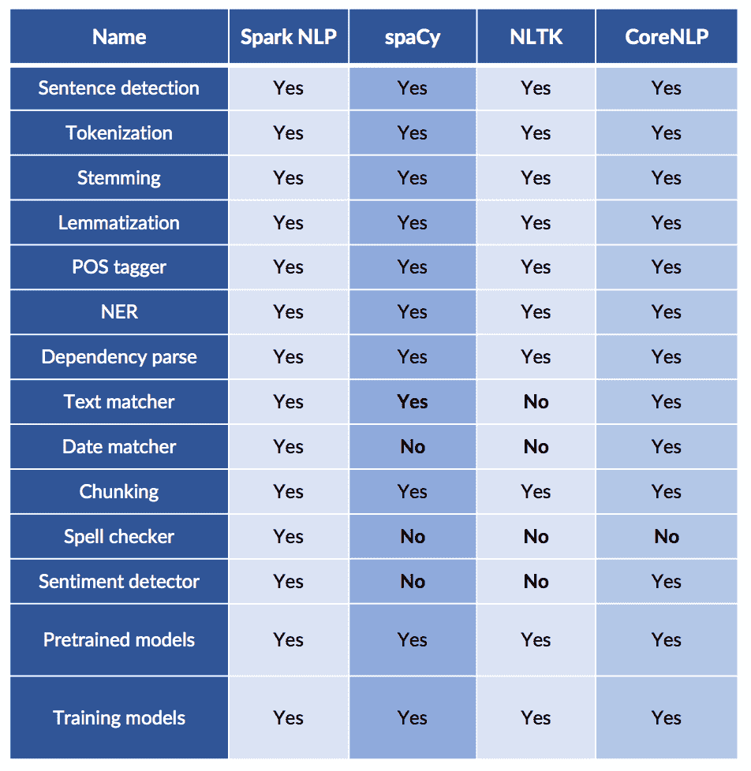

请记住，任何 NLP 管道都只是更大的数据处理管道的一部分:例如，问题回答涉及加载训练数据、转换数据、应用 NLP 注释器、构建功能、训练值提取模型、评估结果(训练/测试分割或交叉验证)以及超参数估计。我们需要一个一体化的解决方案来减轻文本预处理的负担，并在使用 NLP 解决数据科学问题的各个步骤之间建立联系。因此，我们可以说，一个好的 NLP 库应该能够正确地将自由文本转换为结构化特征，并让您训练自己的 NLP 模型，这些模型可以轻松地输入到下游的机器学习(ML)或深度学习(DL)管道中。

**b .利用迁移学习，实现 NLP 研究中最新最棒的算法和模型**

迁移学习是一种从源设置中提取知识并将其应用于不同目标设置的方法，它是一种非常有效的方法来不断提高 NLP 模型的准确性，并通过利用一些相关任务或领域的已有标记数据，即使在小数据的情况下也能获得可靠的准确性。因此，没有必要为了训练一个最先进的模型而积累数百万个数据点。

在过去的几年中，NLP 领域正在发生巨大的变化，现代工业规模的 NLP 库应该能够实现最新和最伟大的算法和模型——这并不容易，因为 NLP 正在经历其 [ImageNet 时刻](https://thegradient.pub/nlp-imagenet/)并且最先进的模型正被[超过一个月两次](https://nlpprogress.com/)。

词向量作为 NLP 核心表示技术的长期统治已经出现了一系列令人兴奋的新挑战者，如 [ELMo](https://arxiv.org/abs/1802.05365) 、 [BERT](https://arxiv.org/abs/1810.04805) 、 [RoBERTa](https://arxiv.org/abs/1907.11692) 、 [ALBERT](https://openreview.net/pdf?id=H1eA7AEtvS) 、 [XLNet](https://arxiv.org/abs/1906.08237) 、 [Ernie](http://arxiv.org/abs/1905.07129) 、 [ULMFiT](https://arxiv.org/abs/1801.06146) 、 [OpenAI transformer](https://s3-us-west-2.amazonaws.com/openai-assets/research-covers/language-unsupervised/language_understanding_paper.pdf) ，它们都是开源的，包括预训练的模型，可以在没有这些作品[上了](https://blog.openai.com/language-unsupervised/) [头条](https://techcrunch.com/2018/06/15/machines-learn-language-better-by-using-a-deep-understanding-of-words/)，证明了预先训练的语言模型可以用来在广泛的自然语言处理任务上实现最先进的结果，有时甚至超过人类水平的基准。

c .缺少 Spark 完全支持的 NLP 库

作为一个通用的内存分布式数据处理引擎， [Apache Spark](https://spark.apache.org/) 获得了业界的广泛关注，并且已经拥有了自己的 ML 库( [SparkML](https://spark.apache.org/docs/latest/ml-guide.html) )和其他一些用于特定 NLP 任务的模块，但是它并没有涵盖拥有一个成熟解决方案所需的所有 NLP 任务。当您尝试在管道中使用 Spark 时，通常需要使用其他 NLP 库来完成某些任务，然后尝试将中间步骤反馈给 Spark。但是，将您的数据处理框架从 NLP 框架中分离出来意味着您的大部分处理时间都花费在来回序列化和复制字符串上，并且效率非常低。

**d .交付任务关键型企业级 NLP 库**

今天许多最流行的 NLP 包都有学术渊源——这表现在设计权衡中，它们更倾向于原型化的简易性而不是运行时性能，选择的广度而不是简单的极简 API，以及淡化可伸缩性、错误处理、节省内存消耗和代码重用。

该库已经在企业项目中使用，这意味着第一级的错误、重构、意外瓶颈和序列化问题已经解决。单元测试覆盖率和[参考文档](https://nlp.johnsnowlabs.com/docs/en/quickstart)的水平让我们可以放心地将代码开源。

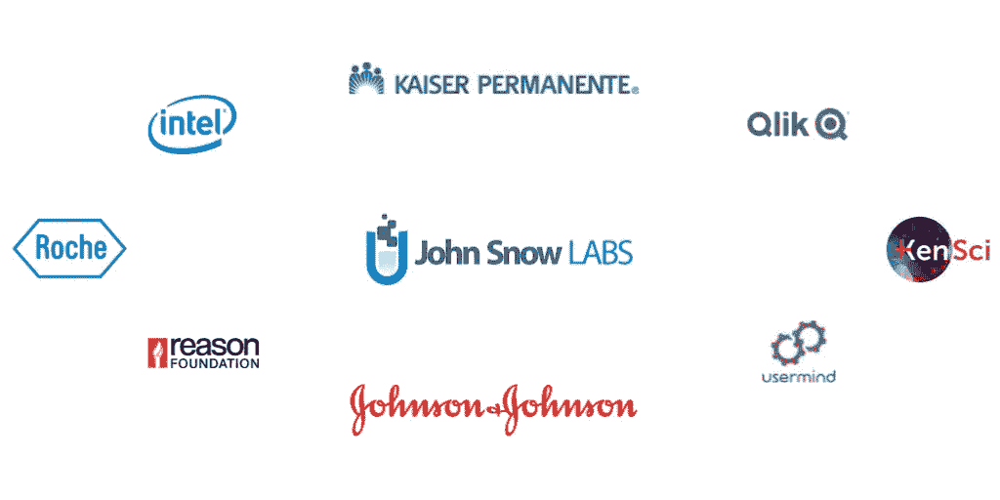

Spark NLP is already in use in enterprise projects for various [use cases](https://www.johnsnowlabs.com/nlp-case-studies/)

总之，我们迫切需要一个 NLP 库，它是简单易学的 API，可以用您最喜欢的编程语言编写，支持您需要的人类语言，速度非常快，并且可以扩展到大型数据集，包括流和分布式用例。

考虑到所有这些问题、流行的 NLP 库的局限性和行业的最新趋势， [John Snow Labs](https://www.johnsnowlabs.com) ，一家帮助医疗保健和生命科学组织更快地将人工智能投入工作的全球人工智能公司，决定率先开发 Spark NLP 库。

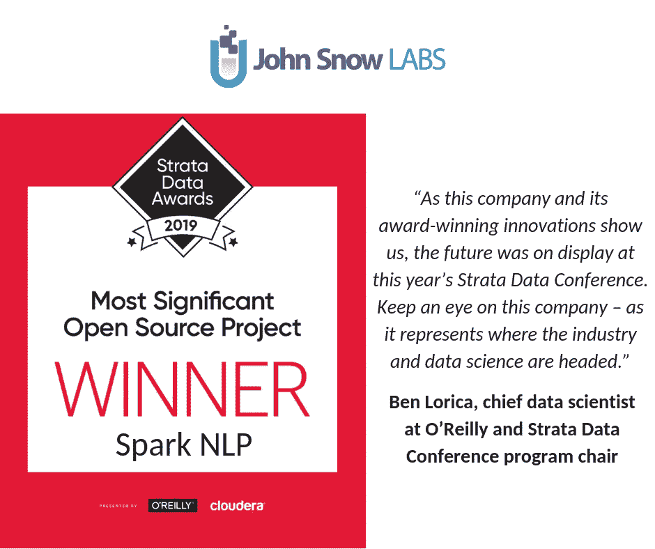

[约翰·斯诺实验室](http://www.johnsnowlabs.com/)是一家[获奖的](https://www.johnsnowlabs.com/press-awards/)数据分析公司，领导并赞助了 Spark NLP 库的开发。该公司为其提供商业支持、赔偿和咨询。这为该库提供了长期的资金支持、有资金支持的活跃开发团队，以及不断增长的推动健壮性和路线图优先级的真实项目流。

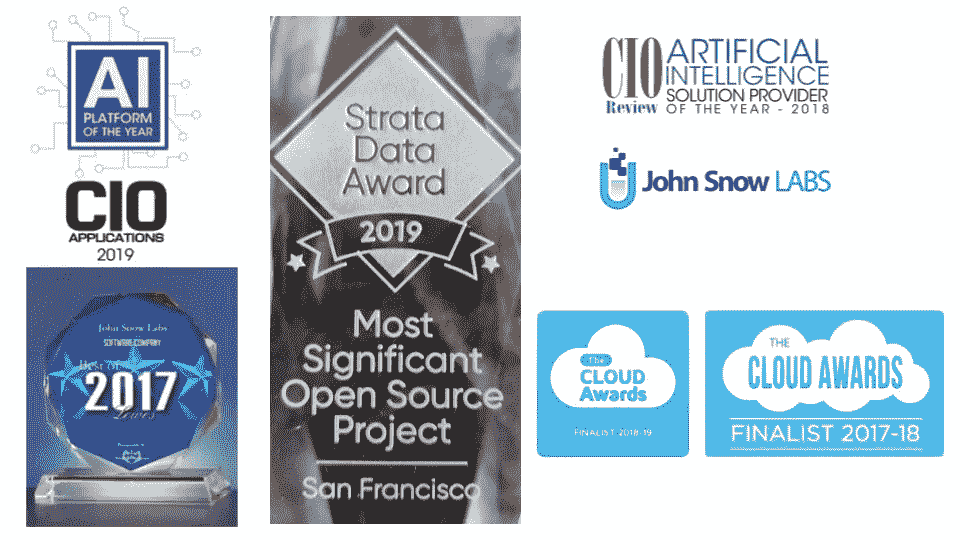

John Snow Labs is a recipient of several awards in Data Analytics

# 2.什么是 Spark NLP？

Spark NLP 是一个开源的自然语言处理库，构建在 Apache Spark 和 Spark ML 之上。它提供了一个简单的 API 来集成 ML 管道，并由 John Snow 实验室提供商业支持。Spark NLP 的注释器利用基于规则的算法、机器学习和一些在引擎盖下运行的 [Tensorflow](https://www.tensorflow.org/) 来支持特定的深度学习实现。

该库涵盖了许多常见的 NLP 任务，包括标记化、词干化、词汇化、词性标注、情感分析、拼写检查、命名实体识别等。注释器、管道和概念的完整列表在[在线参考资料](https://nlp.johnsnowlabs.com/docs/en/quickstart)中有描述。所有这些工具都是开源的，可以用于数据训练模型。它还提供了预先训练的管道和模型，尽管它们只是作为一种感受库如何工作的方式，而不是用于生产用途。

Spark NLP 库是用 Scala 编写的，它包括 Scala 和 Python APIs，供 Spark 使用。它不依赖于任何其他 NLP 或 ML 库。对于每种类型的注释器，我们都要做一个学术文献回顾，以找到最先进的技术(SOTA)，进行团队讨论，并决定实现哪种算法。根据三个标准评估实施情况:

*   准确性——如果一个伟大的框架有不符合标准的算法或模型，那么它就没有任何意义。
*   性能——运行时应该与任何公共基准相当或更好。没有人应该放弃准确性，因为注释器运行速度不够快，无法处理流用例，或者在集群环境中伸缩性不好。
*   可训练性或可配置性——自然语言处理是一个固有的特定领域的问题。社交媒体帖子、学术论文、电子病历和报纸文章使用了不同的语法和词汇。

Spark NLP 面向软件系统中的生产应用，这些软件系统已经超越了 spaCy、NLTK 和 CoreNLP 等旧库。截至 2019 年 2 月，该库被 16%的企业公司使用，是此类公司使用最广泛的[NLP 库。](https://www.oreilly.com/data/free/ai-adoption-in-the-enterprise.csp)

该库原生构建于 Apache Spark 和 [TensorFlow](https://www.analyticsindiamag.com/a-hands-on-primer-to-tensorflow/) 之上，为机器学习管道提供了简单、高效且准确的 NLP 符号，可以在分布式环境中轻松扩展。这个库在集成 NLP 功能的同时重用了 Spark ML 管道。

在 O'Reilly 最近的年度调查中，它确定了企业公司采用人工智能的几个趋势。根据调查结果，Spark NLP 库在所有人工智能框架和工具中排名第七。它也是迄今为止[使用最广泛的 NLP 库](https://www.kdnuggets.com/2019/06/spark-nlp-getting-started-with-worlds-most-widely-used-nlp-library-enterprise.html)——是 spaCy 的两倍。它也是继 scikit-learn、TensorFlow、Keras 和 PyTorch 之后最受欢迎的人工智能库。

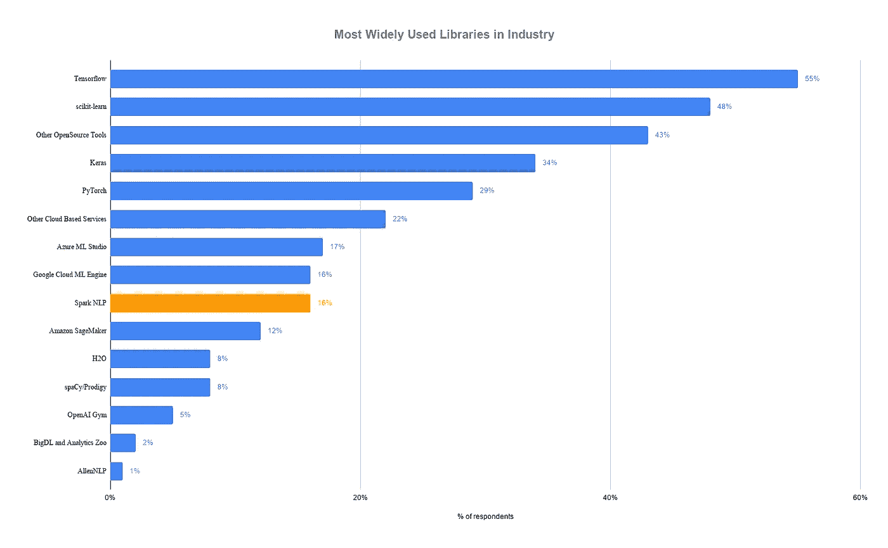

作为 Spark ML API 的本机扩展，该库提供了训练、定制和保存模型的能力，以便它们可以在集群、其他机器上运行或保存起来供以后使用。扩展和定制模型和管道也很容易，我们将在本系列文章中详细介绍。Spark NLP 是带有 Apache 2.0 许可的开源软件，所以欢迎您查看完整的[源代码](https://github.com/JohnSnowLabs/spark-nlp)。

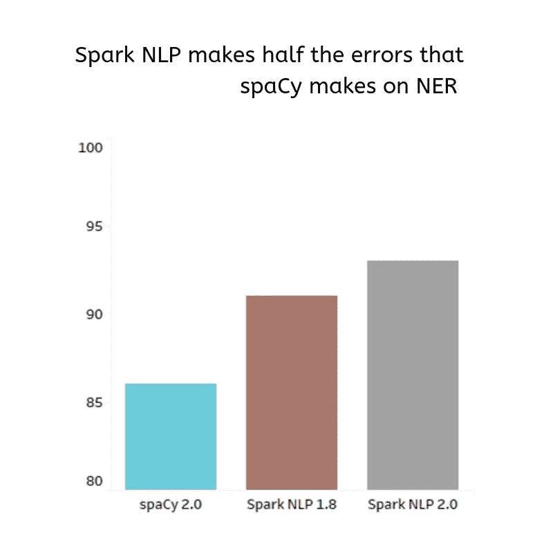

过去几年自然语言处理深度学习的兴起意味着，在热门库中实现的算法，如 [spaCy](https://spacy.io/) 、[斯坦福 CoreNLP](https://stanfordnlp.github.io/CoreNLP/) 、 [NLTK](https://www.nltk.org/) 和 [OpenNLP](https://opennlp.apache.org/) ，不如最新科学论文可能实现的精确。

声称提供最先进的准确性和速度使我们不断追求最新的科学进步。

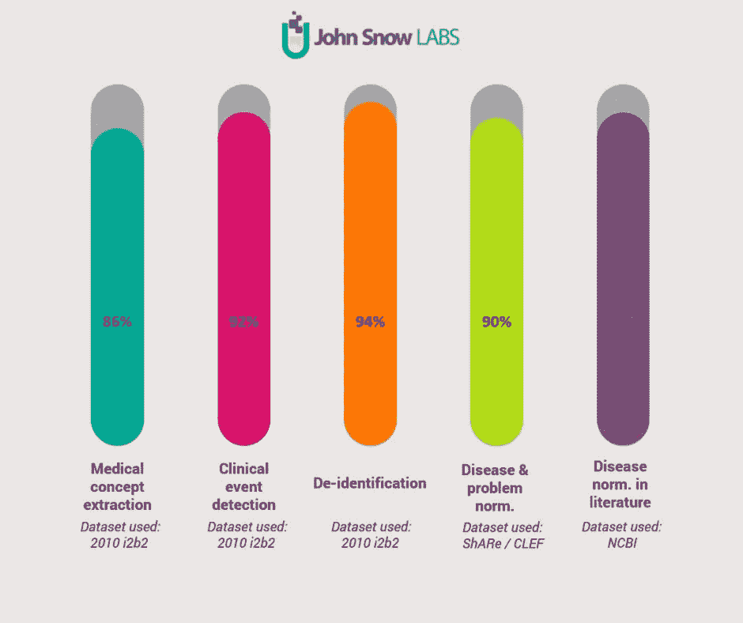

Spark NLP provides licensed annotators and models that are already trained by SOTA algorithms for Healthcare Analytics

在单机和集群上，Apache Spark 的性能更接近裸机，这意味着普通的 NLP 管道可以比传统库的固有设计限制快几个数量级。

迄今为止最全面的基准，[比较生产级 NLP 库](https://www.oreilly.com/ideas/comparing-production-grade-nlp-libraries-accuracy-performance-and-scalability)，一年前发表在 O'Reilly Radar 上。左侧是在单个英特尔 i5、4 核、16 GB 内存机器上训练简单流水线(句子边界检测、标记化和词性标注)的运行时比较

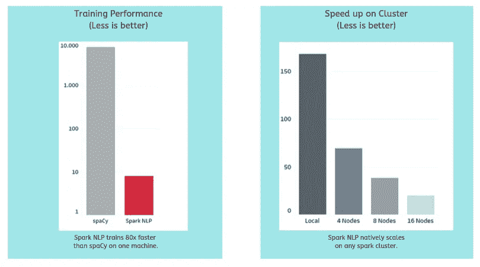

Spark NLP training performance on single machine vs cluster

能够利用 GPU 进行训练和推理已经成为赌注。使用 TensorFlow 进行深度学习使 Spark NLP 能够充分利用现代计算机平台——从[英伟达的 DGX-1](https://www.nvidia.com/en-us/data-center/dgx-1/) 到[英特尔的 Cascade Lake](https://fuse.wikichip.org/news/1773/intel-cascade-lake-brings-hardware-mitigations-ai-acceleration-scm-support/2/) 处理器。旧的库，无论它们是否使用一些深度学习技术，都需要重写以利用这些新的硬件创新，这些创新可以将 NLP 管道的速度和规模提高另一个数量级。

能够在很少或没有代码更改的情况下，将模型训练、推理和完整的人工智能管道从本地机器扩展到集群，也已经成为赌注。Spark NLP 原生构建于 Apache Spark ML 之上，支持 Spark NLP 在任何 Spark 集群、内部或任何云提供商上扩展。由于 Spark 的分布式执行规划和缓存，加速得到了优化，这已经在几乎任何当前的存储和计算平台上进行了测试。

最流行的 NLP 库的功能比较如下:

Spark NLP 还附带了一个 [**OCR** 包](https://nlp.johnsnowlabs.com/docs/en/ocr)，可以读取 PDF 文件和扫描图像(需要`Tesseract 4.x+`)。这是第一个包含 OCR 功能的 NLP 库。( **自 2.2.2 起，OCR 功能移至授权版本。*)

# 3.基本组件和底层技术

既然 Spark NLP 是坐在 Apache Spark 的肩膀上，那么最好用 Spark 本身的参考来解释 Spark NLP 组件。

[Apache Spark](https://spark.apache.org/) ，曾经是 [Hadoop](http://hadoop.apache.org/) 生态系统的一个组成部分，现在正成为企业首选的大数据平台，主要是因为它能够处理流数据。它是一个强大的开源引擎，提供实时流处理、交互式处理、图形处理、内存处理以及批处理，速度非常快，易于使用，接口标准。

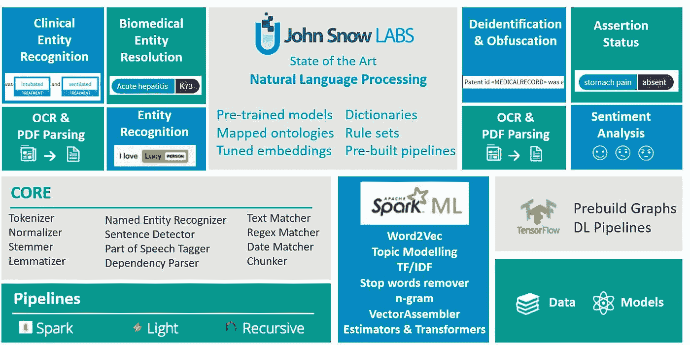

An overview of Spark NLP components

在该行业中，对能够实现上述所有功能的强大引擎有很大的需求。你的公司或客户迟早会使用 Spark 开发复杂的模型，让你发现新的机会或规避风险。Spark 并不难学，如果你已经懂 Python 和 SQL，入门是非常容易的。为了熟悉 Spark 和它的 Python 包装器 [Pyspark](https://spark.apache.org/docs/2.2.0/api/python/pyspark.html) ，你可以在本文底部找到额外的资源。

*(我强烈建议用我的简介笔记本* *)学习 PySpark 的* [*基础知识*](https://github.com/vkocaman/PySpark_Essentials_March_2019/blob/master/PySpark%20-%20From%20Zero%20to%20Hero%20(Sept%202019).ipynb)

Spark 有一个名为 [Spark ML](http://spark.apache.org/docs/latest/ml-guide.html) 的模块，它引入了几个 ML 组件。**估计器**，它们是可训练的算法，以及**变换器**，它们或者是训练估计器的结果，或者是根本不需要训练的算法。估值器和变压器都可以是**流水线**的一部分，这不多不少于一系列按顺序执行的步骤，并且可能依赖于彼此的结果。

**Spark-NLP** 引入了 **NLP 标注器**，它们合并在这个框架中，其算法旨在并行预测。现在，让我们从详细解释每个组件开始。

## a.注释者

在 Spark NLP 中，所有的**注释器**要么是评估器，要么是转换器，就像我们在 Spark ML 中看到的那样。Spark ML 中的估计器是一种算法，它可以适用于数据帧以产生一个变换器。例如，学习算法是在数据帧上训练并产生模型的估计器。转换器是一种能将一个数据帧转换成另一个数据帧的算法。例如，ML 模型是将具有特征的数据帧转换成具有预测的数据帧的转换器。

在 Spark NLP 中，有两种类型的标注器:**标注器方法**和**标注器模型**

**AnnotatorApproach** 从 Spark ML 扩展了估计器，这意味着通过 *fit()* 来训练，而 **AnnotatorModel** 扩展了变换器，这意味着通过 *transform()来变换数据帧。*

有些 Spark NLP 注释器有一个*模型*后缀，有些没有。*当注释器是训练过程的结果时，模型后缀*被明确地声明。一些标注器，比如*标记器*是转换器，但是不包含后缀*模型*，因为它们没有经过训练，标注器。*模型*注释器在其静态对象上有一个 *pre-trained()* ，用于检索模型的公共预训练版本。

长话短说，如果它在一个数据帧上训练并产生一个模型，它就是一种注释方法；如果它通过一些模型将一个数据帧转换为另一个数据帧，它就是*注释器模型*(例如*wordedbedingsmodel*)，并且如果它在转换数据帧时不依赖于预先训练的注释器(例如*标记器*，它就不使用*模型*后缀。

下面是 Spark NLP v2.2.2 提供的注释器列表

* These marked annotators do not take “Approach” suffix at the end while all the others take this suffix. All the AnnotatorModels take “Model” suffix at the end.

按照惯例，有三种可能的名称:

*接近*——可训练的注释者

*型号* —经过培训的注释者

*无*——要么是带有预处理步骤的不可训练的注释器，要么是*模型的简写*

所以比如*斯特梅尔*没有说*接近*也没有说*型号*，但是，它是一个*型号*。另一方面， *Tokenizer* 没有说*接近*也没有说*模型*，但是它有一个 *TokenizerModel()。*因为它不是“训练”什么，而是在转换成模型之前做一些预处理。

如有疑问，请参考[官方文件](https://nlp.johnsnowlabs.com/docs/en/quickstart)和 [API 参考](https://nlp.johnsnowlabs.com/api/#package)。

尽管我们将在下面的文章中进行许多实际操作，但是让我们给你一点提示，让你理解*注释者方法*和*注释者模型*之间的区别。

如上所述，*标记器*是一个*注释器模型*。所以我们需要调用 *fit()* 然后 *transform()* 。

```
tokenizer = Tokenizer() \
 .setInputCols([“document”]) \
 .setOutputCol(“token”)tokenizer.fit(df).transform(df)
```

另一方面，*斯特梅尔*是一个*注释者模型*。所以我们只需要调用 *transform()* 。

```
stemmer = Stemmer() \
 .setInputCols([“token”]) \
 .setOutputCol(“stem”)stemmer.transform(df)
```

稍后您将学习所有这些参数和语法。因此，在我们进入这一部分之前，不要试图复制这些代码片段。

另一个要点是，每个注释器接受某些类型的列，并输出另一种类型的新列(我们称之为*注释器类型*)。在 Spark NLP 中，我们有以下类型: *Document，token，chunk，pos，word_embeddings，date，entity，perspective，named_entity，dependency，labeled_dependency。*也就是说，如果要将一个列输入到注释器中，那么您拥有的数据帧需要有一个来自这些类型之一的列；否则，你需要使用一个 Spark NLP *变压器*。我们将在后面详细讨论这个概念。

## b.预训练模型

我们提到过经过训练的标注器被称为*标注器模型*，这里的目标是通过指定的模型(经过训练的标注器)将一个数据帧转换成另一个数据帧。Spark NLP 提供以下四种语言的预训练模型(*英语、法语、德语、意大利语*)，您只需指定模型名称，然后根据您的用例和数据集配置模型参数，将预训练模型加载到您的磁盘中。然后，您将无需担心从零开始训练一个新模型，并将能够享受通过 *transform()* 直接应用于您自己的数据的预训练 SOTA 算法。在[官方文档](https://nlp.johnsnowlabs.com/docs/en/models)中，你可以找到关于如何通过使用哪些算法和数据集来训练这些模型的详细信息。

以下是 Spark NLP v2.2.2 提供的预训练模型列表

```
# load NER model trained by deep learning approach and GloVe word embeddingsner_dl = NerDLModel.pretrained(‘ner_dl’)# load NER model trained by deep learning approach and BERT word embeddingsner_bert = NerDLModel.pretrained(‘ner_dl_bert’)ner_bert.transform(df)
```

## c.变形金刚(电影名)

还记得我们讨论过每个注释器接受或输出的特定类型的列。那么，如果我们的数据帧没有这种类型的列，我们该怎么办呢？变形金刚来了。在 Spark NLP 中，我们有五个不同的转换器，主要用于获取数据或将数据从一个*注释者类型*转换到另一个。以下是*变形金刚*的列表:

***文档汇编员*** :为了通过 NLP 过程，我们需要得到带注释的原始数据。这是一个特殊的变压器，为我们做到这一点；它创建了 Document 类型的第一个注释，将来注释者可能会用到它。

***token assembler***:这个转换器从标记中重建一个文档类型注释，通常是在这些标记被规范化、词汇化、规范化、拼写检查等之后，以便在进一步的注释器中使用这个文档注释。

***Doc2Chunk*** :用 chunkCol 的内容将文档类型注释转换成 Chunk 类型。

***Chunk2Doc*** :将块类型列转换回文档。在尝试对块结果进行重新标记或进一步分析时非常有用。

***Finisher*** :一旦我们的 NLP 管道准备就绪，我们可能想要在其他容易使用的地方使用我们的注释结果。修整器将注释值输出到字符串中。

```
# get the dataframe with text column, and transform into another dataframe with a new document type column appendeddocumentAssembler = DocumentAssembler()\
 .setInputCol(“text”)\
 .setOutputCol(“document”)documentAssembler.transform(df)
```

## d.管道

我们之前提到过，Spark NLP 提供了一个简单的 API 来与 Spark ML 管道集成，所有的 Spark NLP 注释器和转换器都可以在 Spark ML 管道中使用。所以，还是通过 Spark ML 官方文档来解释管道概念比较好。

什么是*管道*呢？在机器学习中，运行一系列算法来处理和学习数据是很常见的。例如，简单的文本文档处理工作流可能包括几个阶段:

*   将每个文档的文本分成句子和标记(单词)。
*   通过应用一些文本预处理技术(清理、词汇化、词干化等)来规范化标记。)
*   将每个标记转换成数字特征向量(例如，单词嵌入、tfidf 等。).
*   使用特征向量和标签学习预测模型。

这就是如何使用 sklearn(一个流行的 Python ML 库)将这样的流编写为管道。

```
from sklearn.pipeline import Pipeline
from sklearn.feature_extraction.text import CountVectorizer, TfidfTransformerfrom sklearn.linear_model import LogisticRegressiondef text_processing ():
 # your text preprocessing steps ..
 return processed_textmypipeline = Pipeline ([
 (“preprocess”, text_processing()),
 (“vect”, CountVectorizer()),
 (“tfidf”, TfidfTransformer()),
 (“model”, LogisticRegression()),
])mypipeline.fit(X_train, y_train)
```

Apache Spark ML 将这样的工作流表示为管道，它由一系列按特定顺序运行的 *PipelineStages* (转换器和估算器)组成。

简而言之，管道将多个转换器和估算器链接在一起，以指定 ML 工作流。我们使用*管道*将多个转换器和估计器链接在一起，以指定我们的机器学习工作流程。

下图是管道的培训时间使用情况。

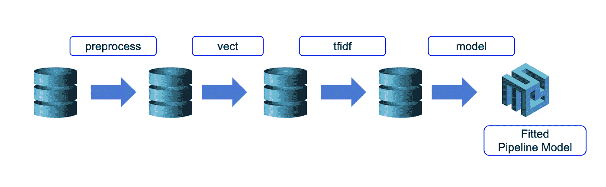

流水线被指定为一系列阶段，每个阶段或者是转换器或者是估计器。这些阶段按顺序运行，输入数据帧在通过每个阶段时会发生转换。也就是说，数据按顺序通过拟合的管道。每个阶段的 *transform()* 方法更新数据集并将其传递给下一个阶段。在管道的帮助下，我们可以确保训练和测试数据经过相同的特征处理步骤。

现在让我们看看如何在 Spark NLP 中使用*标注器*和*转换器*来完成这个任务。假设我们有以下需要在数据帧上逐一应用的步骤。

*   将文本拆分成句子
*   标记化
*   使标准化
*   获取单词嵌入

这是我们如何在 Spark NLP 中编写管道代码。

```
from pyspark.ml import Pipelinedocument_assembler = DocumentAssembler()\
 .setInputCol(“text”)\
 .setOutputCol(“document”)sentenceDetector = SentenceDetector()\
 .setInputCols([“document”])\
 .setOutputCol(“sentences”)tokenizer = Tokenizer() \
 .setInputCols([“sentences”]) \
 .setOutputCol(“token”)normalizer = Normalizer()\
 .setInputCols([“token”])\
 .setOutputCol(“normal”)word_embeddings=WordEmbeddingsModel.pretrained()\
 .setInputCols([“document”,”normal”])\
 .setOutputCol(“embeddings”)nlpPipeline = Pipeline(stages=[
 document_assembler, 
 sentenceDetector,
 tokenizer,
 normalizer,
 word_embeddings,
 ])pipelineModel = nlpPipeline.fit(df)
```

让我们看看这是怎么回事。从下面的流程图中可以看到，根据输入列的规范，每个生成的(输出)列都作为输入指向下一个注释器。这就像积木和乐高积木一样，你可以通过一点点创意来设计出令人惊叹的管道。

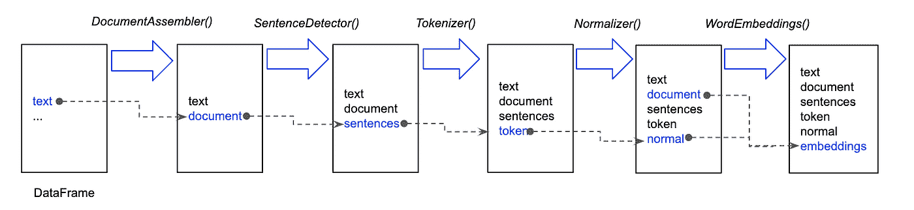

引擎盖下到底发生了什么？

当我们用 Spark 数据帧(df)在管道上拟合()时，它的*文本*列首先被送入 DocumentAssembler()转换器，然后在*文档*类型(*注释者类型*)中创建一个新列“*文档*”。正如我们之前提到的，这个转换器基本上是任何 Spark 数据帧的 Spark NLP 的初始入口点。然后它的文档列被输入到*SentenceDetector()*(*annotator approach*)中，文本被分割成一个句子数组，并在文档 type 中创建新列“ *sentences”。然后将“sentences”列输入到*Tokenizer()*(*annotator model*)中，对每个句子进行分词，并在 Token* type 中创建新列“ *token”。诸如此类。您将在下面的文章中详细了解所有这些规则和步骤，因此我们在此不做过多阐述。*

除了定制的管道之外，Spark NLP 还有一个预先训练好的管道，已经根据不同的用例使用了特定的注释器和转换器。

以下是预训练管道的列表。

我们将在下面的文章中解释所有这些管道，但是让我们给你一个使用其中一个管道的例子。

下面是我们在**“explain _ document _ dl”**管道中的 NLP 注释器:

*   *文件汇编*
*   *sentenced detector*
*   *记号赋予器*
*   *LemmatizerModel*
*   *斯特梅尔*
*   *感知器模型*
*   *上下文拼写检查器模型*
*   *单词嵌入(手套 6B 100)*
*   *NerDLModel*
*   *NerConverter(分块)*

所有这些注释器都已经用 SOTA 算法进行了训练和调优，随时可以为您服务。因此，当您调用这个管道时，这些注释器将在幕后运行，您将获得通过这些注释器生成的一批新列。要使用预先训练好的管道，你需要做的就是指定管道名称，然后 *transform()* 。您还可以设计和训练这种管道，然后保存到您的磁盘上以供以后使用。

```
print (df.columns)>> [‘text’]from sparknlp.pretrained import PretrainedPipelinepipeline = PretrainedPipeline(“explain_document_dl”, lang=”en”)transformed_df = pipeline.transform(df)print (transformed_df.columns)>> [‘text’,
 ‘document’,
 ‘sentence’,
 ‘token’,
 ‘checked’,
 ‘lemma’,
 ‘stem’,
 ‘pos’,
 ‘embeddings’,
 ‘ner’,
 ‘entities’]
```

当说到 SOTA 算法时，我们是认真的。例如， *NERDLModel* 由 *NerDLApproach* 标注器在 WikiNER 语料库上使用 Char CNNs — BiLSTM — CRF 和 GloVe 嵌入进行训练，并支持对 PER、LOC、ORG 和 MISC 实体的识别。根据最近的一份[调查报告](https://www.aclweb.org/anthology/C18-1182/)，这种 DL 架构在 NER 获得了最高分。因此，只需一行代码，您就可以获得 SOTA 结果！

# 4.结论

在第一篇文章中，我们试图让您熟悉 Spark NLP 的基础知识及其构建模块。Spark NLP 库在企业项目中使用，原生构建于 Apache Spark 和 [TensorFlow](https://www.analyticsindiamag.com/a-hands-on-primer-to-tensorflow/) 之上，提供一体化的最新 NLP 解决方案，为机器学习管道提供简单、高性能和准确的 NLP 符号，可在分布式环境中轻松扩展。尽管它有陡峭的学习曲线和复杂的框架，但这个惊人的库背后的虚拟开发人员团队推动了实现和覆盖 NLP 研究中最近突破的极限，并努力使其易于实现到您的日常工作流中。

在接下来的文章中，我们计划用 Python 和 Scala 中清晰的代码样本涵盖所有细节。在此之前，请随时访问[Spark NLP workshop repository](https://github.com/JohnSnowLabs/spark-nlp-workshop)或查看以下资源。欢迎来到 Spark NLP 的神奇世界，敬请期待！

**下一篇文章:**

[Spark NLP 简介:安装和入门](https://medium.com/spark-nlp/introduction-to-spark-nlp-installation-and-getting-started-part-ii-d009f7a177f3?source=your_stories_page---------------------------)

[Spark NLP 101:文档汇编器](https://medium.com/spark-nlp/spark-nlp-101-document-assembler-500018f5f6b5?source=your_stories_page---------------------------)

[Spark NLP 101:光管道](https://medium.com/spark-nlp/spark-nlp-101-lightpipeline-a544e93f20f1?source=your_stories_page---------------------------)

[使用 Bert 和通用语句编码器在 Spark NLP 中进行文本分类](/text-classification-in-spark-nlp-with-bert-and-universal-sentence-encoders-e644d618ca32)

[命名实体识别(NER)Spark NLP 中的 BERT](/named-entity-recognition-ner-with-bert-in-spark-nlp-874df20d1d77)

# 5.资源

PySpark Essentials:[https://github . com/vkocaman/PySpark _ Essentials _ March _ 2019/blob/master/PySpark %20-% 20 from % 20 zero % 20 to % 20 hero % 20(2019 年 9 月% 20 日)。ipynb](https://github.com/vkocaman/PySpark_Essentials_March_2019/blob/master/PySpark%20-%20From%20Zero%20to%20Hero%20(Sept%202019).ipynb)

py spark——快速游览:【https://github.com/skamalj/spark/blob/master/spark.ipynb 

[https://towards data science . com/spark-data bricks-important-lessons from-my-first-six-months-d9b 26847 f45d](/spark-databricks-important-lessons-from-my-first-six-months-d9b26847f45d)

[https://towards data science . com/the-most-complete-guide-to-py spark-data frames-2702 c 343 B2 E8](/the-most-complete-guide-to-pyspark-dataframes-2702c343b2e8)

[https://www . oreilly . com/radar/one-simple-chart-who-is-interest-in-spark-NLP/](https://www.oreilly.com/radar/one-simple-chart-who-is-interested-in-spark-nlp/)

[https://blog . dominodatalab . com/comparisng-the-functionality-of-open-source-natural language-processing-libraries/](https://blog.dominodatalab.com/comparing-the-functionality-of-open-source-natural-language-processing-libraries/)

[https://databricks . com/blog/2017/10/19/introducing-natural-language-processing-library-Apache-spark . html](https://databricks.com/blog/2017/10/19/introducing-natural-language-processing-library-apache-spark.html)

[https://databricks . com/fr/session/Apache-spark-NLP-extending-spark-ml-to-deliver-fast-scalable-unified-natural-language-processing](https://databricks.com/fr/session/apache-spark-nlp-extending-spark-ml-to-deliver-fast-scalable-unified-natural-language-processing)

[https://medium . com/@ Saif 1988/spark-NLP-walk through-powered-by-tensor flow-9965538663 FD](https://medium.com/@saif1988/spark-nlp-walkthrough-powered-by-tensorflow-9965538663fd)

[https://www . kdnugges . com/2019/06/spark-NLP-getting-started-with-worlds-most-wide-used-NLP-library-enterprise . html](https://www.kdnuggets.com/2019/06/spark-nlp-getting-started-with-worlds-most-widely-used-nlp-library-enterprise.html)

[https://www . Forbes . com/sites/forbestechcouncil/2019/09/17/winning-in-health-care-ai-with-small-data/# 1 b2fc 2555664](https://www.forbes.com/sites/forbestechcouncil/2019/09/17/winning-in-health-care-ai-with-small-data/#1b2fc2555664)

[https://medium . com/hacker noon/mueller-report-for-nerds-spark-meets-NLP-with-tensor flow-and-Bert-part-1-32490 a8f8f 12](https://medium.com/hackernoon/mueller-report-for-nerds-spark-meets-nlp-with-tensorflow-and-bert-part-1-32490a8f8f12)

[https://www . analyticsindiamag . com/5-reasons-why-spark-NLP-is-the-most-wide-use-library-in-enterprises/](https://www.analyticsindiamag.com/5-reasons-why-spark-nlp-is-the-most-widely-used-library-in-enterprises/)

[https://www . oreilly . com/ideas/comparing-production-grade-NLP-libraries-training-spark-NLP-and-spacy-pipelines](https://www.oreilly.com/ideas/comparing-production-grade-nlp-libraries-training-spark-nlp-and-spacy-pipelines)

[https://www . oreilly . com/ideas/comparing-production-grade-NLP-libraries-accuracy-performance-and-scalability](https://www.oreilly.com/ideas/comparing-production-grade-nlp-libraries-accuracy-performance-and-scalability)

[](https://www.infoworld.com/article/3031690/analytics/why-you-should-use-spark-for-machine-learning.html) [## 为什么应该使用 Spark 进行机器学习

### 随着组织创建更加多样化和更加以用户为中心的数据产品和服务，对以下方面的需求日益增长…

www.infoworld.com](https://www.infoworld.com/article/3031690/analytics/why-you-should-use-spark-for-machine-learning.html) 

[https://under rated . sigma ratings . com/post/187988777561/a-practical-intro-to-using-spark-NLP-Bert-word](https://underrated.sigmaratings.com/post/187988777561/a-practical-intro-to-using-spark-nlp-bert-word)

[https://nlpprogress.com/](https://nlpprogress.com/)

[http://ruder.io/state-of-transfer-learning-in-nlp/](http://ruder.io/state-of-transfer-learning-in-nlp/)