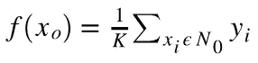
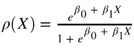
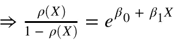
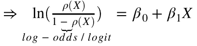
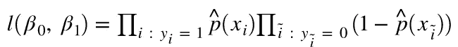
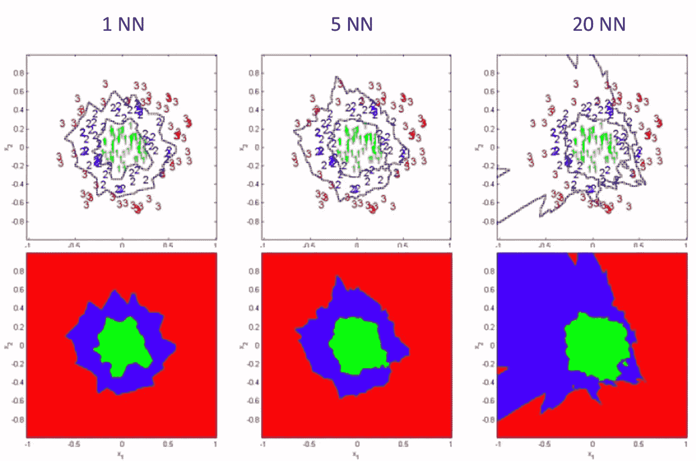
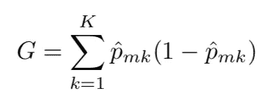
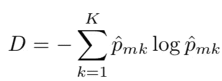

# 人工智能中的统计方法导论

> 原文：<https://towardsdatascience.com/introduction-to-statistical-methods-in-ai-23f89df72cdb?source=collection_archive---------8----------------------->

## 文章力求提供关于人工智能中不同统计方法的简明信息


Photo by [Daniele Levis Pelusi](https://unsplash.com/@yogidan2012?utm_source=unsplash&utm_medium=referral&utm_content=creditCopyText) on [Unsplash](https://unsplash.com/s/photos/infinity?utm_source=unsplash&utm_medium=referral&utm_content=creditCopyText)

统计学习是一套理解数据的工具。这些工具大致分为两类:监督学习和非监督学习。一般来说，监督学习指的是基于一个或多个输入来预测或估计输出。另一方面，无监督学习在没有监督输出的情况下，在给定数据中提供关系或找到模式。

## 什么是统计学习？

让，假设我们观察到一个反应 y 和 p 不同的预测因子 X = (X₁，X₂,….，Xp)。一般来说，我们可以说:

```
Y =f(X) + ε
```

这里 **f** 为未知函数， **ε** 为*随机误差项*。

> 本质上，统计学习指的是一套估计 f 的方法。

在这种情况下，我们有现成的 X 组，但输出 Y，没有这么多，误差平均为零，我们可以说:

```
¥ = ƒ(X)
```

其中**表示我们对 **f** 的估计，表示结果预测。**

因此，对于一组预测值 X，我们可以说:

```
E(Y — ¥)² = E[f(X) + ε — ƒ(X)]²=> E(Y — ¥)² = [f(X) - ƒ(X)]² + Var(ε) 
```

在哪里，

*   *E(Y — )* 表示*实际结果与预期结果的平方差的期望值*。
*   *【f(X)—ф(X)】*代表 ***可约误差*** *。*它是可简化的，因为我们可以通过更好的建模来潜在地提高的精度。
*   *Var(ε)* 代表**不可约误差**。它是不可约的，因为无论我们估计得多好，我们都无法减少ε中由*方差*引入的误差。

## 回归 Vs 分类问题

变量 Y 可以广义地描述为*定量*或*定性*(也称为*分类*)。量化变量采用数字值，例如年龄、身高、收入、价格等等。估计定性响应通常被称为****回归问题*** 。定性变量采用分类值，例如性别、品牌、词性等等。估计定性反应通常被称为****分类问题*** 。**

> **统计学中没有免费的午餐:在所有可能的数据集上，没有一种方法能支配所有其他方法。**

## **方差和偏差**

***方差*是指如果我们用不同的训练数据集进行估计时，会发生变化的量。一般来说，当我们在给定的训练数据集上过度拟合模型时(训练集中的可约误差非常低，但测试集中的可约误差非常高)，我们得到的模型具有较高的方差，因为数据点的任何变化都会导致显著不同的模型。**

***偏差*指的是通过逼近现实生活中的问题而引入的误差，这可能会因为一个简单得多的模型而变得极其复杂——例如，用线性模型来建模非线性问题。一般来说，当我们过度拟合给定数据集上的模型时，它会导致非常小的偏差。**

**这导致方差偏差的权衡。**

> **当我们在给定的数据集上拟合模型时，偏差下降的速度往往比方差最初增加的速度快。因此，预期测试误差(可减少的)下降。然而，在某些时候，当过度拟合开始时，对偏差有一点影响，但是方差开始快速增加，当这种情况发生时，测试误差增加。**

## **线性回归**

**线性回归是一种属于监督学习的统计方法，用于预测定量反应。**

*****简单线性回归*** 方法基于假设线性关系的单个变量 X 预测定量反应。我们可以说:**

```
**¥ ≈ β₀ + β₁X**
```

**我们现在的工作是*基于训练数据集估计* β₀和β₁，我们的模型的参数/系数，使得超平面(在这种情况下是一条线)与训练数据集*接近*。许多标准可以估计接近程度，最常见的是*最小二乘法。***

**所有观察响应和预测响应之间的差的平方和表示为*残差平方和(RSS)。***

****线性回归中的问题****

*   ***反应-预测值关系的非线性。***
*   ***误差项的相关性。***
*   ***误差项的非恒定方差*。**
*   ***异常值:*当实际预测值与估计值相差很大*时，可能会由于数据记录不准确而出现异常值。***
*   ****高杠杆点:*预测值的异常值会影响称为高杠杆点的回归线。***
*   ***共线性:*当两个或两个以上的预测变量彼此密切相关时，剔除单个预测变量的个体效应可能具有挑战性**。****

****KNN 回归****

**KNN 回归是一种估计或预测值的非参数方法，它不采用(X)的形式。它通过平均最接近 x₀.的所有 N₀响应来估计/预测ƒ(x₀),其中 x₀是预测点我们可以说:**

****

**Image by Author**

> **注意:如果 K 很小，拟合将是灵活的，数据的任何变化将导致不同的拟合，因此对于小 K，方差将很高，偏差很低；相反，如果 K 很大，它可能会掩盖数据中的一些结构，因此偏差会很大。**

# **分类问题**

**我们到目前为止所讨论的反应，可能不总是*定量的*，也可能是*定性的，*预测这些定性的反应被称为分类。**

**我们将讨论分类的各种统计方法，包括:**

*   **SVM**
*   ***逻辑回归***
*   ***KNN 分类器***
*   ***GAM***
*   ***树木***
*   ***随机森林***
*   ***增压***

## **支持向量机(SVM)**

**SVM 或支持向量机是最大限度地提高利润率的分类器。在下面的例子中，分类器的目标是找到一条线或(n-1)维超平面，它将 n 维空间中的两个类分开。我已经写了一篇详细的[文章](/support-vector-machine-formulation-and-derivation-b146ce89f28)解释 SVM 的推导和提法。在我看来，它是我们人工智能统计方法工具箱中最强大的技术之一。**

## ****逻辑回归****

**逻辑模型模拟属于特定类别的输出响应的概率。**

**我们可以说:**

****

**Image by Author**

**应用[componendo dividend to](https://brilliant.org/wiki/componendo-and-dividendo/)我们得到:**

****

**Image by Author**

**这无非是[赔率](https://en.wikipedia.org/wiki/Odds)。**

****

**Image by Author**

**为了估计β系数，我们可以使用[最大似然](https://en.wikipedia.org/wiki/Maximum_likelihood_estimation)。基本思想是估计β，使得结果的估计值和观察值尽可能接近。在二元分类中，观察到的类为 *1* 和 *0* ，我们可以说似然函数看起来像:**

****

**Image by Author**

## **KNN 分类器**

**KNN(K 最近邻)分类器是一种惰性学习技术，其中训练数据集表示在欧几里德超平面上，测试数据基于 K 欧几里德距离度量被分配标签。**

****实用方面****

*   **k 应该根据经验选择，最好是奇数，以避免平局。**
*   **KNN 应该有离散的和连续的目标函数。**
*   **来自不同邻居的加权贡献(例如，基于距离的)可以用于计算最终标签。**

> **注意:当数据是高维时，KNN 的性能会降低。这可以通过向特征本身提供权重来避免。**

****K 对决策边界的影响****

****

**Chapter 8, [Pattern Classification](https://www.wiley.com/en-us/Pattern+Classification%2C+2nd+Edition-p-9780471056690) by [Richard O. Duda](https://www.wiley.com/en-us/search?pq=%7Crelevance%7Cauthor%3ARichard+O.+Duda), [Peter E. Hart](https://www.wiley.com/en-us/search?pq=%7Crelevance%7Cauthor%3APeter+E.+Hart), [David G. Stork](https://www.wiley.com/en-us/search?pq=%7Crelevance%7Cauthor%3ADavid+G.+Stork)**

****KNN 的优势****

*   **我们可以学习复杂的目标函数。**
*   **任何信息都不会丢失。**

****KNN 的劣势****

*   **新实例的分类成本非常高。**
*   **大量的计算发生在分类的时候。**

## ****广义可加模型****

**GAM 提供了一个广义的框架，用每个变量的非线性函数扩展了标准的多变量线性回归，同时保持了它的可加性。因此，所有非线性函数都可以独立计算并在以后相加。**

> **注:GAM like 线性回归可用于定量和定性响应。**

## **树木、随机森林、助推和装袋**

**对于涉及将预测空间分割成简单区域的回归和分类，树或决策树都是有用和直接的方法。**

**典型的决策树是上下颠倒的*表示树叶在树的底部。预测器空间被分割的点被称为*内部节点*，并且*叶节点*或*终端节点*是给出预测的节点。连接节点的线段称为*分支*。***

*对于预测，我们采取一种*自上而下的*(在第一个点上所有的观察值都属于一个区域)*、贪婪的*(在特定步骤中进行最佳分割)的方法，称为递归二元拟合。*

*有像[树修剪](https://en.wikipedia.org/wiki/Decision_tree_pruning)这样的策略，通过砍掉一些树枝得到一个小的子树来解决树的过度拟合问题。*

*对于分类问题，我们或者使用基尼指数，*

**

*Image by Author*

*或者熵*

**

*Image by Author*

*来表示节点的纯度，其中 Pmk 是来自第 k 类的第 m 个区域中的样本的比例。*

*决策树仍然受到高方差的影响，与其他监督方法相比没有竞争力。因此，我们引入随机森林助推和装袋。*

***装袋***

*Bagging 是统计学习方法中减少方差的通用方法。核心思想是对一组观察值进行平均会减少方差。因此，我们对数据进行了多次随机采样，对于每个样本，我们构建了一个树，并对所有预测进行平均，以给出一个低方差的结果。*

***随机森林***

*当在袋装树的集合中，从具有总共 m 个预测因子(k < m)的每棵树中随机选择固定的 k 个预测因子，则袋装成为随机森林。*

*这样做是因为大多数装袋的树看起来差不多一样。因此，单个包树的预测将是高度相关的。因此，我们推论的方差不会有太大的减少。随机森林可以被认为是去相关袋装树的过程。*

***增压***

*Boosting 方法是一种缓慢学习的统计方法，其中分类器是在修改的数据集*上顺序学习的*。在决策树的上下文中，每棵树都是使用来自先前树的信息来生长的。这样，我们就不需要一棵大树了。*

## *无监督学习*

*以上所有方法都有某种形式的带注释的数据集。但是，当我们想要在没有任何注释的情况下学习数据中的模式时，无监督学习就出现了。*

*无监督学习最广泛使用的统计方法是 *K-Means 聚类。*我们在数据集中随机选取 K 个点，并根据它们与 K 个随机点的接近程度，将所有其他点映射到 K 个区域中的一个。然后，我们将 K 个随机点改变为这样形成的簇的质心。我们这样做，直到我们观察到每次迭代后形成的集群中的变化可以忽略不计。*

*还有其他像无监督学习中的 PCA 这样的技术被大量使用，但是现在，我们就到此为止。*

***接下来:** [**人工神经网络简介**](/introduction-to-artificial-neural-networks-5036081137bb)*