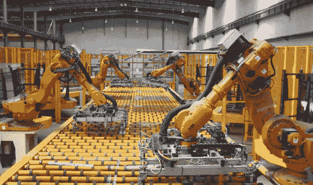
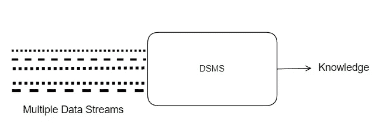

# 流挖掘简介

> 原文：<https://towardsdatascience.com/introduction-to-stream-mining-8b79dd64e460?source=collection_archive---------9----------------------->

## 流挖掘的简单介绍，支持实时数据分析

想象一下，一个拥有 500 个传感器的工厂每秒钟捕获 10 KB 的信息，一小时内大约捕获 36 GB 的信息，每天 432 GB。需要实时(或在尽可能短的时间内)分析这些海量信息，以检测系统中的异常或偏差，并快速做出反应。流挖掘能够实时分析大量数据。在本文中，介绍了流挖掘，解释了几种技术和有用的资源。

> *流挖掘支持使用有限资源实时分析大量数据*

Figure 1: Industrial sensors can capture high quantities of data Source: commons.wikimedia.org

数据流挖掘是从连续快速的数据记录中提取知识的过程，这些数据以流的形式进入系统。数据流是时间[1，2，4]中实例的有序序列。数据流挖掘满足以下特征:

*   **源源不断的数据流**。无限流中的大量数据。我们不知道整个数据集
*   **概念漂移**。数据会随着时间的推移而变化或发展
*   **数据的波动**。系统不存储接收到的数据(资源有限)。当数据被分析时，它会被丢弃或汇总

Data stream management system. Adapted from de.wikipedia.org

接下来，讨论如何分析数据流**。基于数据的技术**依赖于对代表性数据子集的分析【3，9】。这种技术也被用作数据流算法的预处理。另一方面，**挖掘技术**是传统数据挖掘算法的增强版本。

# **基于数据的技术**

**采样**基于选择均匀分布的数据子集。

*   [*油藏采样*](https://en.wikipedia.org/wiki/Reservoir_sampling) *【固定大小样本】*该算法从 stream 中采样一个子集 *m* 的数据。在以概率 1/i 选择了第 I 个项目之后，如果已经采样了第 I 个元素，则随机替换一个采样的项目
*   *最小采样*基于将 0 到 1 范围内的随机γ分配给样本 m 的子集。当系统检索 m 个元素时，我们选择γ最小的样本。

**素描**是基于降低数据集的维度。Sketch 基于执行数据的线性变换，提供流的摘要。请参见最小计数草图。[1]

**近似技术**基于仅保留数据的子集并丢弃先前的数据([滑动窗口](https://www.sciencedirect.com/topics/computer-science/sliding-window) )[2]:

*基于序列的*:窗口的大小取决于观察的数量。该窗口存储γ个元素，并且当新元素到达时，如果该窗口已满，则最后一个元素被移除。

*   *基于时间戳的*:窗口的大小取决于时间。该窗口以时刻 Tn 和 Tn+1 为界，并保存在此期间接收的元素。

# **采矿技术**

存在大量的算法(分类、回归、离群点检测、推荐系统……)用于流挖掘。这些算法需要处理概念漂移、海量数据和有限资源。一些算法需要使用先前的基于数据的技术进行预处理。例如，分类算法的例子有朴素贝叶斯、决策树桩、Hoeffding 树或 ADWIN [8]。

# **工具**

MOA 是一个流行的开源框架，允许处理数据流。MOA 开发了前面提到的一些技术和算法。去年出现了能够分析更多数据的分布式解决方案:S[park Streaming](https://spark.apache.org/docs/latest/streaming-programming-guide.html)【7】或[Apache Storm](https://storm.apache.org)&[Apache Samoa](https://samoa.incubator.apache.org)

# 参考

[1] Mohamed Medhat Gaber、Arkady Zaslavsky 和 Shonali Krishnaswamy。“挖掘数据流:综述”[https://sigmodRecord . org/publications/sigmodRecord/0506/p18-survey-gaber . pdf](https://sigmodrecord.org/publications/sigmodRecord/0506/p18-survey-gaber.pdf)

[2]数据流挖掘[https://en.wikipedia.org/wiki/Data_stream_mining](https://en.wikipedia.org/wiki/Data_stream_mining)

[3] V. Sidda Reddy，T.V Rao 和 Govardhan A .“数据流挖掘的数据挖掘技术”IIETA。链接:[http://iieta . org/sites/default/files/Journals/RCES/04.1 _ 06 . pdf](http://iieta.org/sites/default/files/Journals/RCES/04.1_06.pdf)

[4] Jure Leskovec，Anand Rajaraman，Jeff Ullman。"挖掘数据流"

[5] Brian Babcock 等人，“数据流系统中的模型和问题

[6]若昂·伽马。从数据流中发现知识。2011

[7] Holden Karau 等人《学习火花:快如闪电的大数据分析》。由…编辑作者是奥莱利。2015

[8]菲利普·克拉宁。流挖掘的任意时间算法。由…编辑《信息与自然科学》。2011

[9] V. Sidda Reddy 和 T.V Rao 和 Govardhan A . .《数据串挖掘的数据挖掘技术》[http://iieta . org/sites/default/files/Journals/RCES/04.1 _ 06 . pdf](http://iieta.org/sites/default/files/Journals/RCES/04.1_06.pdf)