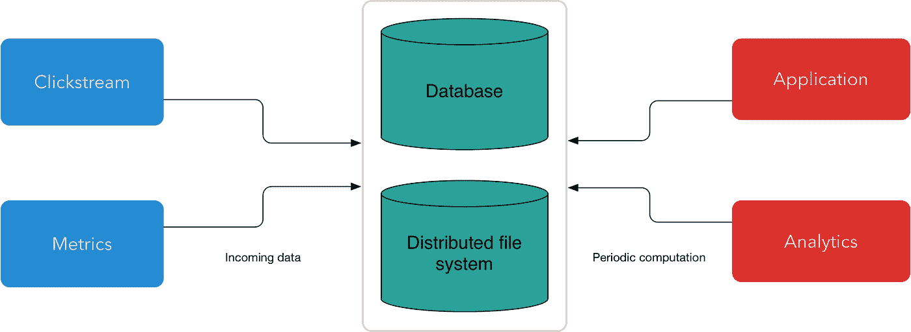
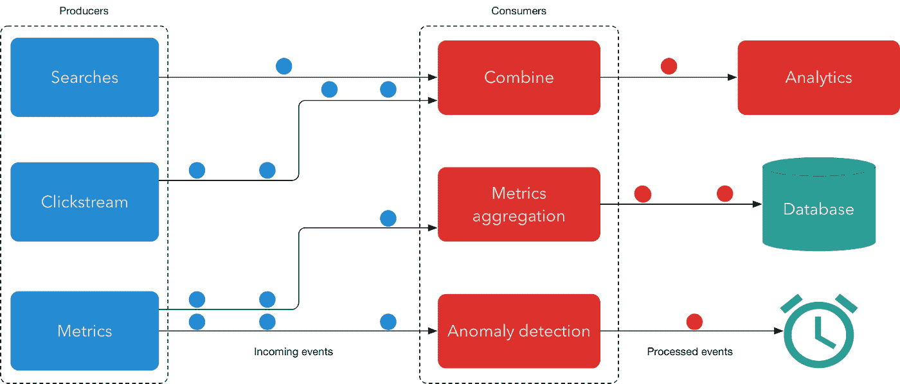
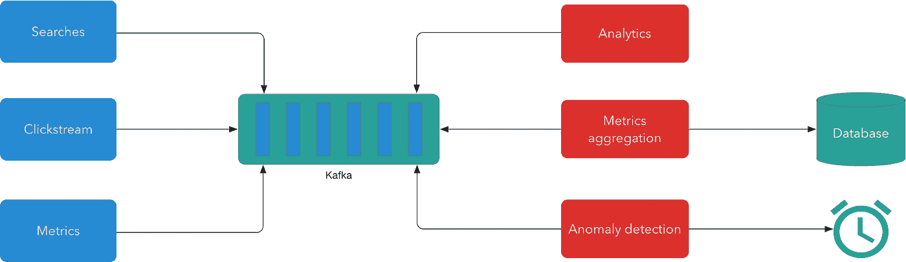
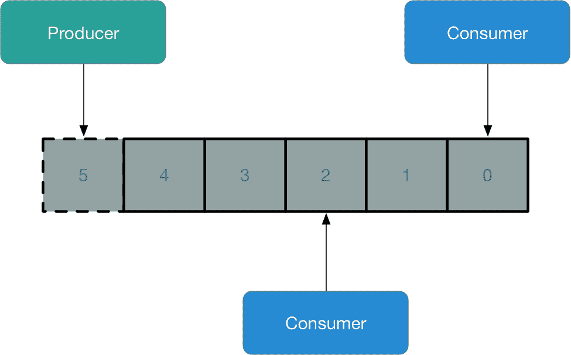
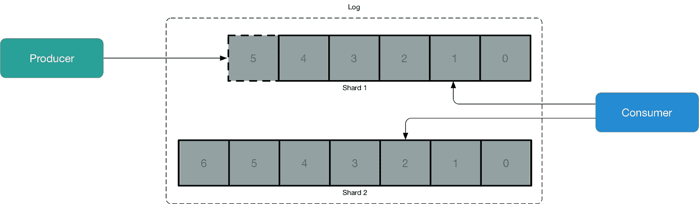
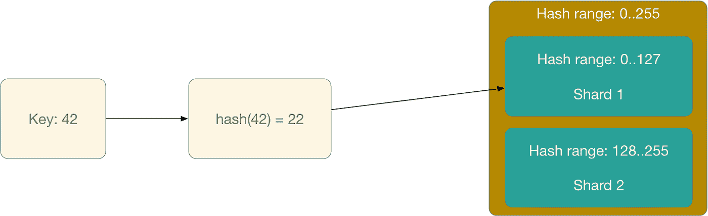
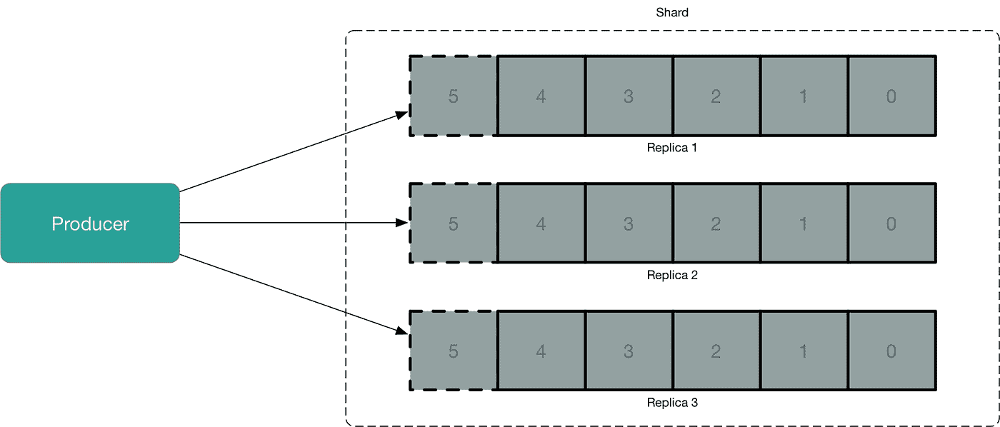
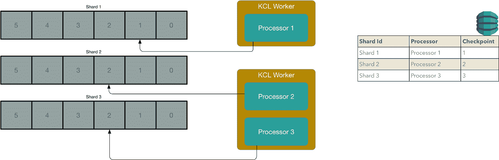

# 流处理简介

> 原文：<https://towardsdatascience.com/introduction-to-stream-processing-5a6db310f1b4?source=collection_archive---------9----------------------->

连同机器学习和无服务器流处理似乎是当今最热门的话题之一。公司正在采用现代流处理工具，服务提供商正在发布更好、更强大的流处理产品，对专家的需求很大。

本文介绍了流处理的基础知识。它从为什么我们需要流处理以及它如何在幕后工作的基本原理开始。然后讨论如何编写简单的、可伸缩的分布式流处理应用程序。全部用不到 40 行代码完成！

由于流处理是一个庞大的主题，本文主要关注数据管理部分，而复杂的处理留给另一篇文章。为了使文章更加实用，它讨论了亚马逊的流处理解决方案 AWS Kinesis，但它也参考了其他流行的开源技术，以呈现更广阔的前景。

*本文原本为* [*共同导师网站*](https://www.codementor.io/ivan-mushketyk/introduction-to-stream-processing-jyn9bian7) *撰写。*

# 为什么是流处理

为了理解为什么流处理会出现，让我们看看以前数据处理是如何完成的。以前的方法称为批处理，所有数据都存储在数据库或分布式文件系统中，不同的应用程序将使用这些数据执行计算。由于批处理工具是为处理有限大小的数据集而构建的，为了连续处理新数据，应用程序会定期处理最近一段时间(如一小时或一天)的数据。



虽然这种架构已经工作了很多年，并且仍然有很多应用程序，但是它有一些根本性的缺点。由于新数据不会在到达后立即得到处理，这将导致几个问题:

*   高延迟—新结果仅在显著延迟后计算，但由于数据[的值随着时间](https://insidebigdata.com/2016/04/08/why-time-value-of-data-matters/)减少，这是不希望的
*   会话数据—由于批处理系统将数据分割成多个时间间隔，因此很难分析在一个时间间隔内开始但在另一个时间间隔内结束的事件
*   非均匀负载—批处理系统应该等到积累了足够的数据后，才能处理下一个数据块

流处理，也就是数据处理，就是处理一系列的事件。典型的流应用程序由许多生成新事件的生产者和一组处理这些事件的消费者组成。系统中的事件可以是任何数量的事情，例如金融交易、网站上的用户活动或应用程序指标。消费者可以聚合传入的数据，实时发送自动警报，或者生成可由其他消费者处理的新数据流。



这种架构有许多优点:

*   低延迟—系统可以处理新事件并实时做出反应
*   非常适合许多应用程序—流处理系统非常适合处理永无止境的事件流的应用程序
*   统一处理——流处理系统不会等待数据累积后再处理下一批数据，而是在新数据到达时立即执行计算

毫不奇怪，流处理首先被需要实时处理新信息(如交易或价格)的金融公司采用，但现在被用于许多领域，如欺诈检测、在线推荐、监控等。

然而，这个架构提出了一个问题:生产者和消费者应该如何连接？生产者应该向每个消费者开放 TCP 会话并直接发送事件吗？虽然这可能是一个选项，但如果生产者正在编写消费者可以处理的数据，这将是一个严重的问题。此外，如果我们有大量的消费者和生产者，网络连接可能会变成一团乱麻。

这正是 LinkedIn 在 2008 年面临的问题，当时他们最终在多个系统之间建立了多个点对点管道。为了组织它，他们开始着手一个内部项目，最终成为阿帕奇卡夫卡。简而言之，Kafka 是一个缓冲器，允许制作者存储新的流媒体事件，让消费者以自己的速度实时阅读它们。



Apache Kafka 通过为分离的事件驱动应用程序提供数据集成层，迅速成为现代流处理应用程序的骨干。它允许轻松地添加新的消费者和生产者，以及构建更复杂的应用程序。Apache Kafka 变得如此成功，以至于其他公司也建立了类似设计的服务，如 [Azure Event Hubs](https://docs.microsoft.com/en-us/azure/event-hubs/event-hubs-what-is-event-hubs) 和 [AWS Kinesis](https://aws.amazon.com/kinesis/data-streams/) 。本文将更详细地讨论后者。

# 仅附加日志

乍一看，Kafka 和 Kinesis 似乎不是什么大事，因为 RabbitMQ 等替代产品已经存在多年了。然而，如果我们深入了解这些系统，我们会发现它们的设计有所不同，并且支持新用例的实现。

现代流处理软件的基础是一种称为只附加日志的数据结构。日志只是一系列二进制记录。Kinesis 对这些记录的内容没有限制——它们可以是任何格式，比如:JSON、Avro、Protobuf 等。

仅附加日志只允许在日志末尾添加新元素。我们不能在日志的任意位置插入新元素，也不能随意删除元素。日志中的每个元素都有一个序列号，新的元素比旧的元素有更高的序列号。



当一个消费者读取一条记录时，它不会被删除，并且也可以被其他消费者读取。Kinesis 不会跟踪不同的消费者将要阅读哪些记录。相反，这一责任在于消费者。这与 RabbitMQ 等系统不同。它的行为就像一个队列，跟踪每个消费者的状态。

这种架构允许 Kinesis 和 Kafka 这样的系统以低延迟处理数量惊人的事务，远远超过传统消息传递系统的能力。它还允许使用者在启动之前处理写入缓冲区的数据。

请记住，Kinesis 和 Kafka 并没有让 RabbitMQ 过时，仍然有许多 RabbitMQ 更适合的用例。

# 保存期

此时，您可能想知道，“数据曾经从流中移除过吗？”如果我们迟早不能从流中删除记录，我们将没有足够的空间来存储所有的新记录。

在 AWS Kinesis 和 Apache Kafka 中，记录都有一个保留期，并在该期限结束时自动删除。在 Kinesis 中，记录会在 24 小时后自动删除，但保留期可延长至 7 天。

如果由于某种原因，您的系统无法正确处理传入的数据，并且您需要再次重新处理这些数据，那么延长保留期尤其有益。保留期越长，修复生产系统和重新处理日志的时间就越长。缺点是你必须为额外的存储空间支付更多的费用。

Kafka 允许指定所有记录的最大保留期或最大保留大小。默认的保留期是七天，但是如果启用了[日志压缩](https://kafka.apache.org/documentation/#compaction)特性，它甚至可以是无限的。

# 按比例放大

像 Apache Kafka 和 AWS Kinesis 这样的系统是为了处理数 Pb 的数据而构建的。由于单台机器永远无法处理这种负载，他们需要横向扩展。为了处理巨大的负载，这两个系统都应用了两个众所周知的技巧来允许处理更多的读取和写入:分片和复制。

# 分片

在流处理的情况下，分片意味着我们有不止一个日志。单个流被分割成多个日志，每个日志都足够小，因此单台机器可以处理它。



为了确定使用哪个碎片，我们需要为每个记录提供一个键。对于每个传入的记录，Kinesis 计算一个键的散列码，散列码的值用于确定哪个碎片将处理它。每个碎片负责散列码值范围的一部分，如果一个键的散列码在一个碎片的范围内，这个碎片将存储一个与之相关的记录。



但是，我们如何为记录找到一个关键字呢？我们可以选择一个随机的键，然后我们的记录将均匀地分布在流的碎片中。我们还可以使用问题领域中的一个密钥，比如一个主机名(如果我们处理指标的话),或者付款人 ID(如果我们处理金融交易的话)。这将允许在具有相同键的记录之间实现排序，因为它们将被定向到相同的碎片。

需要注意的一件重要事情是，因为一个日志被分割成多个片段，所以元素的全局顺序没有被保留。但是，最终出现在同一个碎片上的元素的顺序会被保留。

但是我们应该有多少碎片呢？这取决于我们每秒需要读写多少条记录。我们需要处理的数据越多，我们需要处理的数据流就越多。因此，我们需要能够增加和减少流中的碎片数量。

Kinesis 允许将一个碎片分成两个碎片来处理更多的记录。如果我们需要处理的记录数量减少了，我们可以合并两个具有相邻散列键范围的碎片，并将它们合并到单个碎片中。这反过来会降低吞吐量和我们每月的账单。

 [## 用 AWS Kinesis 开发流处理应用程序

### AWS Kinesis 是一个强大、实时、灵活、可靠的流处理服务。本课程将教你如何使用 AWS Kinesis、流处理服务和大数据框架构建流处理应用。

bit.ly](http://bit.ly/pluralsight-kinesis) 

# 分身术

与数据库一样，全局复制意味着我们维护数据的多个副本，消费者可以从任何副本中读取数据。在 Kinesis 的情况下，每个记录在三个不同的数据中心有三个副本。



这有两个好处。首先，它使流处理系统对故障更有弹性，因为我们可能会丢失数据的两个副本。其次，它允许向消费者传输更多的数据。这反映在 Kinesis 的限制中，它只允许将最多 1MB 的数据写入单个碎片，并从一个碎片中读取最多 2MB 的数据。

# 使用 Kinesis

在这个阶段，您应该了解流处理系统是如何工作的，以及它如何处理几乎无限量的传入数据。现在是时候看一些实际的代码示例了。


*来源:*[*https://bit.ly/2IQCFjM*](https://bit.ly/2IQCFjM)

在这一节中，我们将看到如何使用低级 API 来读写流数据。我们将实现一个将度量数据写入流的生成器和一个将读取和处理该流的生成器。我们的应用程序应该做到以下几点:

*   创建一个流
*   当我们有新数据时向流发送新记录的生产者
*   在无限循环中读取和处理新记录的消费者

正如许多其他 AWS 服务一样，当我们使用 Kinesis 时，我们不需要提供主机或安装软件。我们所需要做的就是执行几个 API 调用，剩下的工作会替我们完成。这就是 Kinesis 不同于卡夫卡的地方。卡夫卡需要一个复杂的设置，这是很难做到的。

要使用 Kinesis 执行任何操作，我们首先创建一个 Kinesis 客户端:

```
// **Create** an AWS Kinesis **client**
// You may want **to** **set** **parameters** such **as** AWS region, credentials, etc.
AmazonKinesis kinesis = AmazonKinesisClientBuilder
    .standard()
    .build();
```

# 创建流

首先，让我们创建一个连接生产者和消费者的流。我们所需要做的就是提供我们的流的名称，一个初始的分片数，并调用`createStream`方法。

```
CreateStreamRequest createStreamRequest = new CreateStreamRequest();
// **Set** the **name** **of** a **new** stream
createStreamRequest.setStreamName("metrics-stream");
// **Set** **initial** number **of** shards
createStreamRequest.setShardCount(4);client.createStream(createStreamRequest);
```

在我们调用了`createStream method`之后，我们需要等待一个新的流被激活。为了简洁起见，我省略了这个逻辑，但是您可以在 [AWS 文档](https://docs.aws.amazon.com/streams/latest/dev/kinesis-using-sdk-java-create-stream.html)中阅读完整的代码示例。

# 实现生成器

现在，当我们有一个流时，我们可以向其中写入一些数据！写入新的*数据*并不难。首先，对于每个新记录，我们需要创建一个`PutRecordRequest`实例，设置一个流名、一个键和我们想要存储在流中的数据。然后我们需要调用`putRecord`方法，并将我们的新记录传递给它:

```
*// A metric data that we need to send*
Metric metric = ...;PutRecordRequest putRecordRequest = **new** PutRecordRequest();
*// Set a stream name. The same as we created in the previous example*
putRecordRequest.setStreamName("metrics-stream");
*// Set metric name as a key of the new record*
putRecordRequest.setPartitionKey(metric.getMetricName());
*// Finally we specify data that we want to store*
putRecordRequest.setData(metric.toBytes());**try** {
    kinesis.putRecord(putRecordRequest);
} **catch** (AmazonClientException ex) {
    *// Don't forget to process an exception!*
}
```

这段代码片段向名为`metrics-stream`的流发送一条记录。

请记住，无论是 Kinesis 还是 Kafka 都不能保证 100%的正常运行时间！两者都是复杂的系统，许多事情都可能出错，从网络故障到在生产系统上执行无效命令。最重要的是，如果你试图在短时间内写太多数据，AWS Kinesis 甚至可以抑制你的请求。因此，您需要做好准备—实现重试逻辑，并在短时间内在本地缓冲新记录，以防流处理系统不可用。

# 实现消费者

这都是为了写数据。从流中读取数据有点复杂。在 AWS Kinesis 的情况下，过程如下所示:

*   获取一个迭代器从一个特定的碎片中读取数据
*   发送一个读请求，并提供在上一步中接收到的迭代器
*   一个读请求从一个流和一个新的迭代器返回记录，我们可以用它来发送另一个读请求以读取下一批记录

下面是我们如何让一个迭代器从一个名为`shard-0001`的分片中读取记录，从流的开始:

```
*// Create a request to get an iterator*
**GetShardIteratorRequest** getShardIteratorRequest = **new** **GetShardIteratorRequest**();
*// Specify a name of the stream to read records from*
**getShardIteratorRequest**.**setStreamName**("metrics-stream");
*// Specify what shard to read from*
**getShardIteratorRequest**.**setShardId**("shard-0001");
*// Start reading from the oldest record*
**getShardIteratorRequest**.**setShardIteratorType**("**TRIM_HORIZON**");*// Get an iterator to read data from a stream from a specific shard*
**GetShardIteratorResult** **getShardIteratorResult** = **client**.**getShardIterator**(getShardIteratorRequest);
*// Iterator that we can use to read records from the specified shard*
**String** **shardIterator** = **getShardIteratorResult**.**getShardIterator**();
```

在这个例子中，我们从流中最老的记录开始读取，但是 Kinesis 支持其他迭代器类型:

*   AT_SEQUENCE_NUMBER —从具有指定序列号的记录开始读取
*   AFTER_SEQUENCE_NUMBER —从具有指定序列号的记录后开始读取
*   AT_TIMESTAMP —从指定的时间戳开始读取记录
*   LATEST —从流中最近的记录后开始读取

请注意，我们只能让一个迭代器从单个碎片中读取数据。但是我们怎样才能得到一个碎片的 ID 来读取呢？我们可以通过使用 AWS Kinesis 的`ListShards`方法获得特定流的碎片列表，该方法返回关于碎片的信息，包括它们的标识符:

```
**ListShardsRequest** listShardsRequest = **new** **ListShardsRequest**();
**listShardsRequest**.**setStreamName**("metrics-stream");**ListShardsResult** **result** = **kinesis**.**listShards**(listShardsRequest);**for** (**Shard** shard : result.getShards()) {
    *// Get hash key range a shard is responsible for*
    **HashKeyRange** **hashKeyRange** = **shard**.**getHashKeyRange**();
    *// Returns first a range of records' sequence numbers in a stream*
    **SequenceNumberRange** **sequenceNumberRange** = **shard**.**getSequenceNumberRange**();
    *// Get a shard id that we can use to read data from it*
    **String** **shardId** = **shard**.**getShardId**();
    *// Get parent's shard id*
    **String** **parentShardId** = **shard**.**getParentShardId**();
}
```

现在，当我们有一个迭代器时，我们可以从单个碎片中读取数据。由于我们不期望记录流永远不会结束，所以我们在无限循环中读取记录。每当我们从一个流中读取一批新的记录时，我们都会得到一个迭代器，可以用它来执行下一次读取。

```
**String** shardIterator = ...;**while** (true) {

    **GetRecordsRequest** getRecordsRequest = **new** **GetRecordsRequest**();
    **getRecordsRequest**.**setShardIterator**(shardIterator);
    **getRecordsRequest**.**setLimit**(20); 

    **GetRecordsResult** **result** = **client**.**getRecords**(getRecordsRequest);

    *// Put the result into record list. The result can be empty.*
    **List**<**Record**> **records** = **result**.**getRecords**();

    **for** (**Record** record: records) {
        *// Process each record*
    } 

    **Thread**.**sleep**(200); 
    **shardIterator** = **result**.**getNextShardIterator**();
}
```

为什么我们需要睡眠 200 毫秒？这是因为 Kinesis 中的每个碎片每秒允许多达五个读取事务，因此我们最多每 200 毫秒可以读取新记录。我们从碎片中读取的消费者越多，每个消费者应该等待的时间就越长。

因为我们在前面的例子中使用了一个指标名作为键，所以所有同名的指标都将出现在同一个片上。这允许一个碎片的读者处理相同度量的所有数据。在某种程度上，这类似于 [MapReduce](https://www.ibm.com/analytics/hadoop/mapreduce) ，当单个 Reduce 执行使用相同的键处理记录。

# 高级 API

到目前为止，我们已经知道如何从单个碎片中读取数据，但是通常，我们希望处理一个流中的所有记录。当然，我们可以在一个流中的每个分片上启动一个线程，但是这带来了几个问题:

*   如果在一个流中创建了新的碎片，我们该怎么办？
*   我们如何在多台机器之间分配从流中读取记录的工作？
*   如果我们的一台机器从流中读取失败，我们如何确保我们继续正确地处理记录？

有多个流处理系统可以处理来自 Kinesis 或 Kafka 流的记录，如 Apache Spark、Apache Flink、Google Cloud Dataflow 等。，但是这些都是复杂的工具，超出了本文的范围。在这里，我们将看看如何使用一个叫做 [Kinesis 客户端库](https://github.com/awslabs/amazon-kinesis-client) (KCL)的更简单的框架。

要使用它，我们需要做两件事:

*   实现一个处理器来处理来自单个分片的记录
*   在一台或多台机器上运行 KCL 工作进程

这就是了。KCL 将确保来自所有碎片的所有记录都得到处理，并且工作在多台机器之间平均分配。

然而，在我们开始之前，让我们简单地谈谈 KCL 是如何分配工作的。KCL 在多个工作者之间分配碎片，每个工作者控制几个处理器，每个处理器处理一个瓦片碎片。这个系统没有“主”节点，每一个 KCL 工作者都是独立于其他工作者的。系统的状态存储在 DynamoDB 表中，并由每个工人不断更新。DynamoDB 表中的每条记录都指定了 Kinesis 流中的一个分片 ID，哪个处理器正在处理它，以及这个分片中最后一条被处理记录的序列号是多少。



每个 KCL 工作者定期从 KCL 流中获取一个碎片列表，并检查是否有没有分配处理器的碎片。如果它发现了任何未分配的碎片，一个 worker 会在 DynamoDB 表中创建一个记录来“获取”一个碎片，并创建一个处理器实例来处理它。如果我们缩小一个流，并且一些碎片被关闭，KCL 也会检测到这一点，并减少处理器的数量，以保持流中处理器和碎片之间的 1:1 关系。

# 实现处理器

要用 KCL 实现处理器，我们需要实现以下接口:

```
// Called once before processor starts processing incoming records
    public void initialize(InitializationInput initializationInput) {}// Called to process a batch of records read from a Kinesis stream
    public void processRecords(ProcessRecordsInput processRecordsInput) {}// Called once before the processor is terminated
    public void shutdown(ShutdownInput shutdownInput) {}
}
```

让我们逐一实现这些方法。

我们需要实现的主要方法是`processRecords`。每当 KCL 库读取一组记录时都会调用它，并将它们发送给处理器。在这个方法中，我们需要遍历一个记录列表，处理每个记录(这里我们只是将它的内容打印到控制台)，并检查我们的进度。

```
**@Override**
**public** **void** **processRecords**(ProcessRecordsInput processRecordsInput) {
    *// Iterate through a list of new records to process*
    **for** (Record record : processRecordsInput.getRecords()) {
                *// First we need to deserialize a metric object*
        Metric metric = parseMetric(record);
        *// Now we can process a single record. Here we just print* 
        *// record to a console, but we could also send a notification*
        *// to a third-party system, write data to a database, calculate*
        *// statistics, etc.*
        System.out.println(metric);

        *// At last, we need to signal that this record is processed*
        *// Once a record is processed it won't be sent to our processor again*
        checkpoint(processRecordsInput.getCheckpointer(), record);
    }
}**private** Metric **parseMetric**(Record record) {
    ByteBuffer data = record.getData();
    *// Parse binary data that was recorded to a stream*
}**private** **void** **checkpoint**(IRecordProcessorCheckpointer checkpointer, Record record) {
    **try** {
        checkpointer.checkpoint(record);
    } **catch** (InvalidStateException e) {
        *// DynamoDB Table does not exists*
        *// We need recreate the table*
    } **catch** (ShutdownException e) {
        *// Two processors are processing the same shard*
        *// We need stop processing records in this processor*
    }
}
```

有多种[方法](https://github.com/awslabs/amazon-kinesis-client/blob/master/src/main/java/com/amazonaws/services/kinesis/clientlibrary/interfaces/IRecordProcessorCheckpointer.java)来检查进度，我们不一定要在处理完所有记录后才这样做。根据我们的应用程序，它可以每 N 条记录执行一次，或者在我们处理完一批记录后执行一次。

注意，如果 DynamoDB 表不存在，或者如果我们有两个 KCL 记录处理同一个碎片，那么`checkpoint`方法会抛出一个异常。

我们需要实现的最后一个方法是`shutdown`。这个方法是处理器检查其进程的最后机会，这正是我们在这里要做的:

```
**public** **void** shutdown(ShutdownInput shutdownInput) {
    ShutdownReason reason = shutdownInput.getShutdownReason();
    **switch** (reason) {
        *// Re-sharding, no more records in current shard*
        **case** TERMINATE:
        *// Application shutdown*
        **case** REQUESTED: 
            checkpoint(shutdownInput.getCheckpointer(), lastProcessedRecord);
            **break**;

        *// Processing will be moved to a different record processor*
        **case** ZOMBIE:
            *// No need to checkpoint*
            **break**;
    }
}
```

大部分工作已经完成，但是我们还需要为 KCL 提供一个工厂对象来创建处理器的实例:

```
**public** **class** **MetricsProcessorFactory** **implements IRecordProcessorFactory** {**public** IRecordProcessor createProcessor() {
      **return** **new** **MetricRecordsProcessor**();
    }
}
```

# 运行 KCL

现在，当我们有了所有的部分，我们需要做的就是启动一个 KCL 工人。我们将在尽可能多的机器上运行这段代码来处理我们的 Kinesis 流。

```
// Configuration for a worker instance
final KinesisClientLibConfiguration config = new KinesisClientLibConfiguration(
    // Name of our application
    "metrics-processor",
    // Name of stream to process
    "metrics-stream",
    new DefaultAWSCredentialsProviderChain(),
    // Name of this KCL worker instance. Should be different for different processes/machines
    "worker-1"
);// Create a factory that knows how to create an instance of our records processor **final** IRecordProcessorFactory recordProcessorFactory = new MetricsProcessorFactory();
// Create a KCL worker. We only need one per machine **final** Worker worker = new Worker.Builder()
 **.config**(config)
 **.recordProcessorFactory**(recordProcessorFactory)
 **.build**();// Start KCL worker
worker.run();
```

这就是我们实现分布式流处理所需要做的全部工作。KCL 将为每个 Kinesis 碎片启动一个处理器，并将自动在多台机器之间分配负载。

注意，KCL 可以启动额外的线程。但是，如果您需要更多的机器来处理传入的记录，您需要自己处理。如果您使用 AWS，您可以使用[自动扩展组](https://docs.aws.amazon.com/autoscaling/ec2/userguide/AutoScalingGroup.html)在 CPU 利用率过高时自动添加更多机器。

# 代码示例

为了让这些概念更加实用，我实现了一个小型的 [GitHub 项目](https://github.com/mushketyk/kinesis-streaming-intro)，展示如何使用 AWS Kinesis。您可以浏览代码并运行工作示例。它由几个小应用程序组成，这些应用程序创建 AWS 资源，产生流数据，并从流中读取数据。

# 结论

这是对流处理领域的简要介绍。现代流处理系统基于仅附加的日志数据结构，该结构允许构建数据摄取基础设施。流处理系统允许生产者向日志中写入新记录，多个消费者可以并行地从日志中读取记录。我们还介绍了如何使用 AWS Kinesis 创建简单的流处理应用程序

这篇文章只是触及了这个话题的表面。它没有涵盖流中的窗口、流处理框架、流数据中的时间概念、流 SQL(我知道这听起来有点矛盾！)，等等。，我希望在接下来的文章中涵盖这些和许多其他主题。

嗨！我叫 Ivan Mushketyk，是一名狂热的软件工程师、开源贡献者、博客作者，也是 [**Pluralsight**](http://bit.ly/ivan-pluralsight) 、 [**Udacity**](http://bit.ly/udacity-cloud-developer) 和 Coursera 的课程作者。

如果你喜欢这篇文章，你可以观看我的深潜 Pluralsight 课程 [**使用 AWS Kinesis 开发流处理应用**](http://bit.ly/pluralsight-kinesis) ，它涵盖了 AWS Kinesis 的内部和外部。