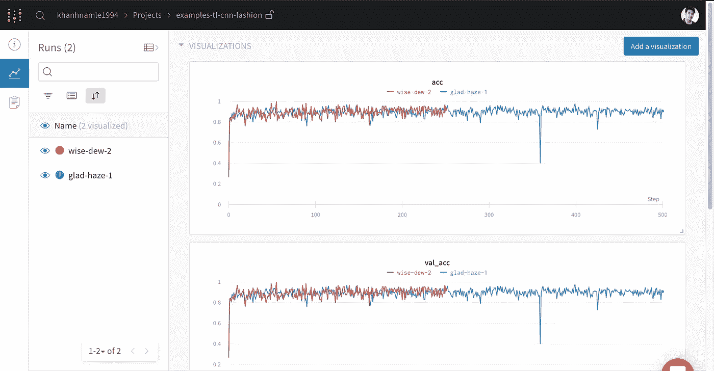
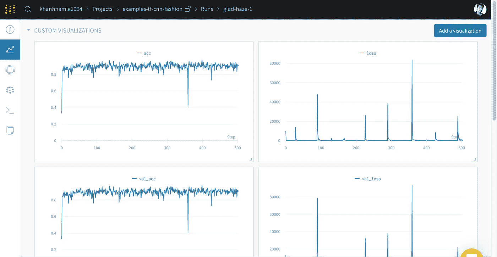
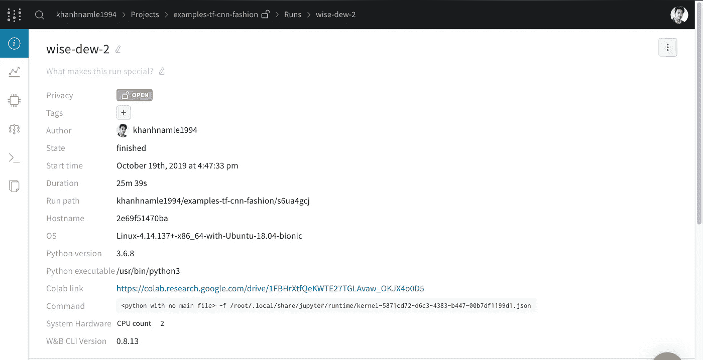

# 带权重和偏差的张量流简介

> 原文：<https://towardsdatascience.com/introduction-to-tensorflow-with-weights-and-biases-cd97636e820f?source=collection_archive---------22----------------------->

在本教程中，我将带您通过一个简单的卷积神经网络，使用 TensorFlow 对 [FashionMNIST](https://research.zalando.com/welcome/mission/research-projects/fashion-mnist/) 中的图像进行分类。我将首先设置[权重&偏差](https://wandb.com/articles)来记录模型度量，然后检查模型性能，最后，分享用于该图像分类问题的卷积神经网络的最佳架构的发现。

为了给你一些背景，Weights & Biases 帮助你跟踪你的机器学习实验。您可以使用该工具记录您跑步的超参数和输出指标，然后可视化和比较结果，并快速与您的同事分享发现。

您可以将它视为 Tensorboard 的一个很好的替代方案，tensor board 是 TensorFlow 的一个扩展，允许在浏览器中轻松监控模型。Tensorboard 的问题是，当它在本地运行时，很难保存信息或在团队中共享结果。此外，您可以为所有配有砝码和偏差的跑步提供 Tensorboard。

在这个例子中，我将使用 Google Colab 作为一个方便的托管环境，但是您可以从任何地方运行自己的培训脚本，并使用 W&B 的实验跟踪工具可视化指标。

**入门**

1.  打开这个 [Colab 笔记本](https://colab.research.google.com/drive/1FBHrXtfQeKWTE27TGLAvaw_OKJX4o0D5)。
2.  单击“在操场上打开”为自己创建此笔记本的副本。
3.  在 Google Drive 中为自己保存一份副本。
4.  浏览下面的每个部分，按代码块上的 play 运行单元。

结果将被记录到 [a 共享 W & B 项目页面](https://app.wandb.ai/khanhnamle1994/examples-tf-cnn-fashion)。

## 训练模型

让我们回顾一下我在上面的 [Colab 笔记本](https://colab.research.google.com/drive/1FBHrXtfQeKWTE27TGLAvaw_OKJX4o0D5)中使用的关键 wandb 命令。

**设置**

*   *pip 安装 wandb* —安装 W & B 库
*   *导入 wandb* —导入 wandb 库
*   *wandb 登录* —登录您的 W & B 账户，这样您就可以在一个地方记录您的所有指标
*   wandb.init() —初始化一个新的 W & B 运行。每次运行都是训练脚本的一次执行。

**初始化超参数**

*   *wandb.config* —将所有的超参数保存在一个配置对象中。您可以使用我们的应用程序，通过超参数值对您的跑步进行排序和比较。

**追踪结果**

*   *wandb.log()* —记录您的指标，以便您可以可视化您的神经网络随时间推移的性能。

## 可视化结果

一旦你训练了你的模型，你可以可视化你的模型所做的预测，它的训练和损失，梯度，最佳超参数，并审查相关的代码。

要查看此打开项目中的人员创建的跑步记录:

1.  查看[项目页面](https://app.wandb.ai/khanhnamle1994/examples-tf-cnn-fashion)。
2.  展开 runs 表，比较每个尝试过该脚本的人的所有结果。
3.  单击一次跑步的名称，在其跑步页面上深入了解该次跑步。

**可视化渐变**

单击单次运行，查看有关该运行的更多详细信息。例如，在[这个运行页面](https://app.wandb.ai/khanhnamle1994/examples-tf-cnn-fashion/runs/yf2pxwhj)上，您可以看到我运行这个脚本时记录的梯度。

**审查代码**

overview 选项卡选择代码的链接。在这种情况下，这是一个链接到我工作的 Google Colab。如果您正在运行 git repo 中的脚本，我们将获取最新 git 提交的 SHA，并在您自己的 GitHub repo 中为您提供该版本代码的链接。

## **接下来的步骤**

你应该尝试分叉这个 [colab 笔记本](https://colab.research.google.com/drive/1FBHrXtfQeKWTE27TGLAvaw_OKJX4o0D5)，调整一些超参数，看看你是否能最大化验证准确性。祝你好运！