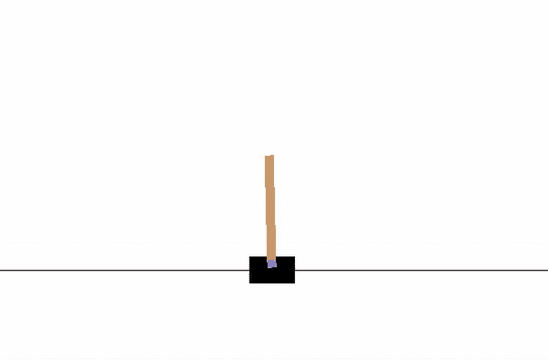
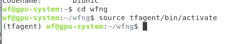
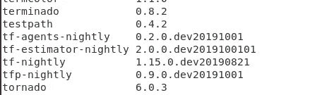
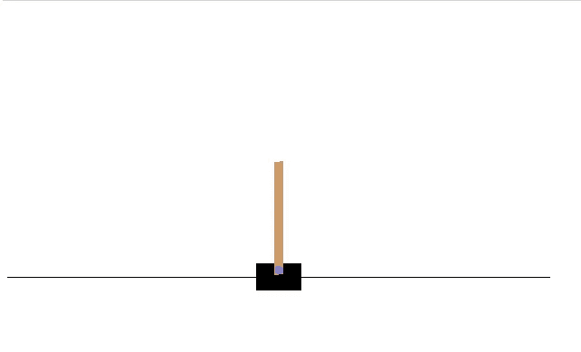
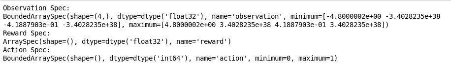
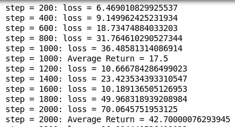
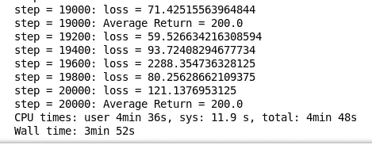
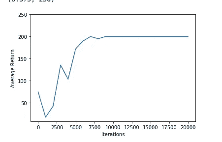
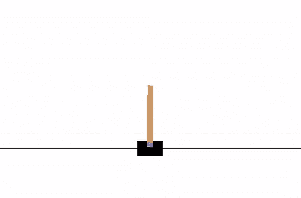

# TF-Agents 简介:TensorFlow 中的强化学习库

> 原文：<https://towardsdatascience.com/introduction-to-tf-agents-a-library-for-reinforcement-learning-in-tensorflow-68ab9add6ad6?source=collection_archive---------18----------------------->

通过 Tensorflow 中灵活而强大的强化学习库来训练您自己的 AI 机器人



Example of an untrained agent playing the CartPole game

今天的主题是 Tensorflow 最新的强化学习库，名为 TF-Agents。这个库相当新，大约一年前才对外开放。因此，与其他流行的强化学习库相比，它严重缺乏适当的文档和教程。在本教程中，我们将学习设置和运行官方文档提供的教程的正确方法。内容分为以下几类:

1.  装置
2.  例子
3.  结论

事不宜迟，我们开始吧！

# 1.装置

我在这个项目中使用的是 Ubuntu 18.04.2 LTS，但是下面的步骤应该适用于任何其他操作系统。根据您正在使用的内容相应地修改命令。

## 虚拟环境

首先，我们需要一个新的虚拟环境来完成这个项目。将项目分离到它自己的虚拟环境中是一个好主意。打开终端，进入你选择的目录。然后，运行以下代码:

```
python3 -m venv tfagent
```

将在同一目录中创建一个名为 tfagent 的新文件夹。通过运行以下命令来激活它:

```
source tfagent/bin/activate
```

您应该会看到以下输出



## Pip 升级(可选)

将 pip 模块更新到最新版本总是一个好主意。如果您不确定是否拥有最新版本，请运行以下命令

```
python3 -m pip install --upgrade pip
```

## Jupyter 笔记本

接下来，我们将安装 Jupyter Notebook，这是一个基于 web 的交互式开发环境，可以提供更流畅的体验。强烈推荐给那些参与数据科学任务的人。运行以下命令:

```
python3 -m pip install jupyter
```

## TF-每晚

如果您一直遵循官方网站提供的教程，您会注意到它将具有以下代码:

```
...
import tensorflow as tf

from tf_agents.agents.reinforce import reinforce_agent
from tf_agents.drivers import dynamic_step_driver
from tf_agents.environments import suite_gym
from tf_agents.environments import tf_py_environment
from tf_agents.eval import metric_utils
from tf_agents.metrics import tf_metrics
from tf_agents.networks import actor_distribution_network
from tf_agents.replay_buffers import tf_uniform_replay_buffer
from tf_agents.trajectories import trajectory
from tf_agents.utils import common
...
```

我们不打算安装 tensorflow，但只为 CPU 的预览版本称为 tf-nightly。这个模块相当不稳定，但是 tf-agent 需要它。官方网站建议我们通过以下代码安装最新版本:

```
python3 -m pip install --upgrade tf-nightly
```

它将安装 tf-nightly 和 tf-nightly-estimator。这两个模块可能有不同的版本。

## TFP-每晚

除此之外，我们还需要安装 tfp-nightly，这是一个用于 TensorFlow 中概率推理和统计分析的库。运行以下命令:

```
python3 -m pip install tfp-nightly
```

## TF-代理-每夜

我们现在已经为 tf 代理模块做好了准备。在继续之前，请确保您已经安装了 tf-nightly 和 tfp-nightly。在终端中键入以下命令并运行它:

```
python3 -m pip install tf-agents-nightly
```

我使用的模块版本如下:



## 降级 gast

如果您遇到某些模块的任何问题，例如以下问题，您需要修改模块的版本:

```
AttributeError: module 'gast' has no attribute 'Ellipsis'
```

对于 gast，我们需要将其设置为以下版本:

```
python3 -m pip install gast==0.2.2
```

## 其他 python 模块

官方教程需要以下模块才能正常工作。逐一执行以下命令来安装它们:

```
python3 -m pip install gym==0.10.11
python3 -m install imageio==2.4.0
python3 -m install pyglet==1.3.2
python3 -m install pyvirtualdisplay
python3 -m install matplotlib
```

# 2.例子

我们将使用最初的 [DQN 教程](https://github.com/tensorflow/agents/blob/master/tf_agents/colabs/1_dqn_tutorial.ipynb)作为例子。代码和步骤非常简单。您需要通过以下命令启动 jupyter notebook:

```
jupyter notebook
```

它将在您的默认浏览器中打开一个选项卡，带有以下 url

```
[http://localhost:8892/tree](http://localhost:8892/tree/work)
```

创建一个新的 Python3 文件。然后，前往 [DQN 教程](https://github.com/tensorflow/agents/blob/master/tf_agents/colabs/1_dqn_tutorial.ipynb)，并开始复制和粘贴笔记本内的代码。您可以独立运行每个单元。让我们来看看如果一切正常，你会看到什么。

## 渲染环境

下面的代码将渲染环境并向您输出一个显示游戏外观的图像。

```
env.reset()
PIL.Image.fromarray(env.render())
```

结果如下:



## 规格

**time_step_spec** ()方法返回**时间步长**元组的规范。

```
print('Observation Spec:')
print(env.time_step_spec().observation)
print('Reward Spec:')
print(env.time_step_spec().reward)
print('Action Spec:')
print(env.action_spec())
```

您应该得到以下输出



**A .观察是 4 个浮点数的数组:**

*   手推车的位置和速度
*   极点的角位置和速度

**B .奖励是一个标量浮点值**

**C. Action 是一个标量整数，只有两个可能的值:**

*   0 —“向左移动”
*   1 —“向右移动”

## 培养

在你达到“培训代理”这一步之前，一切都应该很好。尝试运行 Jupyter Notebook 的单元格中的代码会遇到错误。

```
"UsageError: Line magic function %%time not found."
```

这只是因为按照惯例，魔法函数应该从第一行开始。只需删除该命令，并将%%time 作为单元格中的第一行。运行之后，您应该能够看到下面的输出。



它需要一些时间来运行。预计时间约为 5 分钟。最终输出如下所示



## 形象化

您可以使用 matplotlib 模块来可视化训练结果。一次迭代由 200 个时间步组成。玩家每走一步，杆子就会得到 1 点奖励。结果一集最高收益 200。让我们运行下面的代码:

```
iterations = range(0, num_iterations + 1, eval_interval)
plt.plot(iterations, returns)
plt.ylabel('Average Return')
plt.xlabel('Iterations')
plt.ylim(top=250)
```

您的图表应该是这样的(可能会有一些小的差异):



## 录像

最后一部分是渲染一个视频来显示代理在玩游戏。您应该能够看到如下的训练版本:



我注意到它在站立不动的状态下平衡杆子，表现得非常好。未经训练的代理看起来像这样


# 3.结论

恭喜你！你已经成功地训练了一个能玩翻筋斗的特工。让我们回顾一下今天所学的内容。首先，我们从建立虚拟环境开始。然后，我们安装了必要的 python 模块。同时，我们还需要降级 gast 模块来纠正一些错误。

接下来，我们按照教程提供的渲染图像和设置所需的参数。之后，我们用 DQN 学习算法训练了一个代理。培训大约需要 5 分钟。

最后，我们尝试使用 matplotlib 来可视化它，并呈现两个视频来显示训练有素的代理和未训练的代理之间的差异。

非常感谢，祝你有美好的一天！

# 参考

1.  [https://github.com/tensorflow/agents](https://github.com/tensorflow/agents)
2.  [https://github . com/tensor flow/agents/blob/master/TF _ agents/cola bs/1 _ dqn _ tutorial . ipynb](https://github.com/tensorflow/agents/blob/master/tf_agents/colabs/1_dqn_tutorial.ipynb)