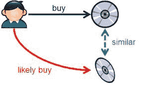
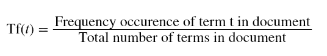
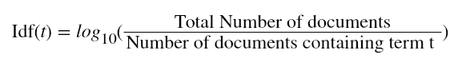
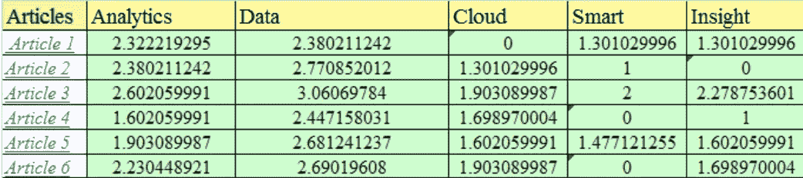
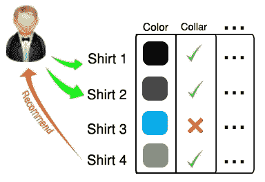
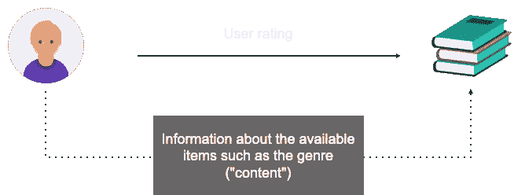
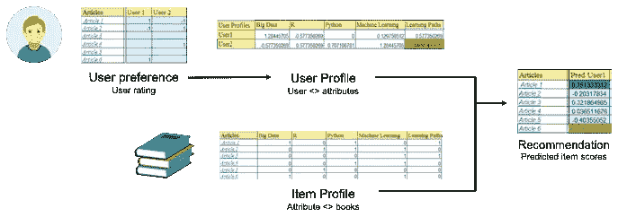
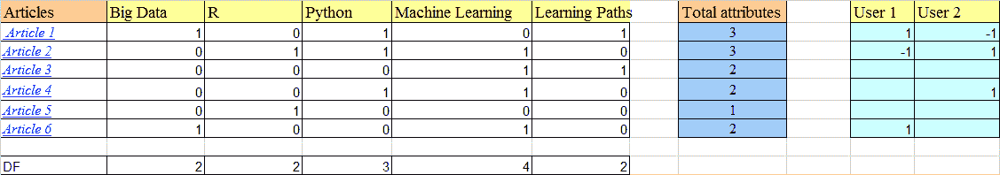
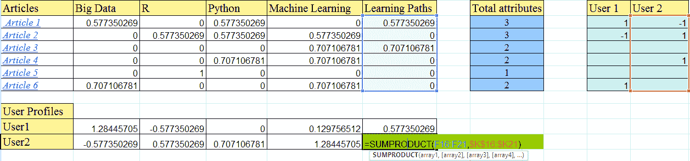
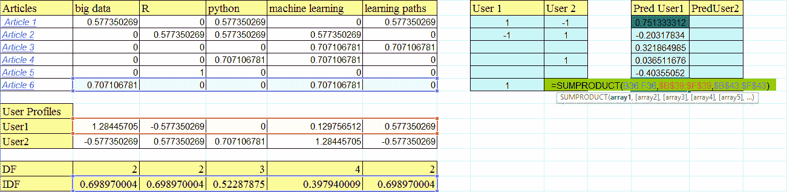

# 基于内容推荐系统的两种方法介绍

> 原文：<https://towardsdatascience.com/introduction-to-two-approaches-of-content-based-recommendation-system-fc797460c18c?source=collection_archive---------5----------------------->

## 解决困惑的完整指南

基于内容的过滤是构建推荐系统的常用方法之一。当我试图做一些研究来理解细节时，有趣的是看到有 **2 种方法**声称是“基于内容的”。下面我将分享我的发现，如果你曾经对这个定义感到困惑，希望它能节省你的研究时间。

本文将涵盖:

1.  方法 1 —仅分析内容描述
2.  方法 2——从用户评价的内容建立用户简档和项目简档
3.  两种方法的利弊

本文将重点解释这两种方法的主要区别，可能不会详细讨论编码。请访问这里的[库](https://github.com/youonf/recommendation_system/tree/master/content_based_filtering)获取各自的 Jupyter 笔记本，你会发现这两种方法的 Python 实现！

Content-based recommendation system (approach 2) simply analyses what you love — Photo Credit: [Jason Leung](https://unsplash.com/@ninjason?utm_source=medium&utm_medium=referral)

# 方法 1:只分析内容的描述

根据我的理解，方法 1 类似于 [**基于项目的协同过滤**](https://en.wikipedia.org/wiki/Item-item_collaborative_filtering) 。简而言之，系统会推荐任何与你之前喜欢的某个物品相似的东西。

在建模阶段，系统首先找到所有项目对之间的相似性，然后在推荐阶段使用与用户已评分项目最相似的项目来生成推荐列表。

例如，如果有人观看《明日边缘》，系统可能会基于相似性推荐 Looper。

> H 如何找到物品之间的相似性？

通常相似性将从项目的**描述**中导出，并且将引入 **TF-IDF** 的概念。那么每个项目将由一个 **TF-IDF 向量**来表示。

## **词频-逆文档频率(TF-IDF)**

**TF-IDF** 属于自然语言处理(NLP)的子领域。它在信息检索中用于特征提取目的。简而言之，你以某种方式计算每个单词在文档中的出现次数，衡量每个单词的重要性，并计算该文档的分数。

## **词频**

当前文档中单词占文档总字数的频率。它表示该单词在文档中出现的次数，当出现的次数越多，权重就越高，所以用它除以文档长度进行归一化。

## 逆文档频率

文档总数与包含该单词的文档的出现频率之比。它表示单词的稀有性，因为文档中出现的单词越少，IDF 就越大。这有助于给文档中的罕见术语更高的分数。

最后，TF-IDF 是用于评估一个单词对文档语料库中的文档有多重要的度量。单词的重要性与单词在文档中出现的次数成比例地增加，但是被单词在语料库中的频率抵消。

由于方法**严重依赖描述**来区分每个项目，描述应深入到产品细节，即标题、摘要、标语、流派，以便提供更多关于项目的信息。

## TF-IDF 载体

在为标签定义了 TF-IDF 值之后，我们就可以为每个项目创建关键字向量了。下面每一行代表一个项目的关键字向量。关于 TF-IDF 的详细计算，你可以参考这里的一篇[文章](https://www.analyticsvidhya.com/blog/2015/08/beginners-guide-learn-content-based-recommender-systems/)。

## 比较项目 TF-IDF 向量的相似性

为了计算项目向量的相似程度，我们可以使用各种方法，例如:

*   余弦相似性
*   欧几里得距离
*   皮森相关

那么推荐器将基于最相似的项目给出推荐。

我试着实现了这三种方法，我发现在推荐的项目上没有明显的区别。你可以从这个 [Jupyter 笔记本](https://github.com/youonf/recommendation_system/blob/master/content_based_filtering/content_based_recommender_approach1.ipynb)中找到我的全部代码。范例数据集——图书穿越数据集可点击[此处](http://www2.informatik.uni-freiburg.de/~cziegler/BX/)下载。

# 方法 2:从用户评价的内容建立用户简档和项目简档

这种方法类似于维基百科[中的定义。](https://en.wikipedia.org/wiki/Recommender_system#Content-based_filtering)

方法 2 利用来自用户已经交互的项目的**描述或属性**来推荐相似的项目。它仅依赖于用户**先前的选择**，使得该方法对于**避免冷启动问题**具有鲁棒性。对于文本项目，如文章、新闻和书籍，很容易使用文章**类别**或**原始文本**来构建**项目简档**和**用户简档**。

假设我观看一部特定类型的电影，我将被推荐该特定类型的电影。片名、上映年份、导演、演员也有助于识别类似的电影内容。

在这种方法中，产品的内容已经基于**用户偏好(用户简档)**被**分级**，而项目的类型是一个**隐含特征**，它将用于建立**项目简档**。然后通过使用两个简档来预测**项目分数**，并且可以进行推荐。与方法 1 相似，TF-IDF 技术也将用于该方法。

> 如何建立用户档案和物品档案？

通常`rating table`(用户评分)`item profile`(书籍类型)是我们仅有的资料。

*   `rating table`:用户与图书的关系
*   `item profile`:属性与账簿的关系

然后我们将创建`user profile`,这样我们就可以了解用户实际上更喜欢什么属性。

*   `user profile`:用户-属性关系

因此，使用`user profile`，我们可以根据他/她的`user profile`和`item profile`预测特定用户的所有项目得分。

你可以从这本 [Jupyter 笔记本](https://github.com/youonf/recommendation_system/blob/master/content_based_filtering/content_based_recommender_approach2_v2.ipynb)中找到我的方法 2 的完整代码。虽然这种方法需要像书籍流派这样的信息，并且它不在图书交叉数据集中，但报废是使用[谷歌图书 API](https://developers.google.com/books/docs/v1/using) 来检索附加信息。报废信息可以在这里[找到。](https://github.com/youonf/recommendation_system/blob/master/content_based_filtering/books_n_description.csv)

# 两种方法的利弊

## 方法 1

## 优点:

*   与协同过滤不同，如果项目有足够的描述，我们就避免了“新项目问题”。
*   内容表示是多种多样的，它们提供了使用不同方法的选择，如:文本处理技术、语义信息的使用、推理等
*   很容易建立一个更透明的系统:我们使用相同的内容来解释推荐。

## 缺点:

*   基于内容的 RecSys 趋向于过度专业化:他们会推荐与已经消费过的商品相似的商品，并倾向于创建一个“[过滤气泡](https://www.ted.com/talks/eli_pariser_beware_online_filter_bubbles?language=en)”。

## 方法 2

## 赞成的意见

*   **用户独立性**:协同过滤需要其他用户的评分来发现用户之间的相似性，然后给出建议。相反，基于内容的方法只需要分析项目和用户简档来进行推荐。
*   **透明**:协作式方法给你推荐是因为一些未知的用户和你有相同的品味，但是基于内容的方法可以告诉你他们是基于什么特征给你推荐的。
*   **无冷启动**:与协同过滤相反，新项目可以在被大量用户评级之前被建议。

## 骗局

*   **有限内容分析**:如果内容没有包含足够的信息来精确区分项目，推荐将不会精确到最后。
*   **过度专门化**:基于内容的方法提供了有限程度的新颖性，因为它必须匹配简档和项目的特征。一个完全完美的基于内容的过滤可能没有什么“惊喜”
*   **新用户**:当没有足够的信息为用户建立可靠的档案时，无法正确提供推荐。

**P.S.** 以上发现来自我在数据科学训练营的合作项目。如果你有兴趣了解更多关于其他推荐系统(协同过滤、潜在因素分析)的信息，请访问这个[知识库](https://github.com/youonf/recommendation_system)。

*参考*
[*https://www . analyticsvidhya . com/blog/2015/08/beginners-guide-learn-content-based-recommenders-systems/*](https://www.analyticsvidhya.com/blog/2015/08/beginners-guide-learn-content-based-recommender-systems/)[*https://towardsdatascience . com/learning-to-make-recommenders-745d 13883951*](/learning-to-make-recommendations-745d13883951)