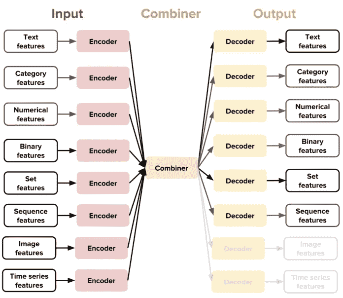
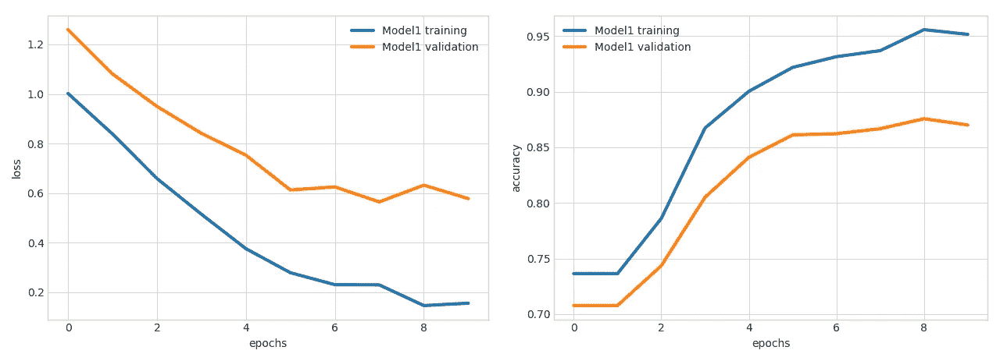

# 优步《路德维希》简介

> 原文：<https://towardsdatascience.com/introduction-to-ubers-ludwig-cdaa67245cfa?source=collection_archive---------9----------------------->

## 无需编写代码即可创建深度学习模型


Figure 1: Ludwig Logo ([Source](https://ludwig-ai.github.io/ludwig-docs/))

优步的人工智能实验室继续开源深度学习框架，并发布了最新版本 Ludwig，这是一个基于 TensorFlow 的工具箱，允许用户在不编写代码的情况下创建和训练模型。

为您的模型找到正确的模型架构和超参数是深度学习管道的一个困难方面。作为一名数据科学家，您可以花几个小时试验不同的超参数和架构，以找到最适合您的特定问题的方法。这个过程不仅耗时、代码密集，而且需要了解所有使用的算法和最先进的技术，这些都是用来挤出最后的性能百分比的。

Ludwig 试图为你提供一个工具箱，让你不用写代码就可以训练和测试你的深度学习模型。这有助于没有很多深度学习知识的领域专家建立他们自己的高性能模型。

# 路德维希

过去两年，优步在内部开发了 Ludwig，以精简和简化深度学习模型的使用。他们已经在自己的几个项目中见证了它的价值，例如从驾照中提取信息、在驾驶员-合作伙伴和乘客之间的对话中识别兴趣点等等。出于这个原因，他们决定将其作为开源软件发布，这样每个人都可以获得 Ludwig 提供的灵活性和易用性。

路德维希遵循以下核心原则:

*   **不需要编码**:不需要编码技能来训练一个模型并使用它来获得预测。
*   **通用性**:一种新的基于数据类型的深度学习模型设计方法，使该工具可以跨许多不同的用例使用。
*   **灵活性**:有经验的用户对模型的建立和训练有广泛的控制，而新手会发现很容易上手。
*   **扩展性**:易于添加新的模型架构和新的特征数据类型。
*   **可理解性**:理解模型性能并比较其预测的标准可视化。

Ludwig 允许我们通过只提供一个包含数据的文件来训练深度学习模型，如 csv 和 YAML 配置文件，其中我们需要指定关于我们的数据文件中包含的特征的一些信息，如它们是因变量还是自变量。如果指定了一个以上的相关/输出变量，Ludwig 将学会同时预测所有的输出。

Ludwig 背后的主要新思想是特定于数据类型的编码器和解码器的概念。这些特定类型的编码器和解码器可以在配置文件中设置，并为我们提供一个高度模块化和可扩展的架构，该架构对每种类型的数据都有特定的预处理步骤。



Figure 2: Different input and output features ([Source](https://eng.uber.com/introducing-ludwig/))

这种设计为用户提供了许多不同的功能和选项，允许他们在不需要大量深度学习知识的情况下为特定领域构建尖端模型。

# 使用路德维希

要使用 Ludwig，我们需要安装它，这可以通过以下命令完成:

```
pip install git+[https://github.com/uber/ludwig](https://github.com/uber/ludwig)
python -m spacy download en
```

下一步是创建我们的模型定义 YAML 文件，它指定了我们的输入和输出特性，以及一些关于我们想要采取的特定预处理步骤的附加信息。

但是在我们创建这个文件之前，我们需要决定我们想要使用什么数据集。对于这篇文章，我决定使用 [Twitter 美国航空公司情绪数据集](https://www.kaggle.com/crowdflower/twitter-airline-sentiment)，它可以免费下载。

现在我们有了数据集，我们可以开始编写模型定义了。

```
input_features:
 -
  name: text
  type: textoutput_features:
 -
  name: airline_sentiment
  type: category
```

准备好 YAML 配置文件后，我们可以使用以下命令开始训练我们的模型:

```
ludwig train –data_csv Tweets.csv –model_definition_file model_definition.yaml
```

Ludwig 现在将随机数据分为训练集、验证集和测试集，对它们进行预处理，然后用指定的编码器和解码器建立一个模型。

它还在控制台内显示训练过程，并提供[张量板](https://www.tensorflow.org/guide/summaries_and_tensorboard)功能。

训练之后，Ludwig 创建了一个结果目录，其中包含了经过训练的模型及其超参数，以及一些可用于可视化训练过程的汇总统计数据。可以使用以下命令执行这些可视化之一:

```
ludwig visualize –visualization learning_curves –training_stats results/training_stats.json
```

这将显示一个图形，该图形显示了作为历元数的函数的损失和精度。



Figure 3: Loss and accuracy plots ([Source](https://eng.uber.com/introducing-ludwig/))

训练之后，我们可以通过键入以下内容来使用该模型进行预测:

```
ludwig predict –data_csv path/to/data.csv –model_path /path/to/model
```

# Ludwig 的编程 API

Ludwig 还提供了 Python 编程 API，允许我们使用 Python 训练或加载模型。上面的问题可以使用如下所示的编程 API 来实现。

# 推荐读物

[](/introduction-to-deep-learning-with-keras-17c09e4f0eb2) [## Keras 深度学习简介

### 如何使用 Keras 深度学习库

towardsdatascience.com](/introduction-to-deep-learning-with-keras-17c09e4f0eb2) 

# 结论

Ludwig 是一个构建在 TensorFlow 之上的工具箱，允许用户在不编写代码的情况下创建和训练模型。

它为我们提供了许多不同的功能和选项，如数据类型特定的编码器和解码器，允许我们建立尖端的深度学习模型。

如果你喜欢这篇文章，可以考虑订阅我的 [Youtube 频道](https://www.youtube.com/channel/UCBOKpYBjPe2kD8FSvGRhJwA)，在社交媒体上关注我。

本文涵盖的代码可以从 [Github 资源库](https://github.com/TannerGilbert/Tutorials/tree/master/Uber%20Ludwig%20Introduction)获得。

如果你有任何问题、建议或批评，可以通过 [Twitter](https://twitter.com/Tanner__Gilbert) 或评论区联系我。