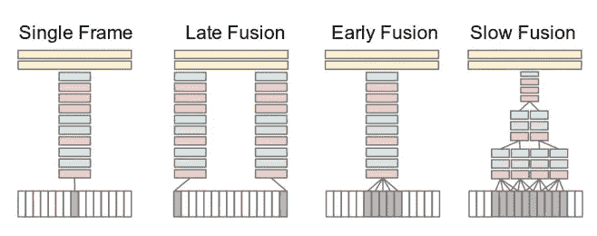
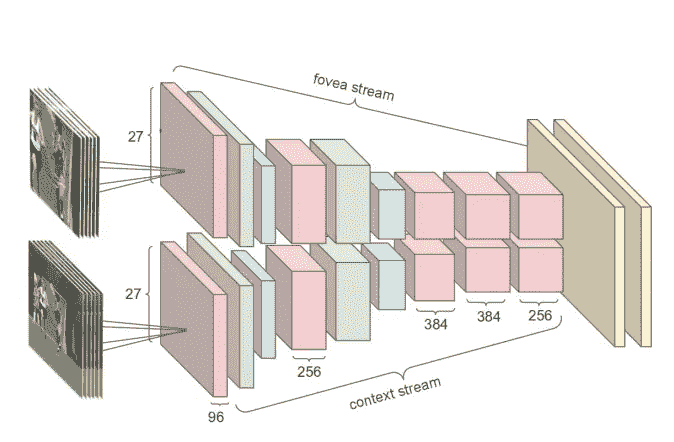
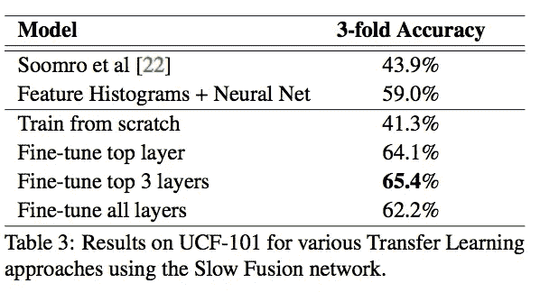

# 视频分类介绍

> 原文：<https://towardsdatascience.com/introduction-to-video-classification-6c6acbc57356?source=collection_archive---------8----------------------->

许多深度学习文章和教程主要关注三个数据领域:图像、语音和文本。这些数据域因其在图像分类、语音识别和文本情感分类中的应用而广受欢迎。另一个非常有趣的数据形式是视频。从维度和大小的角度来看，视频是与社交网络或遗传密码等数据集一起最有趣的数据类型之一。YouTube 等视频上传平台正在收集庞大的数据集，为深度学习研究提供支持。

视频实际上只是一堆图像。本文将回顾一篇关于视频分类研究的论文[1]，该研究由现任特斯拉人工智能总监 Andrej Karpathy 领导。

[https://static . Google user content . com/media/research . Google . com/en//pubs/archive/42455 . pdf](https://static.googleusercontent.com/media/research.google.com/en//pubs/archive/42455.pdf)

本文使用卷积网络对视频进行建模，其方式与 CNN 对图像建模的方式非常相似。这篇论文是卷积网络强大表示能力的一个好例子。在这项工作之前，视频分类研究主要由一系列视觉词袋特征组成，这些特征被量化到 k-means 字典中，并用 SVM 等机器学习模型进行分类。这项工作突出了细胞神经网络的力量，抽象出所有这些以前的特征工程算法。该论文也为将视频的时间成分集成到 CNN 模型中的想法提供了良好的基础。

本文探讨了视频分类的三个不同组成部分，设计了考虑视频中时间连通性的细胞神经网络，可以加速计算的多分辨率细胞神经网络，以及视频分类的迁移学习的有效性。

# 讨论的数据集

任何深度学习项目最重要的组成部分之一是对正在使用的数据集的理解。本文使用了由 487 个类别的[100 万个 YouTube 视频组成的数据集。](https://cs.stanford.edu/people/karpathy/deepvideo/)本文还对从这个大规模数据集学习到的特征到更小的 [UCF-101 数据集](http://crcv.ucf.edu/data/UCF101.php)的迁移学习进行了实验，该数据集由属于 101 个类别的 13320 个视频组成。

有两个与所使用的视频数据集相关的直接问题。首先是数据集的巨大规模，因此将整个数据集加载到本地内存的前景是不切实际的。一种解决方法是使用 url 解析库从视频的 youtube 链接动态下载视频，并覆盖当前在内存中的视频，这些视频是在以前的批量中使用的。为了加快速度，使用了并行计算系统，使得这些批次可以在与训练模型的机器不同的单独机器上加载和预处理。Karpathy 等人使用计算集群来实现这些实验，这非常适合这种数据处理流水线。

这个数据集的第二个问题是文本挖掘应用程序经常遇到的问题，即每个实例的可变长度。例如，一个视频可能是 30 秒，而另一个是 2 分钟。在文本中，这可以通过用 0 填充文本的末尾来解决，这样所有的输入都是相同的长度。本文通过对视频中的作物进行预测并汇总所有作物的预测来解决这一问题。我认为这是需要记住的一个非常重要的细节。整个视频并没有被传送到网络上，而是使用了半秒钟的剪辑。视频通常以每秒 30 帧的速度录制。因此，这些剪辑由 15 帧组成。

聚合半秒剪辑的预测与图像分类中的测试时间增强是一个类似的概念。图像的类别预测与旋转、剪切、裁剪或增强颜色空间后的同一图像的预测相结合。这些视频分类实验还测试了半秒剪辑的翻转和裁剪增强。

# 时间信息融合

> CNN 架构中的哪种时间连接模式最能利用视频中的局部运动信息？
> 
> 额外的运动信息如何影响 CNN 的预测，它对整体性能的改善有多大？

也许本文最有趣的主题是如何修改经典卷积网络以解释视频中的时间依赖性。在本文中，一堆帧一个接一个地连接起来，输入到 CNN。传统上，CNN 采用一个(高×宽×颜色通道)矩阵作为输入。例如，这可能是一个 224 x 224 x 3 的输入张量。在这些实验中，先前的帧堆叠在颜色通道轴的顶部，使得由视频中的两个图像帧组成的输入具有 224 x 224 x 6 的形状。Karpathy 等人提出了 3 种不同的策略来组合作为 CNN 输入的帧，并将这些方法与一次分类一个帧的基线模型进行对比。

单帧模型是通过简单地聚合单帧/图像的预测来对视频进行分类的一个例子。后期融合模型通过连接剪辑中的第一帧和最后一帧来组合帧。早期的融合模型从剪辑中取出较大的连续片段。最后，慢融合模型具有更复杂的方案，其中 4 个部分重叠的连续段在卷积层中被渐进地组合。实验发现慢融合策略获得了最大的个体成功，尽管并没有显著大于单帧模型。通过对所有模型的结果进行平均，找到了最佳的总体结果，(单一+早期+晚期+缓慢)。

# **多分辨率 CNN**

本文讨论的另一个非常有趣的概念是一个引人注目的图像处理策略。多分辨率 CNN 工作如下:两个独立的输入被馈送到独立的卷积层，在两个独立的 conv-最大池-批处理序列之后融合在一起。这些多分辨率输入由下采样为 89 x 89 的 178 x 178 帧和原始 178 x 178 帧的中心 89 x 89 裁剪组成。

这种策略为卷积层节省了大量的计算时间。作者报告说，由于这种降维方案，速度提高了 2-4 倍。具体来说，他们引用了全帧网络每秒 5 个剪辑的速度和多分辨率网络每秒 20 个剪辑的速度。他们还强调，如果使用高端 GPU，而不是在拥有 10–50 个模型副本的计算集群中进行并行化，这可以进一步加快速度。除了加速之外，它还报告了比单帧模型小的改进，单帧模型采用原始的 178 x 178 帧。

# **视频分类中的迁移学习**

图像分类中的迁移学习已经被大量研究，并且是一个非常直观的概念。在 ImageNet 这样的海量数据集上训练，1.2M 的图片，把这些权重转移到一个数据较少的问题上，然后在新的数据集上微调权重。在本文中，Karpathy 等人将 Youtube-1M 数据集的特征转移到流行的视频分类数据集 UCF-101。他们实验了三个层次的迁移学习，并在 UCF-101 数据集上与从头开始的训练进行了比较。

所研究的迁移学习水平包括微调顶层、微调前 3 层和微调所有层。例如，当微调顶层时，网络中的其余权重在训练期间被“冻结”,这意味着它们只参与网络的正向传递，而不通过反向传播进行更新。

从本文来看，时间融合和多分辨率策略带来的性能提升并不显著。然而，迁移学习的结果令人大开眼界。如果这份报告也显示了单框架网络的结果，以对比慢速融合方案是否对迁移学习更有效，这将是很有趣的。

# **结论**

我对报告的结果印象深刻，慢融合方案始终优于单帧模型。在这篇论文中，我期望时间融合算法由 CNN 特征组成，并输入到一个递归模型中，如 LSTM。我认为慢速融合的设计可以通过简单地加倍相邻块的大小来改进，也许可以通过一些参数数量的帧来连接相邻块，并添加剩余连接。

我认为多分辨率处理图像和视频是一个非常有趣的想法，可以扩展到语音和音频。这种机制主要设计用于在输入尺寸减小的情况下提高计算速度，但是，我认为在使用超分辨率技术(如 SR-GANs)对图像进行上采样后，反转这一点并测试分类精度会很有意思。

令人鼓舞的是，图像迁移学习的成功扩展到了视频。在 YouTube-1M 数据集上训练后，UCF-101 的准确率提高了近 25%，高得令人震惊！

本文为探索视频分类奠定了良好的基础。它写得非常好，讨论了在视频数据上建立深度学习模型的许多重要特征。感谢阅读，请在纸上或这篇文章上留下你的想法！

# **参考**

[1]安德烈·卡帕西、乔治·托代里奇、桑克思·谢蒂、托马斯·梁、拉胡尔·苏坦卡尔、李菲菲。基于卷积神经网络的大规模视频分类。2014.