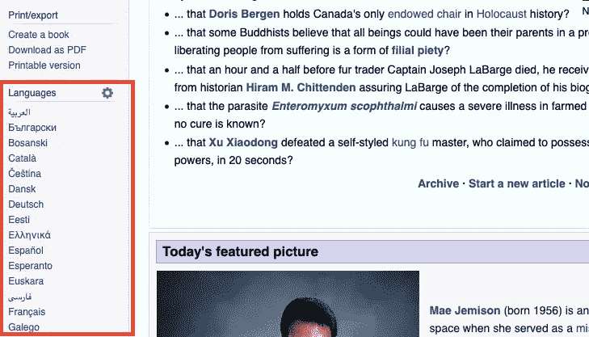
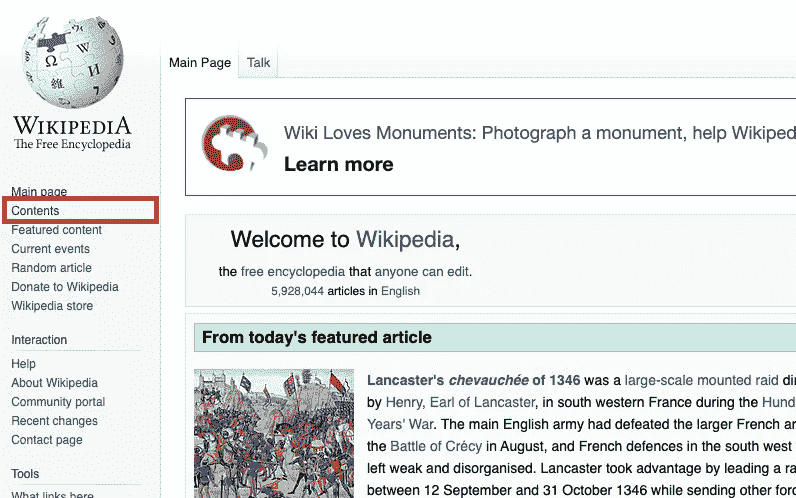

# Selenium 和 Python 网页抓取简介

> 原文：<https://towardsdatascience.com/introduction-to-web-scraping-with-selenium-and-python-85920d41722d?source=collection_archive---------28----------------------->


## 关于如何开始使用 Selenium 的实用教程

当你需要数据时，网络抓取是一种快速、经济、可靠的获取方式。更好的是，数据通常是最新的。现在，请记住，当抓取一个网站时，你可能会违反其使用政策，并可能被踢出网站。虽然抓取大部分是合法的，但根据您打算如何使用数据，可能会有一些例外。所以在开始之前，一定要做好调查。然而，对于一个简单的个人或开源项目，你应该没问题。

抓取数据的方法有很多，但我最喜欢的一种是使用 [Selenium](https://www.seleniumhq.org/) 。它主要用于测试，因为它主要做的是浏览器自动化。用简单的语言来说，它创建了一个机器人浏览器，为你做事情:它可以获得 HTML 数据，滚动，点击按钮等。最大的好处是我们可以明确地说出我们想要什么样的 HTML 数据，这样我们就可以适当地组织和存储它。

Selenium 与许多编程语言兼容，但是本教程将重点介绍 Python。检查[此链接](https://selenium-python.readthedocs.io/index.html)以阅读 Selenium(使用 Python)文档。

# 第一步

要下载 Selenium，请在命令行中使用这个简单的命令:

`pip install selenium`

如果你在 Jupyter 笔记本上工作，你可以直接在那里而不是命令行上完成。开头加个感叹号就行了:

`!pip install selenium`

之后，您需要做的就是导入必要的模块:

`from selenium.webdriver import Chrome, Firefox`

也支持其他浏览器，但这两种是最常用的。

开始时需要两个简单的命令:

`browser = Firefox()`
(或`browser = Chrome()`取决于你的喜好)

这创建了一个 Firefox WebDriver 的实例，允许我们访问它所有有用的方法和属性。我们把它赋给了变量`browser`，但是你可以自由选择你自己的名字。Firefox 浏览器将自动打开一个新的空白窗口。

接下来获取您想要抓取的 URL:

`browser.get('https://en.wikipedia.org/wiki/Main_Page')`

`get()`方法将在浏览器中打开 URL，并等待它完全加载。

现在你可以从这个 URL 获得所有你想要的 HTML 信息。

# 定位元件

用硒定位元素有不同的方法。哪一个是最好的，取决于你抓取的页面的 HTML 结构。找出访问您想要的元素的最有效的方法可能很棘手。所以请慢慢来，仔细检查 HTML。

您可以使用选择的搜索参数访问单个元素(您将获得与您的搜索参数对应的第一个元素)，也可以访问与搜索参数匹配的所有元素。要获得单个，请使用以下方法:

`find_element_by_id()`
`find_element_by_name()`
`find_element_by_xpath()`
`find_element_by_link_text()`
`find_element_by_partial_link_text()`
`find_element_by_tag_name()`
`find_element_by_class_name()`


要定位多个元素，只需在上述方法中将`element`替换为`elements`。您将获得通过该方法定位的 WebDriver 对象的列表。

# 抓取维基百科

所以让我们看看它是如何与已经提到的维基百科页面[https://en.wikipedia.org/wiki/Main_Page](https://en.wikipedia.org/wiki/Main_Page)一起工作的

我们已经创建了包含 WebDriver 实例的`browser`变量，并加载了 Wikipedia 主页面。

假设我们想要访问该页面可以翻译成的语言列表，并存储所有指向这些语言的链接。



经过一些检查，我们可以看到所有元素都有相似的结构:它们是类`'interlanguage-link'`的`<li>`元素，包含带有 URL 和文本的`<a>`;

```
<li class="interlanguage-link interwiki-bg">      <a href="https://bg.wikipedia.org/wiki/" title="Bulgarian" 
     lang="bg" hreflang="bg" class="interlanguage-link-target">

            Български </a> </li>
```

所以让我们首先访问所有的`<li>`元素。我们可以使用类名来隔离它们:

`languages = browser.find_elements_by_class_name('interlanguage-link')`

`languages`是 WebDriver 对象的列表。如果我们打印它的第一个元素:

`print(languages[0])`

它会打印出这样的内容:

*<selenium . web driver . Firefox . web element . Firefox web element(session = " 73e 70 f 48–851 a-764d-8533–66f 738 D2 BCF 6 "，element = " 2a 579 b 98–1a 03-b04f-AFE 3–5d 3 da 8 aa 9 EC 1 ")>*

所以要真正看到里面有什么，我们需要写一个 for 循环来访问列表中的每个元素，然后访问它的`<a>`子元素，并获得`<a>`的文本和`'href'`属性。

要获取文本，我们可以使用`text`属性。使用`get_attribute('attribute_name')`方法获得`'href'`。因此，代码将如下所示:

```
language_names = [language.find_element_by_css_selector('a').text   
                  for language in languages] links =[language.find_element_by_css_selector('a') \
                 .get_attribute('href') for language in languages]
```

你可以打印出`language_names`和`links`来看看它工作了。

# 卷动

有时并不是从一开始就加载整个页面。在这种情况下，我们可以让浏览器向下滚动，从页面的其余部分获取 HTML。使用将 JavaScript 代码作为参数的`execute_script()`方法非常简单:

```
scroll_down = "window.scrollTo(0, document.body.scrollHeight);" browser.execute_script(scroll_down)
```

`scrollTo(x-coord, y-coord)`是一个滚动到给定坐标的 JavaScript 方法。在我们的例子中，我们使用返回元素高度的`document.body.scrollHeight`(在这个例子中是`body`)。

正如你可能已经猜到的，你可以用`execute_script()`方法让浏览器执行所有类型的脚本。所以如果你有 JavaScript 的经验，你有很大的试验空间。

# 微小静电干扰声

点击就像选择一个元素并对其应用`click()`方法一样简单。在某些情况下，如果您知道需要访问的 URL，您可以让浏览器加载带有 URL 的页面。还是那句话，看什么效率更高。

为了举例说明`click()`方法，让我们点击左侧菜单中的“内容”链接。



该链接的 HTML 如下:

```
<li id="n-contents">
   <a href="/wiki/Portal:Contents" title="Guides to browsing Wikipedia">

        Contents

   </a>
</li>
```

我们必须首先找到具有唯一 id `'n-contents'`的`<li>`元素，然后访问它的`<a>`子元素

```
content_element = browser.find_element_by_id('n-contents') \    
                         .find_element_by_css_selector('a')content_element.click()
```

您现在可以看到浏览器加载了“目录”页面。

# 下载图像

现在，如果我们决定从页面下载图片。为此，我们将使用`urllib`库和一个 uuid 生成器。我们将首先用 CSS 选择器`'img'`定位所有图像，然后访问它的`'src'`属性，然后用`urlretrieve('url', 'folder/name.jpg')`方法为每个图像创建一个唯一的 id 下载图像。这个方法有两个参数:一个图片的 URL 和一个我们想给它的名字，以及我们想下载到的文件夹(如果适用的话)。

```
from urllib.request import urlretrieve 
from uuid import uuid4 # get the main page again browser.get('https://en.wikipedia.org/wiki/Main_Page') # locate image elements 
images = browser.find_elements_by_css_selector('img') # access src attribute of the images 
src_list = [img.get_attribute('src') for img in images] for src in src_list: 
     # create a unique name for each image by using UUID generator    
     uuid = uuid4()      # retrieve umages using the URLs 
     urlretrieve(src, f"wiki_images/{uuid}.jpg")
```

# 增加动作之间的等待时间

最后，有时有必要在浏览器中的操作之间引入一些等待时间。比如一个接一个加载很多页面的时候。可以用`time`模块完成。

让我们从我们的`links`列表中加载 3 个 URL，并让浏览器在使用`time.sleep()`方法加载每个页面之前等待 3 秒钟。

```
import time urls = links[0:3] for url in urls: 
     browser.get(url)      # stop for 3 seconds before going for the next page   
     time.sleep(3)
```

# 关闭 web 驱动程序

最后，我们可以关闭机器人浏览器的窗口

`browser.close()`

不要忘记`browser`是一个包含`Firefox()`方法实例的变量(见教程开头)。

# GitHub 中的代码

这篇文章中的代码可以在 GitHub 中找到:
[https://github.com/AnnaLara/scraping_with_selenium_basics](https://github.com/AnnaLara/scraping_with_selenium_basics)

*原发布于 2019 年 9 月 12 日*[*https://dev . to*](https://dev.to/annalara/introduction-to-web-scraping-with-selenium-and-python-4p7b)*。*