# 反思自己的虚拟足迹

> 原文：<https://towardsdatascience.com/introspection-on-ones-virtual-footprint-79590857afb5?source=collection_archive---------24----------------------->

## 谷歌和脸书对你了解多少？可以下载自己找。

## **或者，一点心理分析数据**

你担心网上收集的关于你的数据吗？

如果你正在读这篇文章，我想你以前听说过这个:你已经意识到网上已经有很多关于你的数据，[反乌托邦](https://www.technologyreview.com/s/428210/data-dystopia/) [奥威尔](https://en.wikipedia.org/wiki/Nineteen_Eighty-Four) [卡夫卡](https://www.newstatesman.com/2014/01/death-data-how-kafkas-trial-prefigured-nightmare-modern-surveillance-state) [雅哒雅哒雅哒](https://en.wiktionary.org/wiki/yada_yada_yada)你无力控制它。

GDPR 是欧洲保护消费者数据的一大进步；而美国有多重保护措施( [COPPA](https://www.ftc.gov/enforcement/rules/rulemaking-regulatory-reform-proceedings/childrens-online-privacy-protection-rule) 、[隐私保护](https://www.privacyshield.gov/welcome)等)。)没有什么东西像 GDPR 一样既独特又包罗万象。

你至少可以追踪一些关于你自己的已知信息，并限制它们的使用来针对你。

按照我的习惯(bespoke data science 4ever)，我想简要地检查一下我自己的数据。我们将快速浏览一下谷歌、Instagram 和脸书提供的内容，看看我们能轻松梳理出什么。

在我的 GitHub 上可以找到 Jupyter 笔记本来复制这里提出的问题和绘制的图表。

# **谷歌**

谷歌提供通过[外卖](https://takeout.google.com/)下载你的数据的能力。

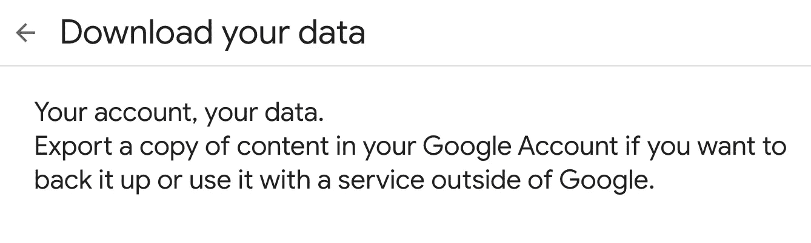

takeout.google.com

按照给出的指示，几个小时后，谷歌将通过电子邮件向你发送链接，下载可能是几千兆字节的个人信息，这取决于你已经告诉谷歌为你保留的隐私级别。我的全部存档超过 20 GB(考虑到其中大部分是谷歌照片和邮件，我认为这是合理的)。

如果您只对浏览数据感兴趣，那么您选择的格式可能对您并不重要。HTML 可能是最容易用肉眼阅读的，但是如果您对检查数据感兴趣，您可能希望深入每个服务并更改格式，并尽可能选择 JSON，以使数据操作最容易。这个选择对于 My Activity 是最重要的，它是一个元产品，存储了跨产品的活动记录。

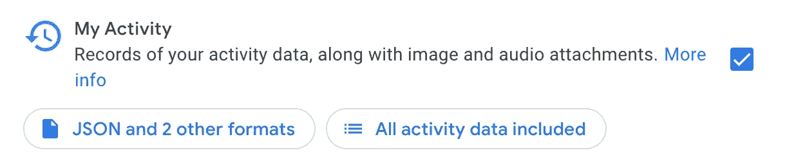

You’ll want to check My Activity out.

有一些显而易见的产品，比如搜索和位置历史，你想挖掘它们的记录，但是也有一些你可能不知道的“产品”。我在这里要研究的是购买和交易。

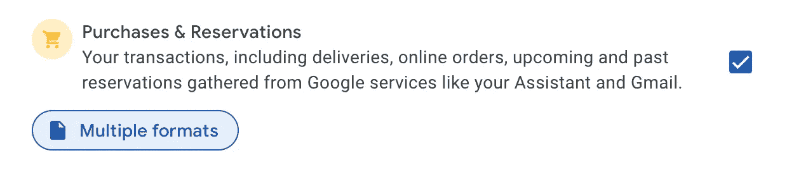

I was not aware that Google was scraping my Gmail for purchase info and collecting it in JSON format.

“购买和交易”包含从其他谷歌服务中抓取的信息。如果 Google 检测到一条信息(通常是电子邮件)涉及购买、预订、订阅、交付或其他类型的金融交易(似乎不包括银行交易)，该内容就会被提取出来并放在 JSON 文件中。每个事务都有自己的文件(与我的活动文件相反，我的活动文件包含特定产品的所有操作)。

例如，我很惊讶(但我应该惊讶吗？)来查看谷歌已经解析了我在 2017 年 11 月下的订单的一封 [GrubHub](https://www.grubhub.com/) 回执邮件的内容。

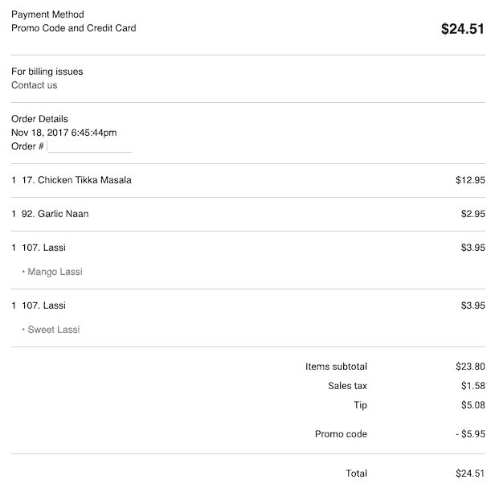

part of the email receipt from GrubHub…

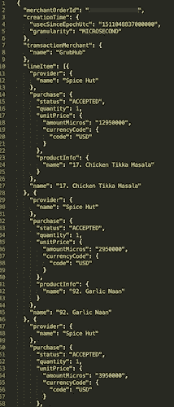

… and part of the JSON extracted from this email.

我很好奇谷歌从我收到的电子邮件中提取了多少此类内容，以及从我可能不知道的其他金融服务中提取了多少与谷歌相关的内容。

事实证明相当多。

我还想知道这个 JSON 文件是如何创建的。谷歌真的提取了这些内容，还是 GrubHub 卖给了谷歌？我不知道。

在没有输入其他单个交易的细节的情况下，在我使用各种谷歌产品的过程中，谷歌似乎已经从至少追溯到 2008 年 5 月的 521 笔交易中提取/获取了数据(截至我的外卖存档时间)。(有 42 个没有日期。)

在这 521 笔交易中，有 390 笔交易有"小计"栏。将这些值相加(忽略任何行项目)表明，在过去 11 年中，Google 已经索引了我价值超过 11，000 美元的交易数据。

真正令人惊讶的是，这实际上并不多。如果我的数据具有代表性的话，看起来他们在 2013 年真正开始加快交易抓取的步伐。(也就是从那时起，我开始使用这个特殊的 gmail 地址进行更多的在线消费。或者两者都有。)

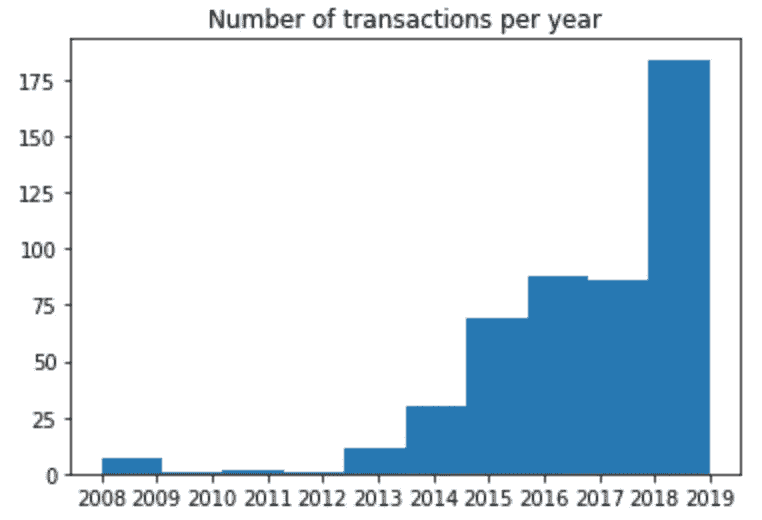

# **Instagram**

要收集你的 Instagram 数据，请遵循[标题为“在 Instagram 上下载你的数据副本”下的这些](https://help.instagram.com/181231772500920)指示。

这些数据仅以 JSON 格式提供。

我们将在这里运行一个简单的查询:每个月我给其他个人资料的赞是什么样的？

我在 2012 年年中开始使用 Instagram。在几个月的小活动后，有趣的是看到[幂定律](https://en.wikipedia.org/wiki/Power_law)似乎是从我点击小心形图标的简单任务中产生的——至少可以说，这是一场无意的受欢迎程度竞赛。(当然，配置文件名是隐藏的。)

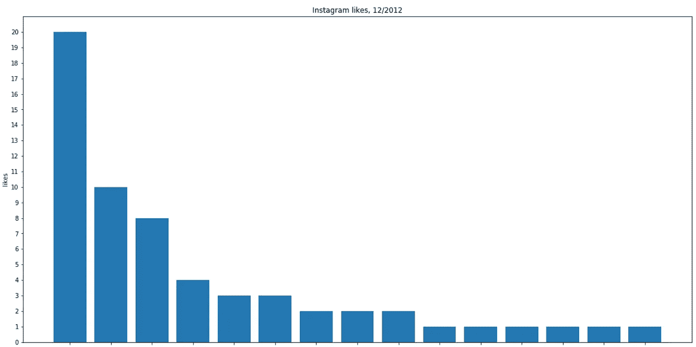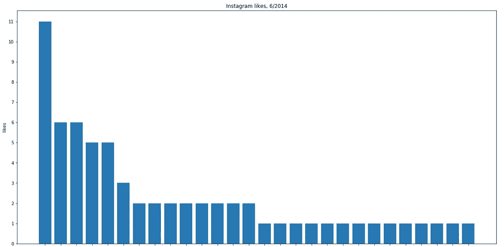

还要注意，分级简档的数量增加了；随着我关注的账户数量的增加，喜欢的照片的差异也在增加，但粗略的幂律结构仍然保持着，即使喜欢的人自己变得越来越分散(T2)。

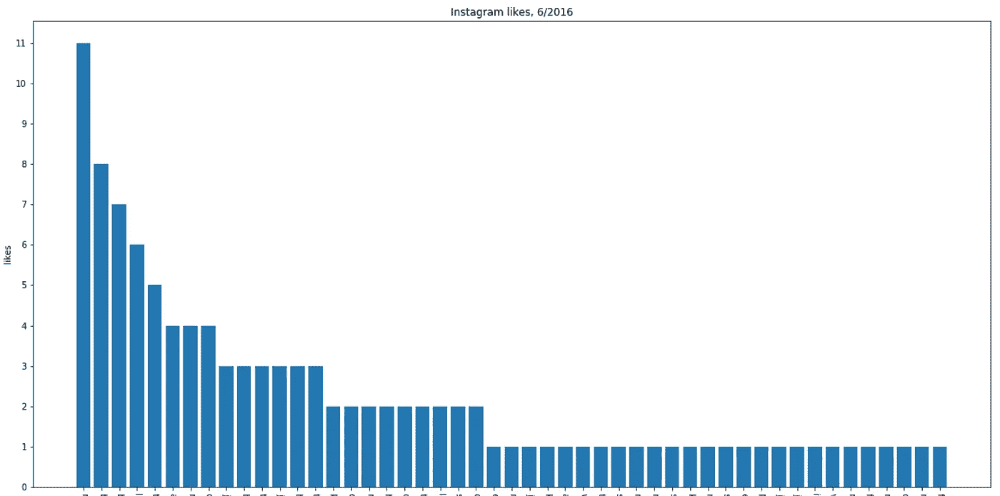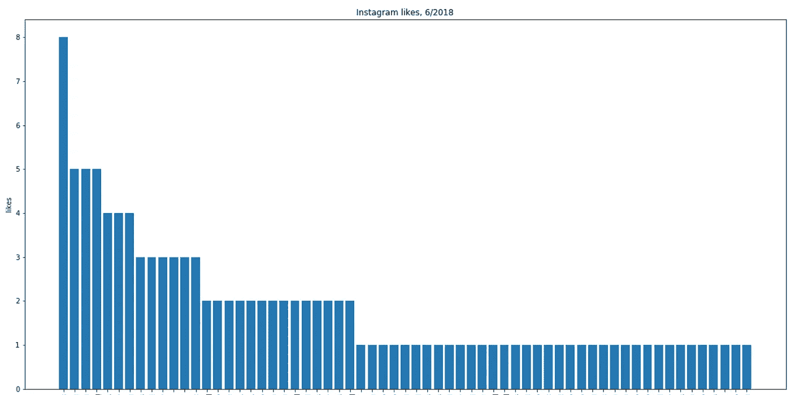

a sample of my Instagram likes distributions: 12/2012, 6/2014, 6/2016, 6/2018

# **脸书**

像以前一样，按照这些指示，在问题“[我如何下载我的脸书信息的副本？“你会注意到，就像谷歌的“我的活动”一样，脸书的数据有 JSON 和 HTML 两种格式。](https://www.facebook.com/help/1701730696756992/?helpref=hc_fnav#)

我们将着眼于脸书数据的两个方面:反应和帖子的情绪。

## 反应

一旦从句子结构的帖子中提取出反应的接收者，反应(喜欢和其他类型)就可以像 Instagram 喜欢一样进行计数。

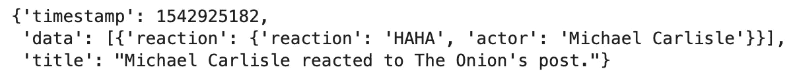

sample Facebook reaction post — if we wish to tabulate who received what reactions, we need to extract the objects of these “title” sentences.

从我自己的脸书 feed 收集 11+年的反应数据开车回家有多少人已经离开了平台；不想在没有对象的情况下丢弃这些反应)，我发现，在排列我的前 25 个回复接收者时，第 5 名是所有离开脸书的占位符“NO_NAME”的总和。

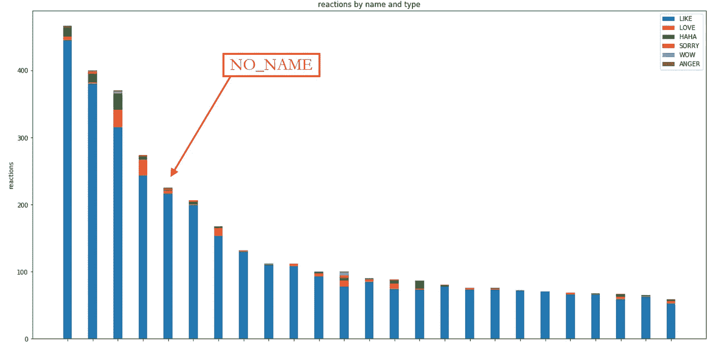

power laws emerging here make sense here too, although a power law appears cleaner with “likes” alone.

与 Instagram 的数据一样，喜欢和反应的“人气”效应表现为一种“财富分配”，受幂律支配。

## 帖子情感

对我在脸书的帖子进行情感分析更有趣一些。 [VADER](https://github.com/cjhutto/vaderSentiment) ，已经被整合到 [NLTK](http://www.nltk.org/_modules/nltk/sentiment/vader.html) (“自然语言工具包”)中，提供了文档级情感的分类，分为“正面的”、“负面的”、“中性的”和“复合的”。

首先，我们将检查每年有多少帖子。

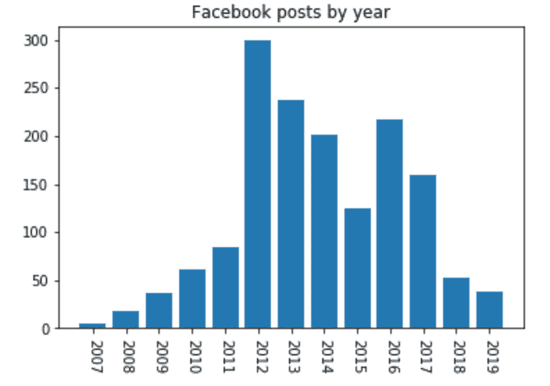

this says a lot just by itself.

接下来，我们将生成每年这些帖子的情绪的箱线图。我是一个相对中立的演讲者(嗨，数学家)，所以我们可以看到中间值非常坚定中立，几乎所有 2010 年以前的负面情绪(那时脸书的帖子变得更像句子，而不是 2000 年代后期的“人是 _____”格式)都被认为是离群值。

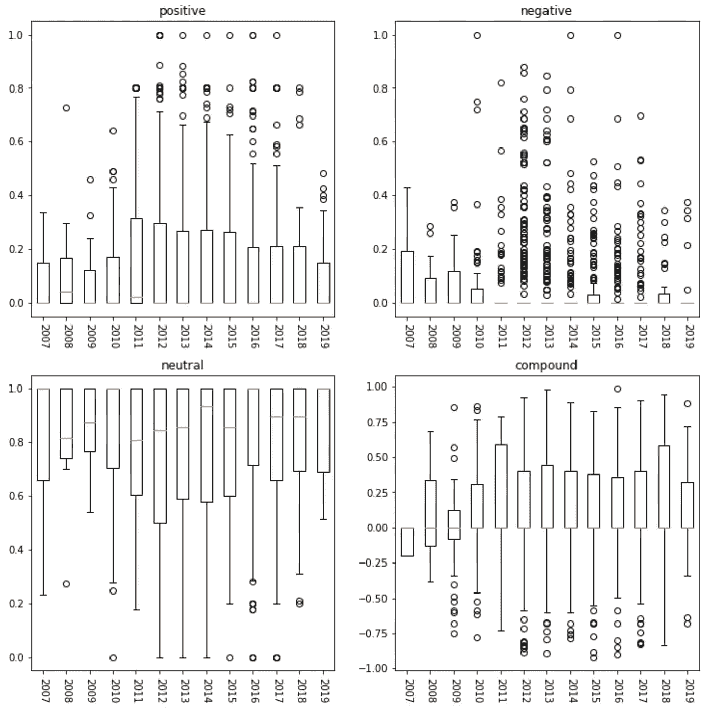

这仅仅触及了你能从这些数据中了解到的一些皮毛。上面给出的例子并没有真正涉及单个交易和帖子中的*细节*，在这里可以进行更细致的分析。

如果你能通过这些数据了解自己，那么掌握这些数据的公司也能从中学习。并用它向你推销。并可能卖给其他人来推销给你。

你同意吗？